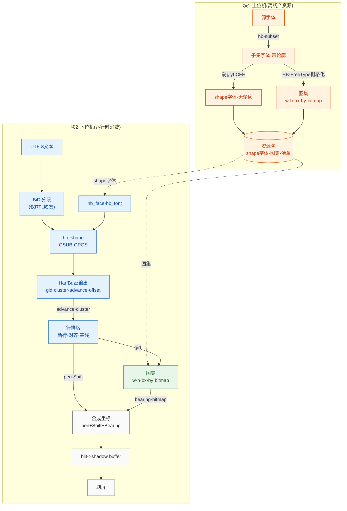

---
领域:
  - 工作
类型:
  - 开发
项目:
  - "[[GUI]]"
任务:
  - "[[260728harfbuzz移植]]"
状态: 进行
相关任务:
创建时间: 2026-07-28T23:41:00
截止时间: 2026-08-04T07:41:00
完成时间:
---

## 待办列表
- [ ] 编码
- [ ] 测试
- [ ] 合并

## 方案



## 字体渲染基础

### 核心模型：笔在基线上走，字形是贴在笔上的贴纸

画一行文字 = 一支笔沿基线从左到右移动，每画一个字向右移一段。**笔尖的位置叫 pen**。每个字形的像素贴图相对笔尖怎么摆，就是 bearing。

```
baseline(基线) ────────────────────────────────────────────────
                      ↑ pen 在这里
                      │
                      │ bearing_y (笔到贴纸顶部，屏幕坐标向下所以带负号)
                      │
                ┌─────┴─────┐
                │  字形bitmap │   ← 实际像素 (w×h)
                │   (w×h)    │
                └───────────┘
                      ↑
           bearing_x (笔到贴纸左缘，可负)
```

### 从文本到像素，每一步一个量

**① 字符 → 码点 (codepoint)**：`"你好"` 是 UTF-8 字节，先解码成 Unicode 编号（`你`=U+4F60）。与字体无关。

**② 码点 → gid，不能直接查表**：gid = 字体里"实际存在的形状"的编号。不能码点→gid 直接映射，因为 `fi` 合成连字 `fi`（2 字符→1 gid）、阿拉伯字母词首/中/尾不同形、`é`=`e`+组合尖音符。所以需要**整形 (shaping)**：输入一串码点，输出一串 gid + 位置。这是 HarfBuzz 干的活。

**③ 整形输出三样，只有两样用于画**：对每个 gid，整形给出 advance（笔沿基线移多远）、offset（字形相对笔的微调位移）、cluster（这个 gid 来自源文本哪几个字符，画字不用）。**advance 决定"下一个字在哪"，offset 决定"这个字形往哪偏"**——所以 advance 来自整形、不入 fontlet（排版量不是贴图量）。`é` 例：`e` 的 gid advance=e 宽、offset=(0,0)；尖音符 gid advance=0、offset=左上（笔不动，音符叠在 e 上）。

**④ 垂直度量 (ascent/descent/line_gap)**：决定行高和换行后基线位置。最小版不存，运行时问 `hb_font` 拿。

**⑤ 光栅化 → bitmap**：字形是矢量轮廓（贝塞尔曲线），屏幕要像素。把曲线在某字号下填充成像素叫光栅化，结果是一个 `w×h` 像素数组。harfembed 里这步**离线**做（PC 上 FreeType），MCU 只拿填好的像素。1-bit = 每像素 1 bit。

**⑥ bearing：bitmap 怎么摆到 pen 上**：bitmap 左上角 ≠ pen，因为字形可向左/上凸出。斜体 `f` 弯钩向左 → bearing_x 为负；大写字母在基线上方 → bearing_y 为正。落点 `bitmap_left = pen_x + bearing_x`，`bitmap_top = pen_y - bearing_y`（屏幕坐标向下）。所以 atlas 里 bx/by 是 i16 可负，x/y/w/h 是 u16 非负。

### atlas + blit

单独存每个字形 bitmap 会碎片化，所以离线把所有字形 bitmap 塞进**一张大图（atlas）**，每个字形记 (x,y,w,h)。**blit**（位块传送）= 从图集搬一块像素到屏幕的纯内存拷贝：

```
1. hb_shape 得到 gid 序列 + advance + offset
2. 对每个 gid: 查 atlas entry 拿 x,y,w,h,bx,by
3. blit: 图集 (x,y) 处 w×h 像素 → 屏幕 (pen_x+bx, pen_y-by)
4. pen_x += advance，回到 2
```

### 汇总表

| 量 | 是什么 | 谁产出 | 存哪 |
|---|---|---|---|
| codepoint | 字符编号 | UTF-8 解码 | — |
| gid | 字形编号 | shaping | — |
| advance | 笔前进量 | shaping | **不入 fontlet** |
| offset | 字形微调 | shaping | **不入 fontlet** |
| x,y,w,h | 像素在图集位置 | 离线光栅化 | atlas entry |
| bx,by | 贴纸相对笔偏移 | 离线光栅化 | atlas entry |
| bitmap | 字形像素 | 离线光栅化 | bitmap pool |

运行时闭环四步：`open → hb_shape → 按 gid 查 atlas → blit`。

## 项目结构

harfembed/  （磁盘文件夹仍叫 harfbuzz_lite）
├── docs/
├── res/
│   ├── fonts/                          # 源字体，CLI 输入（提交）
│   │   ├── xxx.ttf
│   │   └── xxx.otf
│   └── fontlets/                       # 生成产物（gitignore）
│       ├── fontlets_registry.h         # 生成的 fontlet 索引
│       ├── common.fontlet
│       ├── latn.fontlet
│       ├── hani.fontlet
│       └── hans.fontlet
├── src/
│   ├── third_party/                    # harfbuzz / freetype / Dear ImGui（本地第三方）
│   ├── fontlet_generator_cli/          # 块1：源字体 -> fontlet
│   │   └── CMakeLists.txt
│   └── harfembed/                      # 块2：MCU 库（只暴露接口，零载体）
│       ├── CMakeLists.txt
│       └── inc/                        # 公共 API 头（含 fontlet_format.h）
├── examples/                           # host 仿真、完整 HarfBuzz 基准 worker
│   └── CMakeLists.txt
├── cmake/                              # ROM/RAM footprint 报告脚本
│   └── report_size.cmake
├── tests/
│   └── CMakeLists.txt
├── .gitignore
├── CMakeLists.txt                      # 顶层
├── LICENSE                             # 占位，许可证未定
└── README.md

## 关键决策

- **命名**：项目 `harfembed`；前缀 `hbe_`（`hbe_fontlet_open` / `hbe_fontlet_t`）；命名空间 `harfembed::`；fontlet 文件按脚本标签命名（`latn`/`hani`/`hans`/`arab`/`common`）。
- **fontlet**：一个 fontlet = 一个字体 + 一个烘焙字号。blob（最小版）= header(32B) + shape字体 + atlas entry[] + bitmap pool，四段连续。magic `'FNTL'`（0x4C544E46），小端，结构体自然对齐无 padding。位深 **1-bit**，行 stride `ceil(w/8)`、MSB-first、无 padding。atlas entry 稠密索引（gid = 下标，保留原始 GID），当前为 **8B/条**（w/h 为 u16，bx/by 为 i16 可负），位图按 gid 顺序连续存储；advance/offset 来自 `hb_shape` 不入 atlas；缺字回退 gid 0（.notdef）。manifest（行度量）最小版暂缺，运行时问 `hb_font` 拿。字节契约见 `src/harfembed/inc/fontlet_format.h`。
- **io 接口**：harfembed 只暴露 `hbe_io_t`（`map` 零拷贝 / `read` 兜底），**不带任何载体实现**，载体归仿真/固件自带。`map` 只用于不透明字节流（font blob、位图）；需要 MCU 严格对齐时，header/atlas 结构应通过 `read`/`memcpy` 读入对齐局部。
- **载体**（MCU，未定）：Flash const 数组（默认）/ QSPI mmap / LittleFS·FatFS。库不选载体，靠 port 切换；hbe 不依赖文件系统、GUI 或 mmap。
- **多语言**：多个 fontlet + 生成的注册表 `fontlets_registry.h`，固件按 lang 查；库不掺和多语言逻辑。
- **内存**：当前验证版 `hbe_fontlet_open` 和 HarfBuzz buffer/shape plan 仍会动态分配；`hbe_fontlet_shape` 的 glyph 输出数组由调用方提供。面向正式 MCU 时需接入 HarfBuzz allocator 或固定 arena，并测量峰值 RAM；不能把当前实现称为完全无 malloc。
- **第三方**：Host 使用完整 HarfBuzz + harfbuzz-subset + FreeType；MCU runtime 使用独立 `hbe_harfbuzz_runtime`（`HB_TINY`，不编 subset/FreeType）；GUI/demo 使用 Dear ImGui + 独立 GLFW/OpenGL3。
- **GUI**：Demo 中完整 HarfBuzz 基准通过独立 `hbe_full_shape` worker 进程读取原始字体；fontlet 栏通过 hbe 公共 API 使用裁剪 runtime；第三栏为未整形 cmap 对照。分进程是为了避免两套同名 `hb_*` 符号冲突。
- **不发预编译**：源码级集成（`add_subdirectory`），Host 与 MCU runtime 可分别配置；`-DHBE_BUILD_HOST=OFF -DHBE_BUILD_RUNTIME=ON` 只构建 MCU 库。

## HarfBuzz 移植与裁剪

### Host 与 MCU 的边界

Host 只负责离线产资源与基准验证：完整 HarfBuzz 打开原始字体，`harfbuzz-subset` 生成 shape 字体，FreeType 在 PC 上把每个 GID 烘焙成 1-bit bitmap。MCU 不带原始字体、subset、FreeType、GUI、GLFW、OpenGL 或文件对话框，只消费 `.fontlet`。

```text
Host 工具链
  原始 ttf/otf
    ├─ 完整 HarfBuzz + harfbuzz-subset
    └─ FreeType MONO rasterizer
          └─ shape 段 + atlas + bitmap pool -> fontlet

MCU 固件
  应用
    └─ hbe_core
         └─ hbe_harfbuzz_runtime (HB_TINY)
              └─ fontlet: Flash/QSPI/read/map
                    └─ gid + position -> 1-bit blit
```

CMake 构建选择：

```bash
# PC：完整 Host + MCU runtime + demo
cmake -S . -B build -DHBE_BUILD_HOST=ON -DHBE_BUILD_RUNTIME=ON

# MCU 工程首先验证这个边界：只编译 runtime
cmake -S . -B build-runtime -DHBE_BUILD_HOST=OFF -DHBE_BUILD_RUNTIME=ON
```

正式 MCU 工程将把 `src/harfembed/inc`、`src/harfembed/src`、`hbe_harfbuzz_runtime` 和自己的 `hbe_io_t` 载体实现加入 ARM 工具链；当前 CMake 的 runtime-only 配置是 host 侧依赖隔离验证，不是具体厂商的 linker script。

### 当前裁剪配置

`hbe_harfbuzz_runtime` 从 HarfBuzz `harfbuzz.cc` 构建，并定义 `HB_TINY`。该配置组合了 `HB_LEAN` 与 `HB_MINI`，当前关闭或不编译：

- AAT、legacy font/shaper、fallback shaper 的非必要部分；
- 线程安全、`atexit`、mmap/open 文件辅助；
- FreeType、GLib、ICU、Graphite2、subset、raster/vector/GPU；
- 变量字体、垂直布局、name/style/meta/math、颜色、draw/paint、outline 等非 MCU 功能；
- 编译器侧使用 `-Os`、`-fno-rtti`、`-fno-exceptions`、`-ffunction-sections`、`-fdata-sections`，链接使用 `--gc-sections`。

不能裁掉的部分：

- OpenType `cmap`、`head/maxp`、`hhea/hmtx`、GSUB、GPOS、GDEF；
- 内置 Unicode 数据（UCD）、UTF-8 buffer、OpenType font/layout/parser；
- Arabic shaper 与 joining data，用于连接形、ligature、RTL mark/cursive positioning；
- USE shaper、USE category/state-machine、vowel constraints，用于 Sinhala 的重排和依附元音；
- 完整 glyph position：`gid`、`cluster`、`x/y_advance`、`x/y_offset`。

字体资源侧已经移除 `glyf/loca/CFF/CFF2/cvt/fpgm/prep` 等轮廓与 hinting 表，MCU 不做矢量光栅化。shape 段仍必须保留上述整形和度量表；当前先保守保留 `OS/2`，等行度量改为明确的资源字段后再评估。

### hbe/MCU 公共接口

载体由固件提供：

```c
typedef struct hbe_io_t {
    void* user_data;
    const void* (*map)(const struct hbe_io_t*, uint32_t offset, uint32_t size);
    int (*read)(const struct hbe_io_t*, uint32_t offset, void* dst, uint32_t size);
} hbe_io_t;
```

典型生命周期：

```c
hbe_fontlet_t* f = hbe_fontlet_open(&io);
uint32_t count = hbe_fontlet_shape(f, utf8, utf8_len, NULL, 0);
hbe_glyph_t glyphs[MAX_GLYPHS];
count = hbe_fontlet_shape(f, utf8, utf8_len, glyphs, MAX_GLYPHS);
for (uint32_t i = 0; i < count; ++i) {
    const hbe_atlas_entry_t* e = hbe_fontlet_glyph_entry(f, glyphs[i].gid);
    const uint8_t* bitmap = hbe_fontlet_glyph_bitmap(f, glyphs[i].gid);
    /* LCD/OLED：pen + glyph offset + bearing，然后按 1-bit bitmap blit */
    pen_x += glyphs[i].x_advance;
    pen_y += glyphs[i].y_advance;
}
hbe_fontlet_close(f);
```

`hbe_glyph_t` 是 MCU 与上层排版/绘制之间的稳定边界：`cluster` 给断行/回溯使用，`advance` 移动 pen，`offset` 处理 Arabic/Sinhala mark，atlas 的 `bx/by` 再把 bitmap 放到 pen 上。正式固件应由上层先做脚本、方向、语言和 BiDi run 分段；HarfBuzz 不是完整 BiDi 或行排版引擎。当前 hbe 的 `guess_segment_properties()` 只用于最小验证。

### Demo 必须验证的内容

`hbe_demo` 必须同时展示：

1. 完整 HarfBuzz worker：原始字体作为基准；
2. `hbe_fontlet_shape()`：实际走 MCU runtime 和 fontlet shape 段；
3. 未整形：逐字符 `cmap + h_advance`。

完整基准使用独立 `hbe_full_shape` 进程，避免完整 HarfBuzz 与 HB_TINY 的同名 `hb_*` 符号冲突。三者都比较并显示 `gid/cluster/advance/offset`，并用 fontlet atlas 绘制，这样能分别发现字体转换丢表、runtime 裁剪错误和未整形差异。至少回归 Arabic `لا`、Arabic mark/ZWJ/ZWNJ/RTL、Sinhala `ස්ව`、依附元音和 GPOS mark attachment。

## ROM / RAM 测量

构建 `hbe_runtime_size` 会生成 footprint probe、linker map 和 `hbe_runtime_footprint.txt`：

```bash
cmake --build build --target hbe_runtime_size
```

报告定义：

- **ROM** = `text + data`；代码和只读数据在 Flash，初始化数据的镜像也要放在 Flash；
- **RAM** = `data + bss`；这是静态 RAM，不包含 HarfBuzz 运行时动态分配的峰值；
- 同时记录 runtime archive 字节数、probe 文件字节数和 linker map 文件字节数；debug section 不计入 ROM/RAM；
- 当前 MinGW 基线（Debug 可执行文件，仅作相对基线）为：`text=357480`、`data=2448`、`bss=2880`，即 `ROM=359928 B`、`static RAM=5328 B`。正式 MCU 测量必须使用 `arm-none-eabi-size`/厂商 `size` 和真实 linker script；应额外记录 HarfBuzz allocator/arena 的运行峰值。

当前 runtime 仍会由 `hbe_fontlet_open`、HarfBuzz buffer、shape plan/cache 使用动态分配，因此 **5,328 B 不是完整运行时 RAM 上限**。下一步要增加 caller-owned allocator/fixed arena，并在 probe 中记录 peak allocation；在此之前不能宣称 heap-free。


- [x] 骨架已建：目录结构 + 各级 CMakeLists 占位（无 target）+ `.gitignore` + `LICENSE`（占位）+ `README.md`
- [x] 第三方已克隆：harfbuzz(133M) / raylib(147M) / freetype(16M)，浅克隆，走代理 7897
- [x] `fontlet_format.h`（fontlet 字节布局契约·最小版）已落地：header(32B)+shape+atlas+bitmap 四段
- [x] 生成工具（块1）可用：`hbe_pack` CLI + `hbe_gui` GUI（导入字体→整字体转换→网格预览），核心 `packer.{hpp,cpp}` headless 可复用
- [x] 运行时库（块2）最小闭环已通：`hbe_core`（`hbe_fontlet_open`→`hbe_fontlet_shape`→查 atlas→blit），`examples/hbe_demo` 用 mmap 载体验证 `Hello` 渲染成像素正确
- [x] GUI 换 Dear ImGui（+独立 GLFW），raylib 已移除；GUI/demo 共用 `imgui_app` 骨架 + `mmap_io` 载体
- [x] Host HarfBuzz 与 MCU runtime 构建边界已拆开：`HBE_BUILD_HOST` / `HBE_BUILD_RUNTIME`；runtime-only 配置不带 subset、FreeType、GUI
- [x] MCU runtime 初版使用 `HB_TINY`，保留 OpenType、Arabic、USE、UCD、GSUB/GPOS/GDEF 与完整 glyph positions
- [x] `hbe_fontlet_shape()` 已输出 `gid/cluster/x/y_advance/x/y_offset`；demo fontlet 栏走该公共接口
- [x] `hbe_full_shape` 独立进程作为完整 HarfBuzz 原始字体基准，避免两套 `hb_*` 符号冲突
- [x] `hbe_runtime_size` 生成 ROM/RAM、archive、probe、map 测量报告
- [ ] 正式 MCU allocator/fixed arena：去除或约束 runtime 动态分配，记录峰值 RAM
- [ ] 行排版（断行/对齐/基线，用 glyph positions 与 hb_font 度量）+ 多字体/回退链（等真需要时）
