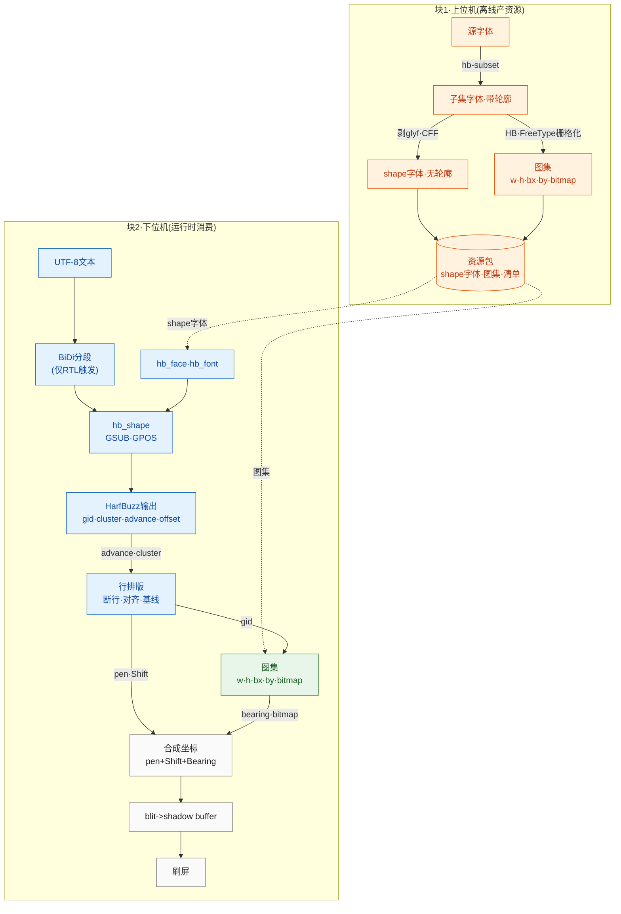

---
领域:
  - 工作
类型:
  - 开发
项目:
  - "[[GUI]]"
任务:
  - "[[260728harfbuzz移植]]"
状态: 进行
相关任务:
创建时间: 2026-07-28T23:41:00
截止时间: 2026-08-04T07:41:00
完成时间:
---

## 待办列表
- [ ] 编码
- [ ] 测试
- [ ] 合并

## 方案



## 字体渲染基础

### 核心模型：笔在基线上走，字形是贴在笔上的贴纸

画一行文字 = 一支笔沿基线从左到右移动，每画一个字向右移一段。**笔尖的位置叫 pen**。每个字形的像素贴图相对笔尖怎么摆，就是 bearing。

```
baseline(基线) ────────────────────────────────────────────────
                      ↑ pen 在这里
                      │
                      │ bearing_y (笔到贴纸顶部，屏幕坐标向下所以带负号)
                      │
                ┌─────┴─────┐
                │  字形bitmap │   ← 实际像素 (w×h)
                │   (w×h)    │
                └───────────┘
                      ↑
           bearing_x (笔到贴纸左缘，可负)
```

### 从文本到像素，每一步一个量

**① 字符 → 码点 (codepoint)**：`"你好"` 是 UTF-8 字节，先解码成 Unicode 编号（`你`=U+4F60）。与字体无关。

**② 码点 → gid，不能直接查表**：gid = 字体里"实际存在的形状"的编号。不能码点→gid 直接映射，因为 `fi` 合成连字 `fi`（2 字符→1 gid）、阿拉伯字母词首/中/尾不同形、`é`=`e`+组合尖音符。所以需要**整形 (shaping)**：输入一串码点，输出一串 gid + 位置。这是 HarfBuzz 干的活。

**③ 整形输出三样，只有两样用于画**：对每个 gid，整形给出 advance（笔沿基线移多远）、offset（字形相对笔的微调位移）、cluster（这个 gid 来自源文本哪几个字符，画字不用）。**advance 决定"下一个字在哪"，offset 决定"这个字形往哪偏"**——所以 advance 来自整形、不入 fontlet（排版量不是贴图量）。`é` 例：`e` 的 gid advance=e 宽、offset=(0,0)；尖音符 gid advance=0、offset=左上（笔不动，音符叠在 e 上）。

**④ 垂直度量 (ascent/descent/line_gap)**：决定行高和换行后基线位置。最小版不存，运行时问 `hb_font` 拿。

**⑤ 光栅化 → bitmap**：字形是矢量轮廓（贝塞尔曲线），屏幕要像素。把曲线在某字号下填充成像素叫光栅化，结果是一个 `w×h` 像素数组。harfembed 里这步**离线**做（PC 上 FreeType），MCU 只拿填好的像素。1-bit = 每像素 1 bit。

**⑥ bearing：bitmap 怎么摆到 pen 上**：bitmap 左上角 ≠ pen，因为字形可向左/上凸出。斜体 `f` 弯钩向左 → bearing_x 为负；大写字母在基线上方 → bearing_y 为正。落点 `bitmap_left = pen_x + bearing_x`，`bitmap_top = pen_y - bearing_y`（屏幕坐标向下）。所以 atlas 里 bx/by 是 i16 可负，x/y/w/h 是 u16 非负。

### atlas + blit

单独存每个字形 bitmap 会碎片化，所以离线把所有字形 bitmap 塞进**一张大图（atlas）**，每个字形记 (x,y,w,h)。**blit**（位块传送）= 从图集搬一块像素到屏幕的纯内存拷贝：

```
1. hb_shape 得到 gid 序列 + advance + offset
2. 对每个 gid: 查 atlas entry 拿 x,y,w,h,bx,by
3. blit: 图集 (x,y) 处 w×h 像素 → 屏幕 (pen_x+bx, pen_y-by)
4. pen_x += advance，回到 2
```

### 汇总表

| 量 | 是什么 | 谁产出 | 存哪 |
|---|---|---|---|
| codepoint | 字符编号 | UTF-8 解码 | — |
| gid | 字形编号 | shaping | — |
| advance | 笔前进量 | shaping | **不入 fontlet** |
| offset | 字形微调 | shaping | **不入 fontlet** |
| x,y,w,h | 像素在图集位置 | 离线光栅化 | atlas entry |
| bx,by | 贴纸相对笔偏移 | 离线光栅化 | atlas entry |
| bitmap | 字形像素 | 离线光栅化 | bitmap pool |

运行时闭环四步：`open → hb_shape → 按 gid 查 atlas → blit`。

## 项目结构

harfembed/  （磁盘文件夹仍叫 harfbuzz_lite）
├── docs/
├── res/
│   ├── fonts/                          # 源字体，CLI 输入（提交）
│   │   ├── xxx.ttf
│   │   └── xxx.otf
│   └── fontlets/                       # 生成产物（gitignore）
│       ├── fontlets_registry.h         # 生成的 fontlet 索引
│       ├── common.fontlet
│       ├── latn.fontlet
│       ├── hani.fontlet
│       └── hans.fontlet
├── src/
│   ├── third_party/                    # harfbuzz / freetype / raylib（浅克隆，gitignore）
│   ├── fontlet_generator_cli/          # 块1：源字体 -> fontlet
│   │   └── CMakeLists.txt
│   └── harfembed/                      # 块2：MCU 库（只暴露接口，零载体）
│       ├── CMakeLists.txt
│       └── inc/                        # 公共 API 头（含 fontlet_format.h）
├── examples/                           # 仿真自带 host 载体
│   └── CMakeLists.txt
├── tests/
│   └── CMakeLists.txt
├── .gitignore
├── CMakeLists.txt                      # 顶层
├── LICENSE                             # 占位，许可证未定
└── README.md

## 关键决策

- **命名**：项目 `harfembed`；前缀 `hbe_`（`hbe_fontlet_open` / `hbe_fontlet_t`）；命名空间 `harfembed::`；fontlet 文件按脚本标签命名（`latn`/`hani`/`hans`/`arab`/`common`）。
- **fontlet**：一个 fontlet = 一个字体 + 一个烘焙字号。blob（最小版）= header(32B) + shape字体 + atlas entry[] + bitmap pool，四段连续。magic `'FNTL'`（0x4C544E46），小端，结构体自然对齐无 padding。位深 **1-bit**，行 stride `ceil(w/8)`、MSB-first、无 padding。atlas entry 稠密索引（gid = 下标，hb-subset remap 到 0），12B/条（x,y,w,h 为 u16，bx/by 为 i16 可负）；advance/offset 来自 `hb_shape` 不入 atlas；缺字回退 gid 0（.notdef）。manifest（行度量）最小版暂缺，运行时问 `hb_font` 拿。字节契约见 `src/harfembed/inc/fontlet_format.h`。
- **io 接口**：harfembed 只暴露 `hbe_io_t`（`map` 零拷贝 / `read` 兜底），**不带任何载体实现**，载体归仿真/固件自带。`map` 只用于不透明字节流（font blob、位图），结构体一律 `read` 进对齐局部（M0 对齐安全）。
- **载体**（MCU，未定）：flash const 数组（默认）/ QSPI mmap / LittleFS·FatFS。库不选载体，靠 port 切换。
- **多语言**：多个 fontlet + 生成的注册表 `fontlets_registry.h`，固件按 lang 查；库不掺和多语言逻辑。
- **内存**：库不直接 `malloc`，走 alloc 接口或调用方传 buffer（原则先立，具体后定）。
- **第三方**：浅克隆 HEAD、`src/third_party/` gitignore（本地副本不跟踪）；后续可钉 release tag 或转 submodule 做可复现。harfbuzz / freetype / **Dear ImGui**（GLFW 用 msys64 pacman 安装，非内嵌）。
- **GUI**：Dear ImGui + GLFW + OpenGL3（raylib 已移除）。GUI/demo 共用 `imgui_app` 骨架（中文字体加载 + 深色主题 + 原生文件对话框句柄）。
- **不发预编译**：源码级集成（`add_subdirectory`），用固件自己的工具链现编现用。

## 当前进度

- [x] 骨架已建：目录结构 + 各级 CMakeLists 占位（无 target）+ `.gitignore` + `LICENSE`（占位）+ `README.md`
- [x] 第三方已克隆：harfbuzz(133M) / raylib(147M) / freetype(16M)，浅克隆，走代理 7897
- [x] `fontlet_format.h`（fontlet 字节布局契约·最小版）已落地：header(32B)+shape+atlas+bitmap 四段
- [x] 生成工具（块1）可用：`hbe_pack` CLI + `hbe_gui` GUI（导入字体→整字体转换→网格预览），核心 `packer.{hpp,cpp}` headless 可复用
- [x] 运行时库（块2）最小闭环已通：`hbe_core`（`hbe_fontlet_open`→`hbe_fontlet_shape`→查 atlas→blit），`examples/hbe_demo` 用 mmap 载体验证 `Hello` 渲染成像素正确
- [x] GUI 换 Dear ImGui（+独立 GLFW），raylib 已移除；GUI/demo 共用 `imgui_app` 骨架 + `mmap_io` 载体
- [ ] 下一步：行排版（断行/对齐/基线，用 hb_font 度量）+ 多字体/回退链（等真需要时）
