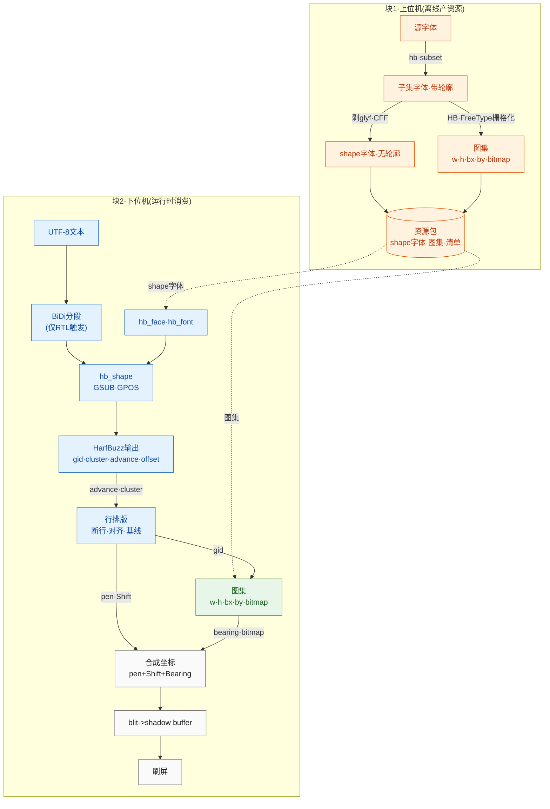

---
领域:
  - 工作
类型:
  - 开发
项目:
  - "[[GUI]]"
任务:
  - "[[260728harfbuzz移植]]"
状态: 进行
相关任务:
创建时间: 2026-07-28T23:41:00
截止时间: 2026-08-04T07:41:00
完成时间:
---

## 待办列表
- [ ] 编码
- [ ] 测试
- [ ] 合并

## 方案

## 项目结构

harfembed/  （磁盘文件夹仍叫 harfbuzz_lite）
├── docs/
├── res/
│   ├── fonts/                          # 源字体，CLI 输入（提交）
│   │   ├── xxx.ttf
│   │   └── xxx.otf
│   └── fontlets/                       # 生成产物（gitignore）
│       ├── fontlets_registry.h         # 生成的 fontlet 索引
│       ├── common.fontlet
│       ├── latn.fontlet
│       ├── hani.fontlet
│       └── hans.fontlet
├── src/
│   ├── third_party/                    # harfbuzz / freetype / raylib（浅克隆，gitignore）
│   ├── fontlet_generator_cli/          # 块1：源字体 -> fontlet
│   │   └── CMakeLists.txt
│   └── harfembed/                      # 块2：MCU 库（只暴露接口，零载体）
│       ├── CMakeLists.txt
│       └── inc/                        # 公共 API 头（含 fontlet_format.h）
├── examples/                           # 仿真自带 host 载体
│   └── CMakeLists.txt
├── tests/
│   └── CMakeLists.txt
├── .gitignore
├── CMakeLists.txt                      # 顶层
├── LICENSE                             # 占位，许可证未定
└── README.md

## 关键决策

- **命名**：项目 `harfembed`；前缀 `hbe_`（`hbe_fontlet_open` / `hbe_fontlet_t`）；命名空间 `harfembed::`；fontlet 文件按脚本标签命名（`latn`/`hani`/`hans`/`arab`/`common`）。
- **fontlet**：一个 fontlet = 一个字体 + 一个烘焙字号。blob = header + shape字体 + manifest + atlas meta + bitmap pool。magic `'FNTL'`（0x4C544E46），小端，结构体自然对齐无 padding。atlas entry 稠密索引（gid = first_gid + 下标，12B/条），advance 来自 `hb_shape` 不入 atlas；缺字回退 index 0（.notdef）。
- **io 接口**：harfembed 只暴露 `hbe_io_t`（`map` 零拷贝 / `read` 兜底），**不带任何载体实现**，载体归仿真/固件自带。`map` 只用于不透明字节流（font blob、位图），结构体一律 `read` 进对齐局部（M0 对齐安全）。
- **载体**（MCU，未定）：flash const 数组（默认）/ QSPI mmap / LittleFS·FatFS。库不选载体，靠 port 切换。
- **多语言**：多个 fontlet + 生成的注册表 `fontlets_registry.h`，固件按 lang 查；库不掺和多语言逻辑。
- **内存**：库不直接 `malloc`，走 alloc 接口或调用方传 buffer（原则先立，具体后定）。
- **第三方**：浅克隆 HEAD、`src/third_party/` gitignore（本地副本不跟踪）；后续可钉 release tag 或转 submodule 做可复现。
- **不发预编译**：源码级集成（`add_subdirectory`），用固件自己的工具链现编现用。

## 当前进度

- [x] 骨架已建：目录结构 + 各级 CMakeLists 占位（无 target）+ `.gitignore` + `LICENSE`（占位）+ `README.md`
- [x] 第三方已克隆：harfbuzz(133M) / raylib(147M) / freetype(16M)，浅克隆，走代理 7897
- [ ] 暂无代码
- [ ] 下一步：`fontlet_format.h`（fontlet 字节布局契约）落地
