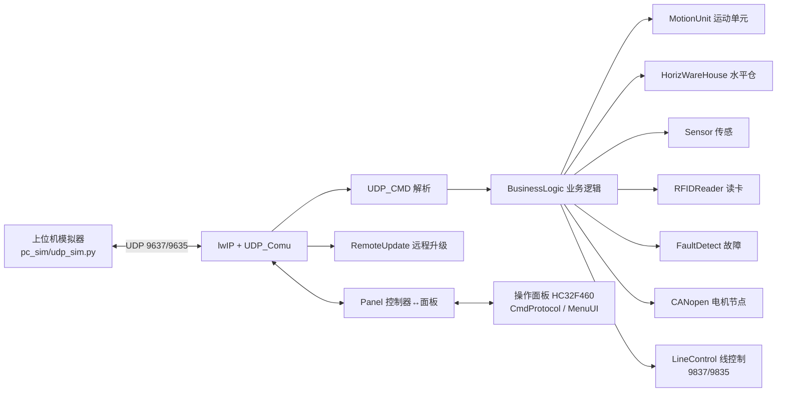

---
领域:
  - 工作
类型:
  - 开发
项目:
  - "[[S3吊挂控制器]]"
任务:
  - "[[261029S3维护]]"
相关任务:
状态: 进行
创建时间: 2026-10-29T12:03:48
截止时间: 2027-10-29T12:03:00
完成时间:
---
<!-- plan-doc:v1 -->

# S3吊挂控制器维护

> **一句话**：维护 S3 吊挂控制器（GD32F407）、操作面板（HC32F460）、上位机模拟器与 SR3 读卡器（HC32F002）的 UDP / 串口通讯与业务逻辑。
> **仓库**：`S3_Controller`（控制器）｜`Operation_Panel`（面板）｜`pc_sim`（上位机模拟）｜`SR3`（读卡器固件）｜`ReaderUpdater`（读卡器升级上位机）
> **规则**：改需求先记 C；一功能一机制；执行一次只做一条。

## 0. 看板

- **阶段**：T1-1 完成，待 V-1 真机验证
- **下一条**：（P0 空；V-1 待真机验证）
- **本次范围**：T1-1 已完成；V-1 待真机验证，不做新改动
- **事实源**：代码 / 测试 > 仓库 README、AGENTS > 本文
- **最后更新**：2026-11-02｜**活跃变更**：—｜**冻结**：—｜**血缘**：前身 —｜后继 —

### 需求登记

<!-- 需求只有一个入口：这张表；每条任务必须挂 需求：R#。 -->

| R | 需求 | 来源 | 状态 | 覆盖任务 | 文档 |
|---|---|---|---|---|---|
| R1 | 屏蔽控制器向上的 `0x00000055` 不确定卡号上报，但保留其推杆占用与避让逻辑 | 现场问题 | 待做 | T1-1 | — |

### 任务总览

| 任务 | 状态 | 出口条件 |
|---|---|---|
| T1-1 屏蔽 0x00000055 上报 | done | 上位机收不到 0x55 卡号；推杆占用 / 避让不变 |

### 机制登记

<!-- 一功能一机制。任务必须写"机制：复用 X / 新建 D#"。 -->

| 机制 | 位置 | 用途 | 扩展方式 | 使用者 |
|---|---|---|---|---|
| UDP 通讯 | `S3_Controller/APP/UDP_Comu.c/h`、`UDP_CMD.c/h`、`command.h` | PC↔控制器命令/心跳，端口 9637/9635，0xFA 帧头 | 在 `command.h` 加命令码 + `UDP_CMD_Deal` 解析 | — |
| 故障上报 | `S3_Controller/APP/FaultDetect.c/h` | 故障检测与上报（`CMD_FAULT_UPLOAD 0x7E`） | 在 FaultDetect 加故障类型/触发条件 | — |
| 业务逻辑 | `S3_Controller/APP/BusinessLogic.c/h` | 衣架流转、出站、桥接、满站等流程 | 在流程分支扩展，不另起状态机 | — |
| 水平仓 | `S3_Controller/APP/HorizWareHouse.c/h` | 水平仓参数（进出仓/满检/同步/桥接/电机/阀）读写与初始化 | 加参数项，复用 `W25QXX` 存储 | — |
| 运动单元 | `S3_Controller/APP/MotionUnit.c/h` | 提升机/推杆/气缸动作控制 | 新增动作参数，复用定时逻辑 | — |
| 传感器 | `S3_Controller/APP/Sensor.c/h` | 光电/避让信号采集与上报 | 加信号类型与上报命令 | — |
| BSP I/O 与定时 | `S3_Controller/BSP/INPUT`、`OUTPUT`、`RELAY`、`TIMER`、`SPI`、`GD32_BSP` | 端口采样/输出、继电器、定时与底层驱动 | 加端口配置，复用现有驱动接口 | — |
| RFID 读卡 | `S3_Controller/APP/RFIDReader.c/h` | 高低频卡号读取与上传 | 复用卡号打包接口 | — |
| 读卡器固件（SR3） | `D:\Reader\SR3`（`03_Application/reader_app.c`、`reader_cmd.c`；`02_Midware/em4095`、`protocol`、`led`） | EM4095 解码、0x10 协议、四种模式、Flash 参数、LED | 扩展 `reader_app` / `reader_cmd`，详见 `[[261102SR3读卡器维护]]` | — |
| 读卡器升级（ReaderUpdater） | `D:\Reader\ReaderUpdater`（`FirmwareUpdater.cpp`）；发布 `D:\Reader\ReaderUpdaterV2.0` | PC 端 0x55 IAP 升级与串口指令测试 | 复用升级状态机；0x55 帧改动需 App / Bootloader / 上位机三端同步 | — |
| 远程升级 | `S3_Controller/APP/RemoteUpdate.c/h` | 网络远程升级（`CMD_REMOTE_UPDATE`） | 复用升级状态机 | — |
| 线控制 | `S3_Controller/APP/LineControl.c/h` | 线控制功能，端口 9837/9835 | 加线控制命令 | — |
| 面板交互 | `S3_Controller/APP/Panel.c/h` | 控制器↔面板数据交换 | 加字段/命令码 | — |
| CANopen | `S3_Controller/BSP/CanOpen/`、`LIB/CANopenNode/` | CAN 电机节点通讯 | 加节点/对象字典 | — |
| Flash 存储 | `S3_Controller/BSP/FLASH/`、`BSP/W25QXX/` | 站号/线号/参数持久化 | 加地址宏，复用读写接口 | — |
| 面板命令协议 | `Operation_Panel/midware/CmdProtocol.c/h` | 面板↔上位机命令帧 + BCC 校验 + 重发 | 加命令 ID 与解析分支 | — |
| 面板菜单 | `Operation_Panel/midware/MenuUI.c`、`MenuParam.c`、`LangMenu.c`、`SC_MenuParam.c`、`TC_MenuParam.c` | 菜单显示与参数配置 | 加菜单项/参数表 | — |
| 面板显示 | `Operation_Panel/midware/LCD.h`、`Dispaly.c`、`fonts.c` | 液晶显示 | 复用显示接口 | — |
| 面板远程升级 | `Operation_Panel/midware/RemoteUpdate.c/h` | 面板端远程升级 | 复用升级状态机 | — |
| 面板存储 | `Operation_Panel/midware/flash/`、`w25qxx/`、`interflash.c`、`ziflash.c` | 面板参数持久化 | 复用读写接口 | — |
| 上位机模拟 | `pc_sim/udp_sim.py` | UDP 上位机模拟器（Typer + Rich TUI），收发/心跳/Bug 复现 | 加命令解析与模拟动作 | — |

### 基线

- 仓库 / 分支 / 提交（2026-11-02 侦察）：
  - 控制器 `D:\S3\Project\S3_Controller`｜`develop`｜`aeef0ca`（工作区干净；任务分支 `feature/T1-1-unknown-card-filter`@`6bb33bf`）
  - 面板 `D:\Screen\Projects\Operation_Panel`｜recon 时 `release/V061`｜`7bd9a43`；当前 `feature/换绑优化`@`50b235c`（dirty，非本任务）
  - 上位机 `D:\S3\pc_sim`｜非 git（仅 `udp_sim.py` + `__pycache__`）
  - 读卡器 `D:\Reader\SR3`｜`main`｜`36f0f76`（RD0312，工作区干净）
  - 读卡器升级上位机 `D:\Reader\ReaderUpdater`｜`master`｜`3619bcb`（工作区 2 个未提交修改）
  - 读卡器发布包 `D:\Reader\ReaderUpdaterV2.0`｜无源码（exe + Qt6 DLL，2026-08-17）
- 构建命令：Keil MDK（`.embeddedskills/config.json`）
  - 控制器 `MDK/network.uvprojx` → `DGController_3`（编译器 ARM Compiler 5.06u7）
  - 面板 `MDK/HC32F460KETA.uvprojx` → `HC32F460KETA_Debug`
  - 读卡器 `00_Project/Keil/SR3.uvprojx` → `SR3`（HC32F002C4PZ，ARMCLANG V6.24）
- 版本：控制器 `ControlVer = "V3.0.07.0"`（`UDP_Comu.c:26`）｜面板 R61（提交 `c0c3b68`）｜读卡器 RD0312（`READER_VER_MAJOR 0x03` / `READER_VER_MINOR 0x12`）
- 测试：未找到自动化测试目录 / CI；控制器联调用 `pc_sim/udp_sim.py`；读卡器用真机串口 + `06_TEST/*.py`
- 构建现状：`UDP_Comu.c` 可编译；完整链接因 `MDK/network.uvprojx` 引用 `APP/FullyEnclosed.c` 而该文件不在 develop `aeef0ca` 中，报 `cannot open source input file`；`MDK/build_output.txt` 为历史 `SEGGER_RTT_Init` 记录；二者均为基线问题，本任务未修
- 备注：`UDP_Comu.c:123` 注释称线控制接收口"单机版 9835 / 服务器版 9838+线号"，但 `124-131` 两分支实际都绑 `9837`，以代码为准
- 旧读卡器程序：`D:\Reader\HC32F002_DDL_Rev1.2.0（取消比对）`、`D:\Reader\RFID_STC15_C语言（EM4095收指令发）` 按 SR3 D1 不纳入比对

## 1. 任务池

<!-- 一次只领一条 P0。任务自包含，执行 AI 不需要读全文。 -->

### R-T-D-C 关联表 / 状态总览

<!-- 视图表；唯一排序源是下面的任务池（P0→P1→P2，区内行序）。已完成与未完成同表。 -->

| 任务 | 状态 | 需求 | 决策 | 变更 | 记录 |
|---|---|---|---|---|---|
| T1-1 | done | R1 | — | — | §5 |

### P0（立即）

- （空；待 V-1 真机验证）

### P1 / P2

- （空）

### 外部依赖与验收

- [ ] **V-1 0x55 真机验证** → 验收：读卡器投票未决上报 `0x00000055` 时，上位机收不到 186/187/152/141/139 中的该卡号；推杆占用与避让仍生效，其他卡号上报不受影响

## 2. 契约

<!-- 带版本；只写会影响任务的约束。 -->

- 控制器 MCU：GD32F407/427/450（`CORE/startup_gd32f*.s`），协议栈 lwIP（`LIB/lwip/`）
- 面板 MCU：HC32F460（`src/hc32f460_*.c`）
- 通讯：UDP，控制器端口 9637（PC→控制器）/9635（PC←控制器），线控制 9837/9835；帧格式 `0xFA CMD1 CMD2 CMD3 LineNo StatNo LenHi LenLo Data`
- 读卡器通讯：SR3 固件 RD0312，0x10 帧（`TYPE + CMD + DATA`，长度按指令表约定），19200-8-N-1（桌面 9600）；控制器侧 `RFIDReader.c` 使用 `10 FF 7A/75`（进站/下放）与 `10 A0 05`（升级），协议细节见 `[[261102SR3读卡器维护]]` §2
- 不确定卡号：`0x00000055` 不上报上位机（152/186/187/141/139 等携带读卡器卡号的上报全部过滤），但保留推杆占用与避让；过滤点在 `UDP_Comu.c` 的 `Pc_UDPSend`（← R1）
- 版本字段：控制器 `ControlVer[10]`（V3.0.07.0），面板版本号 R61
- 构建与测试命令：见 §0 基线（暂无自动化测试）

## 3. 设计要点

<!-- 复杂任务才写。用图表达结构与关系。 -->

```mermaid
flowchart LR
    PC[上位机模拟器<br/>pc_sim/udp_sim.py] <-->|UDP 9637/9635| NET[lwIP + UDP_Comu]
    NET --> CMD[UDP_CMD 解析]
    CMD --> BL[BusinessLogic 业务逻辑]
    BL --> MU[MotionUnit 运动单元]
    BL --> WH[HorizWareHouse 水平仓]
    BL --> SEN[Sensor 传感]
    BL --> RFID[RFIDReader 读卡]
    BL --> FD[FaultDetect 故障]
    BL --> CAN[CANopen 电机节点]
    BL --> LC[LineControl 线控制<br/>9837/9835]
    NET --> RU[RemoteUpdate 远程升级]
    NET <--> PANEL[Panel 控制器↔面板]
    PANEL <--> OP[操作面板 HC32F460<br/>CmdProtocol / MenuUI]
```

- 控制器主循环入口：`S3_Controller/APP/main.c`，通讯处理 `UDP_Comu()` / `UDP_CMD_Deal()`。

### 3.1 屏蔽 0x00000055 卡号上报（R1 / T1-1）

- **方案要点**：在 `UDP_Comu.c` 的 `Pc_UDPSend` 发送层统一过滤，不在读卡器解析层丢弃卡号。
  - 加局部判断（`id.Val == 0x00000055`），覆盖 152 `MAIN_COMM_STORE_HANGER_ID`、186 `MAIN_COMN_COME_IN_STATION_HANGER_ID`、187 `MAIN_COMN_NO_STATION_HANGER_ID`、两条 141 `MAIN_COMM_Hanger_REQ`（`out_RFID_apply` 与 `Hanger_REQ`）、139 `MAIN_COMM_HANGER_OUT`。
  - 命中时：清对应 `Command_Data.apply`、`Command_Num--`、不调用 `UDP_SendOut`；187 额外清 `InReader[statNum].RecvFlag[B]`，避免重复入队；186/187 本地置 `StatParam[statNum].AvoidPDBan[0] = 1`，等价原 PC ACK；139 额外清 `OutReader[statNum].ID_Perd`。
- **保持**：`RFIDReader.c` 仍把 0x55 写入 `InReader.ID` 并置 `InToOutPoleFlag`；推杆占用、进站匹配、避让与计时逻辑不变。
- **边界**：不改读卡器固件 / 上位机 / 0x10 协议帧；不新建机制；不修基线 `SEGGER_RTT_Init` 构建错误。

## 4. 决策与变更

### 决策（D）

| D | 决策 | 结论 | 任务 |
|---|---|---|---|

### 变更（C）

| C | 日期 | 类型 | 需求 | 内容 | 影响 | 处理 | 任务 |
|---|---|---|---|---|---|---|---|

## 5. 实施记录

<!-- 一行一条，只写结果。 -->

- [x] **T1-1 屏蔽 0x00000055 卡号上报** —— `UDP_Comu.c Pc_UDPSend` 对 152/141/186/187/139 六条上报分支加 0x55 过滤，命中清标志/计数不组帧，186/187 补 `AvoidPDBan[0]=1`、187 清 `RecvFlag[B]`、139 清 `ID_Perd`；验证：静态 6/6 分支 + Keil `DGController_3` 编译 `UDP_Comu.c` 0 error（完整链接仍受基线 `FullyEnclosed.c` 缺失阻塞，未修）→ 通过；行为：0x55 不再上报上位机，推杆占用与避让保持；结果：通过（真机待 V-1）

## 6. 归档

| 任务 | 结果 | 关联 | 提交 |
|---|---|---|---|
| T1-1 屏蔽 0x00000055 上报 | 完成 | — | `6bb33bf` |

## 7. 参考与索引

### 仓库

| 仓库 | 路径 | 角色 | 构建 | 测试 |
|---|---|---|---|---|
| S3_Controller | `D:\S3\Project\S3_Controller` | 吊挂控制器（GD32F407） | Keil `network.uvprojx` → DGController_3 | 无 |
| Operation_Panel | `D:\Screen\Projects\Operation_Panel` | 操作面板（HC32F460） | Keil `HC32F460KETA.uvprojx` → HC32F460KETA_Debug | 无 |
| pc_sim | `D:\S3\pc_sim` | 上位机模拟器 | Python（`python udp_sim.py [IP]`） | 手动调试 |
| SR3 固件 | `D:\Reader\SR3` | 读卡器固件（HC32F002C4PZ） | Keil `00_Project/Keil/SR3.uvprojx` target `SR3` | 真机串口 + Python 脚本 |
| ReaderUpdater 源码 | `D:\Reader\ReaderUpdater` | 读卡器升级 / 指令测试上位机 | VS + Qt 6 `ReaderUpdater.vcxproj` | 手工 + 串口 |
| ReaderUpdater 发布 | `D:\Reader\ReaderUpdaterV2.0` | 发布包（exe + Qt6 DLL） | 无源码 | 手工 |
| 旧读卡器程序（不比对） | `D:\Reader\HC32F002_DDL_Rev1.2.0（取消比对）` | 旧 SR3 参考 | — | 不纳入 |
| 旧读卡器程序（不比对） | `D:\Reader\RFID_STC15_C语言（EM4095收指令发）` | 旧 STC15 参考 | — | 不纳入 |

### 关键文件

| 文件 | 作用 |
|---|---|
| `S3_Controller/APP/main.c` | 控制器入口，全局参数/状态 |
| `S3_Controller/APP/command.h` | 通讯命令码宏定义（PC/控制器/MOTOLAN/三代） |
| `S3_Controller/APP/UDP_Comu.c` | UDP 收发与接收解析 |
| `S3_Controller/APP/UDP_CMD.c` | 命令处理/应答 |
| `S3_Controller/APP/BusinessLogic.c` | 衣架流转业务逻辑 |
| `S3_Controller/APP/HorizWareHouse.c` | 水平仓参数与仓储逻辑（W25QXX 持久化） |
| `S3_Controller/APP/FaultDetect.c` | 故障检测上报 |
| `Operation_Panel/source/MAIN.C` | 面板入口 |
| `Operation_Panel/midware/CmdProtocol.c` | 面板命令协议（帧/BCC/重发） |
| `Operation_Panel/midware/MenuUI.c` | 面板菜单 |
| `pc_sim/udp_sim.py` | 上位机模拟器（帧构建/解析/命令） |
| `D:\Reader\SR3\03_Application\reader_app.c` | 读卡器应用：模式、卡事件、主动上报、Flash、IAP、LED |
| `D:\Reader\SR3\03_Application\reader_cmd.c` | 读卡器 14 条指令表 / dispatch / 发送封装 |
| `D:\Reader\SR3\02_Midware\em4095\` | EM4095 解码、投票、卡跟踪、事件 FIFO |
| `D:\Reader\SR3\02_Midware\protocol\` | 0x10 帧解析、RX/TX FIFO、5ms 帧间隔 |
| `D:\Reader\ReaderUpdater\FirmwareUpdater.cpp` | 0x55 升级状态机、CRC |
| `D:\Reader\ReaderUpdater\ReaderUpdater.cpp` | 串口 UI、指令测试 |

### 文档

- 项目级 `README.md` / `AGENTS.md` / `CLAUDE.md`：各仓库均未找到（仅 `LIB/` 下第三方 README）
- 相关笔记：[[260918立冠架构整理]]（通信/控制逻辑）、[[261020立冠RGV料箱站位硬件参考]]
- 读卡器：[[261102SR3读卡器维护]]（RD0312 基线 / 审查任务 / 差异表）、[[260804SR3框架整理]]（协议 / 模式 / LED 参考）、[[260814读卡器测试]]、[[260918读卡器固定衣架号沟通]]
- 读卡器芯片资料：`D:\Reader\SR3\04_Doc\em4095.pdf`、`em4095_ds.pdf`、`em4100.pdf`

### 相关仓库 / 依赖

- `S3_Controller` 依赖 `GD32F4x_FWLib`、`lwip`、`CANopenNode`、`cm_backtrace`、`MALLOC`、`SYSTEM`（均在 `LIB/`）
- 控制器 BSP：`GD32_BSP`、`LAN8720`（PHY）、`INPUT`/`OUTPUT`/`RELAY`/`TIMER`/`SPI`/`W25QXX`/`FLASH`、`CanOpen`
- 控制器 / 面板 / `pc_sim` 三端通过 UDP 协议互通；`pc_sim/udp_sim.py` 是控制器联调工具（Typer + Rich TUI）
- 控制器 `RFIDReader.c/h` 通过 0x10 帧对接 SR3 读卡器；读卡器固件、Bootloader、`ReaderUpdater` 构成 0x55 三端升级链，协议与差异见 `[[261102SR3读卡器维护]]`
