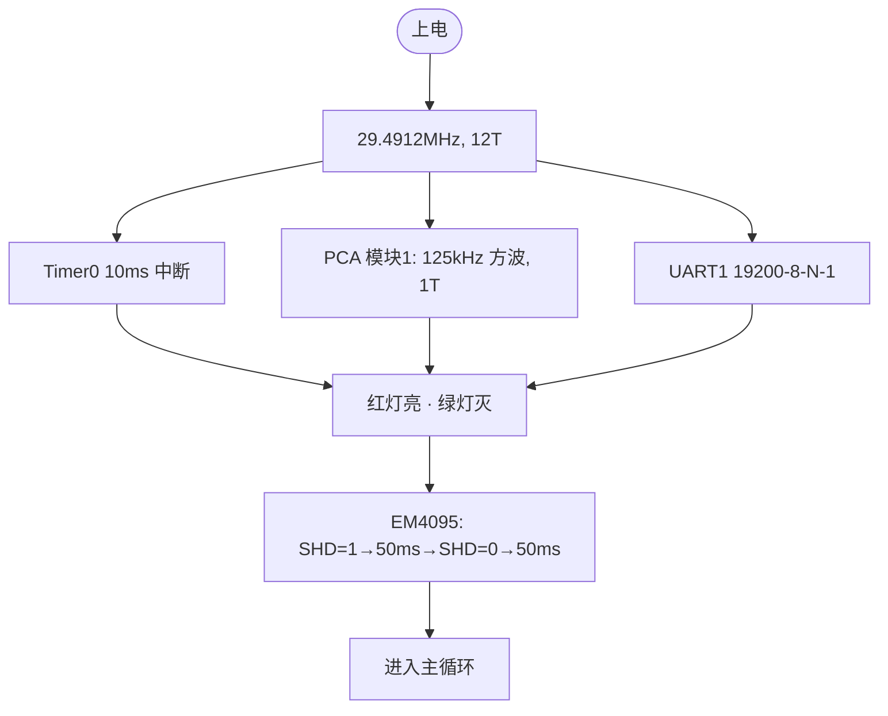
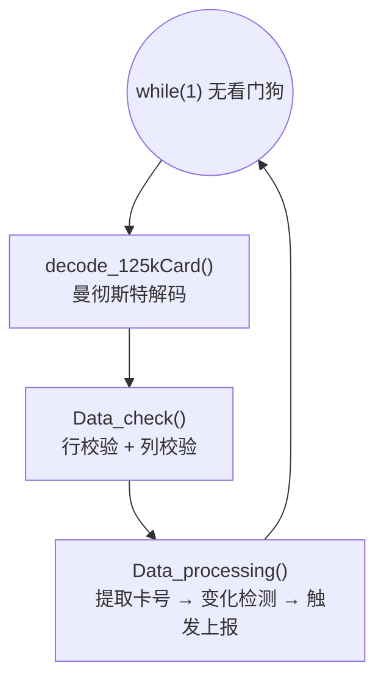
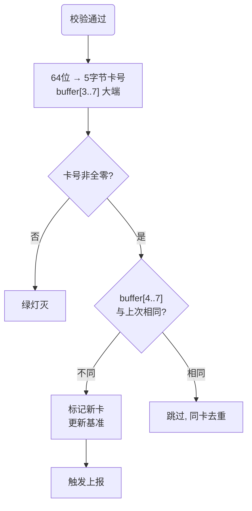
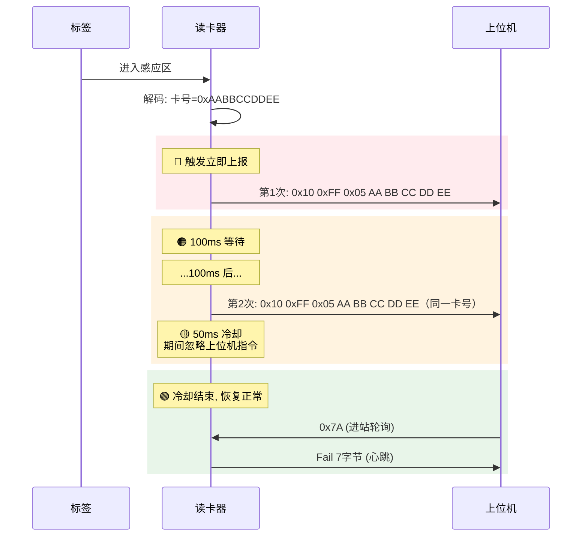
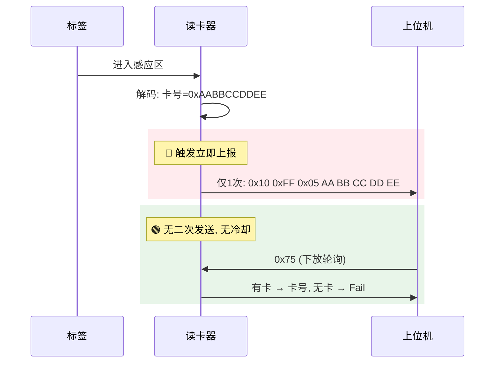

# SR2 读卡器行为（第一代 STC15）

> 源码：`RFID_STC15_C语言（EM4095收指令发）(2)\main.c`（约 640 行，单文件）
> MCU：STC15W4K32S4，29.4912MHz，12T 模式
> 用途：新 SR3 重构时确保向下兼容的基线参考

---

# 一、通信协议

## 1.1 物理层

- UART 19200-8-N-1，P30(RX)/P31(TX)，Timer2 波特率发生器 12T 模式
- 帧头固定 0x10 0xFF，数据长度由 CMD 决定

## 1.2 接收指令（上位机 → 读卡器）

| 字节序列 | 语义 | 说明 |
|---|---|---|
| `10 FF 7A` | 进站查询 + 设方向 0x55 | 唯一触发进站的方式 |
| `10 FF 75` | 下放查询 + 设方向 0xAA | 唯一触发下放的方式 |

> SR2 只支持这两条命令。其他 CMD 值会被 3 字节状态机丢弃（`RX1_Cnt=0`）。

UART 中断中按 3 字节状态机解析：`buf[0]==0x10` → `buf[1]==0xFF` → `buf[2]==0x7A/0x75`，任一不匹配则复位计数器。

## 1.3 发送指令（读卡器 → 上位机）

| 字节序列 | 触发场景 |
|---|---|
| `10 FF 05 + 5字节卡号` | 新卡主动上报、0x75 应答有卡、进站二次发送 |
| `10 FF 04 46 61 69 6C` | 0x7A 应答、0x75 应答无卡 |

> 无 BCC，无模式 2/3，无版本包。

## 1.4 忙保护

收到指令时，满足以下任一条件则**静默忽略**（不回应）：
- 串口正在发送中
- 进站 100ms 等待期或 50ms 冷却期

**但忙保护不阻止新卡上报。** 新卡检测条件独立于忙状态。

---

# 二、读卡核心

## 2.1 上电启动



## 2.2 主循环与解码



**三个函数串行循环**，无看门狗。

## 2.3 曼彻斯特解码

EM4100 协议，125kHz 载波。PCA 中断（每 ~8μs）检测 DEMOD_OUT 引脚跳变→记录脉宽→主循环分类解码：

| 脉宽 | 含义 | 阈值 |
|---|---|---|
| 窄 (~1bit) | 单电平 | 35~95 |
| 宽 (~2bit) | 双电平 | 105~175 |
| 超出范围 | 干扰 | 解码复位 |

- 64 位收齐 → `decode_end_flag=1`
- 卡头保护：前 9 位出现 0 → 复位（EM4100 头必须是 9 个 1）
- 校验期间关闭 PCA（125kHz 停振），校验完恢复

## 2.4 校验：两关

| 关 | 方法 | 通过条件 |
|---|---|---|
| 行校验 | 10 行奇校验 | 10 行全对 |
| 列校验 | 4 列奇校验 | 4 列全对 |

两关全过 → 绿灯亮。**无停止位校验**（这是 SR2 与 SR3 的关键差异）。

## 2.5 卡号提取与变化检测



> 只比较 buffer[4..7]（卡 ID），buffer[3]（厂商编号）不参与。

## 2.6 主动上报触发条件

```c
if(Read_card_success_flag==0 || Kahao_new_flag!=0)
```

- 当前无卡（200ms 超时清零）→ 触发
- 检测到新卡 → 触发
- **不检查 100ms_flag**——即使在等待/冷却中也会触发

---

# 三、位置行为

## 3.1 进站（Send_Manner = 0x55）



**时序参数：** 100ms 二次发送（Timer0 10ms × 10 tick），50ms 冷却（× 5 tick）。

## 3.2 下放（Send_Manner = 0xAA）



## 3.3 轮询应答规则

| 指令 | 忙时 | 空闲时 |
|---|---|---|
| 0x7A（进站） | 静默忽略 | **只应答 Fail**，不报卡号 |
| 0x75（下放） | 静默忽略 | **有卡报卡号，无卡报 Fail** |

## 3.4 新卡打断规则

新卡优先级最高，随时打断任何流程。触发条件不检查 100ms_flag。

| 场景 | 行为 | 后果 |
|---|---|---|
| 100ms 等待中来新卡 | 立即发新卡 | 原卡二次发送取消 |
| 50ms 冷却中来新卡 | 立即发新卡，重新 100ms 计时 | 原卡流程终止 |
| 发送中来新卡 | `delay_ms(20)` 等 TX 空闲 → 发新卡 | 当前发送完成后切卡 |

## 3.5 200ms 无卡超时

新卡解码后 200ms 内无新卡 → `Read_card_success_flag=0` → 绿灯灭。Timer0 10ms × 20 tick。

---

# 四、LED 行为


极简模型：无模式切换闪烁、无红绿互斥逻辑、无黑卡处理。红灯在上电后始终与绿灯相反（有卡时红灯灭，无卡时红灯亮）。

---

# 五、与 SR3 的兼容性

上位机只发 0x7A 和 0x75 时，SR2 和 SR3 行为完全一致，可互换。以下 19 项兼容基线：

| 行为 | 说明 |
|---|---|
| 命令帧格式 | 0x10 0xFF 3 字节 |
| 0x7A 响应 | 进站方向 + Fail 应答 |
| 0x75 响应 | 下放方向 + 有卡报卡号/无卡 Fail |
| 卡号包 | 8 字节，无 BCC |
| Fail 包 | 7 字节 |
| 新卡立即上报 | 不等轮询 |
| 进站 100ms 二次发 | Timer0 10ms × 10 |
| 下放单次发 | 无二次无冷却 |
| 进站 50ms 冷却 | 冷却期忽略指令 |
| 忙保护 | Busy / 100ms_flag |
| 同卡去重 | 比较 buffer2 |
| 200ms 超时 | 无卡清零 |
| 方向标志 | 0x55/0xAA |
| EM4095 初始化 | SHD 高 50ms → 低 |
| 125kHz 载波 | 硬件定时器产生 |
| 曼彻斯特解码 | 脉宽分类 + 64 位还原 |
| 校验 | 行校验 + 列校验 |
| 卡号提取 | 40 位 → 5 字节大端 |
| 波特率 | 19200-8-N-1 |

## SR2 与 SR3 的差异

| 维度 | SR2 | SR3 |
|---|---|---|
| 命令数 | 2 条 | 7 条 |
| 模式 | 仅模式 1 | 模式 1/2/3 |
| BCC | ❌ | 模式 2/3 ✅ |
| 校验 | 行+列 (2关) | 停止位+行+列 (3关) |
| LED | 极简 | 红绿互斥/闪烁/黑卡 |
| 看门狗 | ❌ | ✅ ~3.2s |
| 发送方式 | TI 中断逐字节 | LPUART_Transmit 阻塞 |
| Bootloader | ❌ | ✅ 0x55 帧协议 |
| 远程升级 | ❌ | ✅ |