## 待办列表
- [ ] 编码
- [ ] 测试
- [ ] 合并

---

# SR2 读卡器（第一代 STC15）行为规范

> 源码: `RFID_STC15_C语言（EM4095收指令发）(2)\main.c`（约 640 行，单文件）
> MCU: STC15W4K32S4, 29.4912MHz, 12T 模式
> 用途: 重构第三代时确保向下兼容的基线参考

---

## 一、主动行为（上电即运行，不依赖上位机）

### 1.1 上电启动流程

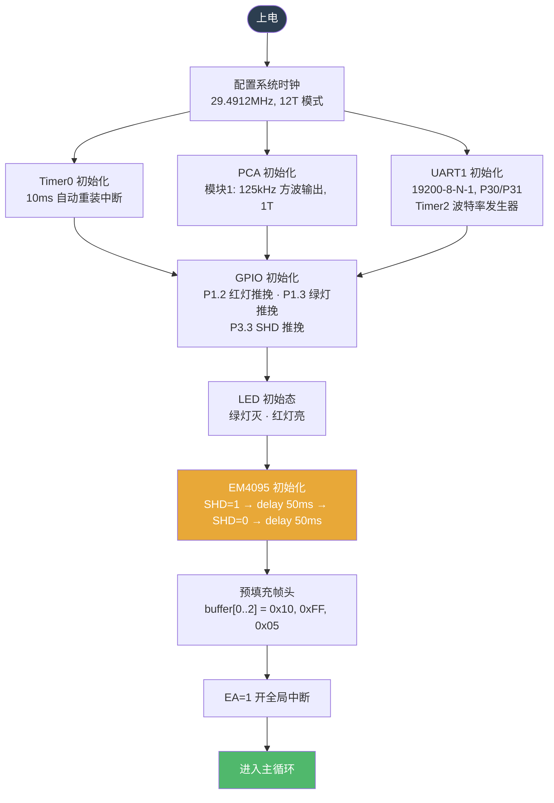

### 1.2 主循环

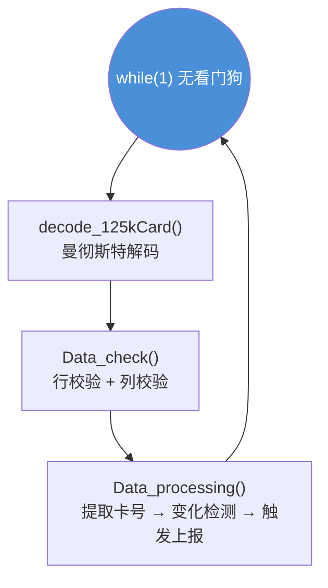

**无看门狗**——WDT_CONTR 在源码中被注释掉。

### 1.3 125kHz 载波与曼彻斯特解码

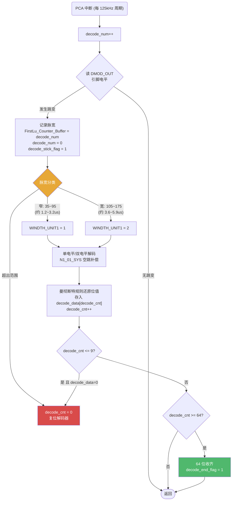

### 1.4 卡号校验：仅两关

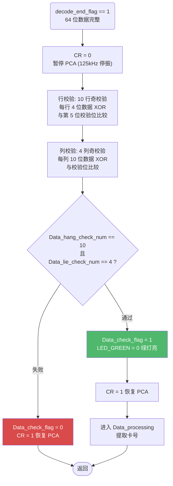

**第一代缺少的校验：** 无停止位校验（Bit[63]==0）、无卡号全零过滤。

### 1.5 卡号提取与变化检测（核心上报逻辑）

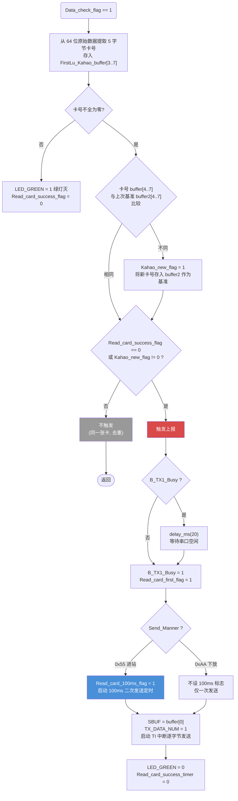

**关键：** 卡号变化时**不等上位机轮询，立即通过 TI 中断逐字节发送**。

### 1.6 Timer0 ISR（10ms 节拍驱动所有定时）

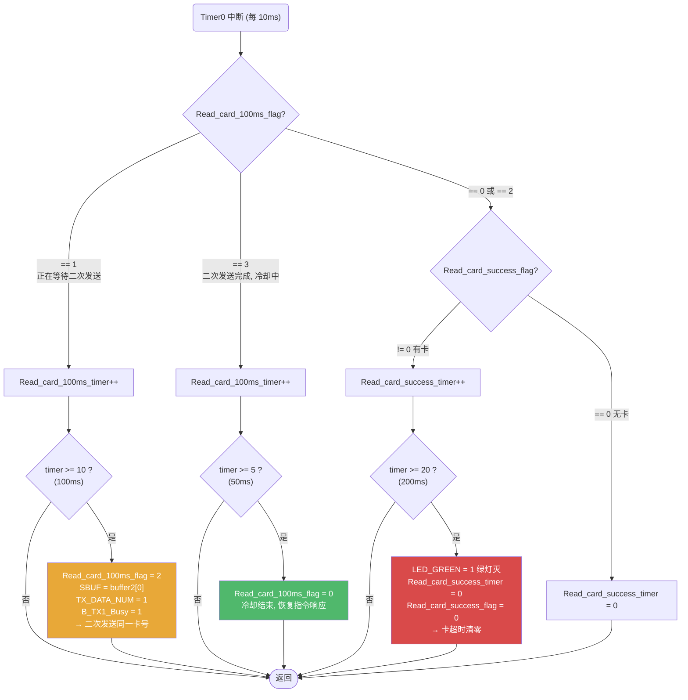

### 1.7 UART TI 中断（逐字节发送状态机）

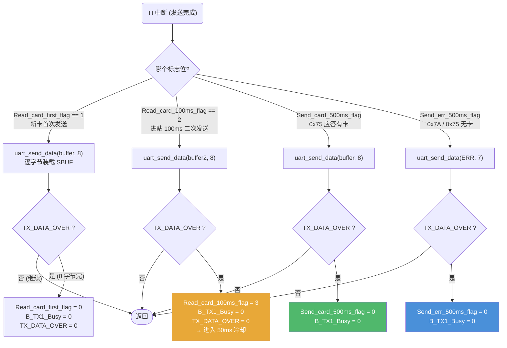

> `uart_send_data` 逻辑：`TX_DATA_NUM < data_len` → 装入 SBUF, 递增；`TX_DATA_NUM >= data_len` → 置 `TX_DATA_OVER = 1`。

### 1.8 LED 行为

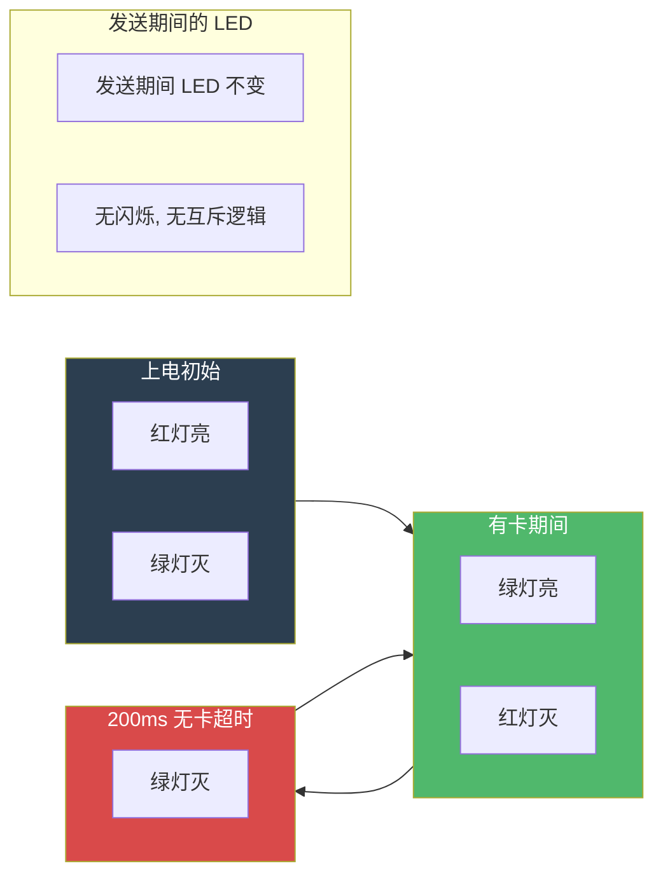

**极简模型：** 上电红灯亮。校验通过有卡 → 绿灯亮。200ms 无新卡 → 绿灯灭。无模式切换闪烁、无红绿互斥逻辑、无黑卡处理。

---

## 二、被动行为（上位机指令触发）

### 2.1 命令接收（UART RI 中断 3 字节状态机）

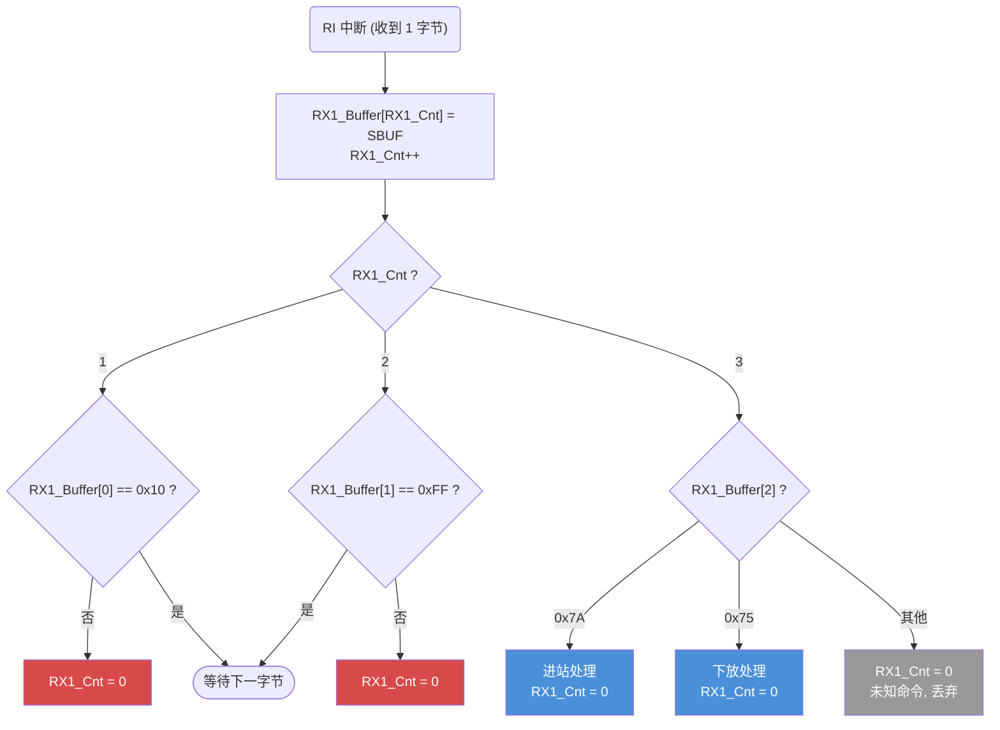

### 2.2 0x7A —— 进站

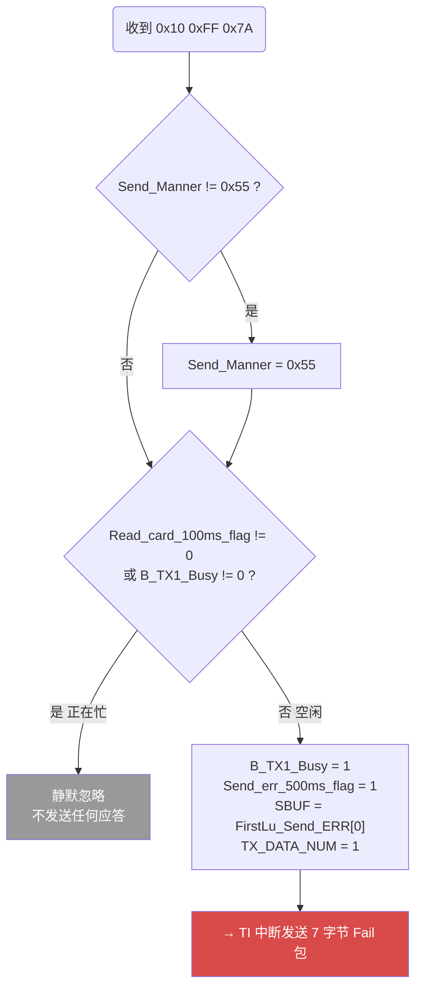

**0x7A 不查询卡号，只应答 Fail。** 卡号已在检测到新卡时主动上报过了。

### 2.3 0x75 —— 下放

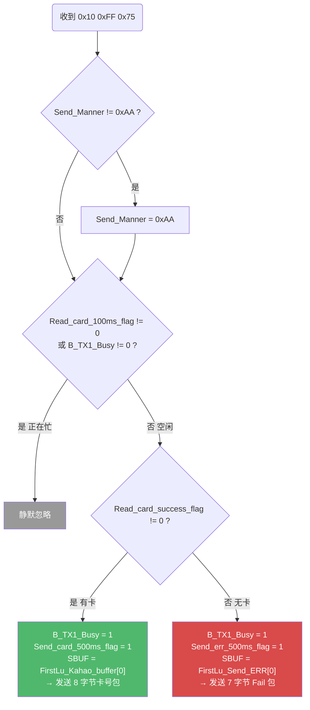

**0x75 可查询当前卡号。** 适用于需要主动获知"工位上现在有没有衣架"的场景。

---

## 三、完整行为时序

### 3.1 进站场景（Send_Manner = 0x55）

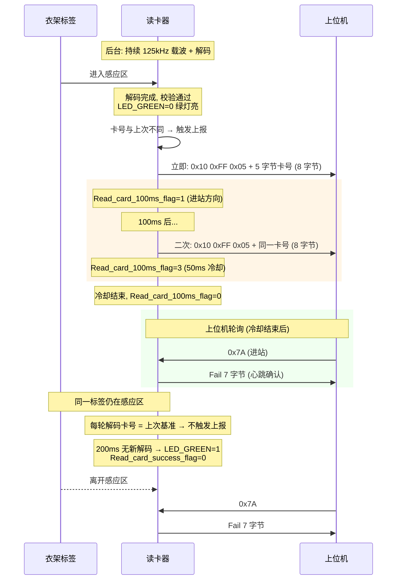

### 3.2 下放场景（Send_Manner = 0xAA）

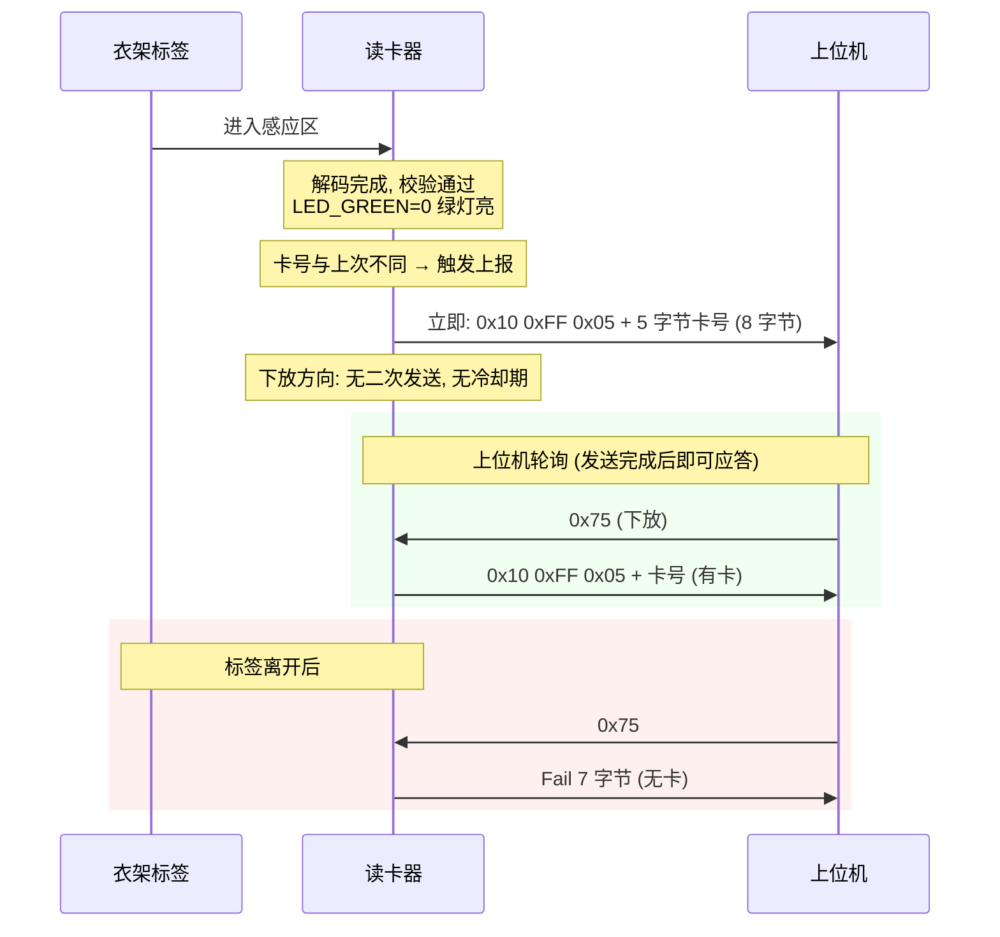

---

## 四、主动/被动行为一图总览

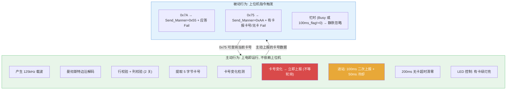

---

## 五、与第二代兼容的基线行为（19 项）

```mermaid
flowchart LR
    subgraph Compat["向下兼容基线: 上位机仅用 0x7A/0x75 即可互换"]
        direction TB
        C1["① 0x10 0xFF 3 字节命令帧"]
        C2["② 0x7A → 进站 0x55 + Fail"]
        C3["③ 0x75 → 下放 0xAA + 卡号/Fail"]
        C4["④ 8 字节卡号包: 0x10 0xFF 0x05 + 5B 卡号"]
        C5["⑤ 7 字节 Fail 包: 0x10 0xFF 0x04 Fail"]
        C6["⑥ 卡号变化立即上报 (不等轮询)"]
        C7["⑦ 进站 100ms 二次上报"]
        C8["⑧ 下放单次上报"]
        C9["⑨ 进站 50ms 冷却"]
        C10["⑩ 忙保护: Busy / Read_card_100ms_flag"]
        C11["⑪ 同卡去重 (比较 buffer2)"]
        C12["⑫ 200ms 无卡超时清零"]
        C13["⑬ Send_Manner 方向 (0x55/0xAA)"]
        C14["⑭ SHD: 高 50ms → 低"]
        C15["⑮ 125kHz 定时器硬件产生"]
        C16["⑯ 曼彻斯特脉宽分类 + 64 位还原"]
        C17["⑰ 行校验 + 列校验"]
        C18["⑱ 40 位 → 5 字节卡号 (大端)"]
        C19["⑲ 19200-8-N-1"]
    end

    style Compat fill:#e8f5e9,stroke:#50B86C
```

---

## 六、与第二代的差异

```mermaid
flowchart LR
    subgraph Gen1["第一代 (STC15)"]
        direction TB
        G1_1["仅 2 条命令: 0x7A, 0x75"]
        G1_2["无 BCC 校验"]
        G1_3["无连续模式"]
        G1_4["校验: 仅 2 关 (行+列)"]
        G1_5["LED: 极简"]
        G1_6["节拍: Timer0 10ms"]
        G1_7["发送: TI 中断 + SBUF"]
        G1_8["无看门狗"]
        G1_9["无 Bootloader"]
    end

    subgraph Gen2["第二代 (HC32F002)"]
        direction TB
        G2_1["7 条命令: +0x9A/0x95/0x9D/0x90/0xA0"]
        G2_2["模式 2 支持 BCC"]
        G2_3["模式 3: 100ms/500ms 自主上报"]
        G2_4["校验: 5 关 (+停止位+全零+脉宽)"]
        G2_5["LED: 模式闪烁/红绿互斥/黑卡"]
        G2_6["节拍: ATIM3 50ms"]
        G2_7["发送: LPUART_Transmit 阻塞"]
        G2_8["IWDT ~106ms"]
        G2_9["0x55 帧协议远程升级"]
    end

    Gen1 -->|"向下兼容"| Gen2

    style Gen1 fill:#fff3e0,stroke:#E8A838
    style Gen2 fill:#e3f2fd,stroke:#4A90D9
```

**兼容性保证：** 如果上位机仅使用 0x7A 和 0x75 轮询，第一代和第二代读卡器可互相替换，上层业务逻辑无需任何修改。第一代不支持的 0x9A/0x95/0x9D/0x90/0xA0 0x05 命令会被自动丢弃（帧头匹配失败 → RX1_Cnt 清零）。
