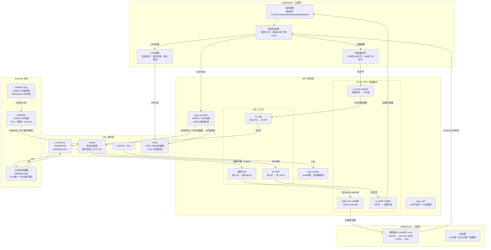
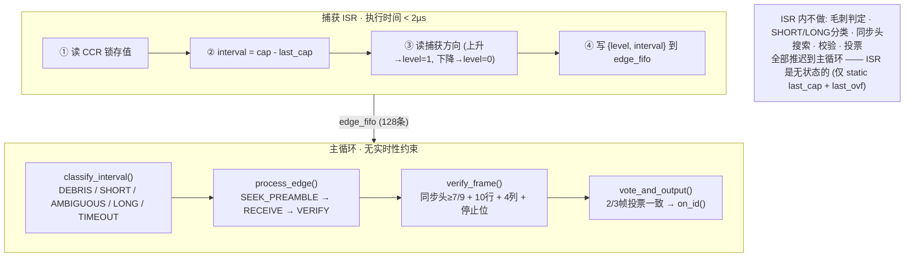
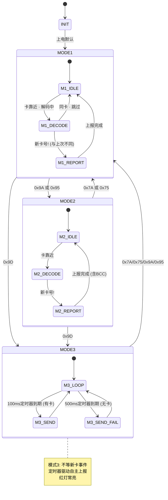
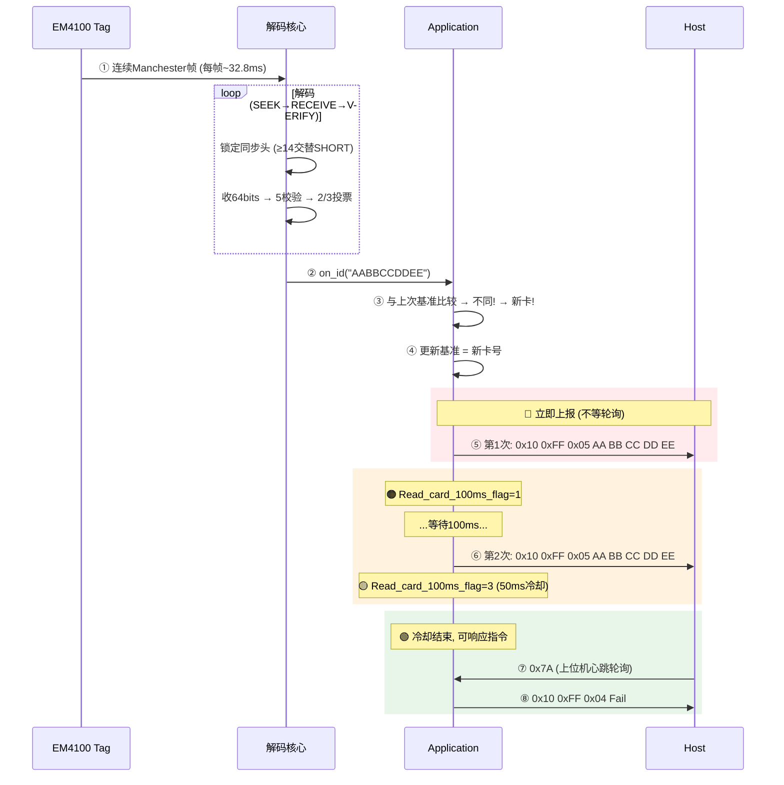
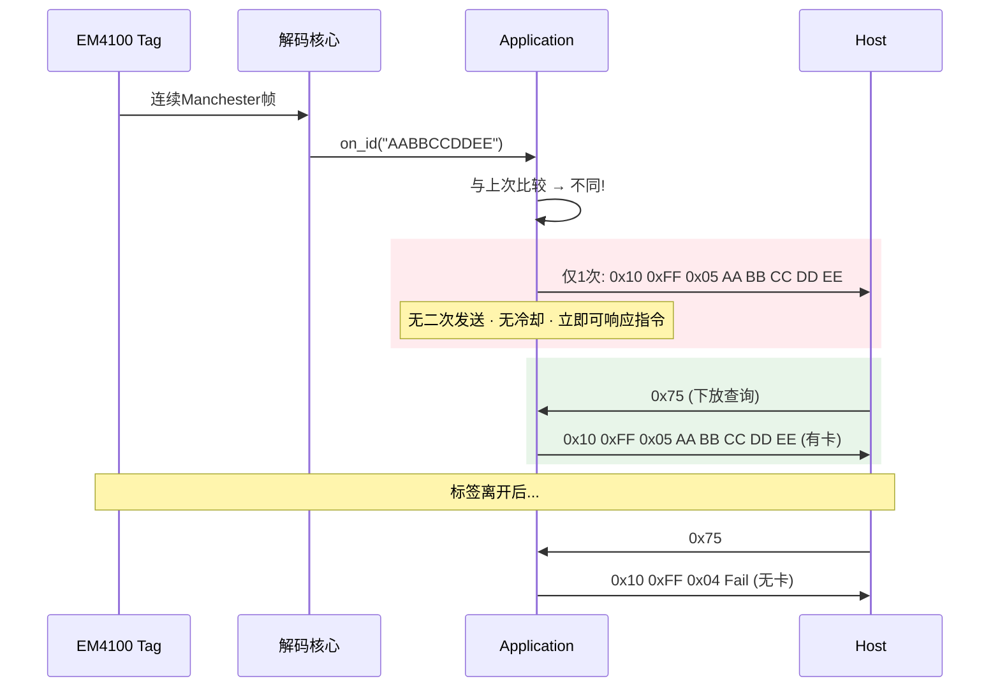
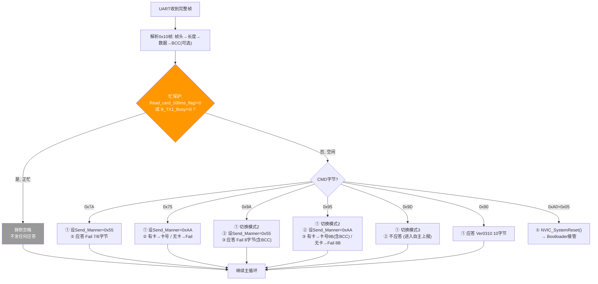
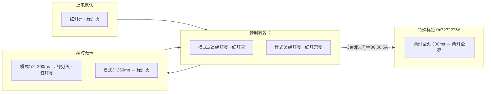
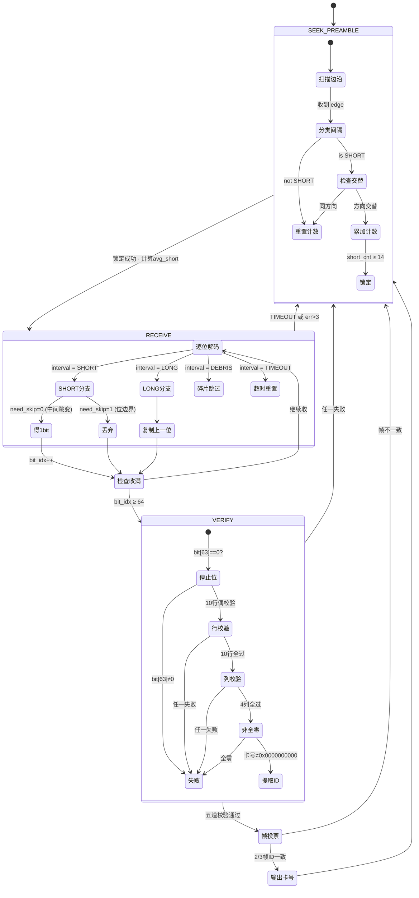

---
领域:
  - 工作
类型:
  - 方案
项目:
  - "[[SR3读卡器]]"
任务:
  - "[[260802SR3读卡器架构]]"
相关任务:
  - "[[260802SR3读卡器需求]]"
  - "[[260802SR2读卡器行为]]"
状态: 进行
创建时间: 2026-08-02T00:24:42
截止时间: 2026-08-02T23:24:00
完成时间:
---

## 待办列表
- [ ] 整体架构
- [ ] 中断与冲突
- [ ] 业务流程闭环

---

## 1. 整体架构

### 1.1 分层架构 + 数据流



### 1.2 分层职责

| 层 | 上下文 | 做什么 | **不做什么** |
|------|--------|--------|-------------|
| ISR (捕获/UART/SysTick) | 中断 | 读寄存器 → 算差值 → 写FIFO | 不解码 · 不分类 · 不校验 · 不判断 |
| SPSC FIFO ×3 | 跨上下文 | 无锁生产者-消费者通道 | 不阻塞 · 不关中断 · 不等锁 |
| Middleware (解码核心) | 主循环 | classify → process_edge → verify → 2/3投票 | 不碰硬件寄存器 |
| Middleware (协议层) | 主循环 | 0x10帧解析 · BCC计算 · 帧组装 | 不关心解码细节 |
| Application | 主循环 | 三模式状态机 · LED · 上报策略 · 指令响应 | 不碰硬件 · 不解码 |
| Bootloader | 独立固件 | 0x55帧协议 · Flash擦写 · CRC16+XOR | 不参与日常业务 |

### 1.3 源文件组织

```
01_Hardware/
├── bsp/
│   ├── inc/
│   │   ├── spsc_fifo.h          # SPSC FIFO (已有)
│   │   ├── bsp_em4095.h        # EM4095抽象 + edge_fifo定义
│   │   ├── bsp_uart.h          # UART API (已有)
│   │   ├── bsp_systick.h       # SysTick API (已有)
│   │   ├── bsp_clk.h           # 时钟 (已有)
│   │   └── bsp_config.h        # 集中配置 (已有)
│   └── src/
│       ├── bsp_em4095.c         # SHD时序 + ATIM3初始化 + 捕获ISR
│       ├── bsp_uart.c           # LPUART + ISR (已有)
│       ├── bsp_systick.c        # SysTick ISR (已有)
│       ├── bsp_clk.c            # 时钟初始化 (已有)
│       └── bsp.c                # Bsp_Init() (已有)
├── driver/                      # DDL库 (按需激活)
│   ├── atim3.{h,c} · lpuart.{h,c} · gpio.{h,c} · sysctrl.{h,c}
│   └── ...
└── f002/common/                 # MCU平台层 (已有)
    ├── HC32F002.h · system_hc32f002.c · interrupts_hc32f002.c

02_Midware/
├── em4095/
│   ├── em4095_core.h            # 共用类型: edge_t, decoder_t, class_t, state_t
│   └── em4095_core.c            # classify + process_edge + verify + vote
└── protocol/
    ├── proto_10.h               # 0x10帧协议: 卡号包 / Fail包 / BCC
    └── proto_10.c               # 帧解析 + 帧组装

03_Application/
├── main.c                       # 主循环: Bsp_Init() → 模式状态机 → poll
├── ddl_device.h                 # 器件选型 (已有)
├── app_mode.h                   # 模式管理: Send_Manner, 上报策略, 定时器管理
├── app_mode.c                   # 模式切换 · 进站冷却 · 二次上报 · 忙保护
├── app_cmd.h                    # 7条指令处理
├── app_cmd.c                    # 0x7A/0x75/0x9A/0x95/0x9D/0x90/0xA0响应
├── app_led.h                    # LED状态机
└── app_led.c                    # 红绿互斥 · 模式闪烁 · 黑卡检测

Bootloader/                      # 独立工程, 驻0x0000~0x1BFF
├── boot_main.c                  # 上电 → CMD 0x04 → 检查UART → 跳App或驻留
├── boot_proto_55.c              # 0x55帧解析: 0x81/0x82/0x83
├── boot_flash.c                 # Flash擦写: 扇区512B, App区0x1C00起
├── boot_crc.c                   # CRC16-USB (0x8005, 初值0xFFFF)
└── boot_crypto.c                # XOR解密 (key="603337")
```

### 1.4 Flash 布局

```
0x0000 ┌──────────────────────┐
       │     Bootloader        │  ~6KB
       │     0x55帧升级协议      │
0x1C00 ├──────────────────────┤  ← APP_START_ADDR
       │     Application       │  最大 10KB
       │     读卡业务            │
0x4600 ├──────────────────────┤  ← UPD_PARAM_FLASH_ADDR
       │   Upgrade Param       │  512B (共享状态区)
0x4800 └──────────────────────┘
```

---

## 2. 中断与冲突

### 2.1 核心原则：ISR 只记录，不判断



### 2.2 SPSC FIFO 为什么不会阻塞 ISR

```
         生产者 (唯一)              消费者 (唯一)
    ┌──────────────────┐    ┌──────────────────┐
    │ ATim3_IRQHandler │    │ em4095_poll()    │
    │                  │    │                  │
    │ head 由 ISR 独占  │    │ tail 由主循环独占  │
    │ 只 write 不 read │    │ 只 read 不 write │
    └──────┬───────────┘    └──────┬───────────┘
           │                       │
           ▼                       ▼
    ┌─────────────────────────────────────────────┐
    │              edge_fifo (SPSC)                │
    │  · 两方各持一个指针 → 零互斥锁                 │
    │  · ISR 永远不会等主循环释放锁                  │
    │  · DMB 屏障保证数据对消费者立即可见             │
    │  · 满时静默丢弃 → ISR 不阻塞                  │
    └─────────────────────────────────────────────┘
```

**三者均如此：** `g_rxFifo` (ISR写→主循环读)、`g_txFifo` (主循环写→ISR读)、`edge_fifo` (ISR写→主循环读)。无一例外。

### 2.3 中断优先级与抢占分析

```
NVIC 优先级 (0=最高, 3=最低):

  IrqLevel0  [保留]
  IrqLevel1  [保留]
  IrqLevel2  ATIM3 捕获中断      ← 边沿捕获，CCR硬件锁存
             LPUART1 中断        ← RX/TX，有256B FIFO缓冲
  IrqLevel3  SysTick             ← 1ms时基
```

ATIM3 和 LPUART1 同优先级 → NVIC 按中断号顺序执行，不会互相抢占。即使 LPUART1 先执行 RX ISR (<1µs)，**ATIM3 的 CCR 寄存器已被硬件在边沿瞬间锁存**——ISR 延迟几微秒去读取，值不会丢也不会错。

### 2.4 防误码分析：逐个场景

| 场景              | 风险评估  | 架构如何消除                                                                  |
| --------------- | ----- | ----------------------------------------------------------------------- |
| ISR 执行解码被打断丢状态  | ❌ 不成立 | **ISR 不做解码**。ISR 只有 4 行代码，无状态机                                          |
| 主循环解码到一半 ISR 写入 | ❌ 不成立 | SPSC: 写方只动 head，读方只动 tail。双方操作不同指针，无竞争                                  |
| 毛刺触发假中断         | ⚠️ 可能 | **ATIM3 硬件数字滤波** (f_DTS÷32) 在边沿前滤除 <1µs 毛刺。逃逸碎片由 `classify → DEBRIS` 丢弃 |
| 解码耗时阻塞主循环       | ⚠️ 可能 | `process_edge()` 每次只处理 1 条边沿，O(1)。poll() 批量 but 每个边沿 <5µs。总耗时远小于帧间隔     |
| TX 大包发送阻塞主循环    | ❌ 不成立 | `Bsp_UartWrite()` 非阻塞——推入 txFifo 即返回。TXE 中断异步逐字节发送                      |
| 卡离开后状态机死锁       | ❌ 不成立 | 每个状态都有 TIMEOUT 出口。`interval > 2.5×base` → 触发 reset 回 SEEK_PREAMBLE      |
| EM4095 初始化时读到乱码 | ⚠️ 可能 | `bsp_em4095_start()` 先清空 edge_fifo，再使能 ATIM3 中断。SHD 启动后延迟 50ms 等 PLL 锁定 |
| 模式切换时边沿 FIFO 残留 | ⚠️ 可能 | stop → 禁中断 → 清空 edge_fifo → 重置 decoder → start。切换原子化                    |

### 2.5 时序分析：最坏情况

```
EM4100 一帧 = 128 个边沿，帧周期 ≈ 32.8ms
平均边沿间隔 ≈ 256µs (SHORT) / 512µs (LONG)

ISR 执行时间:
  · 捕获 ISR:   < 2µs  @48MHz
  · UART RX ISR: < 1µs
  · UART TX ISR: < 1µs

主循环一轮最坏耗时:
  · em4095_poll(): 消费N条边沿，每条 <5µs (classify + process_edge)
  · 指令处理 + 响应格式化: <500µs
  · LED更新: <10µs
  · 主循环单轮最坏 ≈ 1.5ms (N=50, 含UART处理)

128 条 FIFO 缓冲能力:
  · 1ms 内产生 ~4 个边沿 (256µs间隔)
  · 128 条 → 可缓冲 32ms = 整整一帧数据
  · 主循环停滞超过 32ms 才会溢出 → 实际不会发生 (无阻塞调用)
```

**结论：** 即使主循环单轮耗时 5ms（例如正在格式化输出），128条 FIFO 可吸收 32ms 的边沿数据——JS 一帧的缓冲时间。溢出窗口是主循环连续停滞 >32ms，在实际代码中不可能出现。

---

## 3. 业务流程闭环

### 3.1 模式状态机



### 3.2 进站完整时序 (Send_Manner = 0x55)



### 3.3 下放时序 (Send_Manner = 0xAA)



### 3.4 指令处理流程 (7条命令)



### 3.5 数据包格式

```
模式1 (无BCC):
  卡号包: 0x10 0xFF 0x05 [Card0..4]           → 8字节
  Fail包: 0x10 0xFF 0x04 'F' 'a' 'i' 'l'      → 7字节

模式2/3 (含BCC):
  卡号包: 0x10 0xFF 0x05 [Card0..4] [BCC]     → 9字节, BCC=前8字节XOR
  Fail包: 0x10 0xFF 0x04 'F' 'a' 'i' 'l' [BCC]→ 8字节, BCC=前7字节XOR
```

### 3.6 LED 行为



---

## 4. 解码状态机 (em4095_core)



> 详细算法见 [[EM4095详解]]。

---

## 5. 关键设计决策

| 决策 | 选择 | 理由 |
|------|------|------|
| 采集方案 | 方案② Input Capture (ATIM3) | ISR ~3.9kHz，硬件锁存精度±1µs，CCR防抖动延迟 |
| ISR策略 | 只记录不判断 | <2µs执行，无状态，不丢边沿 |
| 边沿FIFO | SPSC × 128条 | 零中断屏蔽，缓冲32ms=一整帧 |
| 解码位置 | 全部主循环 | ISR不判断，classify/decode/verify/vote全在主循环 |
| 解码算法 | classify 5分区 + 2/3投票 | ±20%容差，随机误判≈1/32768 |
| 校验策略 | 5关 (停止位+10行+4列+非全零+脉宽) | 比SR2多3关，减少误读 |
| 串口协议 | 0x10帧 + AT文本扩展 | 向下兼容SR2，`\r\n`兼容串口工具 |
| 帧投票 | 连续2帧一致即输出 | 平衡速度(66ms)与可靠性 |
| 上报策略 | 进站二次(100ms)+冷却(50ms)，下放单次 | 19项行为完全兼容SR2 |
| 忙保护 | Busy时静默忽略指令 | 卡号上报>指令响应，宁丢应答不丢卡 |
| EM4095初始化 | SHD=1 50ms → SHD=0 50ms | 等待PLL锁定，启动前清空FIFO |
| 模式3 | 定时器驱动，不等事件 | 有卡100ms/无卡500ms，持续自主上报 |
| 固件升级 | Bootloader独立工程 | 0x55帧，CRC16+XOR，Flash擦写+栈校验 |

---

## 6. 时序参数

| 参数 | 值 |
|------|------|
| MCU | HC32F002 · Cortex-M0+ · 48MHz |
| EM4100 帧周期 | ~32.8ms (64bits × 512µs) |
| 边沿间隔 | 256µs SHORT / 512µs LONG |
| ATIM3 捕获ISR | ~3.9kHz，执行 <2µs |
| edge_fifo 缓冲 | 128条 ≈ 32ms |
| 进站响应时间 | ~66ms (解码) + 0ms (立即上报) |
| 进站二次上报 | 100ms 后 |
| 进站冷却 | 50ms (共150ms不可响应指令) |
| 模式3 有卡间隔 | 100ms |
| 模式3 无卡间隔 | 500ms |
| UART TX 卡号包 | ~4.2ms (8B × 10bit ÷ 19200) |
| 看门狗 | IWDT ~106ms |
