---
领域:
  - 工作
类型:
  - 方案
项目:
  - "[[SR3读卡器]]"
任务:
  - "[[260802SR3读卡器架构]]"
相关任务:
  - "[[260802SR3读卡器需求]]"
  - "[[260802SR2读卡器行为]]"
状态: 进行
创建时间: 2026-08-02T00:24:42
截止时间: 2026-08-02T23:24:00
完成时间:
---

## 待办列表
- [ ] 整体架构
- [ ] 中断与冲突
- [ ] 业务流程闭环

---

## 1. 架构总图

```mermaid
flowchart TD
    subgraph APP["Application · 主循环"]
        DECIDE["app_mode 决策"]
        STATE["app_card + app_cmd 状态"]
        ACT["app_report + app_led 执行"]
    end

    subgraph MID["Middleware · 主循环"]
        DEC["em4095_core · 解码器"]
        PROTO["proto_10 · 0x10帧协议"]
    end

    subgraph BSP["BSP 驱动层"]
        FIFO["SPSC FIFO ×3 · 无锁缓冲"]
        ISR["ISR · 捕获 / UART RX / UART TX / SysTick"]
        API["bsp_em4095 · bsp_uart · bsp_systick"]
    end

    subgraph HAL["HAL 硬件层"]
        PERIPH["ATIM3 · LPUART1 · SysTick · GPIO"]
    end

    subgraph EXT["External 外部"]
        TAG["EM4100 Tag"]
        EM4095["EM4095 RF前端"]
        HOST["Host 上位机"]
    end

    TAG -.->|"125kHz RF"| EM4095
    EM4095 -->|"DEMOD_OUT"| PERIPH
    PERIPH -->|"中断"| ISR
    ISR -->|"写"| FIFO
    FIFO -->|"主循环消费"| DEC
    DEC -->|"on_id()"| STATE
    STATE -->|"event + cmd"| DECIDE
    DECIDE -->|"report + intent"| ACT
    ACT -->|"写"| FIFO
    FIFO -->|"TXE中断消费"| ISR
    ISR -->|"写DR"| PERIPH
    PERIPH -->|"UART"| HOST

    HOST -->|"UART"| PERIPH

    style APP fill:#1a1a2e,stroke:#FF9800,stroke-width:3px
    style MID fill:#16213e,stroke:#2196F3
    style BSP fill:#0f3460,stroke:#50B86C
    style HAL fill:#1e2632,stroke:#999
```

---

## 2. HAL 硬件层

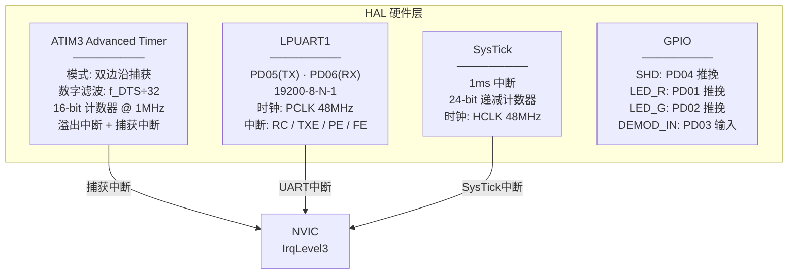

---

## 3. BSP 驱动层

### 3.1 BSP 总架构

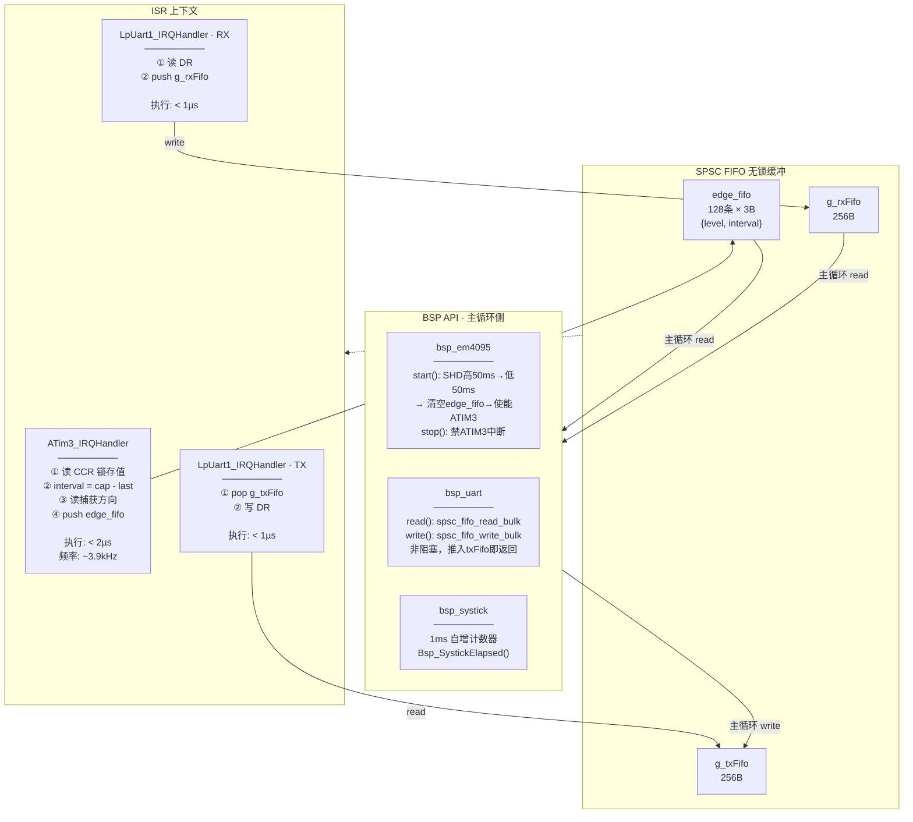

### 3.2 SPSC FIFO 读写关系

```
          生产者 (唯一)              消费者 (唯一)
    ┌──────────────────┐    ┌──────────────────┐
    │ 捕获 ISR          │    │ em4095_poll()    │
    │ head 由 ISR 独占  │    │ tail 由主循环独占  │
    │ 只 write          │    │ 只 read           │
    └──────┬───────────┘    └──────┬───────────┘
           │                       │
           ▼                       ▼
    ┌─────────────────────────────────────────┐
    │              edge_fifo                   │
    │  容量 = 128, 可缓冲 32ms (一整帧)         │
    │  write(head++) · DMB · read(tail++)     │
    │  满则静默丢弃 → ISR 不阻塞               │
    └─────────────────────────────────────────┘

    g_rxFifo: ISR_RX(write) → 主循环(read)
    g_txFifo: 主循环(write) → ISR_TX(read)
```

---

## 4. Middleware 中间件层

### 4.1 em4095_core 解码器

```mermaid
flowchart TD
    subgraph DEC["em4095_core 解码器"]
        direction TB

        INPUT["输入: edge_fifo<br/>{level, interval}"]

        CLASS["classify_interval()<br/>─────────<br/>DEBRIS: < 0.75×base<br/>SHORT: 0.75~1.375×base<br/>AMBIGUOUS: 1.375~1.625×base<br/>LONG: 1.625~2.50×base<br/>TIMEOUT: > 2.50×base"]

        FSM["process_edge() 状态机<br/>─────────<br/>SEEK_PREAMBLE: 找≥14交替SHORT<br/>RECEIVE: 逐位解64bits<br/>VERIFY: 5关校验"]

        VOTE["vote_and_output()<br/>─────────<br/>滑动窗口3帧<br/>2/3一致 → on_id()"]
    end

    subgraph OUT["输出"]
        CB["on_id(id[5], checksum_ok)"]
    end

    INPUT --> CLASS
    CLASS --> FSM
    FSM --> VOTE
    VOTE --> CB

    style DEC fill:#16213e,stroke:#2196F3
```

### 4.2 解码状态机

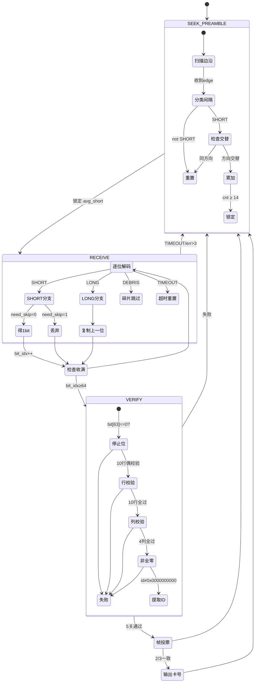

### 4.3 proto_10 协议层

```c
// 纯工具函数，无状态
bool   proto10_verify_frame(uint8_t *buf, uint8_t len);  // 0x10帧头校验
uint8_t proto10_calc_bcc(uint8_t *buf, uint8_t len);     // XOR BCC
void   proto10_build_card(uint8_t *out, uint8_t *id, bool bcc);   // 拼卡号包
void   proto10_build_fail(uint8_t *out, bool bcc);                // 拼Fail包
```

---

## 5. Application 应用层

### 5.1 应用层总架构


### 5.2 app_card 内部

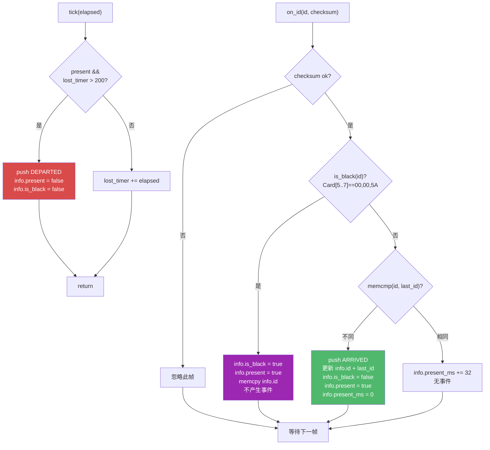

**对外接口：**

```c
// 事件（消费即清）
card_event_t app_card_consume_event(app_card_t *c);

// 属性（随时可查）
bool     app_card_is_present(app_card_t *c);
bool     app_card_is_black(app_card_t *c);
uint8_t* app_card_get_id(app_card_t *c);
uint16_t app_card_present_ms(app_card_t *c);
```

### 5.3 app_cmd 内部

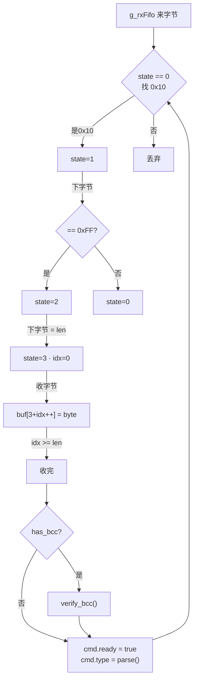

**对外接口：**

```c
typedef enum { CMD_NONE, CMD_7A, CMD_75, CMD_9A, CMD_95, CMD_9D, CMD_90, CMD_A0_05, CMD_INVALID } cmd_type_t;

void      app_cmd_poll(app_cmd_t *c, SPSC_FIFO *rx);
cmd_type_t app_cmd_consume(app_cmd_t *c);
```

### 5.4 app_mode 内部

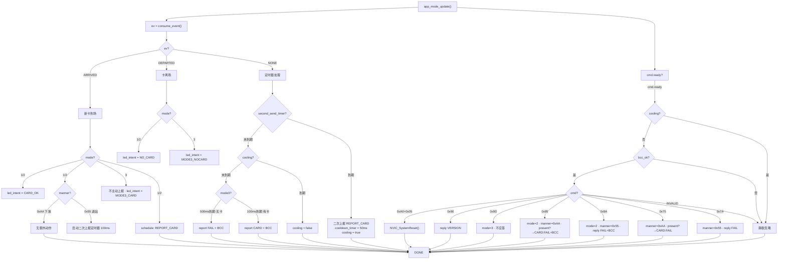

**核心规则：**
- cooling 期间忽略所有指令 —— 卡号上报优先级最高
- 模式3 不响应大多数指令（0x7A/0x75/0x9A/0x95 可退出）
- `app_mode` 不拼帧、不写 GPIO，只设 `report_request` + `led_intent`

### 5.5 app_report 内部


**对外接口：**

```c
typedef enum { REPORT_CARD, REPORT_FAIL, REPORT_VERSION } report_type_t;
void app_report_send(report_type_t type, uint8_t *card_id, bool with_bcc);
```

### 5.6 app_led 内部

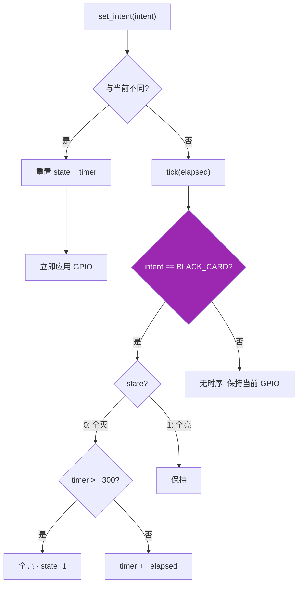

**意图表：**

| intent | 红灯 | 绿灯 | 时序 |
|--------|------|------|------|
| INIT | 亮 | 灭 | 瞬时 |
| CARD_OK | 灭 | 亮 | 瞬时 |
| NO_CARD | 亮 | 灭 | 瞬时 |
| BLACK_CARD | 灭→亮 | 灭→亮 | 300ms |
| MODE3_CARD | 亮 | 亮 | 瞬时 |
| MODE3_NOCARD | 亮 | 灭 | 瞬时 |

---

## 6. 主循环

```c
void main(void) {
    Bsp_Init();
    app_card_init(&g_card);
    app_mode_init(&g_mode);
    app_led_set_intent(LED_INTENT_INIT);

    while (1) {
        uint16_t elapsed = Bsp_SystickElapsed();

        em4095_poll(&g_dec);                       // ① 解码 → on_id → app_card
        app_cmd_poll(&g_cmd, &g_rxFifo);           // ② 指令拼帧
        app_card_tick(&g_card, elapsed);            // ③ 卡超时检测
        app_mode_update(&g_mode, &g_card, &g_cmd, elapsed);  // ④ 唯一决策
        app_report_flush(&g_mode, &g_txFifo);       // ⑤ 执行上报
        app_led_tick(&g_led, elapsed);              // ⑥ 执行 LED
    }
}
```

---

## 7. 中断与冲突

### 7.1 ISR 原则

```
ISR = 只记录，不判断
─────────────────────
读寄存器 → 算差值 → 写 FIFO
不做: 毛刺判定 · 分类 · 解码 · 校验 · 投票
```

### 7.2 优先级

```
IrqLevel2  ATIM3 捕获 (~3.9kHz, <2µs)
           LPUART1  (<1µs)
           → 同优先级，NVIC 按中断号顺序执行，不抢占
           → ATIM3 CCR 硬件锁存，ISR 延迟也不丢值

IrqLevel3  SysTick 1ms
```

### 7.3 防误码

| 场景 | 防护 |
|------|------|
| 毛刺假边沿 | ATIM3 硬件数字滤波 f_DTS÷32 |
| ISR 被 UART 抢占 | CCR 硬件锁存，ISR 延迟不丢值 |
| 主循环解码到一半 ISR 写入 | SPSC: 写方只动 head, 读方只动 tail |
| 解码耗时阻塞 | classify + process_edge 每条 <5µs，FIFO 128条缓冲32ms |
| TX 发送阻塞主循环 | Bsp_UartWrite() 非阻塞，推入 txFifo 即返回 |
| 状态机死锁 | 所有状态都有 TIMEOUT 出口 |
| 卡离开后残留 | 200ms 超时 → DEPARTED → 所有状态清零 |

### 7.4 时序

| 参数 | 值 |
|------|-----|
| 边沿间隔 | 256µs / 512µs |
| ISR | < 2µs @48MHz |
| edge_fifo = 128条 | 缓冲 32ms (一整帧) |
| 溢出条件 | 主循环停滞 > 32ms (不会发生) |
| 解码延迟 | ~66ms (2帧投票) |

---

## 8. 业务流程闭环

### 8.1 进站 (Send_Manner = 0x55)

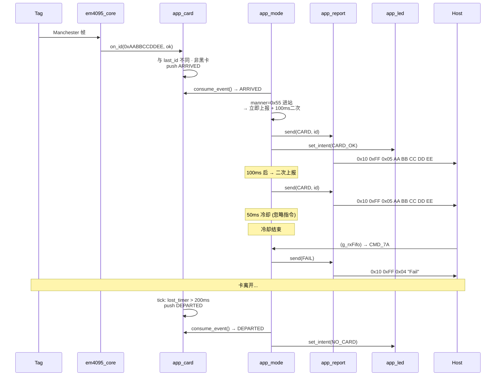

### 8.2 下放 (Send_Manner = 0xAA)

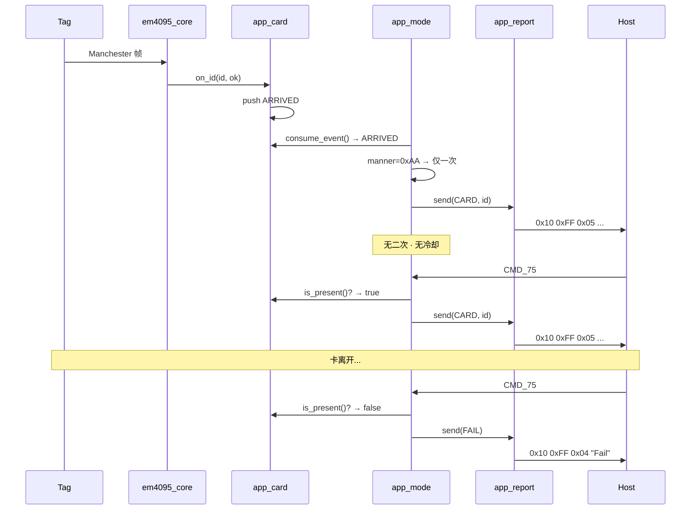

### 8.3 数据包格式

```
卡号包 (模式1):      0x10 0xFF 0x05 [ID0..4]           → 8B
卡号包 (模式2/3):    0x10 0xFF 0x05 [ID0..4] [BCC]     → 9B
Fail包 (模式1):      0x10 0xFF 0x04 'F' 'a' 'i' 'l'    → 7B
Fail包 (模式2/3):    0x10 0xFF 0x04 'F' 'a' 'i' 'l' [BCC] → 8B
版本包:             0x10 0xFF 0x07 'V' 'e' 'r' '0' '3' '1' '0' → 10B

BCC = 前N字节 XOR
```

---

## 9. 源文件组织

```
01_Hardware/bsp/
├── inc/
│   ├── spsc_fifo.h              # SPSC FIFO (已有)
│   ├── bsp_em4095.h            # EM4095 抽象 + edge_fifo
│   ├── bsp_uart.h / bsp_systick.h / bsp_clk.h / bsp_config.h  (已有)
└── src/
    ├── bsp_em4095.c / bsp_uart.c / bsp_systick.c / bsp_clk.c / bsp.c

01_Hardware/driver/              # DDL (按需: atim3/lpuart/gpio/sysctrl/...)
01_Hardware/f002/common/         # MCU 平台 (已有)

02_Midware/
├── em4095/
│   ├── em4095_core.h            # edge_t · decoder_t · class_t · state_t
│   └── em4095_core.c            # classify + process_edge + verify + vote
└── protocol/
    ├── proto_10.h / proto_10.c  # 0x10 帧工具

03_Application/
├── main.c                       # 6行主循环
├── app_card.h / app_card.c      # 卡状态 + 事件
├── app_cmd.h / app_cmd.c        # 指令解析
├── app_mode.h / app_mode.c      # 唯一决策
├── app_report.h / app_report.c  # 拼帧发送
├── app_led.h / app_led.c        # LED 意图→GPIO

Bootloader/                      # 独立工程
├── boot_main.c / boot_proto_55.c / boot_flash.c / boot_crc.c / boot_crypto.c
```

---

## 10. Flash 布局

```
0x0000 ┌──────────────────────┐
       │     Bootloader        │  ~6KB
0x1C00 ├──────────────────────┤  ← APP_START_ADDR
       │     Application       │  最大 10KB
0x4600 ├──────────────────────┤  ← UPD_PARAM_FLASH_ADDR
       │   Upgrade Param       │  512B
0x4800 └──────────────────────┘
```

---

## 11. 关键设计决策

| 决策 | 选择 | 理由 |
|------|------|------|
| 采集方案 | Input Capture | ISR ~3.9kHz，CCR 硬件锁存 |
| ISR 策略 | 只记录不判断 | <2µs，无状态 |
| 边沿 FIFO | SPSC × 128 | 零锁，缓冲 32ms |
| **模块耦合** | **主循环串联，状态结构体交换** | 无回调嵌套，无互相调用 |
| **事件 vs 属性** | **ARRIVED/DEPARTED 事件 + present/id 属性** | 事件触发主动行为，属性服务被动查询 |
| **LED 架构** | **意图驱动** | mode 说"绿灯"，led 管时序 |
| 帧投票 | 2/3 一致 | 66ms |
| 校验 | 5 关 | 停止位+10行+4列+非全零+脉宽 |
| 协议 | 0x10 帧 | 向下兼容 SR2 的 19 项行为 |
| 忙保护 | cooling 静默忽略 | 卡号优先级 > 指令 |
