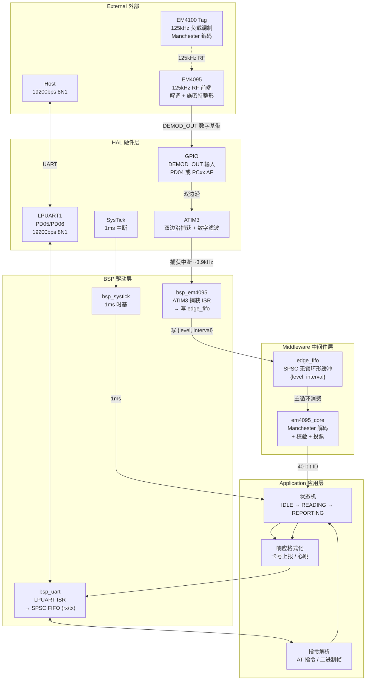
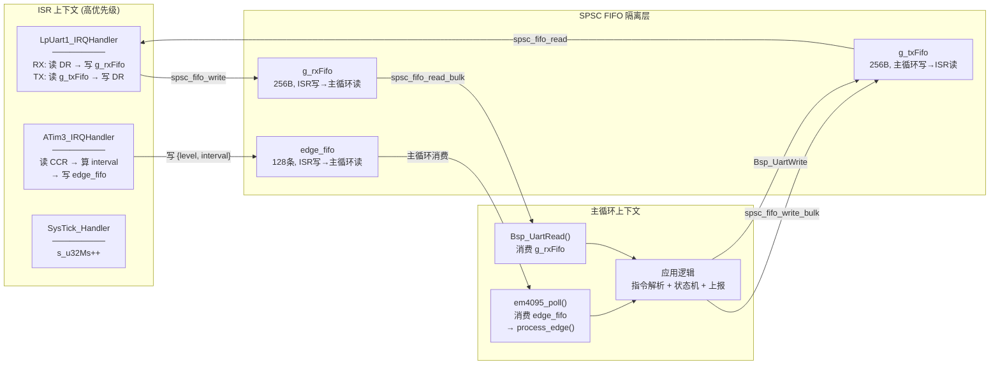
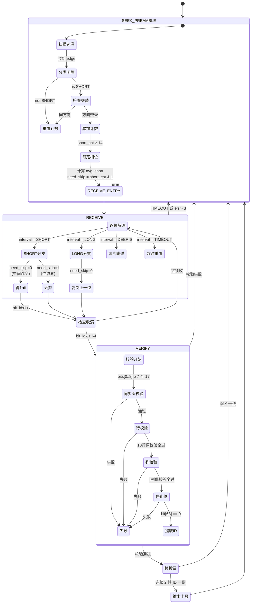
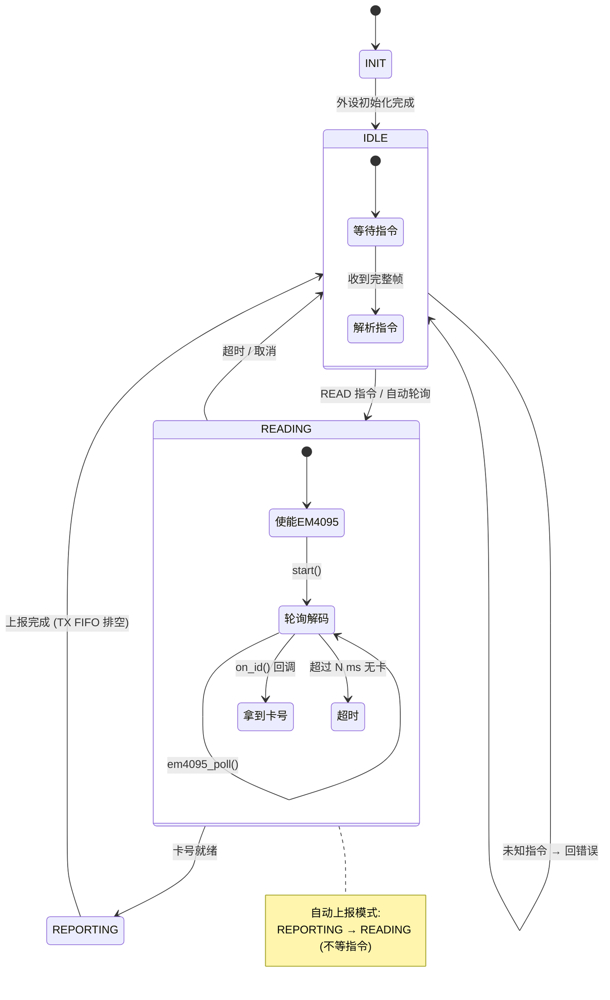
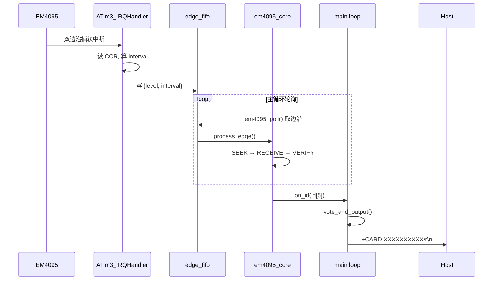

---
领域:
  - 工作
类型:
  - 方案
项目:
  - "[[SR3读卡器]]"
任务:
  - "[[260802SR3读卡器架构]]"
状态: 进行
创建时间: 2026-08-02T00:24:42
截止时间: 2026-08-02T23:24:00
完成时间:
---

## 待办列表
- [ ] 编码
- [ ] 测试
- [ ] 合并

---

## 1. 分层架构



---

## 2. ISR ↔ 主循环上下文边界



**关键约束：**
- ISR 只写 FIFO、只做最小运算（读寄存器、算差值、push），不做任何解码/校验。
- 主循环只读 FIFO，所有算法（classify / process_edge / verify / vote）在主循环完成。
- 通过 SPSC FIFO 解耦，**零中断屏蔽、零临界区**。

---

## 3. 解码状态机



> 详细算法见 [[EM4095详解]] 第三章。

---

## 4. 应用层状态机



### 串口协议 (AT 指令集)

| 指令 | 响应 | 说明 |
|------|------|------|
| `AT\r\n` | `OK\r\n` | 心跳测试 |
| `AT+SCAN\r\n` | `+CARD:XXXXXXXXXX\r\n` 或 `+NOCARD\r\n` | 单次读卡 |
| `AT+AUTO=1\r\n` | `OK\r\n` | 开启自动上报，卡靠近即发 `+CARD:...` |
| `AT+AUTO=0\r\n` | `OK\r\n` | 关闭自动上报 |
| `AT+VER\r\n` | `+VER:SR3-1.0\r\n` | 固件版本 |

---

## 5. 源文件组织

```
01_Hardware/
├── bsp/
│   ├── inc/
│   │   ├── spsc_fifo.h          # SPSC 无锁环形 FIFO (已有)
│   │   ├── bsp_em4095.h        # EM4095 硬件抽象 + 边沿 FIFO
│   │   ├── bsp_uart.h          # UART API (已有)
│   │   ├── bsp_systick.h       # SysTick API (已有)
│   │   ├── bsp_clk.h           # 时钟 API (已有)
│   │   └── bsp_config.h        # 硬件配置集中管理 (已有)
│   └── src/
│       ├── bsp_em4095.c         # ATIM3 初始化 + 捕获 ISR
│       ├── bsp_uart.c           # LPUART 驱动 (已有)
│       ├── bsp_systick.c        # SysTick ISR (已有)
│       ├── bsp_clk.c            # 时钟初始化 (已有)
│       └── bsp.c                # BSP 总初始化 (已有)
│
├── driver/                      # DDL 驱动库 (已有, 按需激活)
│   ├── inc/  (atim3.h, lpuart.h, gpio.h, sysctrl.h, ...)
│   └── src/  (atim3.c, lpuart.c, gpio.c, sysctrl.c, ...)
│
└── f002/common/                 # MCU 平台层 (已有)
    ├── HC32F002.h
    ├── system_hc32f002.c
    └── interrupts_hc32f002.c

02_Midware/
└── em4095/
    ├── em4095_core.h            # 共用类型 + 解码器 API
    └── em4095_core.c            # classify + process_edge + verify + vote

03_Application/
├── main.c                       # 主循环 + 状态机 + 指令解析
├── ddl_device.h                 # 器件选型 (已有)
├── cmd_parse.h                  # 指令解析器
└── cmd_parse.c                  # 指令解析实现
```

---

## 6. 关键设计决策

| 决策 | 选择 | 理由 |
|------|------|------|
| 采集方案 | 方案② Input Capture | ISR 仅 ~3.9kHz，硬件锁存精度 ±1µs，CPU 负载极低 |
| 边沿 FIFO | 复用 `SPSC_FIFO` | 与 UART FIFO 统一基础设施，已通过评审加固 |
| 解码位置 | 全部放主循环 | ISR 不放判断逻辑，分类/解码/校验/投票全在主循环 |
| 串口协议 | AT 指令文本帧 | 调试友好，`\r\n` 分隔，兼容串口助手 |
| 帧投票 | 连续 2 帧一致即输出 | 平衡响应速度与可靠性（EM4100 每 32ms 一帧） |
| 校验策略 | 同步头≥7/9 + 10行 + 4列 + 停止位 | 双重偶校验，随机序列误判概率 ≈ 1/32768 |

---

## 7. 核心数据流时序



### 时序参数

| 参数 | 值 |
|------|------|
| EM4100 帧周期 | ~32.8ms (64 bits × 512µs) |
| 帧间隔 | 32~35ms |
| 中断频率 (方案②) | ~3.9kHz (每边沿一次) |
| ISR 执行时间 | < 2µs @48MHz |
| 解码延迟 (2帧投票) | ~66ms (锁定 + 2帧) |
| 最坏响应时间 | ~100ms (含锁相搜索时间) |
| UART TX 一帧 | ~5.7ms (14 字节 × 10bit ÷ 19200bps) |
