---
领域:
  - 工作
类型:
  - 方案
项目:
  - "[[SR3读卡器]]"
任务:
  - "[[260802SR3读卡器架构]]"
相关任务:
  - "[[260802SR3读卡器需求]]"
  - "[[260802SR2读卡器行为]]"
状态: 进行
创建时间: 2026-08-02T00:24:42
截止时间: 2026-08-04T23:24:00
完成时间:
---

## 待办列表
- [ ] 整体架构
- [ ] 中断与冲突
- [ ] 业务流程闭环

---

## 1. 架构总图

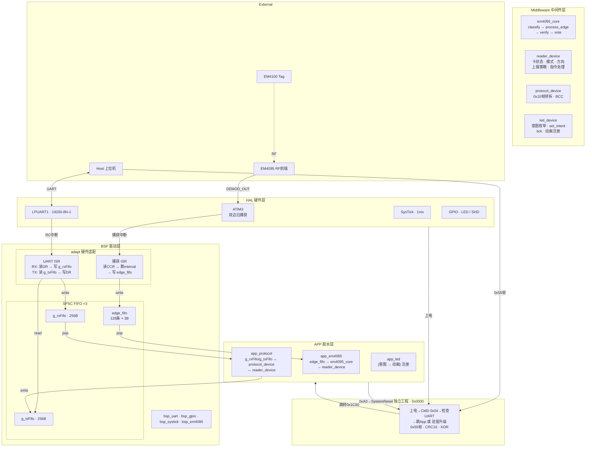

---

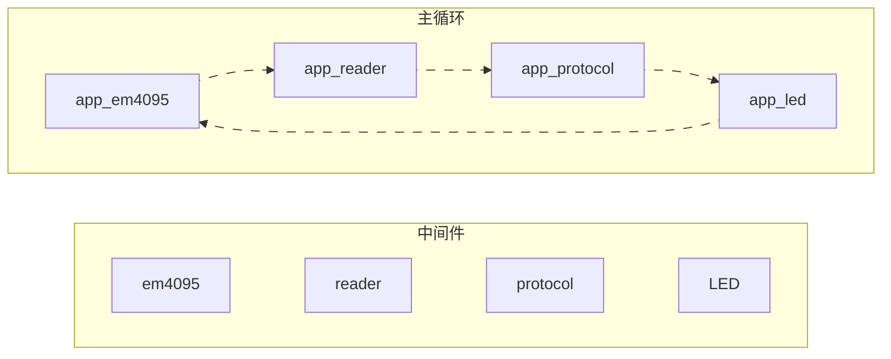

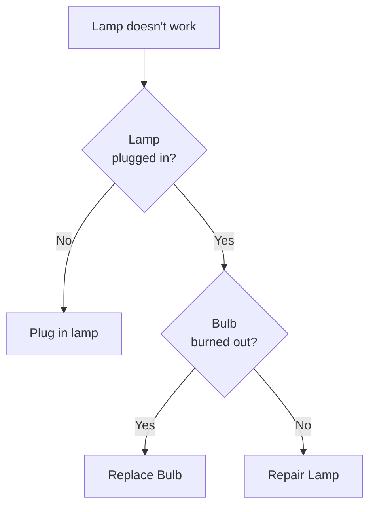
## 2. APP 胶水层

APP 层不做决策、不写算法。只负责把 BSP 的数据喂给 Middleware，再把 Middleware 的结论翻译成硬件操作。

### 2.1 app_em4095

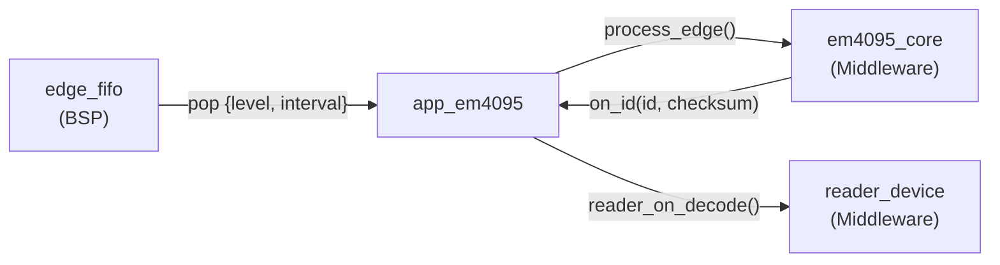

```c
// 持有 decoder_t，暴露两个入口
void app_em4095_poll(void);              // 消费 edge_fifo → 喂 decoder → 回调 reader
void app_em4095_start(void);             // 调 bsp_em4095 启停
void app_em4095_stop(void);
```

只做三件事：pop FIFO → 喂解码器 → 通知 reader。不碰硬件，不判断卡号。

### 2.2 app_protocol

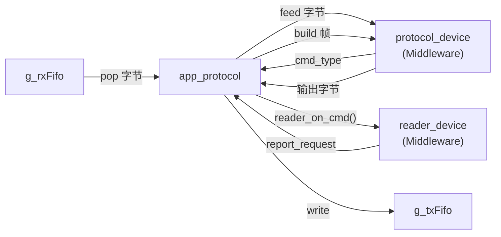

```c
// 持有 app_cmd_t 帧缓冲区，暴露两个入口
void app_protocol_poll(void);             // 收: g_rxFifo → 拼帧 → reader_on_cmd()
void app_protocol_flush(void);            // 发: reader.report → 拼帧 → g_txFifo
```

不是决策者——不知道进站是什么、冷却是什么。只管收字节拼成命令喂给 reader，reader 说要发就把数据拼成帧发出去。

### 2.3 app_led

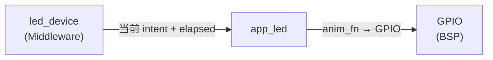

```c
// 注册 {意图 → 动画} 映射表，没有判断逻辑
void app_led_init(void) {
    led_register(LED_INTENT_INIT,        anim_red_on);
    led_register(LED_INTENT_CARD_OK,     anim_green_on);
    led_register(LED_INTENT_NO_CARD,     anim_red_on);
    led_register(LED_INTENT_BLACK_CARD,  anim_black_300ms);
    led_register(LED_INTENT_MODE3_CARD,  anim_both_on);
    led_register(LED_INTENT_MODE3_NOCARD,anim_red_on);
}
```

`reader_device` 调 `led_set_intent(CARD_OK)` → `led_device` 切换当前意图 → `led_tick()` 驱动 app_led 注册的动画函数。换动画只改注册表，换硬件只改动画函数内部的 GPIO 操作。

### 2.4 main.c

```c
void main(void) {
    Bsp_Init();
    app_led_init();
    reader_init(&g_reader);

    while (1) {
        uint16_t elapsed = Bsp_SystickElapsed();

        app_em4095_poll();                     // 解码 → reader
        app_protocol_poll(&g_reader);          // 收指令 → reader
        reader_tick(&g_reader, elapsed);        // 卡超时 + 模式定时 + 忙保护
        app_protocol_flush(&g_reader);          // reader.report → 发帧
        led_tick(elapsed);                      // 驱动动画
    }
}
```

---

## 3. Middleware 中间件层

有上下文的业务模块，对 APP 暴露稳定 API。不碰硬件、不受 MCU 平台影响。

### 3.1 reader_device

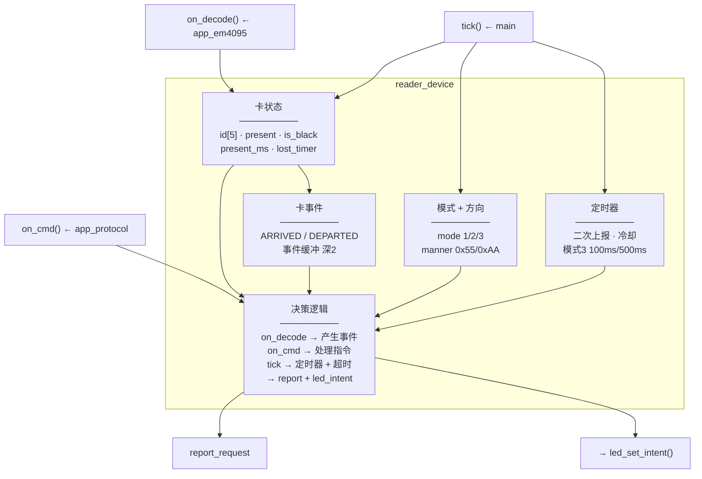

```c
// ==== 输入 (由 APP 胶水层调用) ====
void reader_on_decode(reader_t *r, uint8_t *id, bool checksum_ok);
void reader_on_cmd(reader_t *r, cmd_type_t cmd, bool bcc_ok);
void reader_tick(reader_t *r, uint16_t elapsed);

// ==== 输出 (由 APP 胶水层轮询) ====
bool reader_has_report(reader_t *r);
report_t reader_consume_report(reader_t *r);   // {type, id, bcc}

// ==== 查询 (app_protocol 被动应答时用) ====
bool     reader_has_card(reader_t *r);
uint8_t* reader_get_card_id(reader_t *r);
```

**`reader_device` 是唯一知道"进站要二次上报、冷却期不能应答"的地方。** APP 只管调这些 API，不判断业务规则。

### 3.2 em4095_core

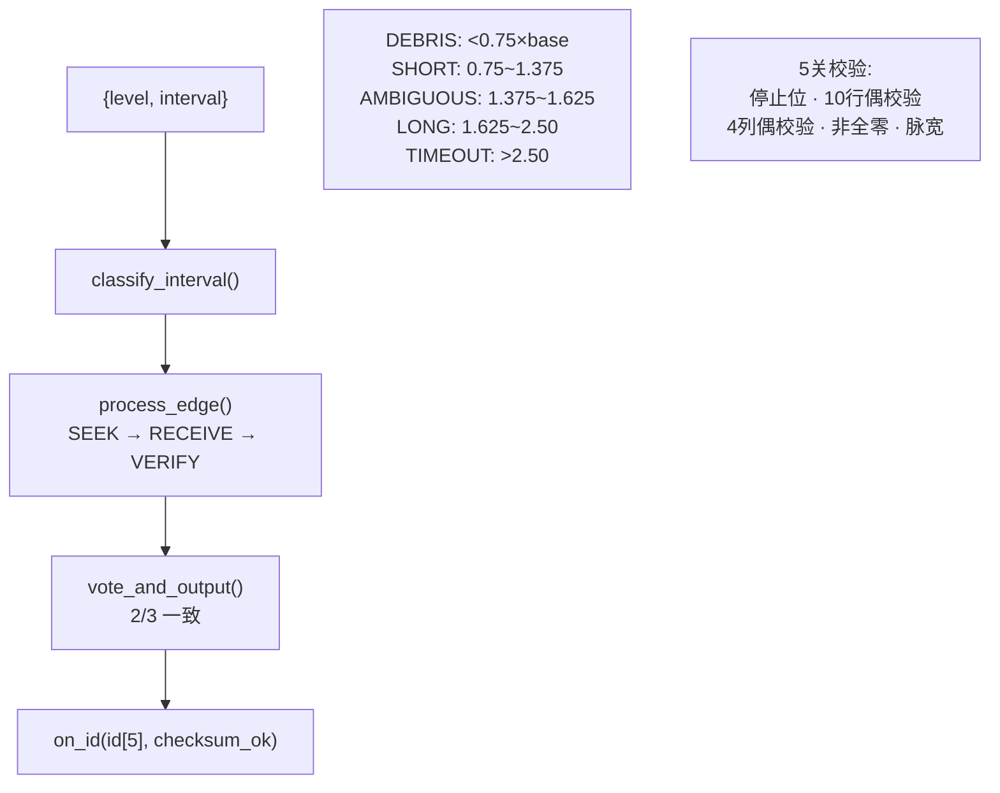

```c
typedef struct {
    uint8_t  level;       // 跳变后电平
    uint16_t interval;    // 距上次边沿的 tick 数
} edge_t;

typedef struct { /* 内部状态: state, avg_short, bit_buf[64], vote... */ } decoder_t;

void decoder_init(decoder_t *d);
void decoder_process(decoder_t *d, edge_t *e);   // on_id 通过回调输出
```

纯算法模块，不依赖任何 MCU 外设。可从 SR3 搬到 SR4 不改一行。

### 3.3 protocol_device

```c
// ==== RX: 字节流 → 指令 ====
void proto_feed_byte(proto_t *p, uint8_t byte);  // 喂字节，内部拼帧
bool proto_has_cmd(proto_t *p);
cmd_t proto_consume_cmd(proto_t *p);             // {type, has_bcc, bcc_ok}

// ==== TX: 指令 → 字节流 ====
void proto_build_card(uint8_t *buf, uint8_t *id, bool bcc);
void proto_build_fail(uint8_t *buf, bool bcc);
void proto_build_version(uint8_t *buf);
```

```c
typedef enum {
    CMD_NONE, CMD_7A, CMD_75, CMD_9A, CMD_95, CMD_9D, CMD_90, CMD_A0_05, CMD_INVALID
} cmd_type_t;
```

内部维护帧拼接状态机（找 0x10 → 找 0xFF → 读 len → 收数据 → 校验 BCC），不关心指令含义。

### 3.4 led_device

```c
typedef enum {
    LED_INTENT_INIT,
    LED_INTENT_CARD_OK,
    LED_INTENT_NO_CARD,
    LED_INTENT_BLACK_CARD,
    LED_INTENT_MODE3_CARD,
    LED_INTENT_MODE3_NOCARD,
} led_intent_t;

typedef void (*led_anim_fn)(uint16_t elapsed);

// 注册表 (APP 层在 app_led_init() 中调用)
void led_register(led_intent_t intent, led_anim_fn anim);

// 调度 (reader_device 调 set，main 调 tick)
void led_set_intent(led_intent_t intent);
void led_tick(uint16_t elapsed);
```

定义意图枚举 + 注册动画回调。`reader_device` 只管说"有卡了"，`led_device` 负责通知当前动画，`app_led` 执行具体 GPIO 操作。

---

## 4. BSP 驱动层

### 4.1 adapt 硬件适配

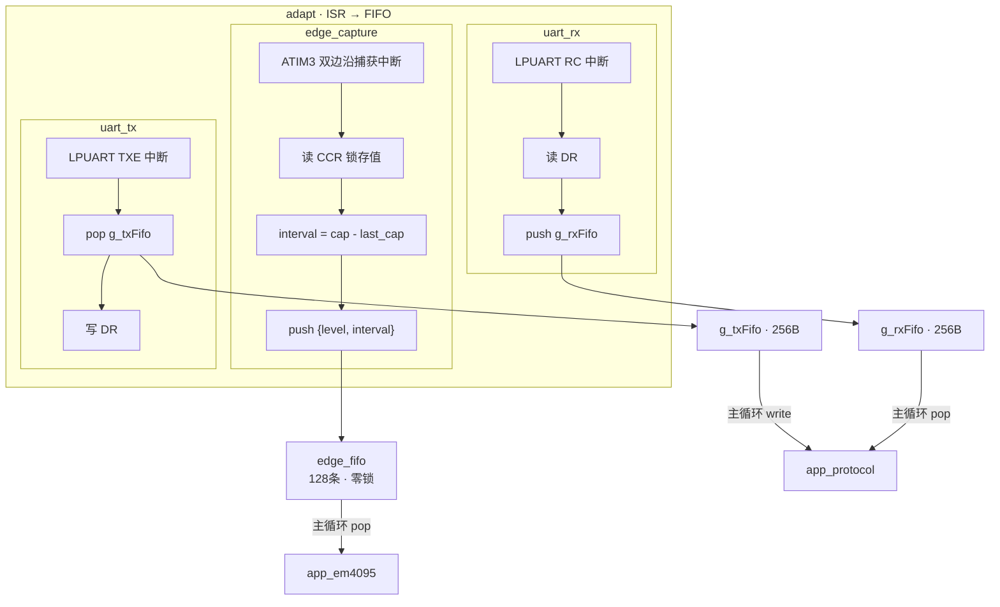

**ISR 只记录不判断。** 读寄存器 → 算差值 → 写 FIFO。< 2µs。不做毛刺判定、不分类、不解码。

### 4.2 SPSC FIFO 读写关系

```
          生产者                      消费者
    ┌──────────────────┐    ┌──────────────────┐
    │ ISR (中断)        │    │ 主循环             │
    │ head 独占          │    │ tail 独占          │
    └──────┬───────────┘    └──────┬───────────┘
           │                       │
           ▼                       ▼
    ┌─────────────────────────────────────────┐
    │              SPSC FIFO                   │
    │  零锁 · DMB屏障 · 满则丢弃                │
    │  128条 = 32ms缓冲 = 一整帧                │
    └─────────────────────────────────────────┘

    edge_fifo:  捕获 ISR(write) →  app_em4095(read)
    g_rxFifo:   UART RX ISR(write) → app_protocol(read)
    g_txFifo:   app_protocol(write) → UART TX ISR(read)
```

### 4.3 中断优先级

```
IrqLevel2  ATIM3 捕获 (~3.9kHz, <2µs)
           LPUART1  (<1µs)
           → 同优先级，按中断号顺序，不抢占
           → CCR 硬件锁存，ISR 延迟不丢值
IrqLevel3  SysTick 1ms
```

### 4.4 防误码

| 场景 | 防护 |
|------|------|
| 毛刺假边沿 | ATIM3 硬件数字滤波 f_DTS÷32 |
| ISR 被抢占 | CCR 硬件锁存 |
| 解码到一半 ISR 写入 | SPSC: head/tail 分离 |
| 解码阻塞主循环 | FIFO 缓冲 32ms |
| TX 阻塞 | Bsp_UartWrite() 非阻塞 |
| 解码器死锁 | 所有状态有 TIMEOUT |
| 卡离开残留 | 200ms → DEPARTED |

---

## 5. Bootloader 远程升级

### 5.1 上电流程

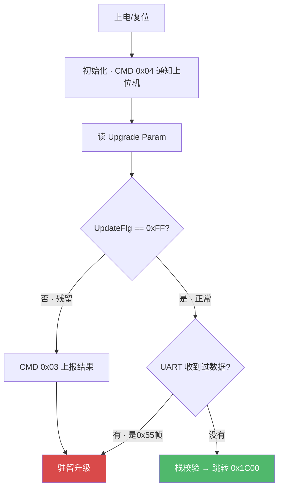

### 5.2 升级协议

```
上位机 → Bootloader:    0x55 | CMD | Len(LE) | PackNo(LE) | Data | CRC16(LE) | 0xAA
Bootloader → 上位机:    0x55 | CMD | Len(LE) | Data | CRC16(LE) | 0xAA
```

| CMD | 方向 | 作用 |
|-----|------|------|
| 0x81 | HOST→BL | 启动升级 (告知总包数) |
| 0x82 | HOST→BL | 发送一包数据 |
| 0x83 | HOST→BL | 查询结果 |
| 0x01 | BL→HOST | 启动确认 |
| 0x02 | BL→HOST | ACK/NAK |
| 0x03 | BL→HOST | 状态报告 |
| 0x04 | BL→HOST | 启动通知 |

### 5.3 安全机制

| 机制 | 参数 |
|------|------|
| CRC | CRC16-USB (0x8005) |
| 加密 | XOR, key="603337" |
| 包序号 | 严格递增, ≤5次重试 |
| 超时 | ~8s |
| 栈校验 | `(*(app_addr) & 0x2FFE0000) == 0x20000000` |
| 写入 | 半扇区擦除 (每256B前擦512B) |

### 5.4 Application 端

```c
void RemoteUpdateInit(void) {
    uint8_t f = FLASH_ReadByte(0x4600);
    if (f == rUpdated) {
        send_cmd_03(VER, 0xAA);                  // 上报成功
        FLASH_EraseSector(0x4600);
    } else if (f != 0xFF && f != rNormal) {
        send_cmd_03(VER, 0x55);                  // 上报失败
        FLASH_EraseSector(0x4600);
    }
}
```

### 5.5 Flash 布局

```
0x0000 ┌──────────────────────┐
       │     Bootloader        │  ~6KB (独立项目)
0x1C00 ├──────────────────────┤
       │     Application       │  最大 10KB
0x4600 ├──────────────────────┤
       │   Upgrade Param       │  512B
0x4800 └──────────────────────┘
```

---

## 6. 业务流程闭环

### 6.1 进站 (manner = 0x55)

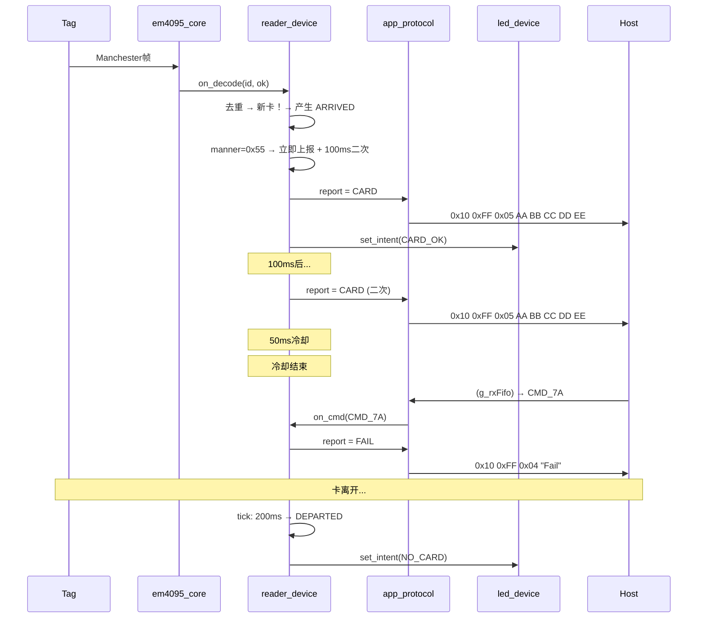

### 6.2 下放 (manner = 0xAA)

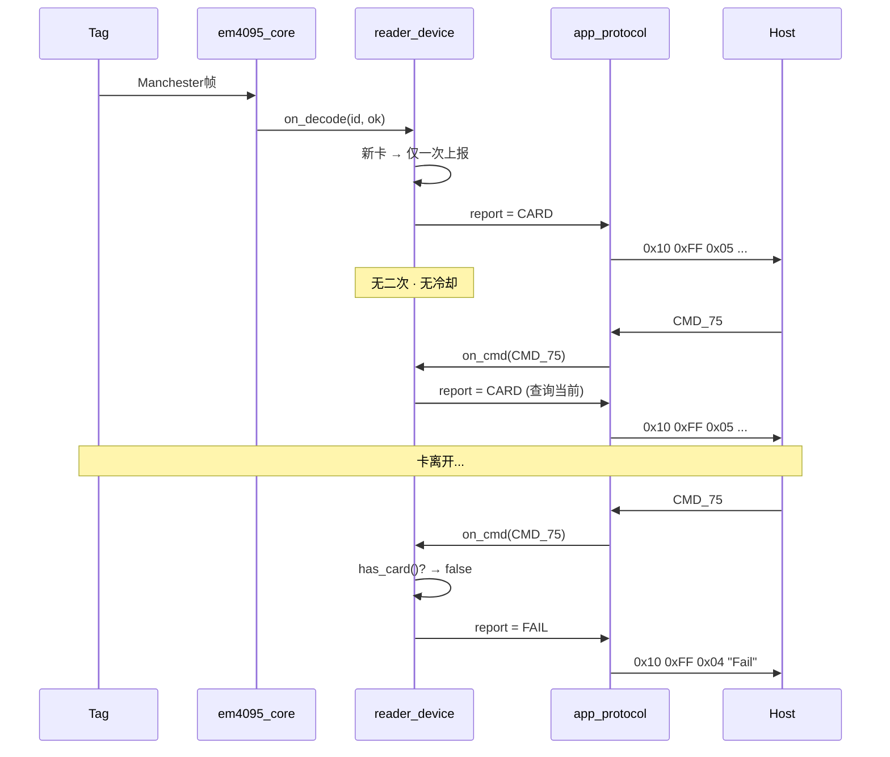

### 6.3 数据包格式

```
卡号包 (模式1):      0x10 0xFF 0x05 [ID0..4]                    → 8B
卡号包 (模式2/3):    0x10 0xFF 0x05 [ID0..4] [BCC]              → 9B
Fail包 (模式1):      0x10 0xFF 0x04 'F' 'a' 'i' 'l'              → 7B
Fail包 (模式2/3):    0x10 0xFF 0x04 'F' 'a' 'i' 'l' [BCC]       → 8B
版本包:             0x10 0xFF 0x07 'V' 'e' 'r' '0' '3' '1' '0' → 10B

BCC = 前N字节 XOR
```

---

## 7. 源文件组织

```
01_Hardware/bsp/
├── adapt/
│   ├── edge_capture.c          # ATIM3 ISR → edge_fifo
│   └── uart_adapter.c          # LPUART ISR → g_rxFifo / g_txFifo
├── inc/
│   ├── spsc_fifo.h             # SPSC FIFO (已有)
│   ├── bsp_uart.h / bsp_systick.h / bsp_clk.h / bsp_config.h
│   └── bsp_gpio.h
└── src/
    ├── bsp_uart.c / bsp_systick.c / bsp_clk.c / bsp.c

01_Hardware/driver/              # DDL (atim3/lpuart/gpio/sysctrl/...)
01_Hardware/f002/common/         # MCU 平台

02_Midware/
├── em4095/
│   ├── em4095_core.h / em4095_core.c    # 纯解码算法
├── reader/
│   ├── reader_device.h / reader_device.c # 卡状态 + 模式 + 上报决策
├── protocol/
│   ├── protocol_device.h / protocol_device.c # 帧拼拆 + BCC
└── led/
    ├── led_device.h / led_device.c       # 意图枚举 + 动画调度

03_Application/
├── main.c                       # 纯调度
├── app_em4095.h / app_em4095.c  # 胶水: edge_fifo → em4095_core → reader
├── app_protocol.h / app_protocol.c # 胶水: FIFO ↔ protocol_device ↔ reader
└── app_led.h / app_led.c        # 胶水: {意图 → 动画} 注册 + GPIO操作

Bootloader/                      # 独立 Keil 工程
├── boot_main.c / boot_proto_55.c / boot_flash.c
├── boot_crc.c / boot_crypto.c
```

---

## 8. 关键设计决策

| 决策 | 选择 | 理由 |
|------|------|------|
| 采集方案 | Input Capture (ATIM3) | ISR ~3.9kHz，CCR 硬件锁存 |
| ISR 策略 | 只记录不判断 | <2µs，无状态，只写 FIFO |
| 边沿 FIFO | SPSC × 128 | 零锁，缓冲 32ms = 一整帧 |
| **APP 定位** | **胶水层，不做决策** | 把 BSP 数据喂给 Middleware，把 Middleware 结论翻译为硬件操作 |
| **Middleware 定位** | **有上下文的业务模块** | reader_device 是唯一知道进站/冷却/模式的地方 |
| **em4095_core** | **纯算法，不依赖平台** | 可以从 SR3 搬到 SR4 不改一行 |
| **led_device** | **意图 + 动画注册** | reader 说"有卡"，app_led 注册表决定亮绿灯 |
| 帧投票 | 2/3 一致 | ~66ms |
| 校验 | 5 关 | 停止位+10行+4列+非全零+脉宽 |
| 协议 | 0x10 帧 | 向下兼容 SR2 19 项行为 |
| 忙保护 | cooling 忽略指令 | 卡号 > 指令 |
| 固件升级 | Bootloader 独立工程 | 0x55帧 + CRC16 + XOR + 栈校验 |
