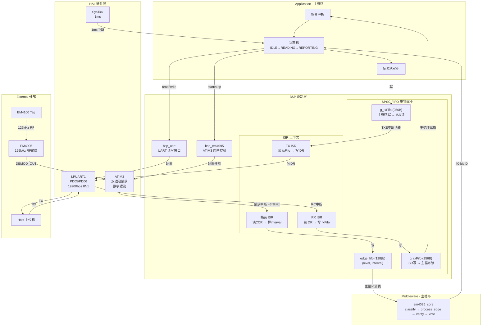
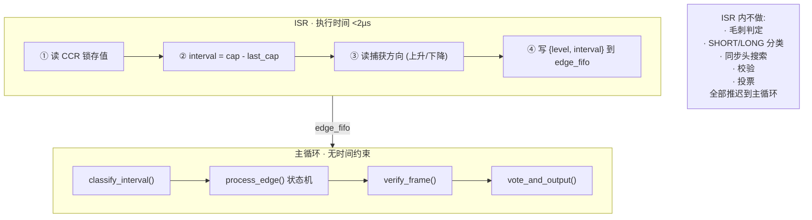
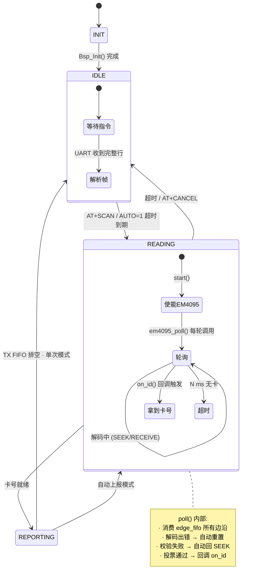
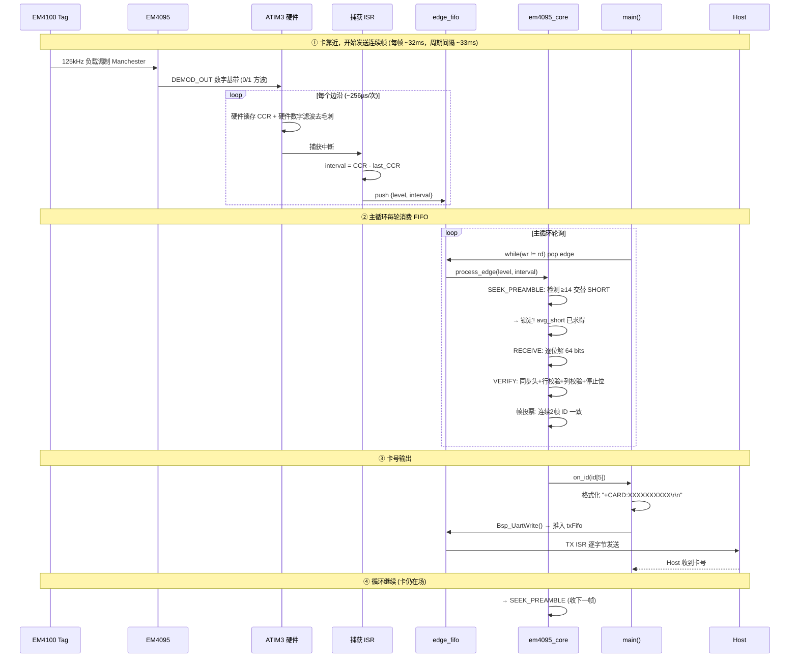
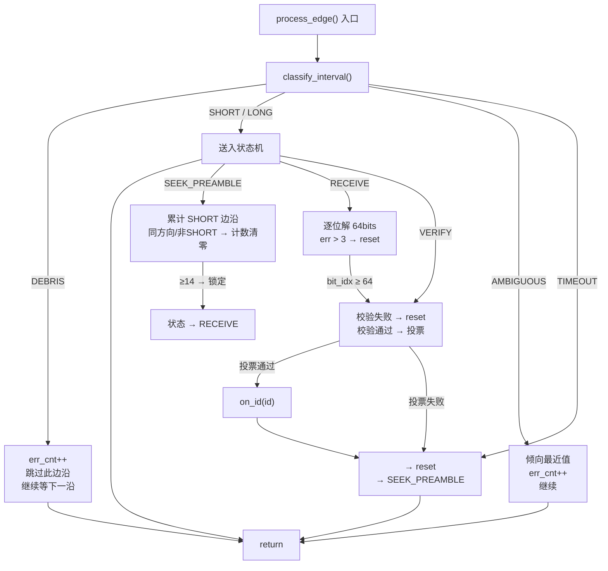
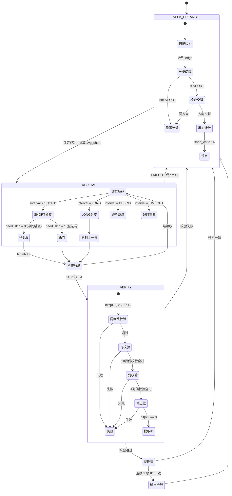

---
领域:
  - 工作
类型:
  - 方案
项目:
  - "[[SR3读卡器]]"
任务:
  - "[[260802SR3读卡器架构]]"
状态: 进行
创建时间: 2026-08-02T00:24:42
截止时间: 2026-08-02T23:24:00
完成时间:
---

## 待办列表
- [ ] 整体架构
- [ ] 中断与冲突
- [ ] 业务流程闭环

---

## 1. 整体架构




### 分层职责

| 层           | 上下文  | 做什么                                     | **不做什么**    |
| ----------- | ---- | --------------------------------------- | ----------- |
| ISR         | 中断   | 读 CCR、算 interval、写 FIFO                 | 不解码、不校验、不判断 |
| SPSC FIFO   | 跨上下文 | 无锁数据通道                                  | 不阻塞、不关中断    |
| Middleware  | 主循环  | classify → process_edge → verify → vote | 不碰硬件寄存器     |
| Application | 主循环  | 状态机、指令解析、上报                             | 不碰硬件寄存器     |

---

## 2. 中断与冲突 — 如何从架构上防止误码

### 2.1 核心原则：ISR 只记录，不判断



### 2.2 为什么 SPSC FIFO 能防止 ISR 被阻塞

```
         生产者 (唯一)              消费者 (唯一)
    ┌──────────────────┐    ┌──────────────────┐
    │ 捕获 ISR          │    │ em4095_poll()    │
    │                  │    │                  │
    │ head 由 ISR 独占  │    │ tail 由主循环独占  │
    │ 只写不读          │    │ 只读不写          │
    └──────┬───────────┘    └──────┬───────────┘
           │                       │
           ▼                       ▼
    ┌─────────────────────────────────────────┐
    │              edge_fifo                  │
    │  · SPSC 模型：两方各持一个指针            │
    │  · 零互斥锁 → ISR 永远不会等主循环释放锁   │
    │  · DMB 屏障 → 数据对消费者立即可见        │
    │  · 满时静默丢弃 → ISR 不阻塞             │
    └─────────────────────────────────────────┘
```

**如果主循环解码耗时 5ms**（校验 + 投票 + 日志输出），ISR 仍然每 256µs 写入一次——二者完全并行。ISR 不关心主循环在做什么，FIFO 也不上锁。

### 2.3 为什么 ISR 不会被 UART 抢占

```
中断优先级 (0=最高, 3=最低):

  IrqLevel0  [保留]
  IrqLevel1  [保留]
  IrqLevel2  ATIM3 捕获中断    ← 边沿捕获，不能丢
             LPUART1 中断      ← RX/TX，有 FIFO 缓冲
  IrqLevel3  SysTick           ← 1ms 时基，精度要求低
```

ATIM3 和 LPUART1 同优先级时，NVIC 按中断号裁决（顺序执行，不会被抢占）。但即便 LPUART1 先响应、执行 RX/TX ISR（< 1µs），ATIM3 捕获的 CCR 值**已被硬件锁存**——定时器 CCR 寄存器在边沿瞬间就冻结了，ISR 晚几 µs 去读也不会丢值或错值。

### 2.4 为什么不会"解析到一半被打断"

| 潜在问题 | 架构如何避免 |
|----------|------------|
| ISR 执行解码 → 被打断丢状态 | **ISR 不做解码**，只写 FIFO。ISR 是无状态的（static 变量只有 last_cap/last_level） |
| 主循环解码到一半 ISR 写入 | SPSC 模型保证**写方只动 head、读方只动 tail**。主循环读 FIFO 不影响 ISR 写入，反之亦然 |
| 毛刺触发假中断 → 干扰解析 | ATIM3 **硬件数字滤波**（f_DTS ÷ 32）在边沿采集前就滤掉毛刺。逃逸的碎片由 `classify_interval()` → `DEBRIS` 在主循环丢弃 |
| 解码耗时阻塞主循环 | `process_edge()` 每次调用只处理一条边沿，O(1) 操作。主循环 `poll()` 批量消费但随时可中断（整个 while(wr != rd) 循环耗时 < 100µs per 边沿） |
| TX 大包发送阻塞主循环 | `Bsp_UartWrite()` 非阻塞——数据推入 txFifo 即返回。TXE 中断异步逐字节发送，主循环不等待 |
| 卡离开后状态机死锁 | decode 每个状态都有 TIMEOUT 出口。`SEEK_PREAMBLE` 中等不到 SHORT → `short_cnt = 0` 循环；`RECEIVE` 中 `interval > 2.5×base` → 触发 reset 回 `SEEK_PREAMBLE` |

### 2.5 时序分析：最坏情况下会丢边沿吗

```
一个 EM4100 帧 = 128 个边沿，帧周期 ≈ 32.8ms
平均边沿间隔 ≈ 256µs

ISR 执行时间 < 2µs @48MHz
主循环一轮最大耗时估算:
  · em4095_poll(): 消费 N 条边沿，每条 < 5µs (classify + process_edge)
  · 指令解析 + 响应格式化: < 300µs (不含等待)
  · 主循环单轮最坏 ≈ 1ms (N=50 边沿 + UART 处理)

128 条 FIFO 在 1ms 主循环周期内能缓冲:
  256µs/边沿 → 1ms 约产生 4 个边沿
  FIFO 128 条 → 可缓冲 32ms 的边沿数据 = 整整一帧
```

**结论**：即使主循环偶尔慢到 5ms 一轮（比如正在格式化输出），128 条 FIFO 也能吸收 32ms 的数据，不会溢出丢边沿。溢出窗口是主循环停滞超过 32ms——这在实际场景不会发生（没有任何阻塞调用）。

---

## 3. 业务流程闭环

### 3.1 应用层状态机



### 3.2 完整闭环：从卡靠近到串口输出



### 3.3 解码器内闭环（故障自动恢复）



**任何异常路径最终都收敛到 `reset → SEEK_PREAMBLE`**。没有死锁态，不需要看门狗介入。

### 3.4 串口协议 (AT 指令集)

| 指令 | 响应 | 说明 |
|------|------|------|
| `AT\r\n` | `OK\r\n` | 心跳测试 |
| `AT+SCAN\r\n` | `+CARD:XXXXXXXXXX\r\n` 或 `+NOCARD\r\n` | 单次读卡 |
| `AT+AUTO=1\r\n` | `OK\r\n` | 开启自动上报 |
| `AT+AUTO=0\r\n` | `OK\r\n` | 关闭自动上报 |
| `AT+CANCEL\r\n` | `OK\r\n` | 中止当前读卡 |
| `AT+VER\r\n` | `+VER:SR3-1.0\r\n` | 固件版本 |

---

## 4. 解码状态机



> 详细算法见 [[EM4095详解]] 第三章。

---

## 5. 源文件组织

```
01_Hardware/
├── bsp/
│   ├── inc/
│   │   ├── spsc_fifo.h          # SPSC 无锁环形 FIFO (已有)
│   │   ├── bsp_em4095.h        # EM4095 硬件抽象 + 边沿 FIFO 定义
│   │   ├── bsp_uart.h          # UART API (已有)
│   │   ├── bsp_systick.h       # SysTick API (已有)
│   │   ├── bsp_clk.h           # 时钟 API (已有)
│   │   └── bsp_config.h        # 硬件配置集中管理 (已有)
│   └── src/
│       ├── bsp_em4095.c         # ATIM3 初始化 + 捕获 ISR
│       ├── bsp_uart.c           # LPUART 驱动 + ISR (已有)
│       ├── bsp_systick.c        # SysTick ISR (已有)
│       ├── bsp_clk.c            # 时钟初始化 (已有)
│       └── bsp.c                # BSP 总初始化 (已有)
│
├── driver/                      # DDL 驱动库 (已有, 按需激活)
│   ├── atim3.h / atim3.c
│   ├── lpuart.h / lpuart.c
│   ├── gpio.h / gpio.c
│   └── ...
│
└── f002/common/                 # MCU 平台层 (已有)
    ├── HC32F002.h
    ├── system_hc32f002.c
    └── interrupts_hc32f002.c

02_Midware/
└── em4095/
    ├── em4095_core.h            # 共用类型 + 解码器 API
    └── em4095_core.c            # classify + process_edge + verify + vote

03_Application/
├── main.c                       # 主循环 + 状态机 + 指令解析
├── ddl_device.h                 # 器件选型 (已有)
├── cmd_parse.h                  # 指令解析器
└── cmd_parse.c                  # 指令解析实现
```

---

## 6. 关键设计决策

| 决策 | 选择 | 理由 |
|------|------|------|
| 采集方案 | 方案② Input Capture | ISR 仅 ~3.9kHz，硬件锁存精度 ±1µs，CPU 负载极低 |
| ISR 策略 | 只记录不判断 | < 2µs 执行时间，不丢边沿，所有算法推迟到主循环 |
| 边沿 FIFO | SPSC 无锁 | 零中断屏蔽，ISR 永远不会等锁，主循环永远不会阻塞 ISR |
| ATIM3 数字滤波 | f_DTS ÷ 32 | 硬件滤除 < 1µs 毛刺，减少假边沿中断 |
| 解码位置 | 全部主循环 | 可阻塞不丢数据（FIFO 缓冲 128 条 = 32ms） |
| 串口协议 | AT 指令文本帧 | 调试友好，`\r\n` 分隔，兼容任意串口工具 |
| 帧投票 | 连续 2 帧一致 | 平衡速度与可靠性 (EM4100 每 32ms 一帧) |
| 校验策略 | 同步头 + 行列 + 停止位 | 双重偶校验，误判概率 ≈ 1/32768 |
| 错误恢复 | 所有异常 → reset | TIMEOUT/err>3/校验失败 全部收敛到 SEEK_PREAMBLE |

---

## 7. 时序参数

| 参数 | 值 |
|------|------|
| EM4100 帧周期 | ~32.8ms (64 bits × 512µs) |
| 帧间隔 | 32~35ms |
| 边沿间隔 (Manchester) | 256µs (SHORT) / 512µs (LONG) |
| ATIM3 捕获 ISR 频率 | ~3.9kHz (每边沿一次) |
| ATIM3 ISR 执行时间 | < 2µs @48MHz |
| UART ISR 执行时间 | < 1µs @48MHz |
| edge_fifo 缓冲能力 | 128 条 ≈ 32ms（一整帧） |
| 解码延迟 (2帧投票) | ~66ms |
| 最坏响应时间 (含锁相) | ~100ms |
| UART TX 单帧 | ~5.7ms (14 字节 × 10bit ÷ 19200bps) |
