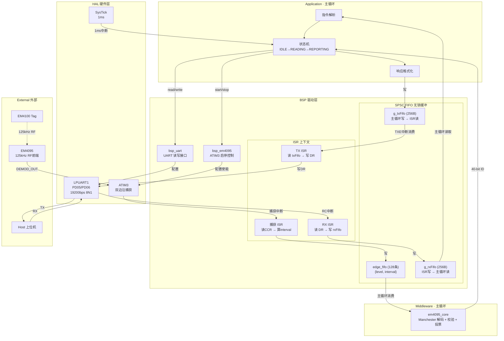
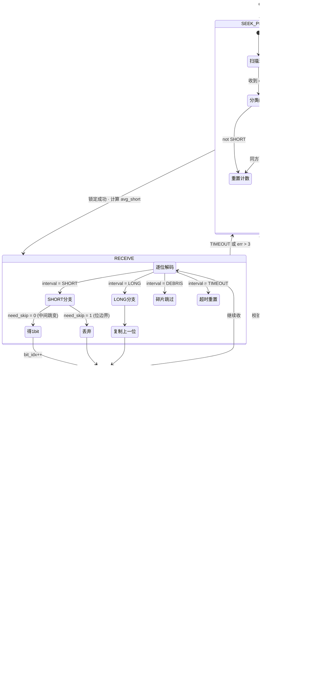
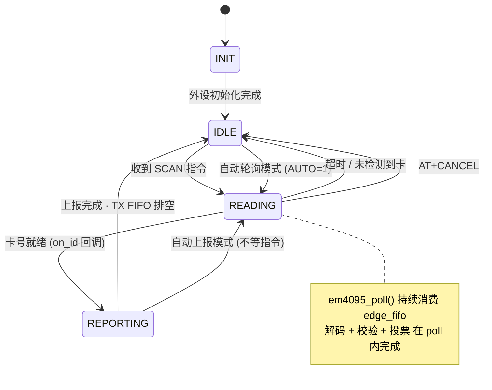
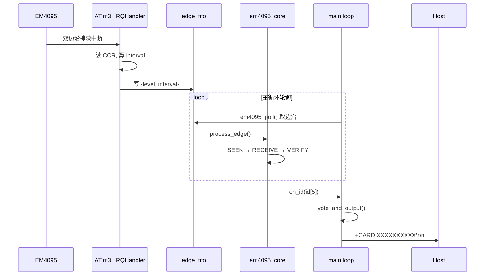

---
领域:
  - 工作
类型:
  - 方案
项目:
  - "[[SR3读卡器]]"
任务:
  - "[[260802SR3读卡器架构]]"
状态: 进行
创建时间: 2026-08-02T00:24:42
截止时间: 2026-08-02T23:24:00
完成时间:
---

## 待办列表
- [ ] 整体架构
- [ ] 中断与冲突
- [ ] 业务流程闭环

---

## 1. 分层架构



**分层规则与上下文边界：**

| 层 | 运行上下文 | 职责 |
|------|-----------|------|
| Application | 主循环 | 状态机、指令解析、响应格式化 |
| Middleware | 主循环 | 曼彻斯特解码、帧校验、投票 (所有算法) |
| BSP · ISR | 中断 | 读寄存器 → 算差值 → 写 FIFO (只记录不判断) |
| BSP · API | 主循环 | 硬件初始化、FIFO 读写接口 |
| SPSC FIFO | 跨上下文 | 零中断屏蔽、零临界区的数据通道 |
| HAL | 硬件 | 外设寄存器操作 |


---

## 2. 解码状态机



> 详细算法见 [[EM4095详解]] 第三章。

---

## 3. 应用层状态机



### 串口协议 (AT 指令集)

| 指令              | 响应                                     | 说明     |
| --------------- | -------------------------------------- | ------ |
| `AT\r\n`        | `OK\r\n`                               | 心跳测试   |
| `AT+SCAN\r\n`   | `+CARD:XXXXXXXXXX\r\n` 或 `+NOCARD\r\n` | 单次读卡   |
| `AT+AUTO=1\r\n` | `OK\r\n`                               | 开启自动上报 |
| `AT+AUTO=0\r\n` | `OK\r\n`                               | 关闭自动上报 |
| `AT+CANCEL\r\n` | `OK\r\n`                               | 中止当前读卡 |
| `AT+VER\r\n`    | `+VER:SR3-1.0\r\n`                     | 固件版本   |

---

## 4. 源文件组织

```
01_Hardware/
├── bsp/
│   ├── inc/
│   │   ├── spsc_fifo.h          # SPSC 无锁环形 FIFO (已有)
│   │   ├── bsp_em4095.h        # EM4095 硬件抽象 + 边沿 FIFO 定义
│   │   ├── bsp_uart.h          # UART API (已有)
│   │   ├── bsp_systick.h       # SysTick API (已有)
│   │   ├── bsp_clk.h           # 时钟 API (已有)
│   │   └── bsp_config.h        # 硬件配置集中管理 (已有)
│   └── src/
│       ├── bsp_em4095.c         # ATIM3 初始化 + 捕获 ISR
│       ├── bsp_uart.c           # LPUART 驱动 + ISR (已有)
│       ├── bsp_systick.c        # SysTick ISR (已有)
│       ├── bsp_clk.c            # 时钟初始化 (已有)
│       └── bsp.c                # BSP 总初始化 (已有)
│
├── driver/                      # DDL 驱动库 (已有, 按需激活)
│   ├── atim3.h / atim3.c
│   ├── lpuart.h / lpuart.c
│   ├── gpio.h / gpio.c
│   └── ...
│
└── f002/common/                 # MCU 平台层 (已有)
    ├── HC32F002.h
    ├── system_hc32f002.c
    └── interrupts_hc32f002.c

02_Midware/
└── em4095/
    ├── em4095_core.h            # 共用类型 + 解码器 API
    └── em4095_core.c            # classify + process_edge + verify + vote

03_Application/
├── main.c                       # 主循环 + 状态机 + 指令解析
├── ddl_device.h                 # 器件选型 (已有)
├── cmd_parse.h                  # 指令解析器
└── cmd_parse.c                  # 指令解析实现
```

---

## 5. 关键设计决策

| 决策 | 选择 | 理由 |
|------|------|------|
| 采集方案 | 方案② Input Capture | ISR 仅 ~3.9kHz，硬件锁存精度 ±1µs，CPU 负载极低 |
| 边沿 FIFO | 复用 `SPSC_FIFO` | 与 UART FIFO 统一基础设施，已通过评审加固 |
| 解码位置 | 全部放主循环 | ISR 不放判断逻辑，classify/decode/verify/vote 全在主循环 |
| 串口协议 | AT 指令文本帧 | 调试友好，`\r\n` 分隔，兼容任意串口工具 |
| 帧投票 | 连续 2 帧一致即输出 | 平衡响应速度与可靠性 (EM4100 每 32ms 一帧) |
| 校验策略 | 同步头≥7/9 + 10行 + 4列 + 停止位 | 双重偶校验，随机序列误判概率 ≈ 1/32768 |

---

## 6. 核心数据流时序



| 参数 | 值 |
|------|------|
| EM4100 帧周期 | ~32.8ms (64 bits × 512µs) |
| 帧间隔 | 32~35ms |
| 中断频率 (方案②) | ~3.9kHz (每边沿一次) |
| ISR 执行时间 | < 2µs @48MHz |
| 解码延迟 (2帧投票) | ~66ms (锁定 + 2帧) |
| 最坏响应时间 | ~100ms (含锁相搜索) |
| UART TX 一帧 | ~5.7ms (14 字节 × 10bit ÷ 19200bps) |
