---
领域:
  - 工作
类型:
  - 方案
项目:
  - "[[SR3读卡器]]"
任务:
  - "[[260802SR3读卡器架构]]"
相关任务:
  - "[[260802SR3读卡器需求]]"
  - "[[260802SR2读卡器行为]]"
状态: 进行
创建时间: 2026-08-02T00:24:42
截止时间: 2026-08-02T23:24:00
完成时间:
---

## 待办列表
- [ ] 整体架构
- [ ] 中断与冲突
- [ ] 业务流程闭环

---

## 1. 架构总图

```mermaid
flowchart TD
    subgraph APP["Application · 主循环"]
        REMOTE["RemoteUpdateInit<br/>上电检测升级结果"]
        DECIDE["app_mode 决策"]
        STATE["app_card + app_cmd 状态"]
        ACT["app_report + app_led 执行"]
    end

    subgraph MID["Middleware · 主循环"]
        DEC["em4095_core · 解码器"]
        PROTO["proto_10 · 0x10帧协议"]
    end

    subgraph BSP["BSP 驱动层"]
        FIFO["SPSC FIFO ×3 · 无锁缓冲"]
        ISR["ISR · 捕获 / UART RX / UART TX / SysTick"]
        API["bsp_em4095 · bsp_uart · bsp_systick"]
    end

    subgraph BOOT["Bootloader · 独立工程"]
        BOOT_MAIN["0x55帧协议 · CRC16+XOR<br/>Flash擦写 · 栈校验"]
    end

    subgraph HAL["HAL 硬件层"]
        PERIPH["ATIM3 · LPUART1 · SysTick · GPIO"]
    end

    subgraph EXT["External 外部"]
        TAG["EM4100 Tag"]
        EM4095["EM4095 RF前端"]
        HOST["Host 上位机"]
    end

    PERIPH -->|"上电复位"| BOOT_MAIN
    BOOT_MAIN -->|"跳转 0x1C00"| APP
    BOOT_MAIN -->|"驻留升级"| HOST
    HOST -->|"0x55 升级帧"| BOOT_MAIN
    APP -->|"0xA0 0x05 → SystemReset"| BOOT_MAIN

    TAG -.->|"125kHz RF"| EM4095
    EM4095 -->|"DEMOD_OUT"| PERIPH
    PERIPH -->|"中断"| ISR
    ISR -->|"写"| FIFO
    FIFO -->|"主循环消费"| DEC
    DEC -->|"on_id()"| STATE
    STATE -->|"event + cmd"| DECIDE
    DECIDE -->|"report + intent"| ACT
    ACT -->|"写"| FIFO
    FIFO -->|"TXE中断消费"| ISR
    ISR -->|"写DR"| PERIPH
    PERIPH -->|"0x10 UART"| HOST
    HOST -->|"0x10 UART"| PERIPH

    style APP fill:#1a1a2e,stroke:#FF9800,stroke-width:3px
    style BOOT fill:#2d1a3e,stroke:#9C27B0,stroke-width:2px
    style MID fill:#16213e,stroke:#2196F3
    style BSP fill:#0f3460,stroke:#50B86C
    style HAL fill:#1e2632,stroke:#999
```

---


## 2. Application 应用层

### 2.1 总架构

```mermaid
flowchart TD
    subgraph SOURCE["数据来源"]
        DEC_CB["em4095_core<br/>on_id(id, checksum)"]
        RX["g_rxFifo · UART字节流"]
        TICK["bsp_systick · 1ms"]
    end

    subgraph CARD["app_card · 卡状态管理"]
        direction TB
        C1["卡属性<br/>id[5] · present · is_black · present_ms"]
        C2["卡事件<br/>ARRIVED / DEPARTED"]
        C3["事件缓冲 深2"]
        C4["超时检测<br/>lost_timer > 200ms → DEPARTED"]
    end

    subgraph CMD["app_cmd · 指令解析"]
        direction TB
        D1["帧拼接状态机<br/>找0x10→读长度→收数据→BCC"]
        D2["7种指令识别<br/>0x7A/75/9A/95/9D/90/A0_05"]
    end

    subgraph MODE["app_mode · 唯一决策者"]
        direction TB
        M1["模式 · 方向<br/>mode 1/2/3 · manner 0x55/0xAA"]
        M2["定时器<br/>进站二次上报 · 冷却 · 模式3定时"]
        M3["决策逻辑<br/>综合 event + cmd + mode → 行为"]
        M4["忙保护<br/>cooling 时静默忽略指令"]
    end

    subgraph EXEC["执行器"]
        RPT["app_report<br/>拼帧 · BCC · 写 txFifo"]
        LED["app_led<br/>意图→GPIO · 黑卡时序"]
    end

    DEC_CB -->|"on_id"| CARD
    RX -->|"字节"| CMD
    TICK --> CARD
    TICK --> MODE
    TICK --> LED

    CARD -->|"consume_event()"| MODE
    CARD -->|"查询: present? id? black?"| MODE
    CMD -->|"consume()"| MODE

    MODE -->|"report_request"| RPT
    MODE -->|"led_intent"| LED

    style MODE fill:#1a1a2e,stroke:#FF9800,stroke-width:3px
```

### 2.2 模块职责

| 模块 | 一句话 | 输入 | 输出 | 有状态 |
|------|--------|------|------|--------|
| **app_card** | **"什么卡，变没变"** | on_id + tick | card_event + card_info | 是 |
| **app_cmd** | **"上位机说了什么"** | g_rxFifo | cmd_type_t + bcc_ok | 少量 |
| **app_mode** | **"要不要报、怎么报"** | event + card_info + cmd + tick | report_request + led_intent | 是 |
| **app_report** | **"拼帧发送"** | type + id + bcc | g_txFifo | 无 |
| **app_led** | **"灯怎么亮"** | led_intent + tick | GPIO | 是 (黑卡300ms) |

### 2.3 核心规则

- **模块之间不互相调用** —— 只通过主循环串联、通过状态结构体交换数据
- **app_mode 唯一下令** —— 所有"然后呢"都在 app_mode，执行器只管照做
- **事件消费即清** —— app_card 产 ARRIVED/DEPARTED，app_mode 取走清掉
- **属性随时可查** —— `is_present()` / `get_id()` 不消费，指令响应时直接读
- **意图不是 GPIO** —— `set_intent()` 只说"我要绿灯"，app_led 内部管时序

### 2.4 app_card —— 卡状态管理

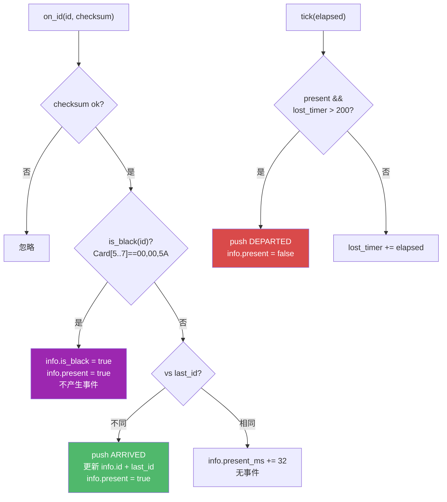

```c
// 事件（消费即清）
typedef enum { CARD_EVENT_NONE, CARD_EVENT_ARRIVED, CARD_EVENT_DEPARTED } card_event_t;
card_event_t app_card_consume_event(app_card_t *c);

// 属性（读不消费）
bool     app_card_is_present(app_card_t *c);
bool     app_card_is_black(app_card_t *c);
uint8_t* app_card_get_id(app_card_t *c);

// 由主循环调用
void app_card_on_decode(app_card_t *c, uint8_t *id, bool checksum_ok);
void app_card_tick(app_card_t *c, uint16_t elapsed_ms);
```

### 2.5 app_cmd —— 指令解析

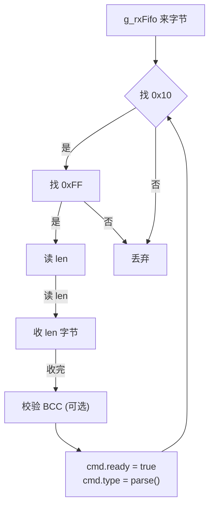

```c
typedef enum {
    CMD_NONE, CMD_7A, CMD_75, CMD_9A, CMD_95, CMD_9D, CMD_90, CMD_A0_05, CMD_INVALID
} cmd_type_t;

void      app_cmd_poll(app_cmd_t *c, SPSC_FIFO *rx);
cmd_type_t app_cmd_consume(app_cmd_t *c);
```

### 2.6 app_mode —— 唯一决策者

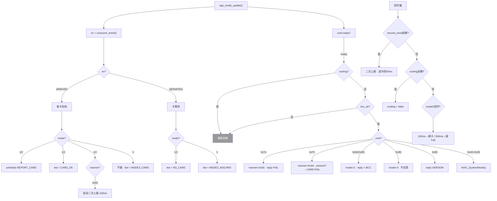

### 2.7 app_report —— 拼帧发送


```c
typedef enum { REPORT_CARD, REPORT_FAIL, REPORT_VERSION } report_type_t;
void app_report_send(report_type_t type, uint8_t *card_id, bool with_bcc);
```

### 2.8 app_led —— LED 状态机

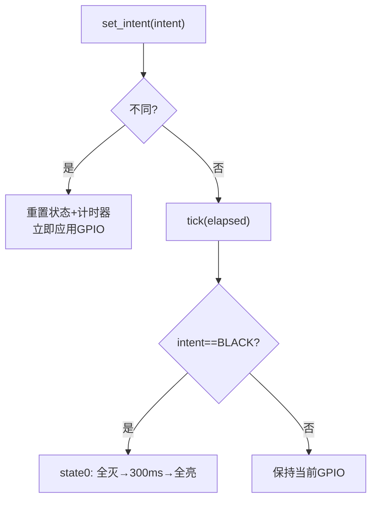

```c
typedef enum {
    LED_INTENT_INIT, LED_INTENT_CARD_OK, LED_INTENT_NO_CARD,
    LED_INTENT_BLACK_CARD, LED_INTENT_MODE3_CARD, LED_INTENT_MODE3_NOCARD,
} led_intent_t;

void app_led_set_intent(led_intent_t intent);
void app_led_tick(uint16_t elapsed_ms);
```

| intent | 红灯 | 绿灯 | 时序 |
|--------|------|------|------|
| INIT | 亮 | 灭 | 瞬时 |
| CARD_OK | 灭 | 亮 | 瞬时 |
| NO_CARD | 亮 | 灭 | 瞬时 |
| BLACK_CARD | 灭→亮 | 灭→亮 | 300ms |
| MODE3_CARD | 亮 | 亮 | 瞬时 |
| MODE3_NOCARD | 亮 | 灭 | 瞬时 |

### 2.9 事件流 + 属性流

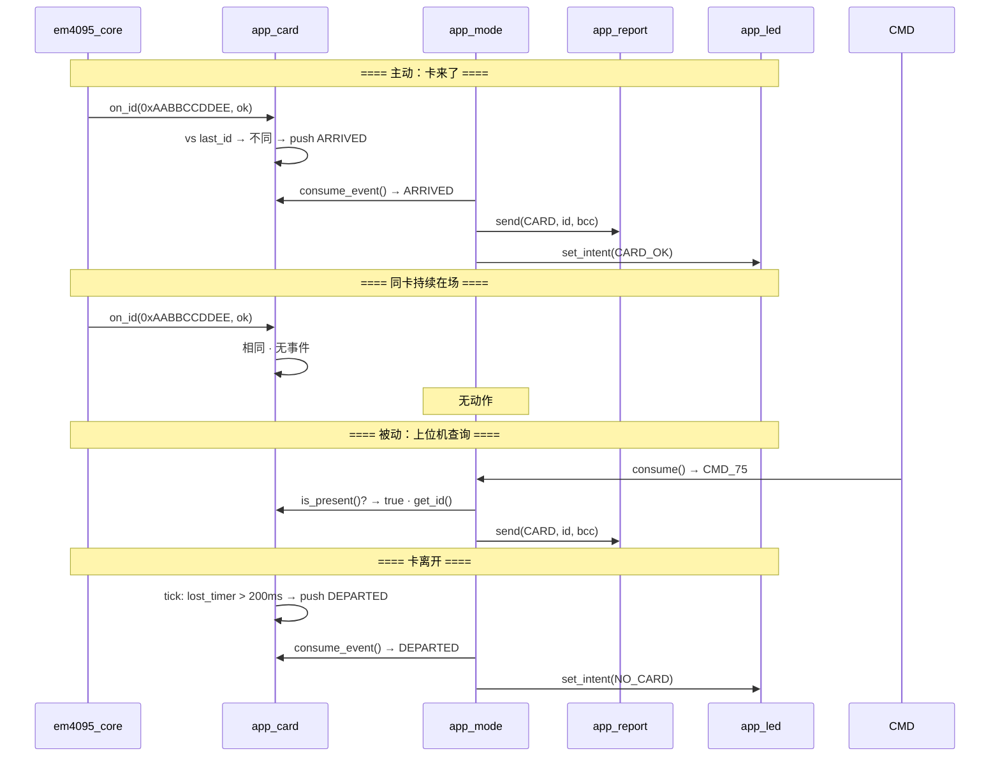

### 2.10 主循环

```c
void main(void) {
    Bsp_Init();
    app_card_init(&g_card);
    app_mode_init(&g_mode);
    app_led_set_intent(LED_INTENT_INIT);

    while (1) {
        uint16_t elapsed = Bsp_SystickElapsed();

        em4095_poll(&g_dec);                       // ① 解码 → on_id → app_card
        app_cmd_poll(&g_cmd, &g_rxFifo);           // ② 指令拼帧
        app_card_tick(&g_card, elapsed);            // ③ 卡超时检测
        app_mode_update(&g_mode, &g_card, &g_cmd, elapsed);  // ④ 唯一决策
        app_report_flush(&g_mode, &g_txFifo);       // ⑤ 执行上报
        app_led_tick(&g_led, elapsed);              // ⑥ 执行 LED
    }
}
```

---

## 3. Bootloader 远程升级

Bootloader 是**独立工程**，驻守在 Flash 前 6KB。Application 通过 `NVIC_SystemReset()` 复位后，由 Bootloader 决定跳转 App 还是驻留升级。

### 3.1 上电流程

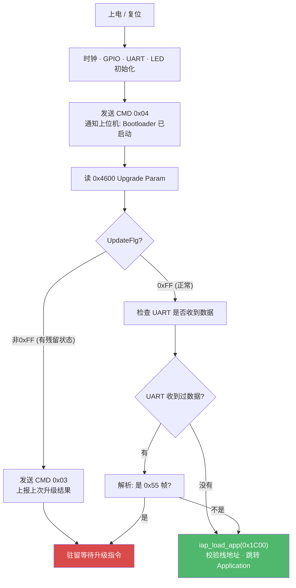

**正常情况（没在升级）：** UpdateFlg=0xFF → 无 UART 数据 → 直接跳 App。整个过程 < 1ms。

**触发升级的时机：** 上位机发 `0xA0 0x05` 复位 App → Bootloader 启动 → 上位机必须在 Bootloader 跳走前发出 `0x55 0x81`——UART RX ISR 收到数据会设标志让主循环停留。

### 3.2 升级协议：0x55 帧

```
上位机 → Bootloader (含 PackNo):
┌──────┬─────┬──────────┬──────────┬──────────────┬──────────┬──────┐
│ 0x55 │ CMD │ Len (LE) │ PackNo   │ Data[Len]    │ CRC16    │ 0xAA │
│ 帧头  │ 命令 │  2B       │ (LE) 2B   │               │ (LE) 2B   │ 帧尾  │
└──────┴─────┴──────────┴──────────┴──────────────┴──────────┴──────┘

Bootloader → 上位机 (不含 PackNo):
┌──────┬─────┬──────────┬──────────────┬──────────┬──────┐
│ 0x55 │ CMD │ Len (LE) │ Data[Len]    │ CRC16    │ 0xAA │
└──────┴─────┴──────────┴──────────────┴──────────┴──────┘
```

**帧解析 6 步：** 找 0x55 → 读 CMD(>0x80) → 读 Len(LE) → 校验帧尾 0xAA → 读 PackNo(LE) → 读 Data + 校验 CRC16。

### 3.3 三条升级命令

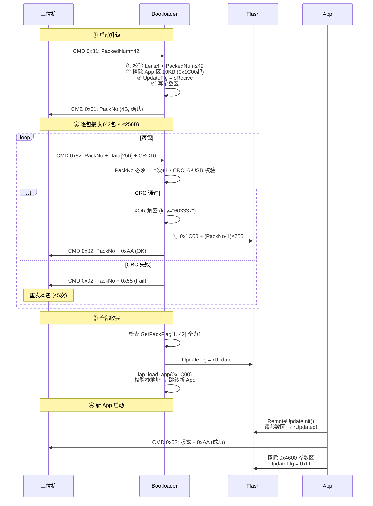

### 3.4 命令速查

| CMD | 方向 | 作用 | 应答 |
|-----|------|------|------|
| 0x81 | HOST→BL | 启动升级，告知总包数 | CMD 0x01: 回显 PackNo |
| 0x82 | HOST→BL | 发送一包数据 | CMD 0x02: PackNo + 0xAA/0x55 |
| 0x83 | HOST→BL | 查询升级结果 | CMD 0x03: 版本 + 状态 |
| 0x01 | BL→HOST | 启动确认 | — |
| 0x02 | BL→HOST | 数据包 ACK/NAK | — |
| 0x03 | BL→HOST / App→HOST | 状态报告 | — |
| 0x04 | BL→HOST | 启动通知 (4B全零) | — |

### 3.5 安全机制

| 机制 | 说明 |
|------|------|
| CRC16-USB | 多项式 0x8005，初值 0xFFFF，结果 XOR 0xFFFF |
| XOR 加密 | 密钥 "603337"，6 字节循环 |
| 包序号 | 必须严格递增，跳跃→忽略，上位机重发 |
| 重发 | 每包最多 5 次 |
| 超时 | UPDATE_OTTP = 8000 tick (~8秒) |
| 栈校验 | `(*(app_addr) & 0x2FFE0000) == 0x20000000` |
| 半扇区擦除 | 每 256B 写入前先擦对应 512B 扇区 |

### 3.6 Application 端

```c
// main() 开头调用一次
void RemoteUpdateInit(void) {
    uint8_t flag = FLASH_ReadByte(UPD_PARAM_FLASH_ADDR);
    if (flag == rUpdated) {
        send_cmd_03(READ_CARD_VER, 0xAA);   // 上报升级成功
        FLASH_EraseSector(UPD_PARAM_FLASH_ADDR);  // 恢复为 0xFF
    } else if (flag != 0xFF && flag != rNormal) {
        send_cmd_03(READ_CARD_VER, 0x55);   // 上报升级失败
        FLASH_EraseSector(UPD_PARAM_FLASH_ADDR);
    }
    // flag == 0xFF 或 rNormal → 什么都不做
}
```

### 3.7 Flash 布局

```
0x0000 ┌──────────────────────┐
       │     Bootloader        │  ~6KB
       │  0x55帧 · CRC16 · XOR │
0x1C00 ├──────────────────────┤  ← APP_START_ADDR
       │     Application       │  最大 10KB (0x2A00)
       │  0x10帧 · 读卡业务     │
0x4600 ├──────────────────────┤  ← UPD_PARAM_FLASH_ADDR
       │   Upgrade Param       │  512B
       │  UpdateFlg · 版本 · CRC│
0x4800 └──────────────────────┘

参数:
  APP_START_ADDR    = 0x1C00
  UPDATE_APP_MAX    = 0x2A00 (10KB)
  PACK_MAX          = 42 包
  U_FILE_MAX        = 256 B/包
  CRC               = CRC16-USB (0x8005)
  加密              = XOR, key="603337"
  超时              = ~8s (8000 tick)
  重试              = 5 次
```

### 3.8 Bootloader 源文件

```
Bootloader/                      # 独立 Keil 工程
├── boot_main.c                  # 上电→CMD 0x04→检查UART→跳App或驻留
├── boot_proto_55.c              # 0x55帧解析 + 三条命令处理
├── boot_flash.c                 # Flash擦写 · 半扇区 (512B)
├── boot_crc.c                   # CRC16-USB 查表计算
└── boot_crypto.c                # XOR 解密 (key="603337")
```

---

## 5. Middleware 中间件层

### 3.1 em4095_core 解码器

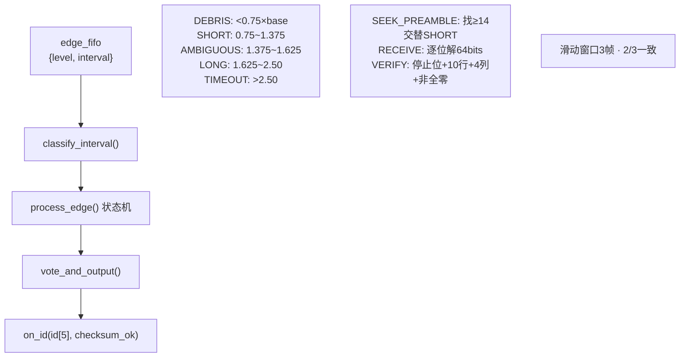

### 3.2 解码状态机

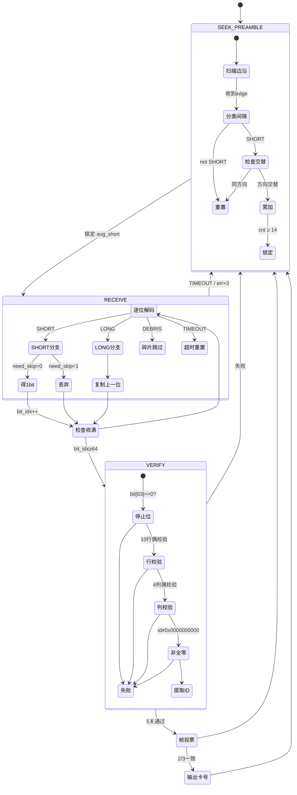

### 3.3 proto_10 协议层

```c
// 纯工具函数，无状态
bool   proto10_verify_frame(uint8_t *buf, uint8_t len);
uint8_t proto10_calc_bcc(uint8_t *buf, uint8_t len);
void   proto10_build_card(uint8_t *out, uint8_t *id, bool bcc);
void   proto10_build_fail(uint8_t *out, bool bcc);
```

---

## 6. BSP 驱动层

### 4.1 总架构

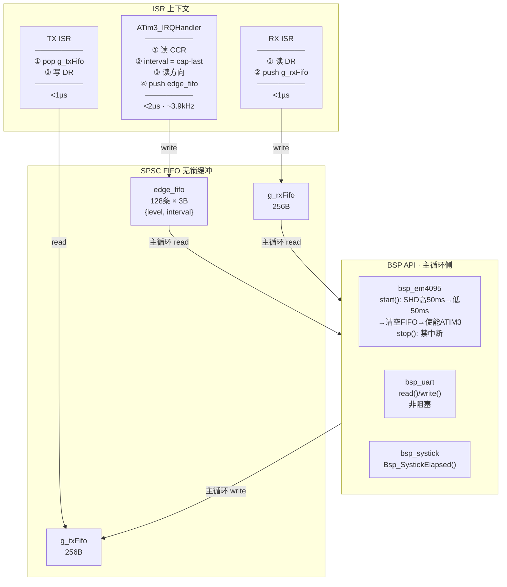

### 4.2 SPSC FIFO 读写关系

```
          生产者                      消费者
    ┌──────────────────┐    ┌──────────────────┐
    │ ISR（中断上下文）   │    │ 主循环             │
    │ head 独占          │    │ tail 独占          │
    └──────┬───────────┘    └──────┬───────────┘
           │                       │
           ▼                       ▼
    ┌─────────────────────────────────────────┐
    │              SPSC FIFO                   │
    │  零锁 · DMB屏障 · 满则丢弃                │
    │  128条 = 32ms缓冲 = 一整帧                │
    └─────────────────────────────────────────┘

    edge_fifo: 捕获ISR(write)  → em4095_poll(read)
    g_rxFifo:  RX ISR(write)   → 主循环(read)
    g_txFifo:  主循环(write)    → TX ISR(read)
```

### 4.3 中断优先级

```
IrqLevel2  ATIM3 捕获 (~3.9kHz, <2µs)
           LPUART1  (<1µs)
           → 同优先级，按中断号顺序，不抢占
           → CCR 硬件锁存，ISR 延迟不丢值
IrqLevel3  SysTick 1ms
```

### 4.4 防误码

| 场景 | 防护 |
|------|------|
| 毛刺假边沿 | ATIM3 硬件数字滤波 f_DTS÷32 |
| ISR 被 UART 抢占 | CCR 硬件锁存，ISR 延迟不丢值 |
| 解码到一半 ISR 写入 | SPSC: head/tail 分离，无竞争 |
| 解码阻塞主循环 | classify+decode 每条 <5µs，FIFO 缓冲32ms |
| TX 阻塞 | Bsp_UartWrite() 非阻塞 |
| 解码器死锁 | 所有状态都有 TIMEOUT 出口 |
| 卡离开残留 | 200ms → DEPARTED → 清零 |

---

## 7. HAL 硬件层

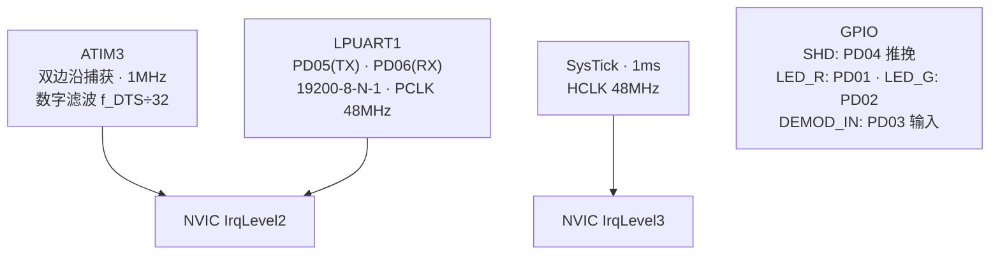

---

## 8. 业务流程闭环

### 6.1 进站 (Send_Manner = 0x55)

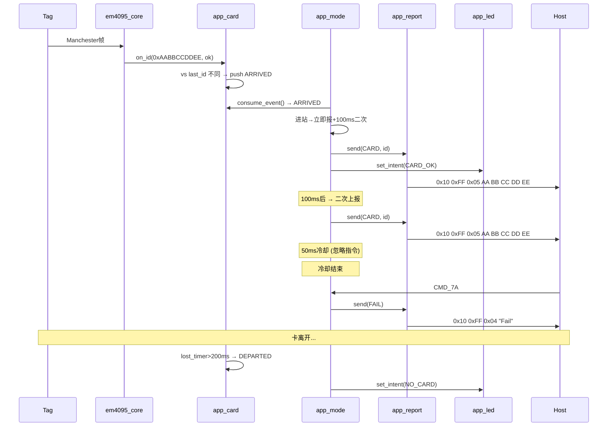

### 6.2 下放 (Send_Manner = 0xAA)

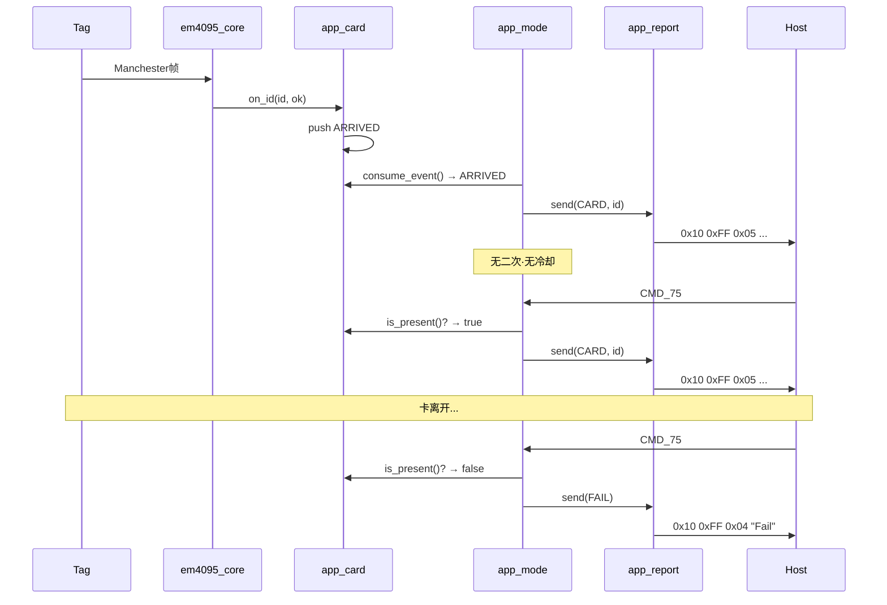

### 6.3 数据包格式

```
卡号包 (模式1):      0x10 0xFF 0x05 [ID0..4]           → 8B
卡号包 (模式2/3):    0x10 0xFF 0x05 [ID0..4] [BCC]     → 9B
Fail包 (模式1):      0x10 0xFF 0x04 'F' 'a' 'i' 'l'    → 7B
Fail包 (模式2/3):    0x10 0xFF 0x04 'F' 'a' 'i' 'l' [BCC] → 8B
版本包:             0x10 0xFF 0x07 'V' 'e' 'r' '0' '3' '1' '0' → 10B

BCC = 前N字节 XOR
```

---

## 9. 源文件组织

```
01_Hardware/bsp/
├── inc/
│   ├── spsc_fifo.h              # SPSC FIFO (已有)
│   ├── bsp_em4095.h            # EM4095 抽象 + edge_fifo
│   ├── bsp_uart.h / bsp_systick.h / bsp_clk.h / bsp_config.h  (已有)
└── src/
    ├── bsp_em4095.c / bsp_uart.c / bsp_systick.c / bsp_clk.c / bsp.c

01_Hardware/driver/              # DDL (按需: atim3/lpuart/gpio/sysctrl/...)
01_Hardware/f002/common/         # MCU 平台 (已有)

02_Midware/
├── em4095/
│   ├── em4095_core.h            # edge_t · decoder_t · class_t · state_t
│   └── em4095_core.c            # classify + process_edge + verify + vote
└── protocol/
    ├── proto_10.h / proto_10.c  # 0x10 帧工具

03_Application/
├── main.c                       # 6行主循环
├── app_card.h / app_card.c      # 卡状态 + 事件
├── app_cmd.h / app_cmd.c        # 指令解析
├── app_mode.h / app_mode.c      # 唯一决策
├── app_report.h / app_report.c  # 拼帧发送
├── app_led.h / app_led.c        # LED 意图→GPIO

Bootloader/                      # 独立工程
├── boot_main.c / boot_proto_55.c / boot_flash.c / boot_crc.c / boot_crypto.c
```

---

## 10. 关键设计决策

| 决策 | 选择 | 理由 |
|------|------|------|
| 采集方案 | Input Capture | ISR ~3.9kHz，CCR 硬件锁存 |
| ISR 策略 | 只记录不判断 | <2µs，无状态 |
| 边沿 FIFO | SPSC × 128 | 零锁，缓冲 32ms |
| **模块耦合** | **主循环串联，状态结构体交换** | 无回调嵌套 |
| **事件 vs 属性** | **ARRIVED/DEPARTED + present/id** | 事件触发主动行为，属性服务被动查询 |
| **LED 架构** | **意图驱动** | mode 说"绿灯"，led 管时序 |
| 帧投票 | 2/3 一致 | 66ms |
| 校验 | 5 关 | 停止位+10行+4列+非全零+脉宽 |
| 协议 | 0x10 帧 | 向下兼容 SR2 19项行为 |
| 忙保护 | cooling 静默忽略 | 卡号优先级 > 指令 |
