# 原SR3 读卡器 —— 行为规范（HC32F002）

> 源码：`HC32F002_DDL_Rev1.2.0（卡号错误问题解决优化版）\midware\RFID\RFID.c` 等
> MCU：HC32F002，48MHz RCH，Flash 18KB，RAM 2KB
> 用途：新 SR3 重构时的功能参考基线

---

# 一、通信协议

## 1.1 物理层

- UART 19200-8-N-1，LPUART1
- 48MHz RCH → PCLK 6MHz（`SYSCTRL_SYSCLK_PCLK_PRS8`）
- 帧头固定 0x10 0xFF，数据长度由 CMD 决定

## 1.2 帧格式

```
┌────────┬────────┬────────┬────────────────────┬─────────┐
│  0x10  │  0xFF  │  CMD   │  DATA（变长）        │  BCC?   │
└────────┴────────┴────────┴────────────────────┴─────────┘
```

- CMD 决定 DATA 长度，不在帧中传 LEN
- 模式 2/3 时 BCC 附加在末尾：`BCC = XOR(0x10, 0xFF, CMD, DATA[0..n])`

## 1.3 接收指令（上位机 → 读卡器）

| 字节序列 | 语义 | S2控制器 | S3控制器 |
|---|---|---|---|
| `10 FF 7A` | 进站查询 + 切模式1 + 设进站方向 | ✅ | ✅ |
| `10 FF 75` | 下放查询 + 切模式1 + 设下放方向 | ✅ | ✅ |
| `10 FF 9A` | 进站 + 切模式2（BCC）+ 设进站方向 | ❌ | ❌ |
| `10 FF 95` | 下放 + 切模式2（BCC）+ 设下放方向 | ❌ | ❌ |
| `10 FF 9D` | 切模式3（连续上报） | ❌ | ❌ |
| `10 FF 90` | 查询版本号 | ❌ | ❌ |
| `10 A0 05` | 系统复位（进 Bootloader） | ❌ | ✅ |

> S2/S3 控制器**从未使用过** 0x9A/0x95/0x9D/0x90 四条命令。它们是读卡器固件预留的。S3 控制器只用了 0x7A、0x75、0xA0 0x05 三条。

SR3 命令解析在主循环 `Read_Mode_Change()` 中，不依赖 UART 中断。0xA0 0x05 命令**不校验 buf[0] 是否为 0x10**，只要 `buf[1]==0xA0 && buf[2]==0x05` 即调用 `NVIC_SystemReset()`。

## 1.4 发送指令（读卡器 → 上位机）

| 字节序列 | 语义 | 模式 |
|---|---|---|
| `10 FF 05 + 5字节卡号` | 卡号包，8字节 | 1 |
| `10 FF 04 46 61 69 6C` | Fail包，7字节 | 1 |
| `10 FF 05 + 5字节卡号 + BCC` | 卡号包带校验，9字节 | 2/3 |
| `10 FF 04 46 61 69 6C + BCC` | Fail包带校验，8字节 | 2/3 |
| `10 FF 01 56 65 72 30 33 31 30` | 版本包 "Ver0310"，10字节 | 任意 |

## 1.5 忙保护

收到指令时，满足以下任一条件则**静默忽略**：
- 串口正在发送
- 进站 100ms 等待期或 50ms 冷却期

**忙保护只阻止指令应答，不阻止新卡上报。** 新卡检测条件独立于忙状态。

---

# 二、读卡核心

## 2.1 上电启动

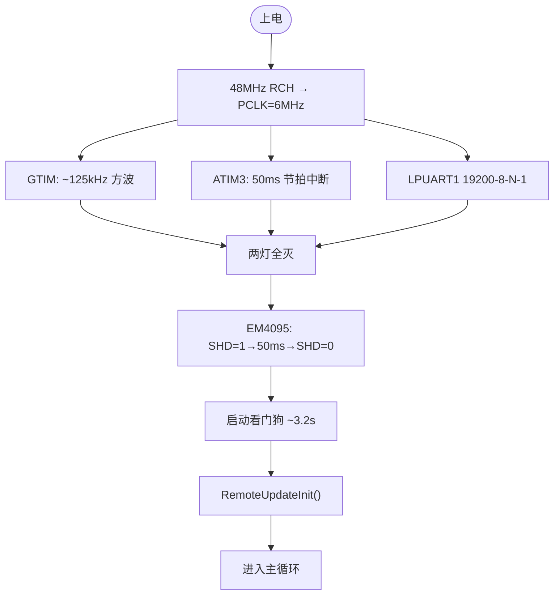

> 与 SR2 不同：SR3 上电**两灯全灭**，SR2 上电红灯亮。

## 2.2 主循环

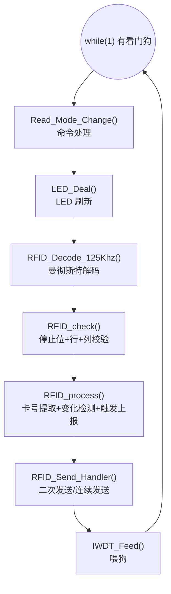

## 2.3 曼彻斯特解码

GTIM 中断（~125kHz）检测 DEMOD_OUT(PC05) 跳变→记录脉宽→主循环分类解码：

| 脉宽 | 阈值 |
|---|---|
| 窄 (~1bit) | 20~41 |
| 宽 (~2bit) | 41~82 |
| 超出范围 | 解码复位 |

- 64 位收齐 → `decode_end_flag=1`
- 卡头保护：前 9 位出现 0 → 复位
- 校验期间关闭 GTIM（125kHz 停振），校验完恢复
- 解码失败时调用 `Reset_RFID_Decode()` 复位全部解码状态

## 2.4 校验：三关

| 关 | 方法 | 说明 |
|---|---|---|
| 停止位 | `decode_data[63] != 0` → 失败 | **SR3 新增**，SR2 没有 |
| 行校验 | 10 行奇校验 | 同 SR2 |
| 列校验 | 4 列奇校验 | 同 SR2 |

三关全过 → `Data_check_flag=1`。失败时 `Reset_RFID_Decode()` 复位解码器。

## 2.5 卡号提取与变化检测

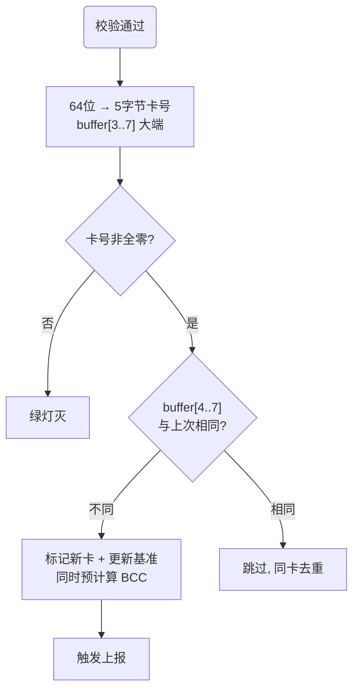

> 与 SR2 一致：只比较 buffer[4..7]（卡 ID），buffer[3] 不参与。SR3 区别：新卡时同时预计算 BCC。

## 2.6 主动上报触发条件

```c
if(Read_card_success_flag==0 || Kahao_new_flag!=0)
```

- 当前无卡（200ms 超时清零）→ 触发
- 检测到新卡 → 触发
- **不检查 100ms_flag**——即使在等待/冷却中也会触发

---

# 三、位置行为

## 3.1 进站（Send_Manner = 0x55）

指令 0x7A 或 0x9A 设置为进站方向。

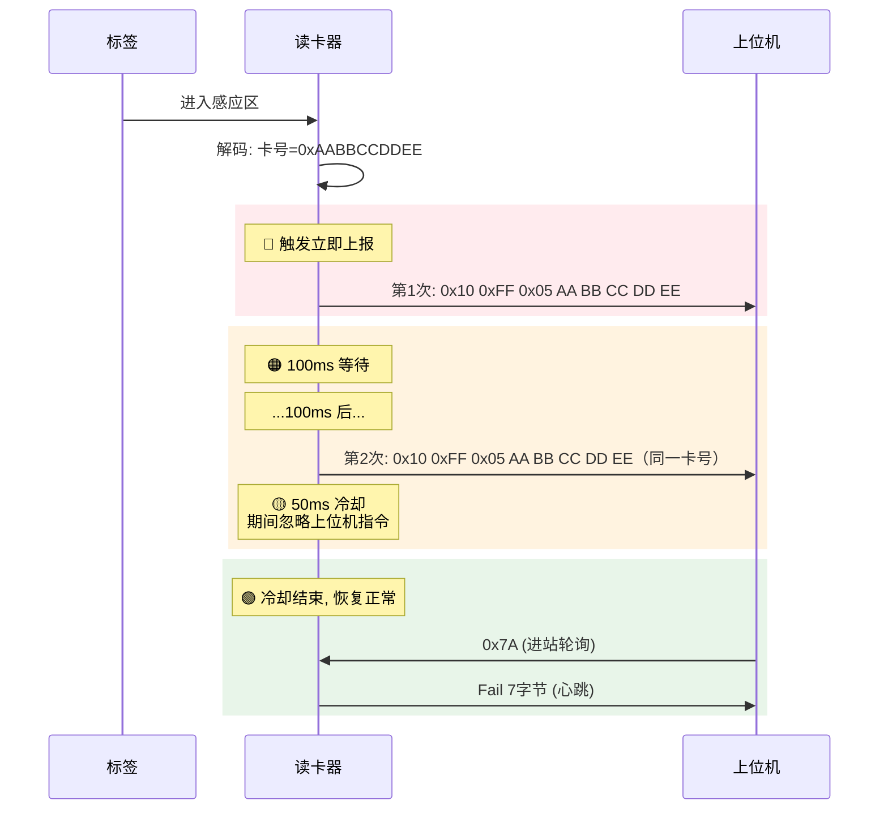

**时序参数：** 100ms（ATIM3 50ms × 2 tick），50ms 冷却（× 1 tick）。模式 3 时不进冷却。

## 3.2 下放（Send_Manner = 0xAA）

指令 0x75 或 0x95 设置为下放方向。

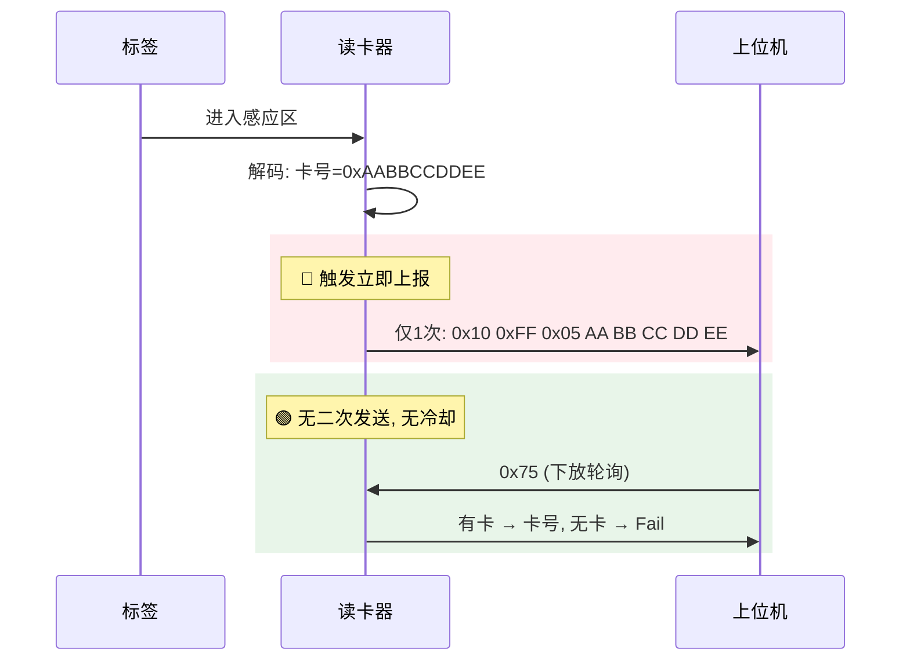

## 3.3 进站 vs 下放 对比

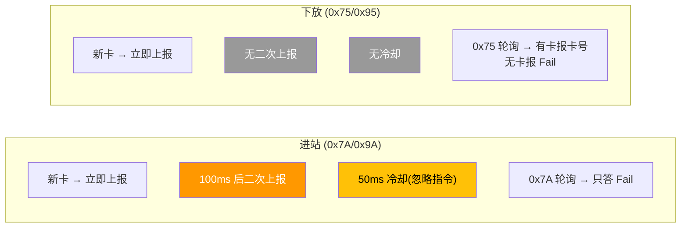

## 3.4 轮询应答规则

| 指令 | 忙时 | 空闲时 |
|---|---|---|
| 0x7A（进站） | 静默忽略 | **只应答 Fail**，不报卡号 |
| 0x75（下放） | 静默忽略 | **有卡报卡号，无卡报 Fail** |
| 0x9A（进站+BCC） | 静默忽略 | 同 0x7A，但应答含 BCC，切模式2 |
| 0x95（下放+BCC） | 静默忽略 | 同 0x75，但应答含 BCC，切模式2 |
| 0x9D（连续模式） | - | 切模式3，无应答 |
| 0x90（查版本） | - | 直接回版本号 10 字节 |

## 3.5 新卡打断规则

新卡优先级最高，随时打断任何流程。触发条件不检查 100ms_flag。

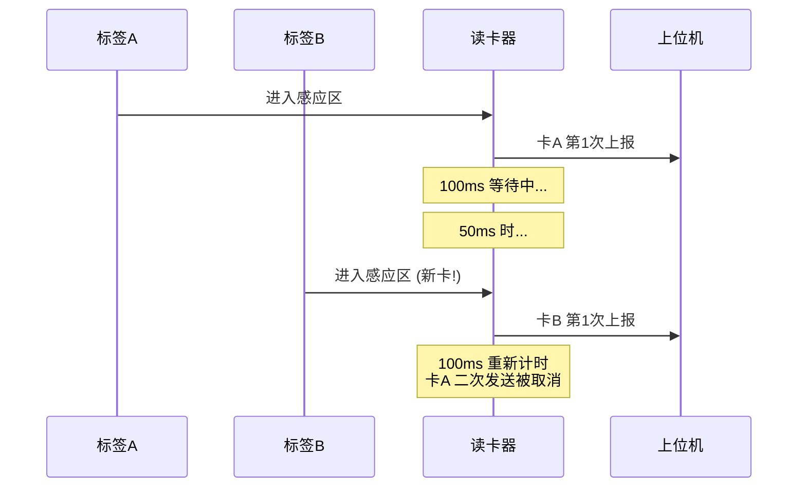

| 场景 | 结果 |
|---|---|
| 100ms 等待中来新卡 | 立即发新卡，原卡二次发送取消 |
| 50ms 冷却中来新卡 | 立即发新卡，重新开始 100ms 计时 |
| 发送中来新卡 | `delay1ms(20)` 等 TX 空闲 → 发新卡 |

## 3.6 三种模式

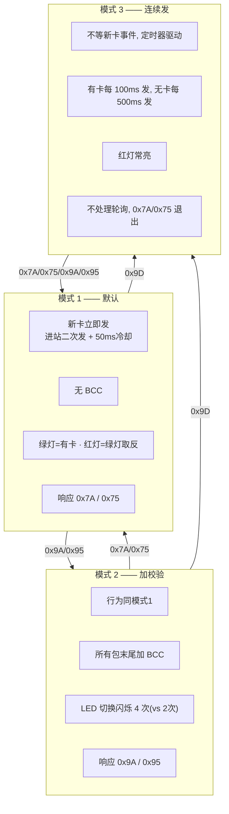

| 维度 | 模式 1 | 模式 2 | 模式 3 |
|---|---|---|---|
| 进入指令 | 0x7A / 0x75 | 0x9A / 0x95 | 0x9D |
| 上报驱动 | 新卡事件 | 新卡事件 | 定时器 |
| 进站二次发 | ✅ | ✅ | 不适用 |
| 50ms 冷却 | ✅ | ✅ | ❌ |
| BCC | ❌ | ✅ | ✅ |
| 有卡频率 | 1 次（+进站二次） | 1 次（+进站二次） | 每 100ms |
| 无卡频率 | 不发 | 不发 | 每 500ms |
| 红灯 | 绿灯取反 | 绿灯取反 | 常亮 |

### 模式 3 的工作方式

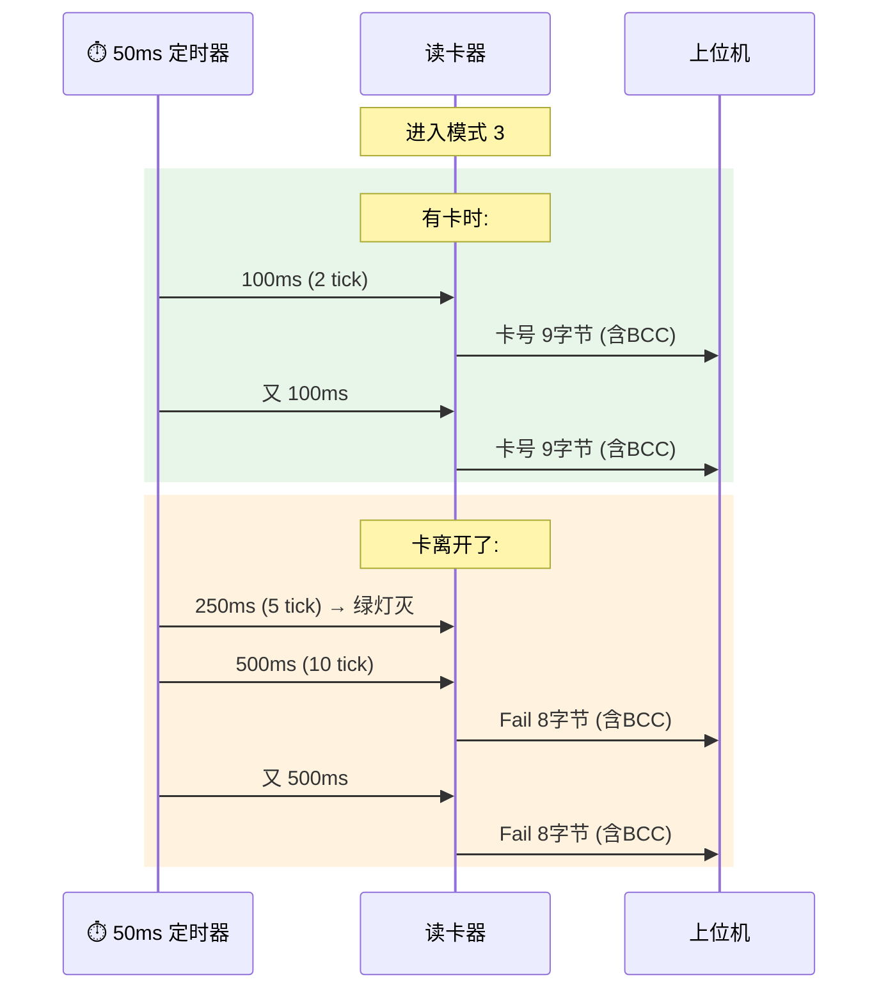

### 模式切换时 LED 闪烁

切换到新模式时，绿灯快速闪烁确认：
- 模式 1：2 次（`temp_led_num_flag=2`）
- 模式 2：4 次（`temp_led_num_flag=4`）
- 模式 3：6 次（`temp_led_num_flag=6`）

每次闪烁约 200ms（ATIM3 50ms × 4 tick）。

## 3.7 200ms 无卡超时

无新卡解码超过 200ms → `Read_card_success_flag=0` → 绿灯灭。ATIM3 50ms × 4 tick。

---

# 四、LED 行为

## 4.1 引脚与初始态

- PD02 绿灯，PD03 红灯，低电平亮
- 上电初始：**两灯全灭**（与 SR2 上电红灯亮不同）

## 4.2 模式 1/2 常态


红灯 = 绿灯取反（`GPIO_PD02_READ()` 取反后设红灯）。

## 4.3 模式 3

- 红灯**常亮**（不参与取反）
- 有卡 → 绿灯亮
- 无卡 250ms（5 tick × 50ms）→ 绿灯灭

## 4.4 黑卡时序

卡号后 3 字节为 `00 00 5A` 时触发：

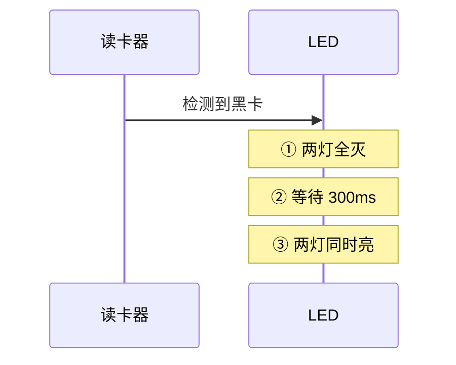

用于标识特定设备/推车。

---

# 五、固件升级

## 5.1 升级架构


三端协作：PC 下发 → S3 编排 → Bootloader 执行。读卡器 App 在升级中角色极小：只负责上电上报结果 + 接 0xA0 0x05 复位。

## 5.2 Flash 布局

```
0x0000 ┌──────────────┐
       │  Bootloader  │  7KB (0x0000~0x1BFF)，永不被擦
0x1C00 ├──────────────┤
       │ Application  │  10KB (0x2A00)，最大 42 包×256B
0x4600 ├──────────────┤
       │  参数区       │  512B，App↔Bootloader 共享
0x4800 └──────────────┘  Flash 总 18KB
```

**UpdateFlg（@0x4604，Flash 持久化）——App 和 Bootloader 的唯一握手渠道：**

| 值 | 含义 | Bootloader 动作 |
|---|---|---|
| 0xFF | 擦除态/正常 | 立即跳 App |
| 0 (rNormal) | 正常 | 驻留监听 |
| 5 (rRecive) | 正在收固件 | 驻留监听 |
| 3 (rUpdated) | 升级完成 | App 见后发 0x03 上报 |

## 5.3 触发升级

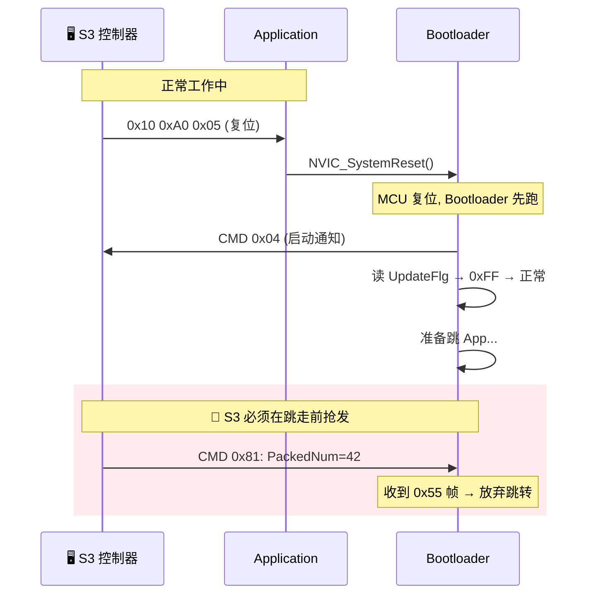

> App 收 0xA0 0x05 后**直接复位，不预置 UpdateFlg**。靠 Bootloader 启动时 100ms 延时 + S3 抢发 0x81 来抓住窗口。

## 5.4 0x55 升级帧

```
上位机 → 读卡器（含 PackNo）:
┌──────┬─────┬──────────┬──────────┬──────────────┬──────────┬──────┐
│ 0x55 │ CMD │ Len(LE)  │ PackNo   │ Data[Len]    │ CRC16 LE │ 0xAA │
└──────┴─────┴──────────┴──────────┴──────────────┴──────────┴──────┘

读卡器 → 上位机（不含 PackNo）:
┌──────┬─────┬──────────┬──────────────┬──────────┬──────┐
│ 0x55 │ CMD │ Len(LE)  │ Data[Len]    │ CRC16 LE │ 0xAA │
└──────┴─────┴──────────┴──────────────┴──────────┴──────┘
```

## 5.5 升级命令

| CMD | 方向 | 干什么 |
|---|---|---|
| 0x81 | 上位机→BL | 启动升级（告知总包数，擦除 App 区） |
| 0x82 | 上位机→BL | 发送一包数据（256B + CRC16） |
| 0x83 | 上位机→BL | 查询升级结果 |
| 0x01 | BL→上位机 | 启动确认 |
| 0x02 | BL→上位机 | 数据包 ACK（uOK=0xAA / uFail=0x55） |
| 0x03 | App→上位机 | 升级结果报告（版本 + 成功/失败） |
| 0x04 | BL→上位机 | Bootloader 启动通知（4 字节零） |

## 5.6 完整升级流程

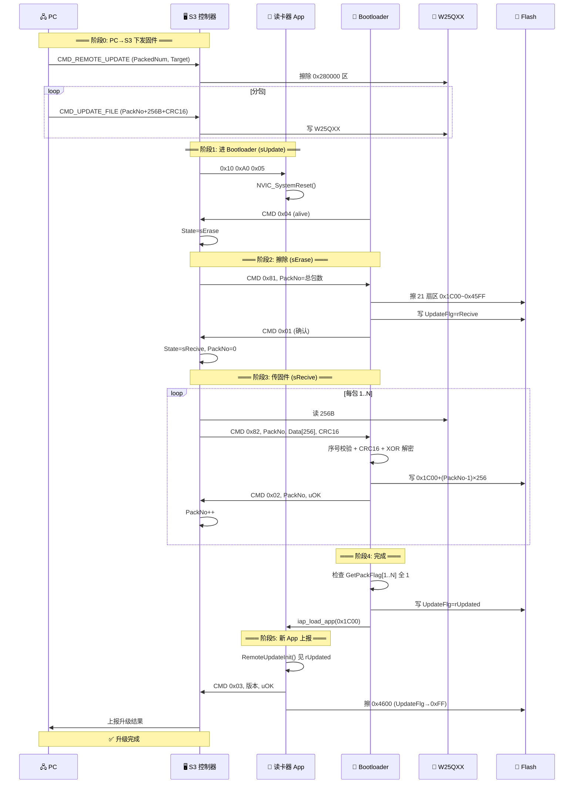

## 5.7 S3 控制器升级状态机

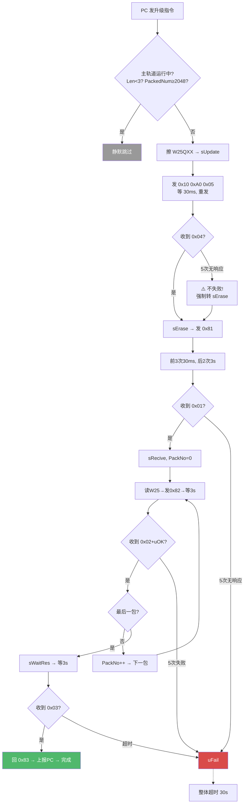

## 5.8 安全机制

| 机制 | 参数 |
|---|---|
| CRC | CRC16-USB (0x8005)，初值/结果 XOR 0xFFFF |
| 加密 | XOR，密钥 "603337"（6 字节循环），仅 Bootloader 解密 |
| 包序号 | 严格递增，跳跃则静默丢弃 |
| 重传 | S3 侧最多 5 次，Bootloader 无重传逻辑 |
| 超时 | S3: 30s 整体 + 3s 单步 / BL: ~4s（8000×500μs） |
| 栈校验 | 跳转前验证 `(*(app_addr) & 0x2FFE0000) == 0x20000000` |

## 5.9 失败后能不能恢复

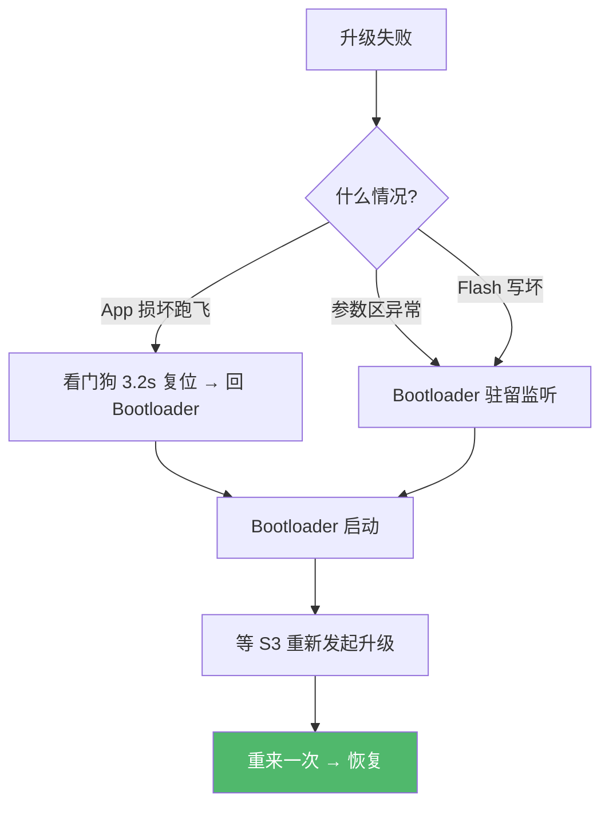

**结论：OTA 不会变砖。** 三道兜底：
1. Bootloader 区（0x0000~0x1BFF）永不被擦写
2. App 看门狗 ~3.2s 超时复位
3. UpdateFlg≠0xFF 时 Bootloader 驻留，0x81 来者不拒

但恢复依赖 PC/S3 重新发起升级，停留在 Bootloader 期间不读卡不上报，现场表现为"死机"。

## 5.10 升级代码位置

| 角色 | 文件 | 关键函数 |
|---|---|---|
| S3 编排 | `APP\RemoteUpdate.c` | `GotoUpdate()`, `UpdateFileRecv()`, `RemoteUpdate()` |
| 读卡器 App | `midware\RFID\RFID.c` | `Read_Mode_Change()` 接复位 |
| 读卡器 App | `midware\REMOTEUPDATE\RemoteUpdate.c` | `RemoteUpdateInit()` 上报结果 |
| Bootloader 主 | `source\main.c` | 启动决策 + 跳转 |
| Bootloader 升级 | `midware\REMOTEUPDATE\RemoteUpdate.c` | `GotoUpdate()`, `UpdateFileRecv()`, `iap_load_app()` |
| Bootloader 解帧 | `midware\CMDPROTOCOL\CmdProtocol.c` | `UPD_RFID_Prase()` |

---

# 六、与 SR2 的兼容性

## 6.1 兼容基线

上位机只发 0x7A 和 0x75 时，SR3 与 SR2 行为完全一致，可互换。SR3 收到 0x7A/0x75 会自动切回模式 1，向下兼容无感知。

## 6.2 差异总览

| 维度 | SR2 (STC15) | SR3 (HC32F002) |
|---|---|---|
| MCU | STC15W4K32S4 (32KB) | HC32F002 (18KB) |
| 命令数 | 2 条 | 7 条 |
| 模式 | 仅模式 1 | 模式 1/2/3 |
| BCC | ❌ | 模式 2/3 ✅ |
| 校验 | 行+列 (2关) | 停止位+行+列 (3关) |
| LED | 上电红灯亮，有卡绿灯亮 | 上电两灯灭，红绿互斥/闪烁/黑卡 |
| 看门狗 | ❌ | ✅ ~3.2s |
| 节拍 | Timer0 10ms | ATIM3 50ms |
| 发送 | TI 中断逐字节 | LPUART_Transmit 阻塞 |
| Bootloader | ❌ | ✅ 0x55 帧协议 |
| 远程升级 | ❌ | ✅ |