## 待办列表
- [ ] 编码
- [ ] 测试
- [ ] 合并

---

# SR3 读卡器 —— 行为全景图

> 你一页一页往下看就行。每张图解释一个概念，从最简单的问题开始。

---

## 〇、读卡器到底是什么

读卡器就是一个串在衣架轨道上的小盒子：

```
┌─────────────────────────────────────────────────────┐
│                    主轨道 (衣架在走)                  │
│  ═══════════════════════════════════════════════════  │
│       ↓ 衣架滑过来                                   │
│  ┌─────────┐                                        │
│  │ 读卡器   │ ← UART 一根线连到控制器                  │
│  │ 125kHz  │   19200-8-N-1                           │
│  │ 线圈    │                                         │
│  └─────────┘                                        │
│       ↓ 读到标签卡号                                  │
│  控制器收到卡号 → 决定要不要放行                        │
└─────────────────────────────────────────────────────┘
```

**核心任务只有一个：** 衣架经过时，读出它身上的 RFID 标签卡号，告诉控制器。

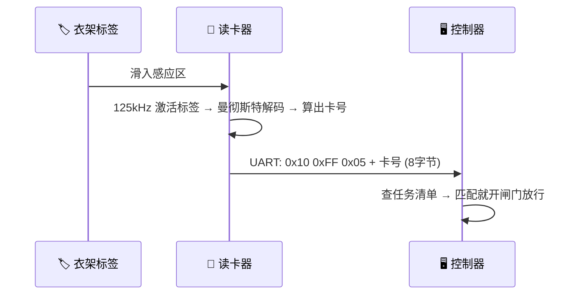

---

## 一、读卡器怎么"读"到卡号（解码全链路）

这是读卡器上电后**一直在做**的事，不需要上位机叫它才做。

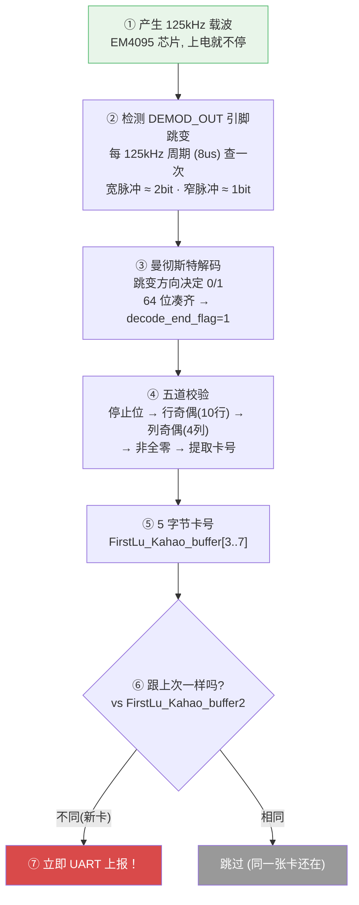

**关键点：** 第⑥⑦步——读到新卡号就立刻上报，**不等待上位机来问**。

---

## 二、主动 vs 被动：谁先动

这是最容易搞混的地方。读卡器和上位机**各干各的**，不是一问一答。

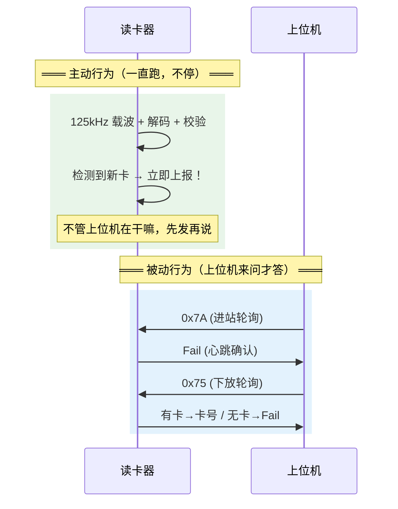

**一句话总结：**
- **主动 = 读卡器自己发现新卡，自己上报**（不等任何人）
- **被动 = 上位机来问"你还在吗？什么模式？"，读卡器回答**
- 上位机的轮询**不是**用来取卡号的——卡号早就主动上报过了。轮询只是心跳 + 模式管理。

---

## 三、进站 vs 下放：同样的新卡，不同的处理

一张卡进入感应区，读卡器的反应取决于它被设成了**进站方向**还是**下放方向**。

### 3.1 进站方向 (Send_Manner = 0x55)

衣架从主轨道滑进工位——需要确保上位机**一定收到**卡号，所以多发一次：

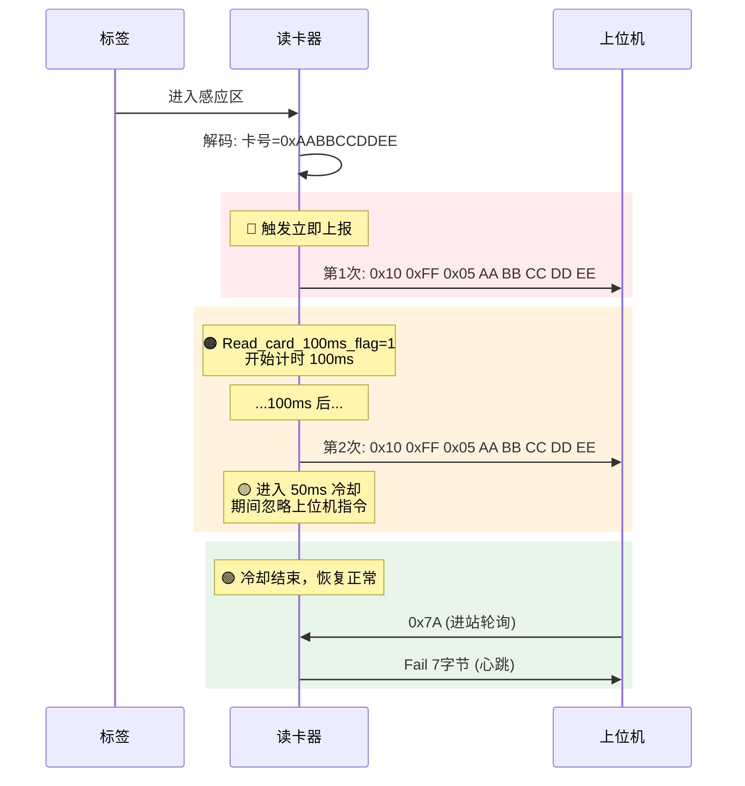

**为什么发两次？** 进站是关键动作——衣架要进工位了。两次发送间隔 100ms，确保上位机在轮询间隙也能收到。

**为什么冷却 50ms？** 防止二次发送还没完成就被上位机的轮询打断。

### 3.2 下放方向 (Send_Manner = 0xAA)

衣架在工位上操作完了，要放回主轨道——发一次就够了：

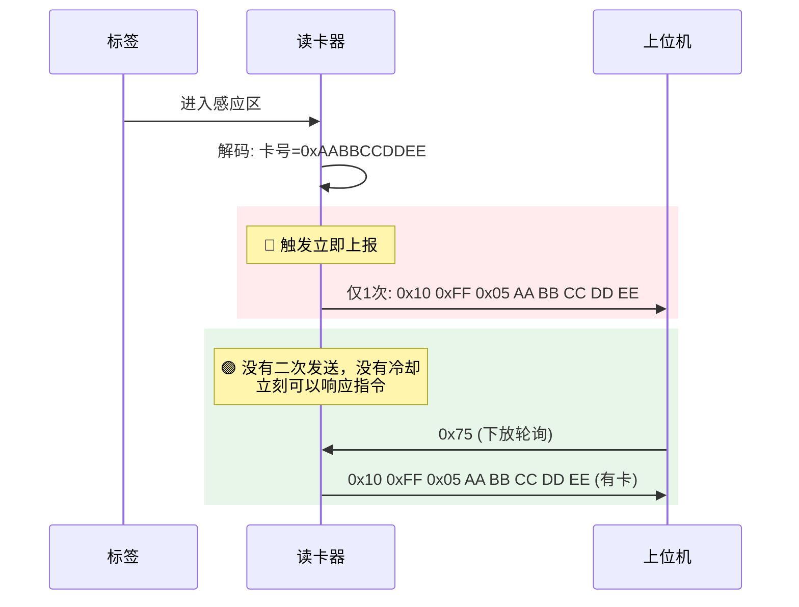

**为什么只发一次？** 下放不像进站那么关键。而且上位机可以通过 0x75 随时查询。

### 3.3 并排对比

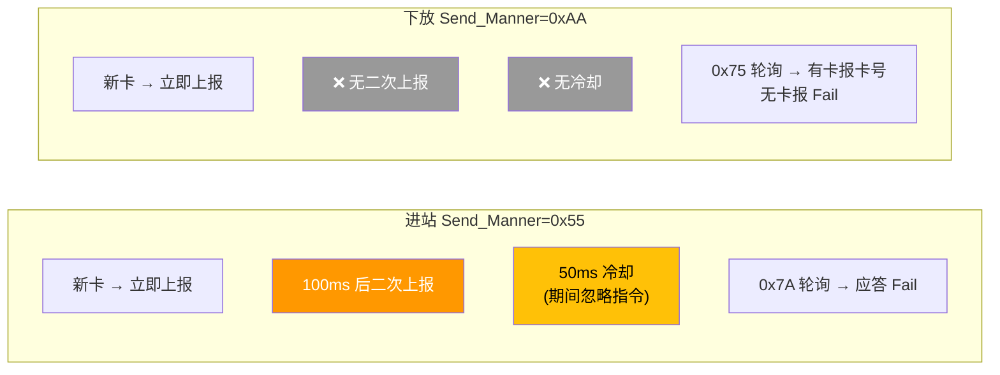

---

## 四、三种模式：一张表看懂

三种模式的区别，核心就三个维度：**上报方式、数据格式、LED**。

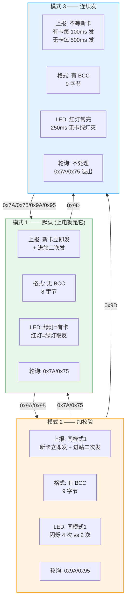

**一句话区分：**
- 模式 1 = 有卡才发，发完就停
- 模式 2 = 有卡才发 + 数据末尾加 BCC 校验
- 模式 3 = 不管有没有卡，一直发（像心跳一样）

### 4.1 模式 3 的工作方式

模式 3 最特殊——它不依赖"新卡出现"这个事件，而是**定时器到了就发**：

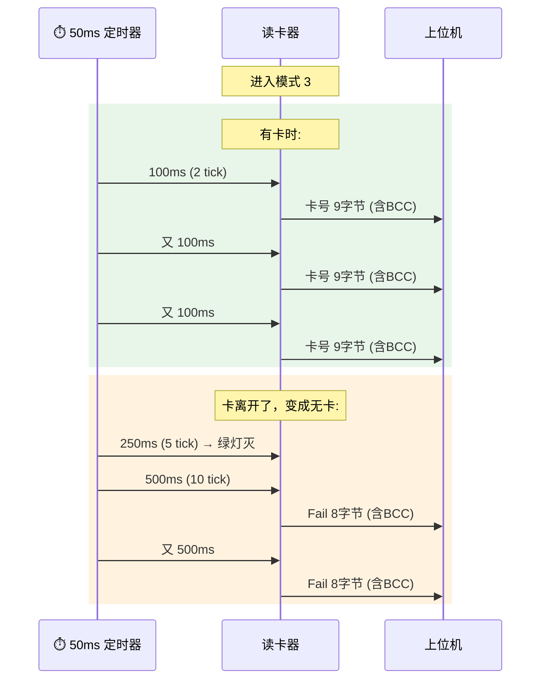

**适用场景：** 需要实时知道工位上有没有衣架的场合。上位机不用轮询，读卡器自己会一直报。

---

## 五、上位机 7 条命令速查

读卡器不是主动发完就完了——上位机也会发命令过来。这些命令**全部是被动响应**。


### 忙保护（重要！）

读卡器正在发送卡号（或处在进站冷却期）时，上位机发命令过来会被**静默忽略**：

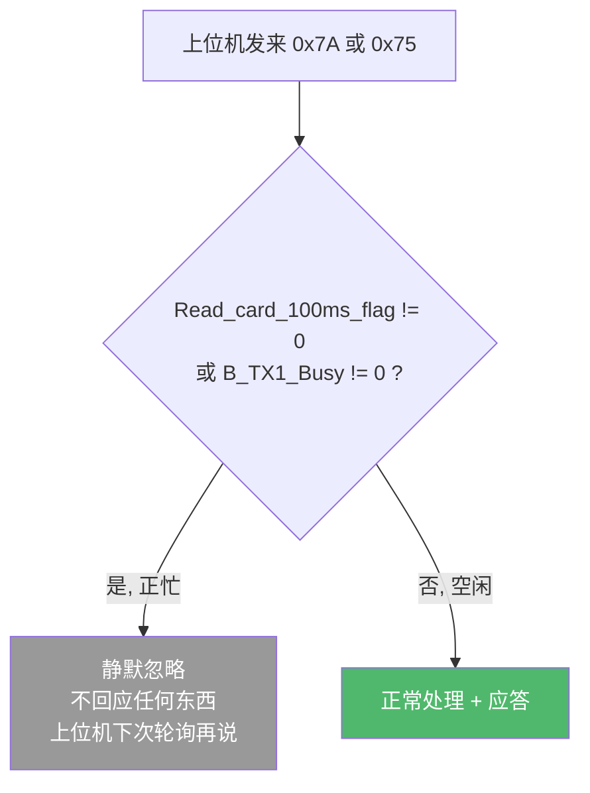

**为什么这样设计？** 卡号上报是最高优先级。如果正在发卡号时被打断去响应轮询，上位机可能收到半个包，解析出错。宁可这次不答，等上位机下次再问。

---

## 六、一个完整场景：衣架进站全过程

把所有概念串起来，看一个衣架从进入感应区到上位机做出决定的完整流程：

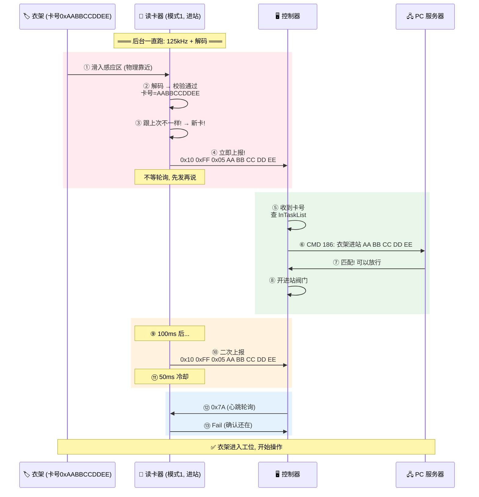

**理解这个流程的关键：** 第④步是读卡器**自己**发的，不是控制器⑫步问出来的。控制器的轮询在第⑫步才来——那时候衣架早就决定放行了。

---

## 七、数据包格式速查

所有 UART 通信都是 19200-8-N-1。

### 卡号包

```
模式 1:
┌──────┬──────┬──────┬──────────────────────────┐
│ 0x10 │ 0xFF │ 0x05 │ 5 字节卡号 (大端)          │
│ 帧头  │ 帧头  │ 长度  │ Card[3] Card[4]...Card[7]│
└──────┴──────┴──────┴──────────────────────────┘
  8 字节，无 BCC

模式 2 / 模式 3:
┌──────┬──────┬──────┬──────────────────────────┬─────┐
│ 0x10 │ 0xFF │ 0x05 │ 5 字节卡号 (大端)          │ BCC │
│ 帧头  │ 帧头  │ 长度  │ Card[3] Card[4]...Card[7]│ XOR │
└──────┴──────┴──────┴──────────────────────────┴─────┘
  9 字节，BCC = 所有前 8 字节 XOR
```

### Fail 包

```
模式 1:
┌──────┬──────┬──────┬───┬───┬───┬───┐
│ 0x10 │ 0xFF │ 0x04 │ F │ a │ i │ l │
└──────┴──────┴──────┴───┴───┴───┴───┘
  7 字节，无 BCC

模式 2 / 模式 3:
┌──────┬──────┬──────┬───┬───┬───┬───┬─────┐
│ 0x10 │ 0xFF │ 0x04 │ F │ a │ i │ l │ BCC │
└──────┴──────┴──────┴───┴───┴───┴───┴─────┘
  8 字节，BCC = 前 7 字节 XOR
```

---

## 八、LED 行为速查

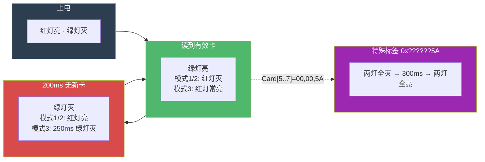

---

## 九、与第一代的兼容性

第一代只有模式 1 的功能（没有模式 2/3、没有 BCC、没有 Bootloader）。但只要上位机只用 0x7A 和 0x75 轮询，第一代和第二代可以**互换**：


**19 项行为在两端表现完全一致。** 上位机的控制逻辑不需要为不同代读卡器写分支。

---

## 十、控制器怎么用读卡器

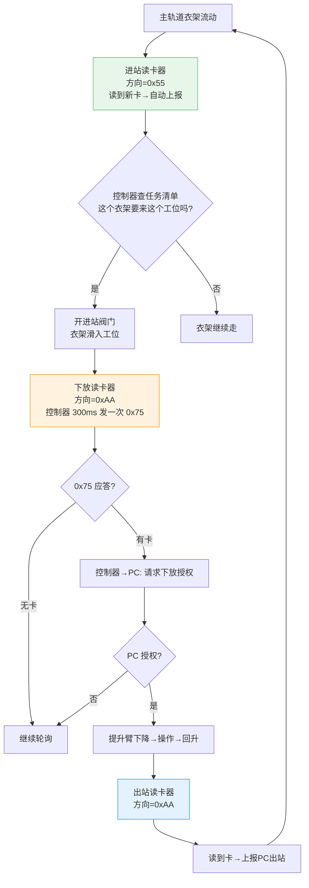

**每个工位有 2~3 个读卡器：** 进站、下放、出站（可选）。硬件完全相同，靠位置区分角色。

---

## 十一、重构你需要做什么

### Application（读卡器主固件）

```
必须做的（向下兼容）：
☐ 125kHz 载波 + 曼彻斯特解码 → 64位 → 5字节卡号
☐ 卡号变化立即上报（不等轮询）
☐ 进站(0x55): 100ms 二次上报 + 50ms 冷却
☐ 下放(0xAA): 仅一次上报
☐ 0x7A → Fail 7字节
☐ 0x75 → 有卡报卡号/无卡 Fail
☐ 同卡去重

二代新增（也要做）：
☐ 0x9A/0x95 → 模式2 + BCC
☐ 0x9D → 模式3 连续上报
☐ 0x90 → 版本查询
☐ 0xA0 0x05 → 系统复位
☐ LED: 模式闪烁 + 红绿互斥 + 黑卡时序
☐ 看门狗
☐ RemoteUpdateInit (上电检测升级结果)
```

### Bootloader

```
☐ 上电 → CMD 0x04 通知
☐ UpdateFlg==0xFF → 跳转 App
☐ 0x55 帧协议: 0x81(启动) / 0x82(数据) / 0x83(查结果)
☐ CRC16-USB + XOR 解密
☐ Flash 擦写 + 栈校验 + 超时 + 重试
```

---

## 十二、测试清单（快速核对）

```
读卡基础:
☐ 有卡绿灯亮, 无卡绿灯灭
☐ 同卡不重复报
☐ 换卡立即报新卡号
☐ 非法卡不上报

进站 (0x55):
☐ 新卡→立即报→100ms后再报→50ms冷却
☐ 冷却期忽略指令
☐ 0x7A 轮询→应答 Fail

下放 (0xAA):
☐ 新卡→立即报 (仅一次)
☐ 0x75 轮询→有卡报卡号/无卡 Fail

模式 3:
☐ 有卡每 100ms 报, 无卡每 500ms 报
☐ 数据含 BCC
☐ 红灯常亮

上位机命令:
☐ 0x90 → Ver0310
☐ 0xA0 0x05 → 复位
☐ 忙时忽略指令

联调:
☐ 进站匹配→开阀→衣架进工位
☐ 下放授权→提升臂操作
☐ 出站确认→上报PC
```
