## 待办列表
- [ ] 编码
- [ ] 测试
- [ ] 合并

---

# SR3 读卡器 · 完整功能需求文档

> 以 **读卡器为主视角**，回答三个问题：我能做什么？谁会跟我说话、说什么？我说出去之后会发生什么？
> 整合自 HC32F002 读卡器固件 + S2 控制器 + S3 控制器 三个工程。

---

## 一、我是谁

我是 **125kHz RFID 读卡器**，装在服装吊挂输送线上。我的工作就是：**一直等着衣架过来 → 读出衣架上的 RFID 标签 → 把卡号告诉上位机（控制器）**。


**我的硬件不变，核心就是三件事：**
- 产生 125kHz 载波（通过 EM4095 芯片）
- 解码 EM4100/EM4102 标签
- 通过 UART 串口（19200-8-N-1）和上位机说话

---

## 二、我能识别什么标签、怎么识别

### 2.1 标签规格

| 项目 | 规格 |
|------|------|
| 频率 | 125kHz |
| 标签协议 | EM4100 / EM4102 (EM4001 族) |
| 编码方式 | 曼彻斯特编码 (Manchester) |
| 原始数据结构 | 64 位 |

### 2.2 64 位数据的结构


### 2.3 我的解码 = 五道关卡

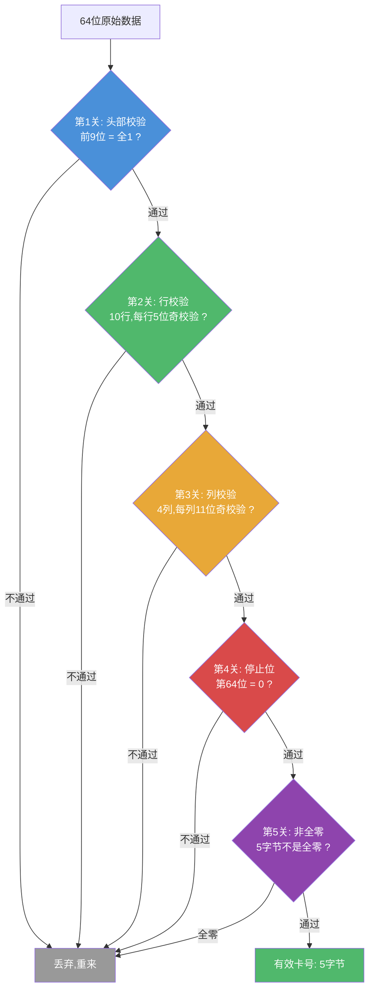

### 2.4 我是怎么从信号里读出比特的

```
我盯着 DEMOD_OUT 引脚的电平跳变，测量两次跳变的间隔（脉宽）：

  窄脉冲: 约 160 ~ 328 us  ->  记作类型1
  宽脉冲: 约 328 ~ 656 us  ->  记作类型2
  超出范围 ->  不认识了，从头再来

根据曼彻斯特规则从脉冲序列还原出 64 个比特。
```

---

## 三、我的三种工作模式

上位机发不同的命令，我就切到不同的模式：

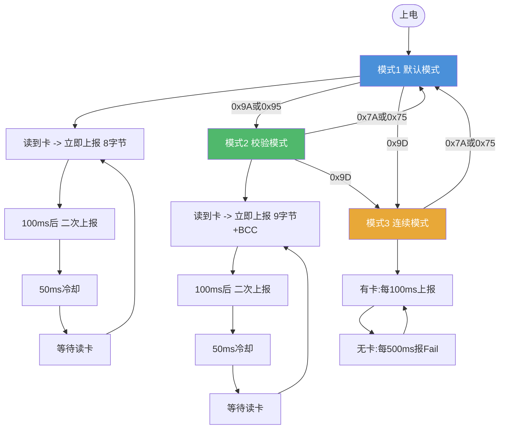

| 模式 | 触发指令 | 上报格式 | 上报节奏 | 特点 |
|------|---------|---------|---------|------|
| 模式1 默认 | `0x7A`(进站) / `0x75`(下放) | 8字节 | 立即+100ms重复+50ms冷却 | 防丢包 |
| 模式2 校验 | `0x9A`(进站校验) / `0x95`(下放校验) | 9字节(末尾+1字节BCC) | 同模式1 | XOR校验 |
| 模式3 连续 | `0x9D` | 8字节 | 有卡每100ms / 无卡每500ms报Fail | 不等待轮询,红灯常亮 |

> **模式说明：** 模式1/2 为轮询应答模式（上位机问我才答），模式3 为主动上报模式（我不等上位机问就自己报）。方向标识（进站=0x55, 下放=0xAA）仅为内部状态，不影响协议帧格式。BCC = 对数据字节依次做 XOR。

---

## 四、我和上位机的对话协议（UART）

### 4.1 物理层

**19200 bps, 8 数据位, 1 停止位, 无校验, 无流控。**

上位机发 3 个字节问我，我回 7~10 个字节答它。

```mermaid
flowchart LR
    subgraph Ask[上位机问我 3字节]
        A1[0x10 0xFF 0x7A 进站]
        A2[0x10 0xFF 0x75 下放]
        A3[0x10 0xFF 0x9A 进站+校验]
        A4[0x10 0xFF 0x95 下放+校验]
        A5[0x10 0xFF 0x9D 连续发送]
        A6[0x10 0xFF 0x90 查询版本]
        A7[0x10 0xA0 0x05 系统复位]
    end

    subgraph Answer[我回答]
        B1[有卡-模式1/3: 0x10 0xFF 0x05 +5字节卡号 =8字节]
        B2[有卡-模式2: 0x10 0xFF 0x05 +5字节卡号+BCC =9字节]
        B3[无卡-模式1/3: 0x10 0xFF 0x04 Fail =7字节]
        B4[无卡-模式2: 0x10 0xFF 0x04 Fail+BCC =8字节]
        B5[版本: 0x10 0xFF 0x01 Ver0310 =10字节]
    end

    Ask --> Answer

    style Ask fill:#e3f2fd,stroke:#4A90D9
    style Answer fill:#e8f5e9,stroke:#50B86C
```

### 4.2 命令速查

| 上位机发 | 我做什么 | 我切到什么模式 |
|----------|---------|--------------|
| `0x10 0xFF 0x7A` | 进站方向读卡 | -> 模式1，方向=进站 |
| `0x10 0xFF 0x75` | 下放方向读卡 | -> 模式1，方向=下放 |
| `0x10 0xFF 0x9A` | 进站方向读卡+校验 | -> 模式2，方向=进站 |
| `0x10 0xFF 0x95` | 下放方向读卡+校验 | -> 模式2，方向=下放 |
| `0x10 0xFF 0x9D` | 连续发送 | -> 模式3 |
| `0x10 0xFF 0x90` | 告诉我版本号 | 不变 |
| `0x10 0xA0 0x05` | 软件复位 | 重启 |

### 4.3 什么时候我不理上位机

- 我正在发送数据中（TX busy）
- 我刚刚上报了卡号，还在 100ms 等待期内（准备二次上报）

---

## 五、我的 LED 行为

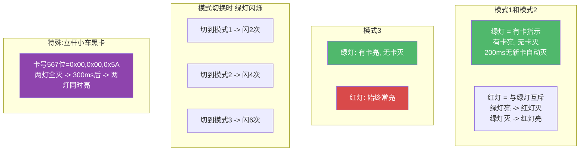

**闪烁速度：** 每 ~200ms 翻转一次（一亮一灭算半个周期）

---

## 六、我的系统定时

我内部有一个 **50ms 周期**的节拍，所有定时都是它的倍数：

| 倍数 | 时长 | 用在哪 |
|------|------|--------|
| x1 | 50ms | EM4095 初始化稳定 |
| x2 | 100ms | 卡号二次上报 / 连续模式有卡间隔 |
| x4 | 200ms | 读卡LED自动灭 / 模式切换闪烁半周期 |
| x6 | 300ms | 立杆小车LED延迟 |
| x10 | 500ms | 连续模式无卡上报间隔 |
| x2+ | ~106ms | 看门狗超时 |

---

## 七、我能远程升级

控制器可以通过 UART 给我升级固件，用的是另一套帧格式（不是平时的 `0x10 0xFF` 协议）：

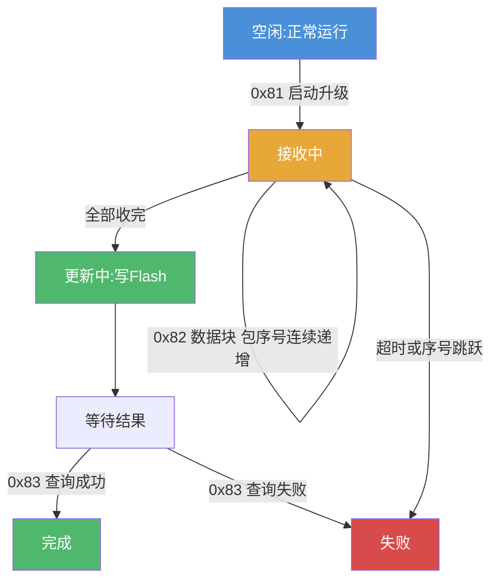

**升级帧格式：**

```
0x55 | CMD | Len(2B) | PackNo(2B) | Data(<=256B) | CRC16(2B) | 0xAA
帧头    命令    长度       包序号         数据          校验       帧尾
```

**安全措施：**
- CRC16-USB 校验（多项式 0x8005）
- 固件用密钥 `"603337"` 加密
- 每包最多重发 5 次
- 上电时自动检查上次升级结果并上报

---

## 八、我出错时会怎么处理

| 我遇到什么 | 我怎么处理 |
|-----------|-----------|
| 感应范围内没有卡 | 回答 Fail |
| 标签头部校验不过 | 丢弃，重读 |
| 标签行/列校验不过 | 丢弃，重读 |
| 标签停止位不对 | 丢弃，重读 |
| 读出来的卡号全零 | 不上报，LED灭 |
| 脉宽超出范围 | 复位解码器，重来 |
| 升级帧头不对 | 解析错误码 1 |
| 升级CMD无效 | 解析错误码 2 |
| 升级帧尾不对 | 解析错误码 3 |
| 升级数据太长 | 解析错误码 4 |
| 升级CRC16不匹配 | 解析错误码 5 |
| 升级包序号不连续 | 忽略这一包 |
| 上位机在我TX忙时问我 | 不吭声 |
| 看门狗超时 | 硬件复位 |

---

## 九、我在系统里的位置

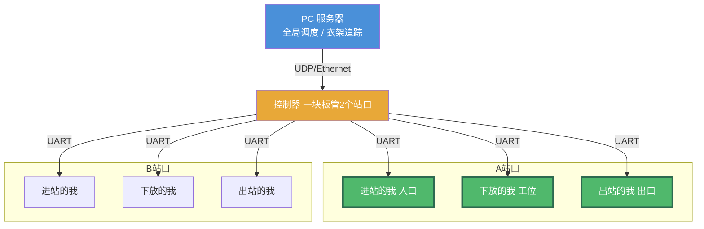

**有一个关键事实：我们六个读卡器硬件完全一样，唯一的区别是装在哪。**

---

## 十、上位机怎么跟我说话

### 10.1 控制器的轮询节奏

控制器每 **300ms** 向我发一次轮询命令。我根据有没有卡来回答。

如果控制器连续 **300ms** 没收到我回话 -> 它认定丢包。
如果连续 **1000ms+** 没收到 -> 它判定我掉线了。
我恢复应答后 -> 它判定我恢复了。

### 10.2 控制器按我的安装位置发不同命令

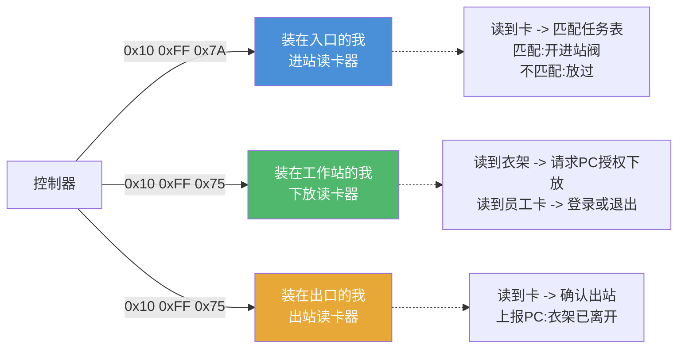

---

## 十一、我说出卡号之后会发生什么

这是整个系统最核心的故事线——我读出衣架卡号，然后呢？

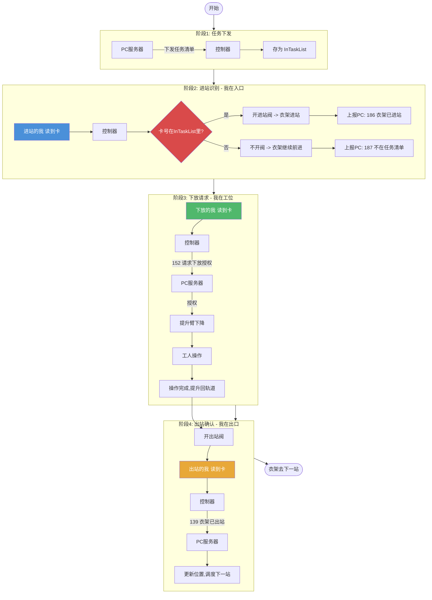

---

## 十二、不同站台模式下我的表现

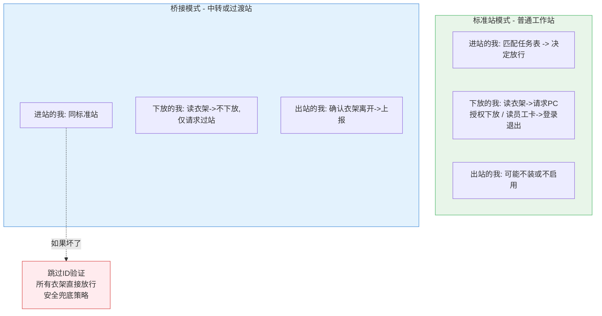

---

## 十三、我的状态管理（控制器视角）

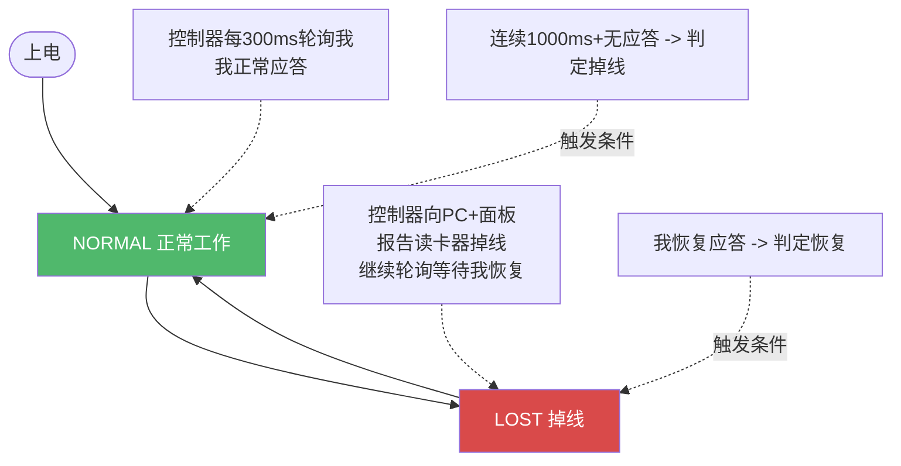

**每个我都有3个配置项（存在Flash里，可动态修改）：**

| 配置项 | 说明 |
|--------|------|
| 绑定端口 | 我接在哪个UART上 |
| 是否监控 | 控制器要不要盯我的在线状态 |
| 掉线阈值 | 多久不答算掉线（1000ms+） |

---

## 十四、我跟老系统(S2)和新系统(S3)打交道时有什么不同

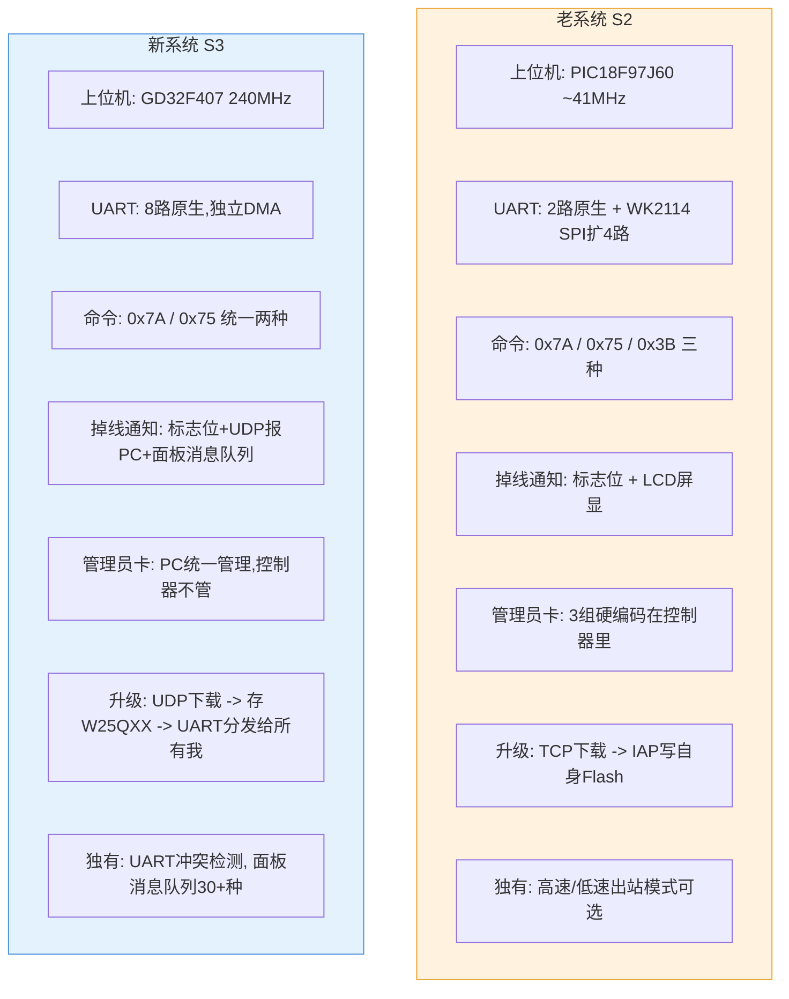

---

## 十五、重构时需要实现什么

### A. 我的核心能力 (Reader 端)

| # | 必须实现 |
|---|---------|
| 1 | 125kHz 载波产生 + EM4100/EM4102 曼彻斯特解码 |
| 2 | 五道校验(头/行/列/停止位/全零) |
| 3 | 3字节轮询协议: `0x10 0xFF 0xXX` -> 应答卡号或Fail |
| 4 | 7条指令: 0x7A/0x75/0x9A/0x95/0x9D/0x90/复位 |
| 5 | 3种模式: 默认/校验/连续，模式切时绿灯闪对应次数 |
| 6 | 双次上报(100ms重复防丢) + TX忙时不响应 |
| 7 | 绿灯(有卡) + 红灯(状态/连续) 全行为 |
| 8 | 50ms 系统节拍基准 |
| 9 | 看门狗 (~106ms) |
| 10 | 远程升级 (0x55帧, CRC16-USB, 密钥"603337") |

### B. 上位机要对我做的事 (Controller 端)

| # | 必须实现 |
|---|---------|
| 1 | 每300ms 向每个我发轮询 |
| 2 | 解析我的应答: 7/8/9字节，提取4字节卡号(大端) |
| 3 | 进站的我: 卡号匹配InTaskList -> 开阀 / 不匹配 -> 放过 |
| 4 | 下放的我: 卡号 -> 请求PC授权 -> 授权后下放机构 |
| 5 | 出站的我: 卡号 -> 确认出站 -> 上报PC |
| 6 | 下放的我兼读员工卡: -> 登录/退出/求助 |
| 7 | 我掉线(1000ms+无应答) -> 上报PC故障 |
| 8 | 我接哪个UART可配置，存在Flash里 |
| 9 | 给我升级: 上位机收固件 -> 通过UART -> 分发给所有我 |

---

## 十六、测试验收清单

### 我的基本功
- [ ] 有卡靠近 -> 绿灯亮，无卡 -> 绿灯灭
- [ ] 卡号上报格式: `0x10 0xFF 0x05` + 4字节卡号(大端)
- [ ] 同一张卡不重复上报（模式3除外）
- [ ] 换卡 -> 立即上报新卡号
- [ ] 非法卡（校验失败/全零）-> 不上报

### 协议交互
- [ ] 0x7A / 0x75 问我 -> 正常答
- [ ] 0x9A / 0x95 问我 -> 答带BCC(末尾=XOR)
- [ ] 0x9D -> 连续模式，红灯常亮
- [ ] 0x90 -> 返回 Ver0310
- [ ] 没卡 -> 答 Fail
- [ ] 我TX忙时不理你
- [ ] 100ms内读到同一张卡 -> 第二次上报

### 模式切换
- [ ] 切模式1 -> 绿灯闪2次
- [ ] 切模式2 -> 绿灯闪4次，数据带BCC
- [ ] 切模式3 -> 绿灯闪6次，红灯常亮

### 掉线恢复
- [ ] 拔掉我的串口 -> 上位机判定我掉线 -> 报PC
- [ ] 插回去 -> 上位机判定我恢复 -> 清故障

### 给我升级
- [ ] 0x81 启动 -> 进入升级态
- [ ] 0x82 顺序发包 -> 正常收
- [ ] 0x82 序号跳跃 -> 忽略
- [ ] 0x83 查询 -> 返回成功/失败
- [ ] CRC16正确
- [ ] 上电自动上报上次升级结果

### 系统联调
- [ ] 进站的我 -> 匹配任务表 -> 开阀放行
- [ ] 进站的我 -> 不匹配 -> 衣架放走
- [ ] 下放的我 -> 读衣架 -> 请求PC -> 授权后下放
- [ ] 下放的我 -> 读员工卡 -> 登录/退出
- [ ] 出站的我 -> 确认出站 -> 上报PC
- [ ] 桥接模式 + 进站的我坏了 -> 直接放行

### 鲁棒性
- [ ] 看门狗超时 -> 我复位
- [ ] 格式错误的轮询 -> 我不崩，继续干活
- [ ] 干扰/非法卡片 -> 我正确拒绝
- [ ] 连续快速刷卡 -> 不丢不重
- [ ] 多个我同时工作 -> 互不干扰
