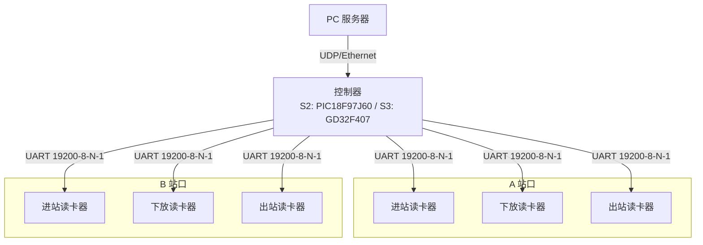
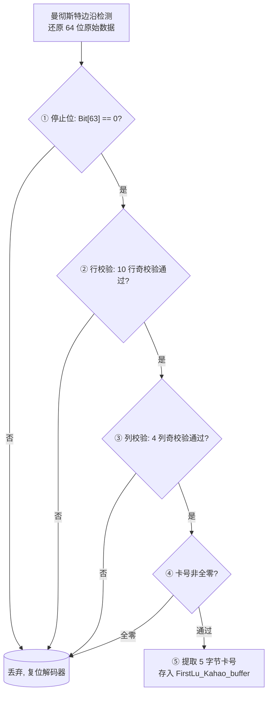
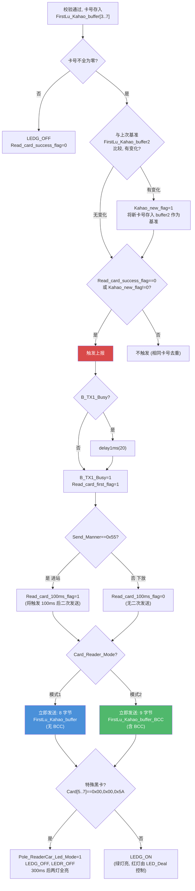
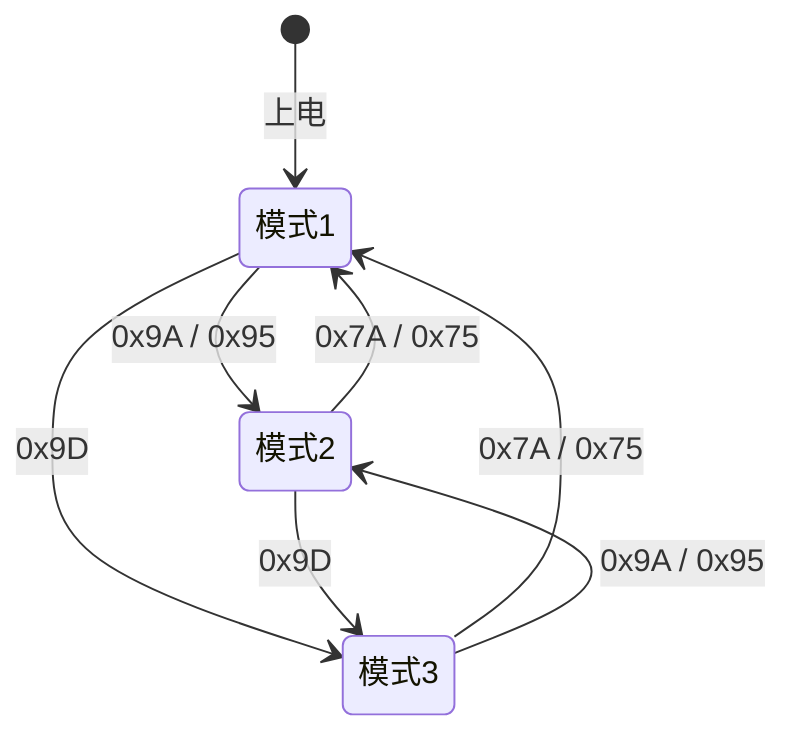
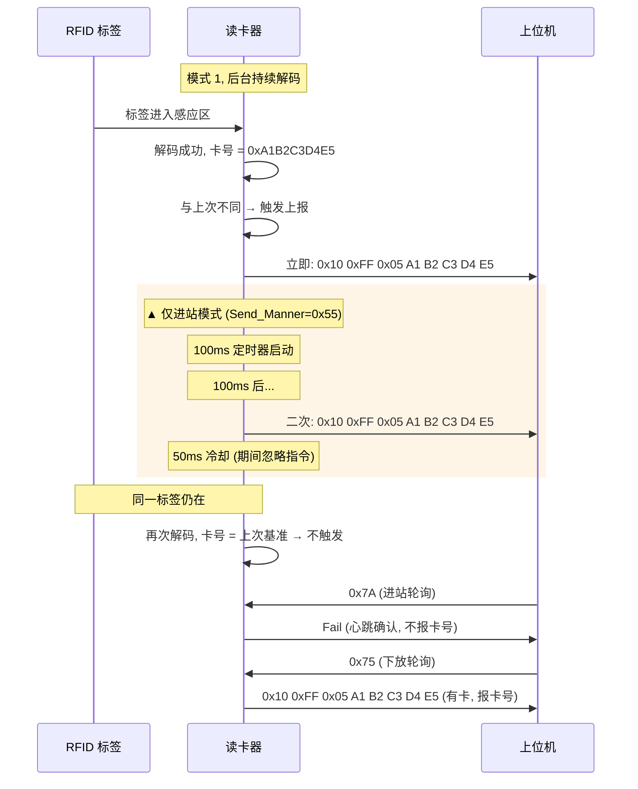
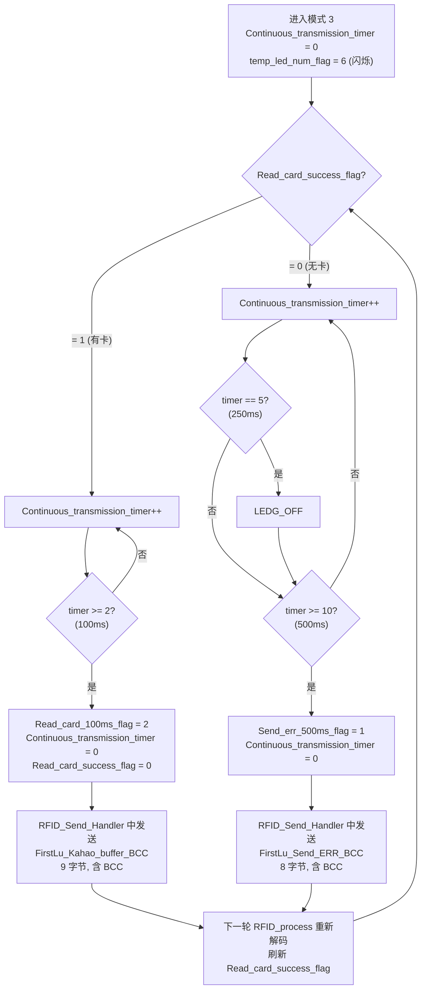
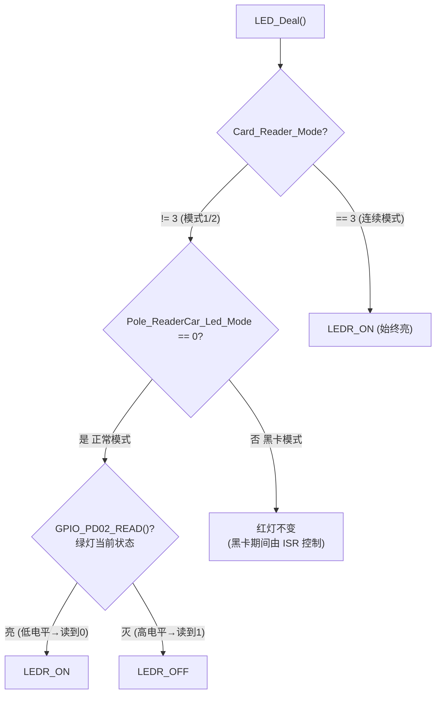
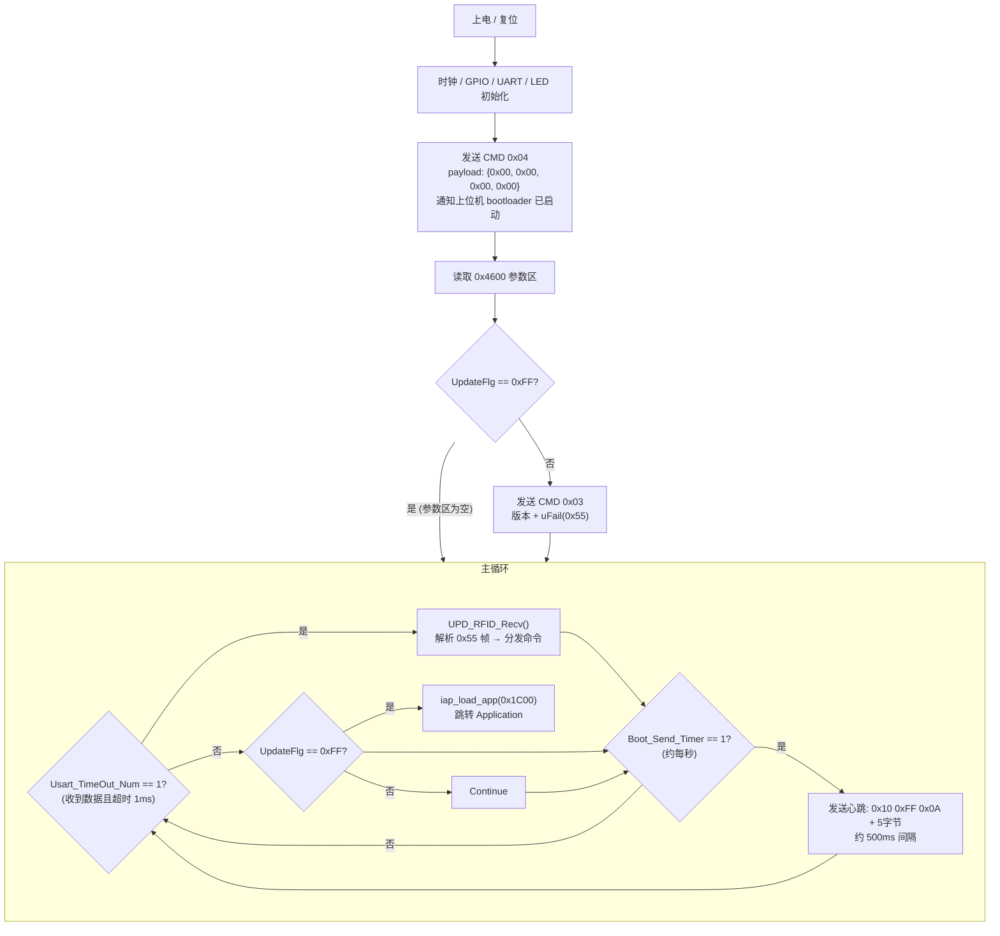
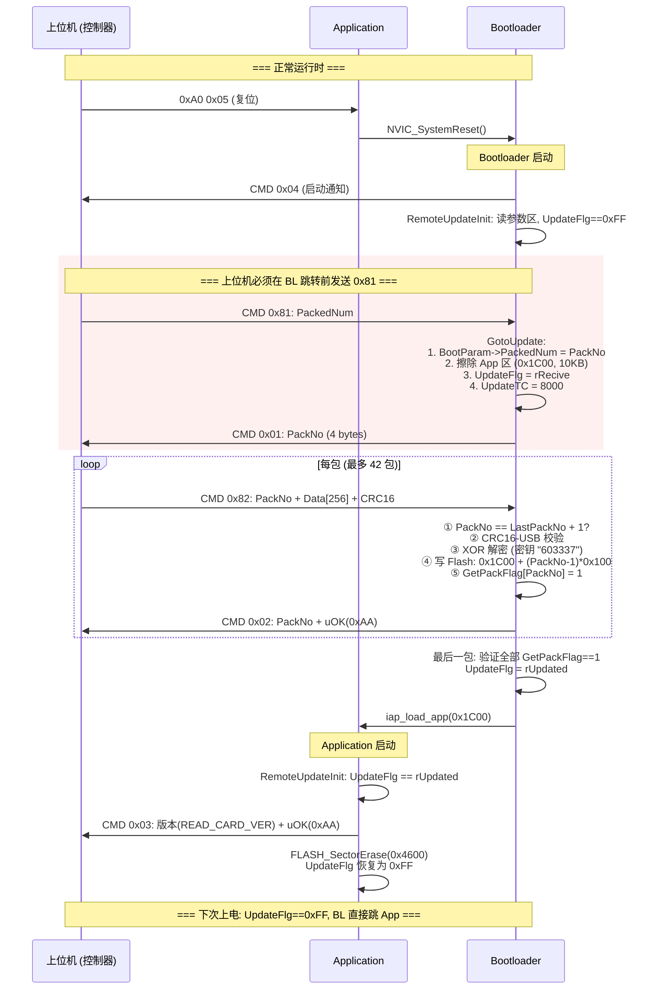
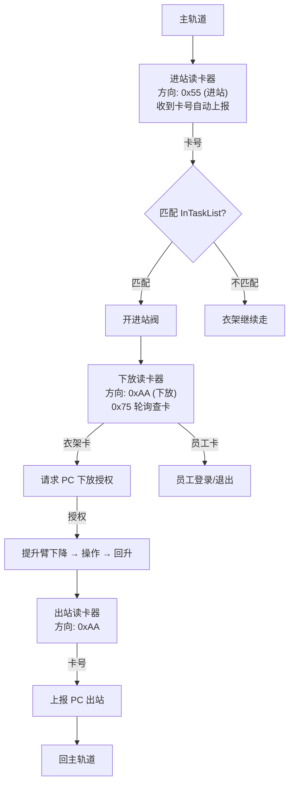

## 待办列表
- [ ] 编码
- [ ] 测试
- [ ] 合并

---

# SR3 读卡器软件功能需求文档

> 整合 HC32F002 读卡器固件 + Bootloader + S2/S3 控制器。
> 所有行为均从源码逐行验证，用于新框架下重构参考。

---

## 一、系统总览

### 1.1 读卡器的角色

读卡器是服装吊挂输送线中的组件：读出经过感应区的衣架 RFID 标签卡号，通过 UART 报给控制器。控制器操作阀门和提升臂完成衣架的进站、操作、出站。

一块控制器管理 A、B 两个站口，每站 3 个读卡器（进站/下放/出站），共 6 个。6 个读卡器硬件完全相同，仅靠 UART 端口绑定区分角色。



### 1.2 Flash 布局

32KB Flash 存放两份独立固件：

```
0x0000 ─────────────────── Bootloader (约 6KB)
0x1C00 ─────────────────── Application (最大 10KB)  ← APP_START_ADDR
0x4600 ─────────────────── Upgrade Param (512B)     ← UPD_PARAM_FLASH_ADDR
0x4800 ─────────────────── Flash End
```

- **Bootloader**：上电先运行。`UpdateFlg == 0xFF` 则跳转 Application，否则驻留等待升级。
- **Application**：RFID 解码 + 串口协议 + LED 控制。含 RemoteUpdate 模块。
- **Upgrade Param**：`BOOT_PARAM_STRU` 结构体（总包数、升级标志、结果）。Bootloader 和 Application 共享。

---

## 二、RFID 读卡（所有模式的基础）

读卡器上电后**持续**运行解码流程，不随模式切换而停止。

### 2.1 标签规格

| 项目 | 值 |
|------|-----|
| 频率 | 125kHz |
| 协议 | EM4100 / EM4102（EM4001 族） |
| 编码 | 曼彻斯特（Manchester） |
| 原始帧长 | 64 位 |
| 脉宽 | 窄 160~328us / 宽 328~656us，超出则复位 |

### 2.2 64 位数据结构

```
Bit[0..8]:   9 位头部，全部为 1
Bit[9..58]:  50 位数据区（10 行 × 5 位，每行含 1 位行奇校验）
Bit[59..62]: 4 位列奇校验
Bit[63]:     停止位，必须为 0
```

### 2.3 五道校验



**注意：** 停止位校验是第一步（line 91: `if(decode_data[63] != 0)`），头部校验隐含在脉宽解码中（前 9 位为 1 时 N1_01_SYS 机制确保格式正确）。

### 2.4 卡号提取

从 40 位有效数据中提取 5 字节：

```
CardData[3] = Bit[9..17]  (9 bits → 1 byte, 大端)
CardData[4] = Bit[19..27]
CardData[5] = Bit[29..37]
CardData[6] = Bit[39..47]
CardData[7] = Bit[49..57]
```

### 2.5 关键变量

| 变量 | 作用 |
|------|------|
| `FirstLu_Kahao_buffer[8]` | 当前解码的卡号（[0..2]=0x10,0xFF,0x05, [3..7]=卡号） |
| `FirstLu_Kahao_buffer2[8]` | 上次上报的基准卡号（用于去重比较） |
| `FirstLu_Kahao_buffer_BCC[9]` | 当前卡号 + BCC（格式同 buffer + 末尾 BCC 字节） |
| `Read_card_success_flag` | 0=无卡, 1=有卡在感应范围内 |
| `Kahao_new_flag` | 1=解码到与上次不同的新卡号 |
| `Read_card_first_flag` | 1=触发首次立即发送 |
| `Read_card_100ms_flag` | 0=空闲, 1=等待 100ms, 2=触发二次发送, 3=等待 50ms 冷却 |
| `Send_card_500ms_flag` | 1=指令触发的卡号回复（仅 0x75/0x95） |
| `Send_err_500ms_flag` | 1=指令触发的 Fail 回复（0x7A/0x9A/无卡时的 0x75/0x95） |
| `B_TX1_Busy` | 1=串口发送忙 |
| `Send_Manner` | 0x55=进站, 0xAA=下放 |

### 2.6 卡号变化检测与立即上报（核心逻辑）

`RFID_process()` 在主循环中每轮都执行。当 `Data_check_flag==1`（校验通过）时：



**关键行为：**
- 卡号切换时**不等上位机轮询，立即发送**。
- 立即发送通过 `Read_card_first_flag=1` 触发，`Send_KaHao_LpUart1` 检测到此标志 + 非模式3 → 调用 `LPUART_Transmit`。
- `B_TX1_Busy` 保护：如果串口正忙，等待 20ms 后强制发送。

---

## 三、上位机 7 条命令（逐条分析）

所有命令通过 UART `0x10 0xFF` 帧协议到达，由 `LpUart1_IRQHandler` 接收 3 字节后设 `Rev_Com_Flag=TRUE`，主循环中 `Read_Mode_Change()` 处理。

### 3.0 通信参数

| 参数 | 值 |
|------|-----|
| 波特率 | 19200 |
| 数据位 | 8 |
| 停止位 | 1 |
| 校验位 | 无 |

### 3.1 0x7A —— 进站（Entry）

```
上位机 → 读卡器: 0x10 0xFF 0x7A
```

**切换行为：**
- `Card_Reader_Mode` 非 1 时 → 设为 1，`temp_led_num_flag=2`（触发模式切换闪烁）
- `Send_Manner` 非 0x55 时 → 设为 0x55

**应答行为：**
- 若 `Read_card_100ms_flag != 0` 或 `B_TX1_Busy != 0`（正在处理卡号上报或串口忙）→ **静默忽略，不应答**
- 否则 → 发送 `FirstLu_Send_ERR`（7 字节 Fail 包，无 BCC）

**设计意图：** 0x7A 只做两件事——①切换到进站模式、②用 Fail 包作心跳确认。**它不查询卡号**，因为卡号已经在检测到新卡时自动上报了。

### 3.2 0x75 —— 下放（Release）

```
上位机 → 读卡器: 0x10 0xFF 0x75
```

**切换行为：**
- `Card_Reader_Mode` 非 1 时 → 设为 1，`temp_led_num_flag=2`
- `Send_Manner` 非 0xAA 时 → 设为 0xAA

**应答行为：**
- 若 `Read_card_100ms_flag != 0` 或 `B_TX1_Busy != 0` → **静默忽略**
- 否则：
  - 若 `Read_card_success_flag != 0`（有卡）→ 发送 `FirstLu_Kahao_buffer`（8 字节卡号包，无 BCC），设置 `Send_card_500ms_flag`
  - 若 `Read_card_success_flag == 0`（无卡）→ 发送 `FirstLu_Send_ERR`（7 字节 Fail 包），设置 `Send_err_500ms_flag`

**设计意图：** 0x75 作心跳确认 + 可选的卡号查询。进站读卡器（0x7A）不需要额外查询——衣架通过时已经自动上报了；下放读卡器（0x75）有时需要主动查询"当前工位有没有衣架"。

### 3.3 0x9A —— 进站 + BCC 校验

```
上位机 → 读卡器: 0x10 0xFF 0x9A
```

**切换行为：**
- `Card_Reader_Mode` 非 2 时 → 设为 2，`temp_led_num_flag=4`
- `Send_Manner` 设为 0x55

**应答行为：** 同 0x7A，但发送的 Fail 包为 `FirstLu_Send_ERR_BCC`（8 字节，含 BCC）。

### 3.4 0x95 —— 下放 + BCC 校验

```
上位机 → 读卡器: 0x10 0xFF 0x95
```

**切换行为：**
- `Card_Reader_Mode` 非 2 时 → 设为 2，`temp_led_num_flag=4`
- `Send_Manner` 设为 0xAA

**应答行为：** 同 0x75，但有卡时发送 `FirstLu_Kahao_buffer_BCC`（9 字节，含 BCC），无卡时发送 `FirstLu_Send_ERR_BCC`（8 字节，含 BCC）。

### 3.5 0x9D —— 连续发送模式

```
上位机 → 读卡器: 0x10 0xFF 0x9D
```

**切换行为：**
- `Card_Reader_Mode` 非 3 时 → `Continuous_transmission_timer = 0`，设为 3，`temp_led_num_flag=6`
- 已在模式 3 时再次收到 0x9D → `Continuous_transmission_timer = 0`（重置定时器，等效重入）

**应答行为：** 不做立即应答。进入模式 3 后由定时器驱动自主上报（详见第四章）。

### 3.6 0x90 —— 查询固件版本

```
上位机 → 读卡器: 0x10 0xFF 0x90
读卡器 → 上位机: 0x10 0xFF 0x01 0x56 0x65 0x72 0x30 0x33 0x31 0x30
                         帧头    长度  V    e    r    0    3    1    0
```

不切换模式，不检查 Busy 状态，即时响应。共 10 字节。

### 3.7 0xA0 0x05 —— 系统复位

```
上位机 → 读卡器: 0x10 0xA0 0x05
```

直接调用 `NVIC_SystemReset()`，无应答。不经过 `Read_Mode_Change` 的正常帧头匹配逻辑——在函数末尾单独判断 `RX1_Buffer[1]==0xA0 && RX1_Buffer[2]==0x05`。

### 3.8 命令速查总表

| 命令 | 目标模式 | 方向 | 不忙时应答 | 应答长度 | 含 BCC |
|------|---------|------|-----------|---------|--------|
| 0x7A | 模式 1 | 进站 0x55 | 始终 Fail | 7 | 无 |
| 0x75 | 模式 1 | 下放 0xAA | 有卡报卡号 / 无卡报 Fail | 7 或 8 | 无 |
| 0x9A | 模式 2 | 进站 0x55 | 始终 Fail | 8 | 有 |
| 0x95 | 模式 2 | 下放 0xAA | 有卡报卡号 / 无卡报 Fail | 8 或 9 | 有 |
| 0x9D | 模式 3 | 不变 | 不应答，进入自主上报 | — | — |
| 0x90 | 不变 | 不变 | 版本号 | 10 | 无 |
| 0xA0 0x05 | 不变 | 不变 | 无（直接复位） | — | — |

### 3.9 BCC 算法

```pseudocode
BCC = 0
for byte in [0x10, 0xFF, 0x05, CardData[3], CardData[4], CardData[5], CardData[6], CardData[7]]:
    BCC ^= byte
```

即从帧头到卡号末尾所有字节的 XOR。Fail 包同理（对 `0x10, 0xFF, 0x04, 'F', 'a', 'i', 'l'` 做 XOR）。

---

## 四、三种工作模式

上电默认：模式 1，`Send_Manner=0x55`（进站方向）。



---

### 4.1 模式 1 —— 默认模式

#### 4.1.1 上报机制：事件驱动 + 进站有 100ms 二次确认

**核心逻辑：卡号变化时立即发送，不等轮询。**



#### 4.1.2 进站 vs 下放的关键差异

| 行为 | 进站 (0x55) | 下放 (0xAA) |
|------|-----------|-----------|
| 卡号变化时立即上报 | ✅ | ✅ |
| 100ms 后二次上报 | ✅ `Read_card_100ms_flag=1` | ❌ 不设该标志，无二次上报 |
| 50ms 冷却 | ✅ | ❌（没有 100ms 标志就没有冷却期） |
| 轮询命令应答 (0x7A) | 始终 Fail | — |
| 轮询命令应答 (0x75) | — | 有卡报卡号 / 无卡报 Fail |
| 指令冲突保护 | `Read_card_100ms_flag!=0 \|\| B_TX1_Busy` | `B_TX1_Busy` |

#### 4.1.3 数据格式

**自动上报（卡号变化时立即发送）：**
```
[0] 0x10 | [1] 0xFF | [2] 0x05 | [3..7] 5 字节卡号
```
共 8 字节，无 BCC。使用 `FirstLu_Kahao_buffer`。

**二次上报（进站模式 100ms 后）：**
```
[0] 0x10 | [1] 0xFF | [2] 0x05 | [3..7] 5 字节卡号
```
共 8 字节，无 BCC。使用 `FirstLu_Kahao_buffer2`（内容与首次相同，但发送缓冲区不同）。

**轮询 Fail 应答（0x7A 触发）：**
```
[0] 0x10 | [1] 0xFF | [2] 0x04 | 0x46 0x61 0x69 0x6C  (= "Fail")
```
共 7 字节。使用 `FirstLu_Send_ERR`。

**轮询卡号应答（0x75 触发，有卡时）：**
```
[0] 0x10 | [1] 0xFF | [2] 0x05 | [3..7] 5 字节卡号
```
共 8 字节。使用 `FirstLu_Kahao_buffer`。

#### 4.1.4 去重逻辑

同一张卡持续在感应范围内，`RFID_process` 每次解码后比较 `FirstLu_Kahao_buffer[4..7]` 与 `FirstLu_Kahao_buffer2[4..7]`：
- 相同 → `Kahao_new_flag` 保持 0，且 `Read_card_success_flag` 已为 1 → 条件 `(Read_card_success_flag==0 || Kahao_new_flag!=0)` 为 false → **不触发上报**。
- `Read_card_success_flag` 维持为 1 最多 200ms（4 个节拍），超过后自动清零。清零后下一轮解码即使卡号相同也会重新触发上报——这是"重新出现"而非"去重失败"。

#### 4.1.5 TX 忙保护

`B_TX1_Busy` 在发送开始前置 1，`Send_KaHao_LpUart1` 中对应标志处理后置 0。若新卡检测时 `B_TX1_Busy==1`，delay 20ms 后强制执行。

`Read_card_100ms_flag` 非零时（等待 100ms 二次发送 或 50ms 冷却中），0x7A/0x75 命令不响应。

---

### 4.2 模式 2 —— 校验模式

#### 4.2.1 与模式 1 的差异

**仅两个差异：**

1. **所有发送的数据末尾追加 1 字节 BCC**（卡号包 9 字节，Fail 包 8 字节）
2. **LED 切换闪烁次数不同**（`temp_led_num_flag=4` vs 模式 1 的 2）

其余行为完全一致：卡号变化立即上报、进站有二次上报、下放无二次上报、去重逻辑、TX 保护、冷却期——全部相同。

#### 4.2.2 数据格式

**自动上报（卡号变化时）：**
```
[0] 0x10 | [1] 0xFF | [2] 0x05 | [3..7] 5 字节卡号 | [8] BCC
```
共 9 字节，使用 `FirstLu_Kahao_buffer_BCC`。BCC 在 `RFID_process` 中卡号变化时一并计算好（line 453）。

**二次上报（进站模式 100ms 后）：**
共 9 字节，通过 `RFID_Send_Handler` 发送 `FirstLu_Kahao_buffer_BCC`。

**轮询 Fail（0x9A 触发）：**
```
[0] 0x10 | [1] 0xFF | [2] 0x04 | 'F' 'a' 'i' 'l' | BCC
```
共 8 字节，使用 `FirstLu_Send_ERR_BCC`。

**轮询卡号（0x95 触发，有卡时）：**
共 9 字节，使用 `FirstLu_Kahao_buffer_BCC`。

---

### 4.3 模式 3 —— 连续发送模式

#### 4.3.1 核心机制

**不等待上位机轮询，由 50ms 定时器 ISR 驱动自主上报。**

进入模式 3 后，`Read_Mode_Change` 不做应答。上报完全由 `ATIM3_IRQHandler` 定时器驱动。



#### 4.3.2 关键特性

| 特性 | 行为 |
|------|------|
| 有卡上报间隔 | 每 100ms（2 个节拍）自动发送 |
| 无卡上报间隔 | 每 500ms（10 个节拍）自动发送 |
| 无卡时绿灯熄灭时机 | 第 5 个节拍（250ms）时主动熄灭 |
| 卡号去重 | **无**。每 100ms 都发一次 |
| 上报数据格式 | **含 BCC**（9 字节卡号包 / 8 字节 Fail 包），与模式 2 相同 |
| `Read_card_success_flag` 处理 | 每次上报后立即清零，由下一轮 `RFID_process` 重新设置 |
| 退出方式 | 收到 0x7A/0x75/0x9A/0x95 切换到对应模式，停止连续发送 |
| 再次收到 0x9D | 复位 `Continuous_transmission_timer`，等效重入 |

#### 4.3.3 与模式 1/2 的根本区别

| 对比维度 | 模式 1/2 | 模式 3 |
|----------|---------|-------|
| 上报触发 | 卡号变化事件驱动（立即） | 定时器周期驱动（100ms/500ms） |
| 二次上报 | 进站有（100ms），下放无 | 不需要（每 100ms 持续发） |
| 上位机轮询 | 0x7A/0x75 用于心跳 + 可选查询 | 不处理轮询 |
| 数据格式 | 模式 1 无 BCC / 模式 2 有 BCC | **有 BCC**（与模式 2 一致） |
| 卡号去重 | 有 | **无** |
| 红灯 | 与绿灯互斥（模式 1/2） | **始终常亮** |

---

## 五、LED 行为

两颗 LED：绿灯 PD02、红灯 PD03，均为低电平点亮。

### 5.1 LED_Deal（主循环中每轮调用）



**解释：** 在模式 1/2 下，红灯的状态直接由绿灯 GPIO 引脚电平取反决定——绿灯亮则红灯灭，绿灯灭则红灯亮。黑卡模式下跳过此逻辑（红灯由 300ms 延迟 ISR 控制）。模式 3 下红灯无条件常亮。

### 5.2 模式切换闪烁

`ATIM3_IRQHandler` 中每 200ms（4 个节拍）切换一次绿灯状态。`temp_led_num_flag` 表示剩余切换次数。

| 切换到 | temp_led_num_flag | 实际闪烁序列（每段 200ms） | 总时长 |
|--------|-------------------|--------------------------|--------|
| 模式 1 | 2 | ON → OFF | 400ms |
| 模式 2 | 4 | ON → OFF → ON → OFF | 800ms |
| 模式 3 | 6 | ON → OFF → ON → OFF → ON → OFF | 1200ms |

闪烁期间，`RFID_process` 仍正常解码，但可能因为 LED 快速切换导致视觉上不易判断。

### 5.3 卡在感应范围内的 LED

- 模式 1/2：`Read_card_success_flag==1` 时 `LEDG_ON`（由 `RFID_process` 设置），红灯由 `LED_Deal` 控制（因绿灯亮故红灯灭）。持续 200ms 无新卡后 `Read_card_success_flag` 自动清零 → `LEDG_OFF`。
- 模式 3：绿灯由 `RFID_process` 设置开关，但 250ms 无卡后 ISR 主动 `LEDG_OFF`。

### 5.4 立杆小车黑卡

**触发条件：** CardData[5]=0x00, CardData[6]=0x00, CardData[7]=0x5A

**行为：**
1. `Pole_ReaderCar_Led_Mode = 1`（接管 LED 控制）
2. `LEDG_OFF; LEDR_OFF`（两灯全灭）
3. 定时器计数到 6 个节拍（300ms）→ `LEDG_ON; LEDR_ON`（两灯全亮）

此行为在模式 1/2/3 下均生效，不影响该次卡号的正常上报。

---

## 六、定时系统

### 6.1 50ms 系统节拍

`ATIM3` 配置为约 50ms 周期（`A_TIM3_Config(4700)`，PCLK=6MHz, 32 分频 → 4700×32/6M ≈ 50ms）。所有定时基于此节拍。

### 6.2 定时项目汇总

| 节拍数 | 时长 | 用途 | 触发源 |
|--------|------|------|--------|
| 2 (100ms) | `Read_card_100ms_timer>=2` | 进站二次上报延迟 | 卡号变化时 `Read_card_100ms_flag=1` |
| 1 (50ms) | `Read_card_100ms_timer>=1` | 二次上报后冷却 | `Read_card_100ms_flag==3` |
| 2 (100ms) | `Continuous_transmission_timer>=2` | 模式 3 有卡上报间隔 | 模式 3 有卡时 |
| 5 (250ms) | `Continuous_transmission_timer==5` | 模式 3 无卡绿灯熄灭 | 模式 3 无卡时 |
| 10 (500ms) | `Continuous_transmission_timer>=10` | 模式 3 无卡 Fail 上报 | 模式 3 无卡时 |
| 4 (200ms) | `Read_card_success_timer>=4` | 模式 1/2 卡超时清零 | 模式 1/2 有卡时 |
| 4 (200ms) | `Card_Reader_Mode_Led_timer>=4` | 模式切换 LED 半周期 | `temp_led_num_flag>0` 时 |
| 6 (300ms) | `Pole_ReaderCar_Led_Delay_On_Timer>=6` | 立杆黑卡 LED 延迟 | 检测到黑卡时 |

### 6.3 看门狗

独立看门狗（IWDT），超时约 106ms。主循环 `while(1)` 中每轮 `IWDT_Feed()`。

---

## 七、Bootloader

### 7.1 启动流程



**关键：** 上位机在收到 CMD 0x04 后，必须在 bootloader 跳转到 Application **之前**发送 0x55 0x81。UART ISR 接收到数据后置 `Usart_TimeOut_Num=100`，这确保主循环在下一次迭代时先进入 `UPD_RFID_Recv()` 处理升级命令，而不是跳转 Application。

### 7.2 0x55 帧协议

不同于日常的 `0x10 0xFF` 协议，升级使用独立帧：

**接收帧（上位机 → Bootloader，含 PackNo 字段）：**
```
[0] 0x55 | [1] CMD | [2-3] Len(LE) | [4-5] PackNo(LE) | [6..5+Len] Data | CRC16(LE) | 0xAA
```

**发送帧（Bootloader → 上位机，不含 PackNo 字段）：**
```
[0] 0x55 | [1] CMD | [2-3] Len(LE) | [4..3+Len] Data | CRC16(LE) | 0xAA
```

`send_command()` 中的 CRC 计算偏移为 `tempbuffer+6`（即跳过帧头 1B + CMD 1B + Len 2B + Data[0..1] 2B = 6 字节），这是已知的协议细节。

**帧解析状态机（`UPD_RFID_Prase`）：**
1. 找 0x55 → 读 CMD（必须 > 0x80）
2. 读 Len（2 字节 LE），校验 `Len < 剩余长度 - 5`
3. 校验 `FlashBuff[j+Len+5] == 0xAA`（帧尾）
4. 读 PackNo（2 字节 LE）
5. 读 Data[Len]
6. CRC16 校验

### 7.3 升级命令

| CMD | 方向 | 功能 | 处理条件 |
|-----|------|------|---------|
| 0x81 | 上位机 → BL | 启动升级 | 任何状态（GotoUpdate） |
| 0x82 | 上位机 → BL | 数据包 | `WorkState == sRecive` 且 `PackNo == LastPackNo + 1` |
| 0x83 | 上位机 → BL | 查询结果 | `UpdParam->State == sWaitRes` |
| 0x01 | BL → 上位机 | 启动 ACK：回显 PackNo（4 字节） | |
| 0x02 | BL → 上位机 | 数据 ACK：PackNo(2B) + uOK(0xAA)/uFail(0x55) | |
| 0x03 | BL → 上位机 | 状态报告：版本(2B) + uOK/uFail | |
| 0x04 | BL → 上位机 | 启动通知：4 字节零 | |

### 7.4 升级流程（完整）



### 7.5 安全机制

| 机制 | 参数/算法 |
|------|----------|
| CRC | CRC16-USB (多项式 0x8005, 初值 0xFFFF, RefIn=True, RefOut=True, XorOut=0xFFFF) |
| 加密 | XOR, 6 字节密钥 "603337", `data[i] ^= key[i % 6]` |
| Flash 写入 | 半扇区擦除(256B) → 写入 → 校验 |
| 包序号 | 严格递增，跳跃则忽略（上位机重发） |
| 栈校验 | 跳转前验证 `(*(app_addr) & 0x2FFE0000) == 0x20000000` |
| 重发 | 每包最多 5 次 |
| 升级超时 | UPDATE_OTTP = 8000 tick（约 8 秒） |

### 7.6 关键参数

| 参数 | 值 | 含义 |
|------|-----|------|
| APP_START_ADDR | 0x1C00 | Application 起始 |
| UPD_PARAM_FLASH_ADDR | 0x4600 | 升级参数 |
| UPDATE_APP_MAX | 0x2A00 (10KB) | App 最大体积 |
| PACK_MAX | 42 | 最大包数 |
| U_FILE_MAX | 256 | 每包最大数据 |
| UPDATE_OTTP | 8000 | 升级超时 |
| RESEND_CNT | 5 | 重发次数 |
| BOOT_VER | 0x01 | Bootloader 版本 |

### 7.7 Application 端 RemoteUpdateInit

Application 上电后调用 `RemoteUpdateInit()`（main.c line 88），读取 0x4600 参数区：

- `UpdateFlg == rUpdated` → 发送 CMD 0x03（版本 + uOK），擦除参数区
- `UpdateFlg != rNormal && UpdateFlg != 0xFF` → 发送 CMD 0x03（版本 + uFail），擦除参数区
- `UpdateFlg == 0xFF || rNormal` → 不做任何操作

Application 本身不发起升级——升级由上位机通过 0xA0 0x05 复位 + 在 bootloader 窗口期发送 0x55 0x81 启动。

---

## 八、控制器端（S2 / S3）

### 8.1 站口内衣架流转



### 8.2 控制器轮询策略

- 每 300ms 发送一次命令
- 进站位置发 0x7A（仅作心跳 + 模式确认，不取卡号——卡号已自动上报）
- 下放/出站位置发 0x75（心跳 + 可选卡号查询）
- 实际取卡号主要依赖读卡器自动上报（进站）或 0x75 轮询应答（下放）
- 300ms 无应答 → 丢包；1000ms+ 无应答 → 判定掉线

### 8.3 控制器 → PC 通信

| 触发 | CMD | 内容 |
|------|-----|------|
| 进站匹配 | 186 | 衣架进站 (4 零字节 + 4 字节卡号) |
| 进站不匹配 | 187 | 不在任务清单 |
| 下放请求 | 152 | 请求授权 (1 命令字节 + 8 字节卡号) |
| 员工登录 | 129 | |
| 员工退出 | 130 | |
| 出站确认 | 139 | 衣架出站 |
| 读卡器掉线 | FALT_READER_LOST | |

### 8.4 标准站 vs 桥接站

- 标准站：进站 → 下放（操作）→ 出站（可能不装）
- 桥接站：进站 → 过站（不下放）→ 出站确认
- 进站读卡器损坏时：桥接站跳过 ID 验证，所有衣架直接放行

### 8.5 S2 vs S3 差异

| 对比 | S2 (PIC18F97J60) | S3 (GD32F407) |
|------|-----------------|---------------|
| UART | 2 路 + WK2114 扩 4 路 | 8 路原生, DMA |
| 轮询命令 | 0x7A/0x75/0x3B | 0x7A/0x75 (2 种) |
| 掉线通知 | LCD 屏显 | UDP 报 PC + 面板消息队列 |
| 管理员卡 | 3 组硬编码 | PC 统一管理 |
| 升级 | TCP → IAP 自身 | UDP → W25QXX → 分发各设备 |
| 独有 | 高/低速出站, 按键矩阵 | UART 冲突检测, CAN 电机控制 |

---

## 九、重构需求清单

### A. 读卡器 Application

| # | 功能 |
|---|------|
| 1 | 125kHz 载波 + EM4100/EM4102 曼彻斯特解码（64 位 → 5 字节卡号） |
| 2 | 五道校验：停止位 → 行校验(10行) → 列校验(4列) → 非全零 → 提取卡号 |
| 3 | 卡号变化立即上报（不等轮询），模式 1 无 BCC / 模式 2 有 BCC |
| 4 | 进站(0x55)二次上报(100ms) + 50ms 冷却；下放(0xAA)仅一次上报 |
| 5 | 7 条命令：0x7A(进站,Fail) / 0x75(下放,有卡报卡/无卡Fail) / 0x9A(进站+BCC) / 0x95(下放+BCC) / 0x9D(连续) / 0x90(版本) / 0xA0 0x05(复位) |
| 6 | 模式 3：100ms 有卡上报 / 500ms 无卡 Fail，数据含 BCC，红灯常亮 |
| 7 | LED：绿灯(有卡亮, 无卡灭, 200ms 超时) + 红灯(模式1/2 与绿灯互斥, 模式3 常亮) + 黑卡时序(300ms 双灭→双亮) |
| 8 | 模式切换闪烁：200ms 半周期，模式1=2次切换, 模式2=4次, 模式3=6次 |
| 9 | 50ms 节拍 + 看门狗(~106ms) |
| 10 | RemoteUpdateInit：上电检测 rUpdated → 报成功 → 擦除参数区 |

### B. Bootloader

| # | 功能 |
|---|------|
| 1 | 上电 → CMD 0x04 通知 → 读参数区 → UpdateFlg==0xFF 跳 App / 否则驻留 |
| 2 | 0x55 帧解析：帧头→CMD(>0x80)→Len→帧尾(0xAA)→PackNo→Data→CRC16 |
| 3 | CMD 0x81 启动升级（擦除 App 区 10KB），CMD 0x82 数据包（解密+写 Flash，序号递增），CMD 0x83 查询结果 |
| 4 | CRC16-USB + XOR 解密 (密钥 "603337") |
| 5 | Flash: 半扇区擦除(256B)，全部收完标记 rUpdated → 跳转 App |
| 6 | 栈校验 + 超时(8000 tick) + 重试(5次) |
| 7 | 心跳：约每 500ms 发送 0x10 0xFF 0x0A + 5 字节 |

### C. 控制器端

| # | 功能 |
|---|------|
| 1 | 每 300ms 轮询：进站=0x7A, 下放/出站=0x75 |
| 2 | 解析应答：提取 4 字节卡号（大端） |
| 3 | 进站：卡号 vs InTaskList → 匹配开阀 / 不匹配放行 |
| 4 | 下放：请求 PC 授权 → 驱动机构 / 员工卡 → 登录退出 |
| 5 | 出站：确认 → 上报 PC |
| 6 | 掉线检测：1000ms+ 无应答 → 故障上报 |
| 7 | 固件升级：UDP 下载 → W25QXX → 0x55 帧分发给读卡器 |

---

## 十、测试验收清单

### 读卡基础
- [ ] 有卡 → 绿灯亮，无卡 → 绿灯灭（200ms 超时）
- [ ] 卡号格式：`0x10 0xFF 0x05` + 5 字节卡号
- [ ] 同卡不重复报（模式 3 除外）
- [ ] 换卡 → 立即报新卡号
- [ ] 非法卡（校验失败/全零）→ 不上报

### 模式 1
- [ ] 0x7A → 模式 1 进站，绿灯闪烁(2次切换)，轮询时应答 Fail
- [ ] 0x75 → 模式 1 下放，有卡应答卡号 / 无卡应答 Fail
- [ ] **卡号变化 → 立即上报，不等轮询**
- [ ] 进站：首次上报后 100ms → 二次上报，再 50ms 冷却
- [ ] 下放：仅一次上报，无二次发送
- [ ] 冷却期内指令 → 忽略

### 模式 2
- [ ] 0x9A/0x95 → 应答末尾有 BCC
- [ ] 其余行为与模式 1 一致

### 模式 3
- [ ] 0x9D → 绿灯闪烁(6次切换)，红灯常亮
- [ ] 有卡：每 100ms 上报（含 BCC，9 字节）
- [ ] 无卡：每 500ms 报 Fail（含 BCC，8 字节）
- [ ] 250ms 无卡 → 绿灯灭
- [ ] 0x7A → 退出模式 3，切回模式 1

### 版本查询
- [ ] 0x90 → 返回 `0x10 0xFF 0x01 Ver0310`

### Bootloader
- [ ] 上电 → CMD 0x04 通知
- [ ] UpdateFlg==0xFF → 跳转 Application
- [ ] 收到 0x55 0x81 → 擦除 App 区 → 进入接收
- [ ] 0x82 顺序包 → CRC 校验 → XOR 解密 → 写 Flash → ACK
- [ ] 序号跳跃 → 忽略
- [ ] 全部收完 → rUpdated → 跳转 App
- [ ] App 检测 rUpdated → CMD 0x03 报成功 → 擦除参数区
- [ ] 升级超时 → 回空闲
- [ ] 包重发 ≤ 5 次

### 系统联调
- [ ] 进站：卡号变化自动上报 → 匹配任务 → 开阀
- [ ] 进站：不匹配 → 衣架放走
- [ ] 下放：0x75 轮询 → 有卡报卡 → 请求 PC → 授权 → 下放
- [ ] 下放：读员工卡 → 登录/退出
- [ ] 出站：确认 → 上报 PC
- [ ] 桥接站 + 进站读卡器损坏 → 跳过 ID 验证

### 鲁棒性
- [ ] 看门狗 → 复位
- [ ] 格式错误指令 → 不崩溃
- [ ] 干扰卡 → 正确拒绝
- [ ] 快速连续刷卡 → 不丢不重
- [ ] 6 个读卡器同时工作 → 互不干扰
