## 待办列表
- [ ] 编码
- [ ] 测试
- [ ] 合并

---

# SR3 读卡器软件功能需求文档

> 整合 HC32F002 读卡器固件 + Bootloader 项目 + S2 控制器(PIC18F97J60) + S3 控制器(GD32F407)。
> 仅描述软件功能行为，不含代码实现细节，用于新框架下重构参考。

---

## 一、读卡器在系统中的位置

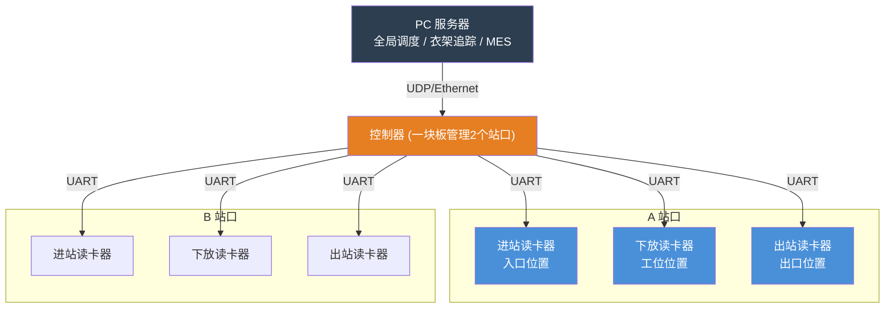

**关键约束：**
- 一块控制器同时管理 A、B 两个站口，每站 3 个读卡器，共 6 个
- 6 个读卡器硬件完全相同，仅通过 UART 端口绑定区分角色
- 读卡器之间彼此独立，各自与控制器点对点通信

---

## 二、读卡器固件的总体结构

读卡器 Flash 中存放两份固件：

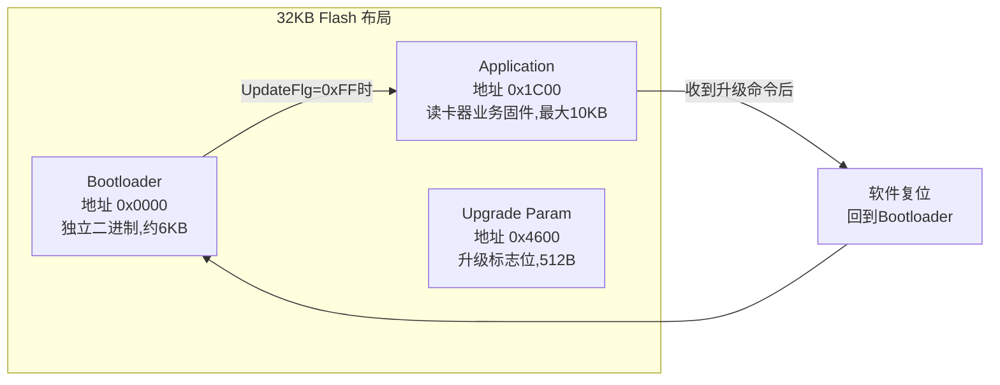

- **Bootloader**（0x0000）：独立编译。上电先运行，判断升级标志位决定跳转。负责接收固件数据包、解密、写 Flash。
- **Application**（0x1C00）：读卡器业务固件。负责 RFID 解码、串口协议应答、LED 控制。内含 RemoteUpdate 模块，检测到升级请求后设置标志位、软件复位回到 Bootloader。
- **Upgrade Parameter Sector**（0x4600）：存储 `BOOT_PARAM_STRU`（总包数、目标类型、升级标志、结果）。Application 和 Bootloader 共享此区域。

---

## 三、读卡器 Application 固件功能

### 3.1 RFID 读卡与解码

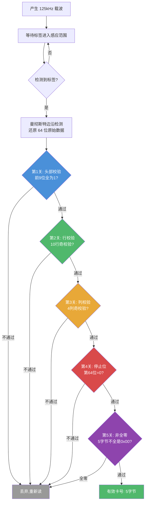

**标签规格：**
| 项目 | 规格 |
|------|------|
| 频率 | 125kHz |
| 标签协议 | EM4100 / EM4102 (EM4001 族) |
| 调制方式 | 曼彻斯特编码 (Manchester) |
| 原始数据位宽 | 64 位 |
| 数据格式 | 9位头部(全1) + 40位数据(10行x4位,含行校验) + 4位列校验 + 1位停止位(必须为0) |
| 有效输出 | 5 字节卡号（40 位有效数据） |
| 脉宽分类 | 窄脉冲 160~328us / 宽脉冲 328~656us / 超范围则复位 |

### 3.2 方向标识

每个读卡器内部维护一个方向状态 `Send_Manner`，用于标识当前命令的上下文：

| 方向 | Send_Manner 值 | 含义 |
|------|---------------|------|
| 进站 (Entry) | 0x55 | 衣架从主轨道进入站台的方向 |
| 下放 (Release) | 0xAA | 衣架从站台工位下放或离开的方向 |

这个标识不影响串口协议帧的格式，仅作为读卡器内部状态记录，供控制器端判别当前读卡器的工作上下文。方向随模式切换指令一同更新：

- 收到 `0x7A` 或 `0x9A` → 方向 = 进站 (0x55)
- 收到 `0x75` 或 `0x95` → 方向 = 下放 (0xAA)

---

### 3.3 三种工作模式

读卡器维护一个全局变量 `Card_Reader_Mode`，取值范围 1/2/3，上电默认为模式1。

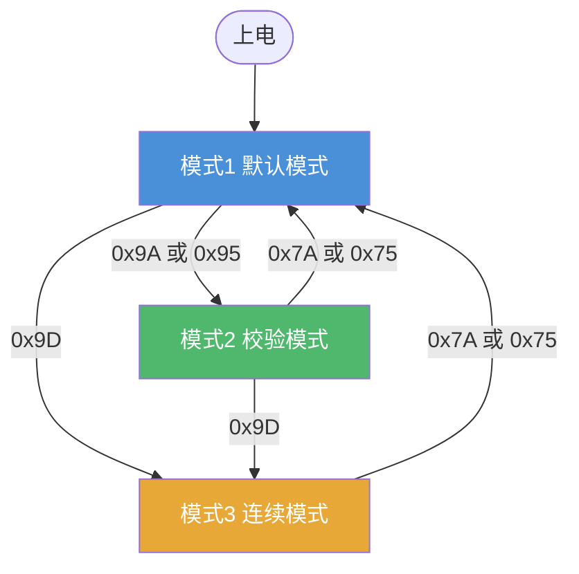

**模式切换时的通用行为：**
- 收到模式切换指令后，先切换模式变量，再执行对应的 LED 闪烁指示
- 模式切换过程中（LED 闪烁期间），读卡器仍正常解码 RFID 标签，但不响应上位机轮询
- 从模式3切回模式1/2时，停止连续发送定时器，重新回到轮询应答模式

---

#### 3.3.1 模式1 —— 默认模式（轮询应答）

**触发指令：** `0x10 0xFF 0x7A`（进站方向）或 `0x10 0xFF 0x75`（下放方向）

**上电默认状态：** 上电后自动进入模式1，方向默认为进站 (0x55)

**模式切换指示：** 进入模式1时，绿灯闪烁 2 次，每次翻转间隔 ~200ms

**工作流程：**

```
上位机轮询 → 读卡器检查是否有卡 → 有卡则上报 / 无卡则应答 Fail
                                        ↓
                              （轮询与读卡是异步的）
```

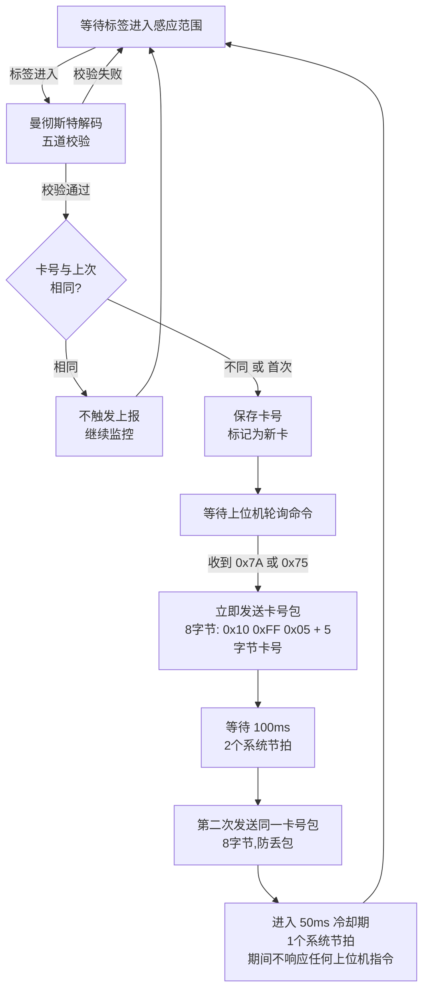

**卡号包格式（8字节）：**

```
[0] 0x10 | [1] 0xFF | [2] 0x05 | [3] CardData[3] | [4] CardData[4] | [5] CardData[5] | [6] CardData[6] | [7] CardData[7]
  帧头1      帧头2      长度         ←────────────────── 5字节卡号（40位有效数据）──────────────────→
```

**失败包格式（7字节）：** 当上位机轮询时恰好没有有效卡号，发送：

```
[0] 0x10 | [1] 0xFF | [2] 0x04 | [3] 'F' | [4] 'a' | [5] 'i' | [6] 'l'
  帧头1      帧头2      长度        F        a        i        l
```

**关键行为特性：**

| 特性 | 说明 |
|------|------|
| 应答触发条件 | 仅在收到上位机轮询命令（0x7A 或 0x75）时发送应答 |
| 卡号去重 | 同一张卡连续在感应范围内，解码成功后仅首次触发上报；后续解码发现卡号未变则不重复上报 |
| 换卡检测 | 当解码出的卡号与上次不同时，立即标记为新卡，等待轮询后触发新的上报周期 |
| 二次上报 | 第一次上报后间隔 100ms，自动发送第二次相同的卡号包，用于防止上位机丢包 |
| 冷却保护 | 二次上报后的 50ms 内，接收到任何上位机指令均静默忽略 |
| TX 忙保护 | 串口发送未完成时收到轮询指令，静默忽略 |
| 无卡应答 | 如果收到轮询时没有任何有效卡号（解码未完成或标签离开），发送 Fail 包 |
| 轮询与读卡的关系 | 轮询命令不触发解码——解码由 125kHz 载波持续驱动，轮询仅触发"上报当前已解码的卡号" |

**LED 行为：**

| 条件 | 绿灯 (LEDG) | 红灯 (LEDR) |
|------|-----------|-----------|
| 有有效卡号在感应范围内 | 亮 | 灭 |
| 无卡或卡已离开 | 灭 | 亮 |
| 卡号保持超过 200ms 无变化 | 自动熄灭（超时保护） | 灭 → 转亮 |
| 立杆小车黑卡 (卡号[5..7]=0x00,0x00,0x5A) | 两灯全灭 → 300ms 后 → 两灯同时亮 |

---

#### 3.3.2 模式2 —— 校验模式（轮询应答 + BCC）

**触发指令：** `0x10 0xFF 0x9A`（进站方向）或 `0x10 0xFF 0x95`（下放方向）

**模式切换指示：** 进入模式2时，绿灯闪烁 4 次，每次翻转间隔 ~200ms

**工作流程：** 与模式1完全相同（等待标签 → 解码 → 卡号变化检测 → 等待轮询 → 立即上报 → 100ms二次上报 → 50ms冷却），唯一区别是应答帧末尾追加 1 字节 BCC 校验码。

**卡号包格式（9字节）：**

```
[0] 0x10 | [1] 0xFF | [2] 0x05 | CardData[3..7] | [8] BCC
  帧头1      帧头2      长度        5字节卡号        XOR校验
```

**失败包格式（8字节）：**

```
[0] 0x10 | [1] 0xFF | [2] 0x04 | 'F' 'a' 'i' 'l' | BCC
```

**BCC 算法：**

```
BCC = 0
for 每个字节 in (0x10, 0xFF, 0x05, CardData[3], CardData[4], CardData[5], CardData[6], CardData[7]):
    BCC = BCC XOR 字节
```

即：BCC 是对帧头到卡号数据区所有字节依次做异或运算的结果。上位机收到后重新计算 BCC 并与接收到的 BCC 比对，一致则判定数据完整。

**关键行为特性：**

| 特性 | 说明 |
|------|------|
| 所有模式1的特性 | 轮询触发、卡号去重、换卡检测、二次上报(100ms)、冷却(50ms)、TX忙保护、无卡应答 Fail，全部与模式1相同 |
| 额外特性 | 每个应答帧末尾增加 1 字节 BCC 校验码，使上位机可以验证数据完整性 |
| BCC 覆盖范围 | 从 0x10 帧头到卡号最后一个字节的所有数据 |
| 失败包也带 BCC | 无卡时发送的 Fail 包同样末尾追加 BCC 字节 |

**LED 行为：** 与模式1完全相同，无额外变化。

---

#### 3.3.3 模式3 —— 连续发送模式（自主上报）

**触发指令：** `0x10 0xFF 0x9D`

**模式切换指示：** 进入模式3时，绿灯闪烁 6 次，每次翻转间隔 ~200ms。模式切换完成后，红灯立即常亮。

**核心区别：** 模式3 不等待上位机轮询命令，读卡器自主定时上报。进入模式3 时，先清空连续发送定时器，然后启动自主上报循环。

**工作流程：**

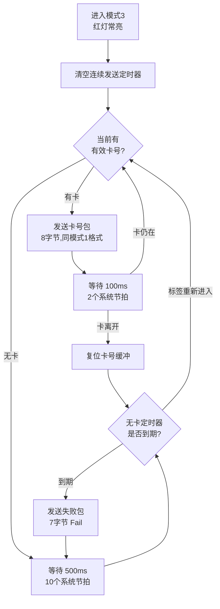

**卡号包格式（8字节）：** 与模式1完全相同

```
[0] 0x10 | [1] 0xFF | [2] 0x05 | CardData[3..7]
```

**失败包格式（7字节）：** 与模式1完全相同

```
[0] 0x10 | [1] 0xFF | [2] 0x04 | 'F' 'a' 'i' 'l'
```

**关键行为特性：**

| 特性 | 说明 |
|------|------|
| 上报触发条件 | 不依赖上位机轮询，由内部定时器自主触发 |
| 有卡上报周期 | 每 100ms（2个系统节拍）发送一次卡号包 |
| 无卡上报周期 | 每 500ms（10个系统节拍）发送一次 Fail 包 |
| 卡号去重 | 不检查——同一张卡持续在感应范围内，每个周期都上报一次（与模式1/2不同） |
| 换卡检测 | 每次解码成功后立即更新卡号缓冲，下一个周期上报新卡号 |
| 上位机指令响应 | 收到 0x7A/0x75/0x9A/0x95 时退出模式3，切换到对应模式 |
| 0x90 版本查询 | 即时响应，不受 100ms/500ms 周期影响 |
| 0x9D 再次发送 | 如果已在模式3，重新收到 0x9D → 复位连续发送定时器，相当于重入模式3 |

**LED 行为：**

| 条件 | 绿灯 (LEDG) | 红灯 (LEDR) |
|------|-----------|-----------|
| 任何情况 | 有卡亮,无卡灭 | 始终常亮 |
| 卡离开超过 200ms | 自动熄灭 | 仍常亮 |

**与模式1/2的核心差异总结：**

| 对比维度 | 模式1 / 模式2 | 模式3 |
|----------|-------------|-------|
| 应答方式 | 轮询触发（上位机问才答） | 自主定时（不等上位机） |
| 上位机轮询 | 必须 | 不必 |
| 有卡上报频率 | 一次读数 + 100ms 重复一次 | 每 100ms 持续上报 |
| 无卡上报 | 收到轮询时答 Fail | 每 500ms 主动报 Fail |
| 卡号去重 | 去重（相同不报） | 不去重（每次都报） |
| 红灯 | 与绿灯互斥 | 始终常亮 |
| 是否等待轮询 | 等待 | 不等待 |

---

#### 3.3.4 特殊场景：立杆小车黑卡

无论当前处于哪种模式，解码卡号时如果满足以下条件，触发特殊 LED 时序：

**触发条件：** CardData[5] = 0x00, CardData[6] = 0x00, CardData[7] = 0x5A

**行为：**
1. 两灯同时熄灭（覆盖当前模式的正常 LED 逻辑）
2. 等待 300ms（6个系统节拍）
3. 两灯同时亮起

此特殊时序用于立杆场景下检测到特定"黑卡"时的视觉反馈，模式1/2/3 下均生效。触发后不影响正常的卡号上报逻辑——卡号仍按当前模式的规则正常上报。

### 3.4 UART 通信协议

- 物理层: **19200 bps, 8-N-1**
- 命令帧: 固定 3 字节 `0x10 0xFF 0xXX`
- 应答帧: 7~10 字节，首字节为 `0x10 0xFF`

```mermaid
flowchart LR
    subgraph Cmd["上位机 -> 读卡器 (3字节)"]
        C1["0x10 0xFF 0x7A: 进站"]
        C2["0x10 0xFF 0x75: 下放"]
        C3["0x10 0xFF 0x9A: 进站+校验"]
        C4["0x10 0xFF 0x95: 下放+校验"]
        C5["0x10 0xFF 0x9D: 连续发送"]
        C6["0x10 0xFF 0x90: 查询版本"]
        C7["0x10 0xA0 0x05: 系统复位"]
    end

    subgraph Rsp["读卡器 -> 上位机"]
        R1["有卡(模式1/3): 8字节<br/>0x10 0xFF 0x05 + 5字节卡号"]
        R2["有卡(模式2): 9字节<br/>0x10 0xFF 0x05 + 5字节卡号 + BCC"]
        R3["无卡(模式1/3): 7字节<br/>0x10 0xFF 0x04 Fail"]
        R4["无卡(模式2): 8字节<br/>0x10 0xFF 0x04 Fail + BCC"]
        R5["版本查询: 10字节<br/>0x10 0xFF 0x01 Ver0310"]
    end

    Cmd --> Rsp

    style Cmd fill:#e3f2fd,stroke:#4A90D9
    style Rsp fill:#e8f5e9,stroke:#50B86C
```

**BCC 算法：** 对数据区全部字节依次异或（XOR）。

**指令冲突保护：** 以下情况读卡器静默忽略上位机指令——正在发送中（TX busy）、处于二次上报的 100ms 等待期内。

### 3.5 LED 行为规范

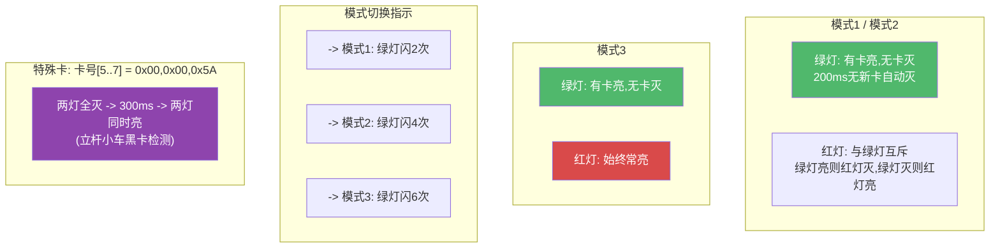

### 3.6 系统定时基准

系统需要 **50ms 周期节拍**，所有定时基于此计算：

| 节拍倍数 | 时长 | 用途 |
|----------|------|------|
| x1 | 50ms | EM4095 初始化稳定 |
| x2 | 100ms | 卡号二次上报延迟 / 连续模式有卡上报间隔 |
| x4 | 200ms | 读卡LED超时熄灭 / 模式切换闪烁半周期 |
| x6 | 300ms | 立杆小车LED延迟 |
| x10 | 500ms | 连续模式无卡上报间隔 |
| x2+ | ~106ms | 看门狗超时 |

### 3.7 错误处理

| 场景 | 行为 |
|------|------|
| 无卡 | 应答 Fail |
| 头部/行/列校验失败 | 丢弃,复位解码器,重新读 |
| 停止位错误 | 丢弃,复位解码器,重新读 |
| 卡号全零 | 不上报,LED灭 |
| 脉宽超出合法范围 | 复位解码计数器 |
| TX忙时收到指令 | 静默忽略 |
| 看门狗超时 | MCU硬件复位 |

---

## 四、Bootloader 固件功能

Bootloader 是独立的二进制文件，烧录在 Flash 0x0000 起始位置，先于 Application 运行。

### 4.1 Flash 分区

```
地址        大小      用途
0x0000      ~6KB     Bootloader 代码区
0x1C00      最大10KB Application 代码区 (APP_START_ADDR)
0x4600      512B     Upgrade Parameter Sector (UPD_PARAM_FLASH_ADDR)
```

### 4.2 上电启动流程

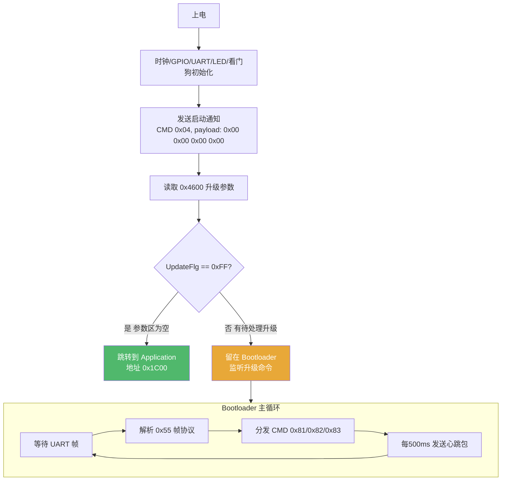

### 4.3 升级命令协议

Bootloader 使用 **0x55 帧协议**（与日常轮询的 `0x10 0xFF` 协议不同）：

**接收帧格式（上位机 -> Bootloader）：**

```
[0] 0x55 | [1] CMD | [2-3] Len(LE) | [4-5] PackNo(LE) | [6..] Data[len] | CRC16(LE) | 0xAA
 帧头       命令      数据长度           包序号             数据               校验         帧尾
```

**发送帧格式（Bootloader -> 上位机，应答时不含 PackNo 字段）：**

```
[0] 0x55 | [1] CMD | [2-3] Len(LE) | [4..] Data[len] | CRC16(LE) | 0xAA
```

### 4.4 升级命令集

```mermaid
flowchart TD
    Idle[空闲] -->|0x81 启动升级| GotoUpdate

    subgraph GotoUpdate["GotoUpdate 处理"]
        GU1[校验 PackNo <= 42]
        GU2[擦除 Application 区<br/>0x1C00 ~ 0x1C00+10KB]
        GU3[写 UpdateFlg = rRecive 到 0x4600]
        GU4[设置超时计时器 = 8000]
        GU5[应答 CMD 0x01 ACK]
        GU1 --> GU2 --> GU3 --> GU4 --> GU5
    end

    GotoUpdate --> Receiving[接收中]

    Receiving -->|0x82 数据包| ProcessPacket

    subgraph ProcessPacket["数据包处理"]
        PP1[校验包序号 = 上次序号 + 1]
        PP2[CRC16-USB 校验]
        PP3["XOR 解密 (密钥: 603337)"]
        PP4[写入 Flash: 0x1C00 + 序号x256]
        PP5[标记 GetPackFlag[i] = 1]
        PP6[应答 CMD 0x02: 成功=0xAA, 失败=0x55]
        PP1 --> PP2 --> PP3 --> PP4 --> PP5 --> PP6
    end

    ProcessPacket -->|最后一包完成| Complete

    subgraph Complete["接收完成"]
        CP1[校验全部 GetPackFlag == 1]
        CP2[写 UpdateFlg = rUpdated 到 0x4600]
        CP3[跳转到 Application<br/>验证栈指针在 RAM 范围内]
    end

    Receiving -->|超时 8000 tick| Timeout["超时,回到空闲"]

    Idle -->|0x83 查询结果| Query["仅在 sWaitRes 状态处理<br/>保存结果(uOK=0xAA / uFail=0x55)"]

    style Idle fill:#4A90D9,color:#fff
    style Receiving fill:#E8A838,color:#fff
    style Complete fill:#50B86C,color:#fff
    style Timeout fill:#D94A4A,color:#fff
```

**命令速查：**

| CMD | 方向 | 功能 |
|-----|------|------|
| 0x81 | 上位机->Bootloader | 启动升级: 携带总包数,收到后擦除App区,应答0x01 |
| 0x82 | 上位机->Bootloader | 数据包: 256字节加密固件块,应答0x02 |
| 0x83 | 上位机->Bootloader | 查询/确认结果: 仅在sWaitRes状态处理 |
| 0x01 | Bootloader->上位机 | 启动应答: 回显总包数 |
| 0x02 | Bootloader->上位机 | 数据包应答: 包序号 + 状态(0xAA/0x55) |
| 0x03 | Bootloader->上位机 | 上电状态报告: 版本号 + 升级结果 |
| 0x04 | Bootloader->上位机 | 启动通知: payload 全零 |

### 4.5 升级状态机

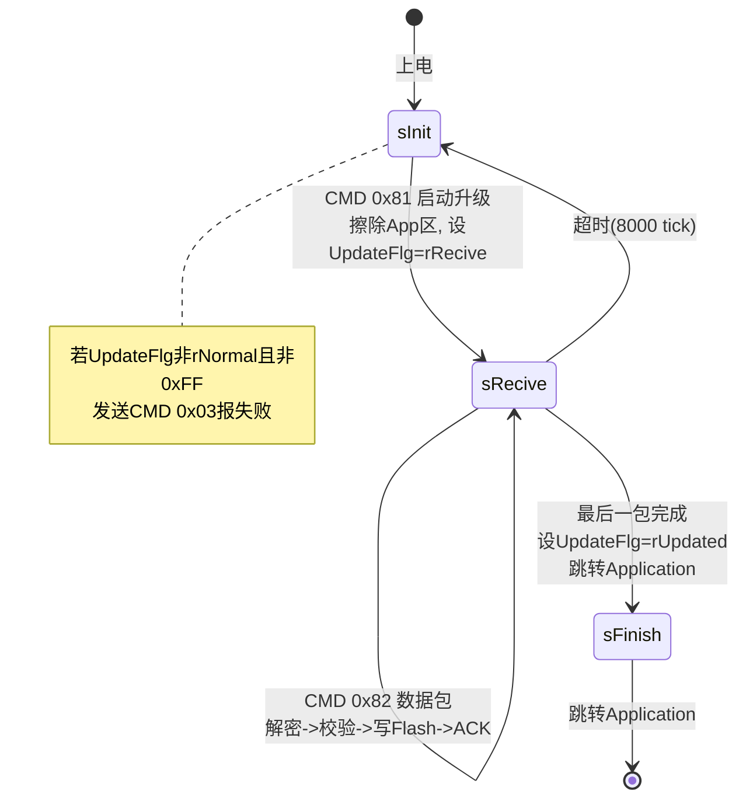

### 4.6 安全机制

| 机制 | 算法/参数 |
|------|----------|
| CRC 校验 | CRC16-USB, 多项式 0x8005, 初值 0xFFFF, 对 Data 区计算 |
| 数据加密 | XOR 循环加密, 6字节密钥 `"603337"`, `data[i] ^= key[i % 6]` |
| Flash 保护 | 写入前先擦除半扇区(256B), 写入后校验 |
| 栈指针校验 | 跳转前验证 Application 栈指针在 RAM 范围 (0x20000000~0x2001FFFF) |
| 包序号校验 | 严格递增（PackNo == LastPackNo + 1），跳跃则忽略 |
| 重发机制 | 每包最多重发 5 次 |

### 4.7 关键参数

| 参数 | 值 | 含义 |
|------|------|------|
| APP_START_ADDR | 0x1C00 | Application 起始地址 |
| UPD_PARAM_FLASH_ADDR | 0x4600 | 升级参数存储地址 |
| UPDATE_APP_MAX | 0x2A00 (10KB) | Application 最大体积 |
| PACK_MAX | 42 | 最大包数 |
| U_FILE_MAX | 256 | 每包最大数据量 |
| UPDATE_OTTP | 8000 | 升级超时（约8秒） |
| RESEND_CNT | 5 | 最大重发次数 |
| BOOT_VER | 0x01 | Bootloader 版本号 |

### 4.8 Application 与 Bootloader 的协作流程

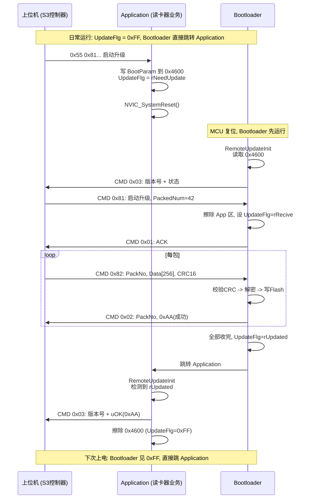

---

## 五、控制器端软件功能（S2 & S3）

### 5.1 控制器的角色

控制器通过 UART 轮询读取读卡器上报的衣架卡号，匹配 PC 下发的任务清单，驱动站台内的阀门和提升臂完成衣架进站、下放、出站的机械动作。

### 5.2 站口内读卡器协同

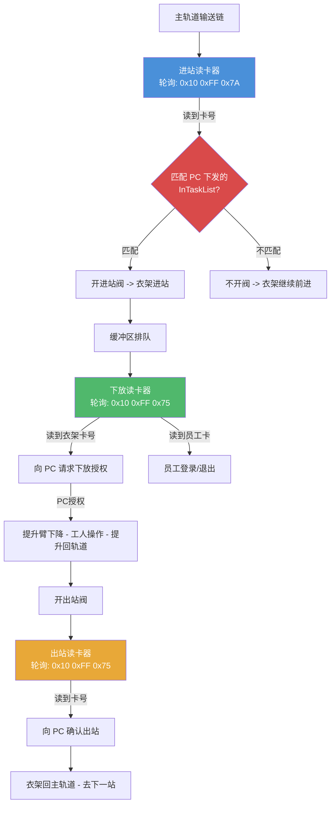

### 5.3 控制器轮询策略

- 轮询周期: **每 300ms** 向每个读卡器发送一次命令
- 应答超时: 300ms 无应答 -> 判定丢包; **1000ms+** 无应答 -> 判定读卡器掉线
- 卡号解析: 从应答帧中提取 **4 字节卡号（大端序）**
- 去重逻辑: 相同卡号不重复触发业务（模式3除外）

### 5.4 控制器 -> PC 通信报文（读卡器触发）

| 触发源 | 报文 | 说明 |
|--------|------|------|
| 进站: 匹配成功 | CMD 186 | 衣架已进站 (4空字节+4字节卡号) |
| 进站: 匹配失败 | CMD 187 | 衣架不在任务清单 (4空字节+4字节卡号) |
| 下放: 衣架卡 | CMD 152 | 请求下放授权 (1命令字节+8字节卡号) |
| 下放: 员工卡 | CMD 129 | 员工登录 |
| 下放: 员工卡 | CMD 130 | 员工退出 |
| 出站 | CMD 139 | 衣架已出站 |
| 读卡器掉线 | FALT_READER_LOST | 上报PC故障 + 推送操作面板消息 |

### 5.5 两种站台模式下的读卡器行为差异

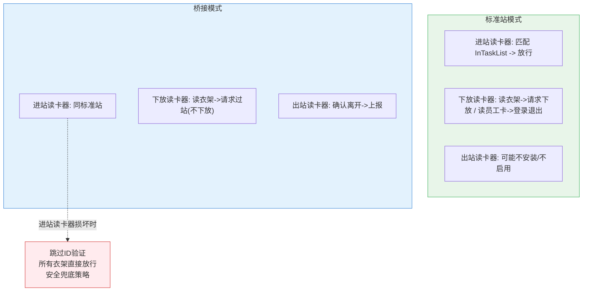

### 5.6 S2 与 S3 控制器差异

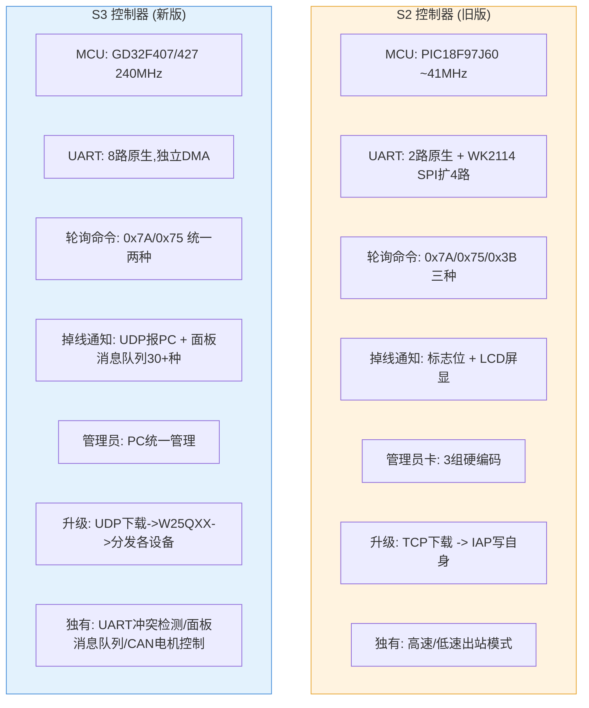

### 5.7 读卡器状态管理

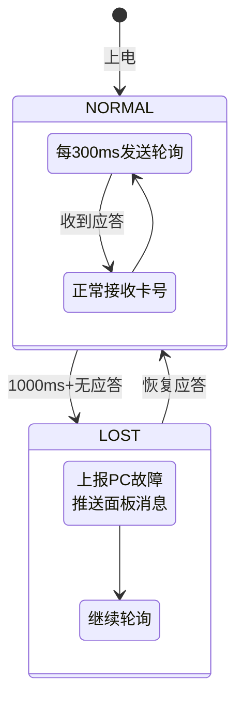

每个读卡器有 3 个可配置参数（存储在控制器 Flash 中）：

| 参数 | 说明 |
|------|------|
| UART 端口绑定 | 读卡器接在哪个串口上 |
| 监控使能 | 是否监控该读卡器在线状态 |
| 掉线阈值 | 连续无应答多少毫秒判定掉线 (默认1000ms) |

### 5.8 远程升级支持（控制器端）

控制器可同时为多个目标设备分发固件升级：

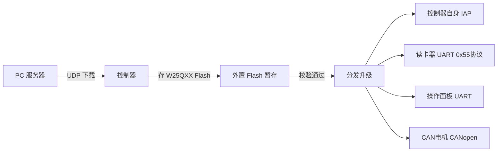

S2 与 S3 在升级流程上的差异: S2 仅升级自身(TCP->IAP), S3 支持多目标分发(UDP->W25QXX->UART/CAN分发)。

---

## 六、重构需求清单

### A. 读卡器 Application 固件

| # | 功能需求 |
|---|---------|
| 1 | 125kHz 载波输出 + EM4100/EM4102 曼彻斯特解码 (64位 -> 5字节卡号) |
| 2 | 五道校验: 头部(9位全1) + 行校验(10行奇校验) + 列校验(4列奇校验) + 停止位(0) + 全零过滤 |
| 3 | UART 轮询协议: 接收 `0x10 0xFF 0xXX` 3字节命令,应答 7~10字节 |
| 4 | 7 条命令: 0x7A(进站) / 0x75(下放) / 0x9A(进站+BCC) / 0x95(下放+BCC) / 0x9D(连续) / 0x90(版本) / 0xA0 0x05(复位) |
| 5 | 3 种工作模式切换 + 模式切换时绿灯闪烁 (模式1=2次,模式2=4次,模式3=6次) |
| 6 | 双次上报(100ms 防丢) + TX忙时不响应指令 |
| 7 | LED 控制: 绿灯(有卡指示) + 红灯(状态/连续模式常亮) + 立杆小车黑卡特殊时序 |
| 8 | 50ms 系统节拍 + 看门狗(~106ms) |
| 9 | RemoteUpdate 模块: 检测升级标志、触发系统复位 进入 Bootloader |
| 10 | 上电检测升级结果 (UpdateFlg=rUpdated时上报成功并擦除参数区) |

### B. 读卡器 Bootloader 固件

| # | 功能需求 |
|---|---------|
| 1 | 上电判断 UpdateFlg: 0xFF=跳转App, 其他=驻留监听升级 |
| 2 | 0x55 帧协议解析: 帧头0x55, CMD, Len, PackNo, Data, CRC16, 帧尾0xAA |
| 3 | 3 条升级命令: 0x81(启动,擦除App区) / 0x82(收数据包,解密写Flash) / 0x83(查询结果) |
| 4 | CRC16-USB 校验 (多项式 0x8005,初值 0xFFFF,对Data区计算) |
| 5 | XOR 解密 (密钥 "603337", 6字节循环异或) |
| 6 | Flash 管理: 擦除半扇区(256B), 包序号递增校验, 全部收完后标记 rUpdated |
| 7 | 安全跳转: 验证 App 栈指针在 RAM 范围内再跳转 |
| 8 | 超时与重试: 升级超时8000tick, 包重发最多5次 |
| 9 | 上电上报: 若参数区有异常标志, 发送 CMD 0x03 报失败 |
| 10 | 心跳: 每 500ms 发送一次心跳包 |

### C. 控制器端

| # | 功能需求 |
|---|---------|
| 1 | 每 300ms 向每个读卡器发送轮询 (进站=0x7A, 下放/出站=0x75) |
| 2 | 解析读卡器应答: 7/8/9 字节, 提取 4 字节卡号(大端) |
| 3 | 进站匹配: 卡号 vs InTaskList -> 匹配开阀 / 不匹配放过 |
| 4 | 下放: 卡号 -> 请求PC授权(CMD 152) -> 授权后驱动下放机构 |
| 5 | 出站: 卡号 -> 确认出站 -> 上报PC(CMD 139) |
| 6 | 员工卡识别: 通过下放读卡器 -> 登录(CMD 129) / 退出(CMD 130) |
| 7 | 读卡器掉线检测: 1000ms+无应答 -> 上报PC故障 |
| 8 | 读卡器 UART 端口可配置 (存入非易失存储) |
| 9 | 升级分发: 接收固件 -> 通过 UART 0x55协议分发给读卡器 |

---

## 七、测试验收清单

### 读卡器基础功能
- [ ] 有卡靠近 -> 绿灯亮，无卡 -> 绿灯灭
- [ ] 卡号上报格式: `0x10 0xFF 0x05` + 4字节卡号(大端)
- [ ] 同一张卡不重复上报（模式3除外）
- [ ] 换卡 -> 立即上报新卡号
- [ ] 非法卡（校验失败/全零）-> 不上报

### 协议交互
- [ ] 0x7A / 0x75 轮询 -> 正常应答
- [ ] 0x9A / 0x95 轮询 -> 应答带BCC（最后字节 = 前面全部 XOR）
- [ ] 0x9D -> 连续模式，红灯常亮
- [ ] 0x90 -> 返回 Ver0310
- [ ] 无卡 -> 应答 Fail
- [ ] TX忙时不响应指令
- [ ] 100ms内读到同一张卡 -> 第二次上报

### 模式切换
- [ ] 切模式1 -> 绿灯闪2次
- [ ] 切模式2 -> 绿灯闪4次，数据带BCC
- [ ] 切模式3 -> 绿灯闪6次，红灯常亮

### 掉线恢复
- [ ] 断开读卡器串口 -> 控制器 1000ms 后判定掉线 -> 上报PC
- [ ] 恢复连接 -> 控制器判定恢复 -> 清故障

### Bootloader 与固件升级
- [ ] 上电 UpdateFlg=0xFF -> 直接跳转 Application
- [ ] 上电 UpdateFlg=rRecive -> 驻留监听升级命令
- [ ] CMD 0x81 启动升级 -> 擦除 App 区 -> 进入接收状态
- [ ] CMD 0x82 顺序发包 -> CRC校验通过 -> 解密 -> 写Flash -> ACK
- [ ] CMD 0x82 包序号跳跃 -> 忽略
- [ ] CMD 0x82 CRC不匹配 -> 不应答（上位机超时重发）
- [ ] 全部包收完 -> 标记 rUpdated -> 跳转 Application
- [ ] Application 检测到 rUpdated -> 上报 CMD 0x03 成功 -> 擦除参数区
- [ ] 升级超时 -> 回到空闲状态
- [ ] XOR 解密正确 (密钥 603337)
- [ ] CRC16-USB 校验正确
- [ ] 包重发最多 5 次

### 系统联调
- [ ] 进站读卡器 -> 匹配任务表 -> 开阀放行
- [ ] 进站读卡器 -> 不匹配 -> 衣架放走（不开阀）
- [ ] 下放读卡器 -> 读衣架 -> 请求PC -> 授权后下放
- [ ] 下放读卡器 -> 读员工卡 -> 登录/退出
- [ ] 出站读卡器 -> 确认出站 -> 上报PC
- [ ] 桥接模式 + 进站读卡器损坏 -> 跳过ID验证直接放行

### 鲁棒性
- [ ] 看门狗超时 -> MCU 复位
- [ ] 格式错误的轮询帧 -> 不崩溃
- [ ] 干扰/非法卡片 -> 正确拒绝
- [ ] 连续快速刷卡 -> 不丢卡不重复
- [ ] 多读卡器同时工作 -> 互不干扰
