## 待办列表
- [ ] 编码
- [ ] 测试
- [ ] 合并

---

# 原SR3 读卡器 —— 行为规范（HC32F002）

> 源码：`HC32F002_DDL_Rev1.2.0（卡号错误问题解决优化版）\midware\RFID\RFID.c` 等
> MCU：HC32F002，48MHz RCH，Flash 18KB，RAM 2KB
> 用途：新 SR3 重构时的功能参考基线

---

## 〇、读卡器到底是什么

读卡器就是一个串在衣架轨道上的小盒子：

```
┌─────────────────────────────────────────────────────┐
│                    主轨道 (衣架在走)                  │
│  ═══════════════════════════════════════════════════  │
│       ↓ 衣架滑过来                                   │
│  ┌─────────┐                                        │
│  │ 读卡器   │ ← UART 一根线连到控制器                  │
│  │ 125kHz  │   19200-8-N-1                           │
│  │ 线圈    │                                         │
│  └─────────┘                                        │
│       ↓ 读到标签卡号                                  │
│  控制器收到卡号 → 决定要不要放行                        │
└─────────────────────────────────────────────────────┘
```

**核心任务只有一个：** 衣架经过时，读出它身上的 RFID 标签卡号，告诉控制器。

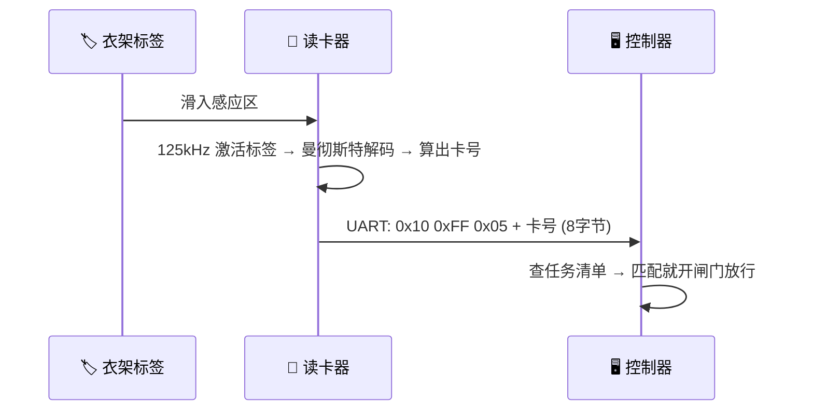

---

## 一、读卡器怎么"读"到卡号（解码全链路）

这是读卡器上电后**一直在做**的事，不需要上位机叫它才做。

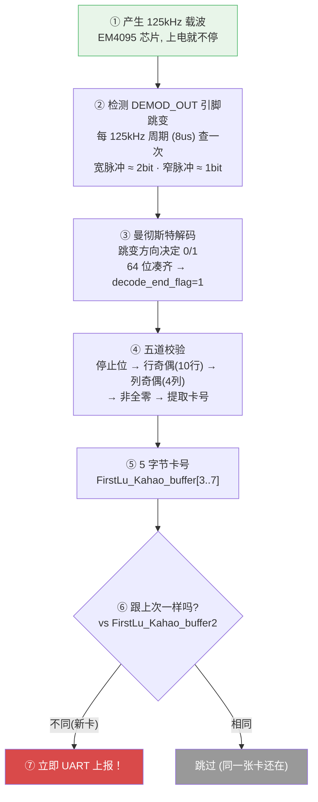

**关键点：** 第⑥⑦步——读到新卡号就立刻上报，**不等待上位机来问**。

---

## 二、主动 vs 被动：谁先动

这是最容易搞混的地方。读卡器和上位机**各干各的**，不是一问一答。

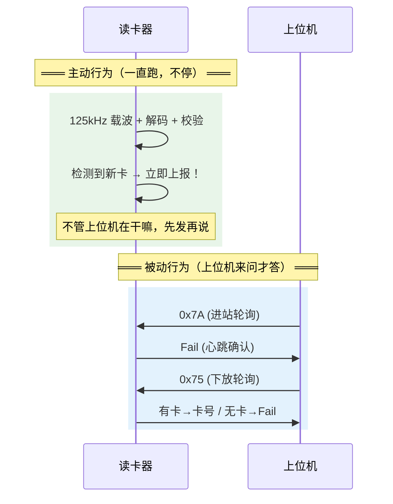

**一句话总结：**
- **主动 = 读卡器自己发现新卡，自己上报**（不等任何人）
- **被动 = 上位机来问"你还在吗？什么模式？"，读卡器回答**
- 上位机的轮询**不是**用来取卡号的——卡号早就主动上报过了。轮询只是心跳 + 模式管理。

---

## 三、进站 vs 下放：同样的新卡，不同的处理

一张卡进入感应区，读卡器的反应取决于它被设成了**进站方向**还是**下放方向**。

### 3.1 进站方向 (Send_Manner = 0x55)

衣架从主轨道滑进工位——需要确保上位机**一定收到**卡号，所以多发一次：

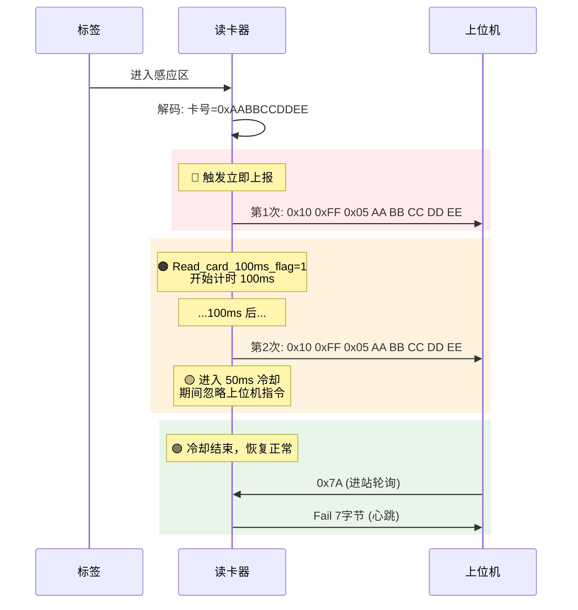

**为什么发两次？** 进站是关键动作——衣架要进工位了。两次发送间隔 100ms，确保上位机在轮询间隙也能收到。

**为什么冷却 50ms？** 防止二次发送还没完成就被上位机的轮询打断。

**100ms 等待期 / 50ms 冷却期来新卡怎么办？** 新卡优先级最高，随时打断。代码里新卡检测条件 `Read_card_success_flag==0 || Kahao_new_flag!=0` **不检查 `Read_card_100ms_flag`**，所以 100ms 等待和 50ms 冷却都不阻止新卡上报。新卡到来立即中断当前流程，改发新卡并重新开始 100ms 计时--原卡的二次发送被取消。

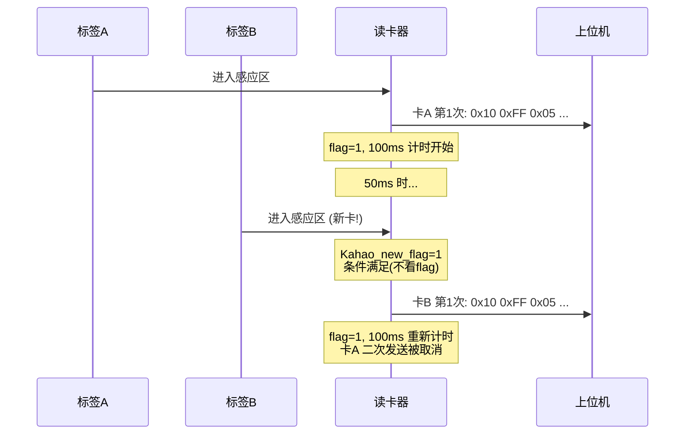

### 3.2 下放方向 (Send_Manner = 0xAA)

衣架在工位上操作完了，要放回主轨道——发一次就够了：

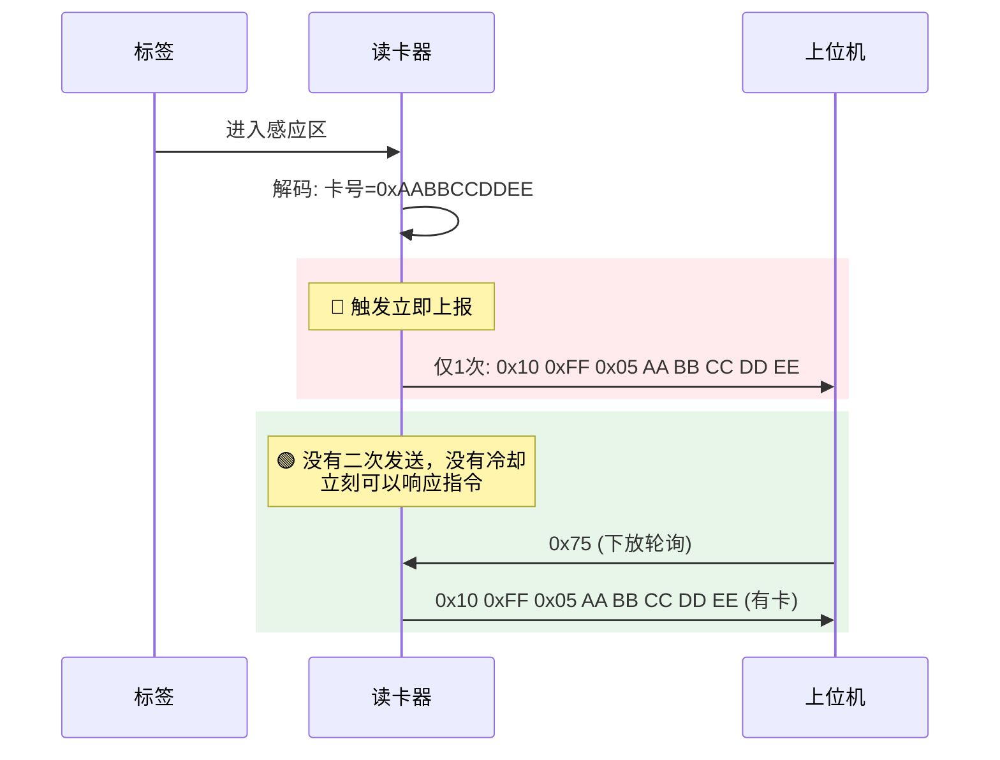

**为什么只发一次？** 下放不像进站那么关键。而且上位机可以通过 0x75 随时查询。

**来新卡怎么办？** 跟进站一样，新卡检测条件 `Read_card_success_flag==0 || Kahao_new_flag!=0` 不受任何状态约束。下放期间来新卡立即上报新卡。由于下放本来就没有二次发送和冷却，新卡不会打断任何待发流程，直接发即可。

### 3.3 并排对比

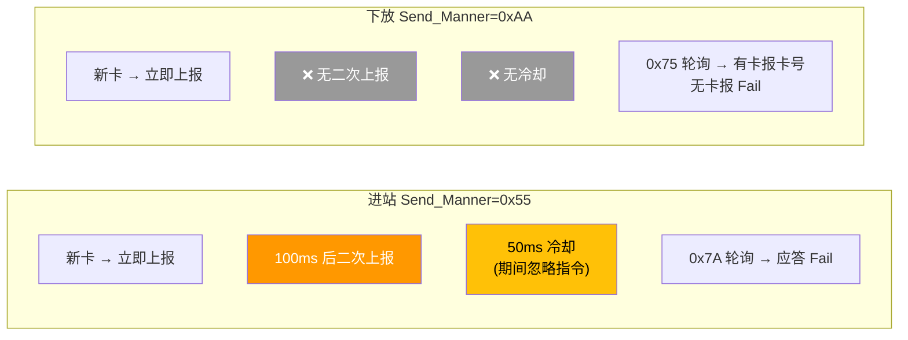

---

## 四、三种模式：一张表看懂

三种模式的区别，核心就三个维度：**上报方式、数据格式、LED**。

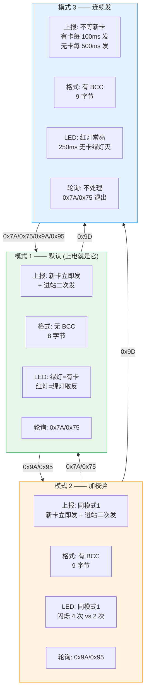

**一句话区分：**
- 模式 1 = 有卡才发，发完就停
- 模式 2 = 有卡才发 + 数据末尾加 BCC 校验
- 模式 3 = 不管有没有卡，一直发（像心跳一样）

### 4.1 模式 3 的工作方式

模式 3 最特殊——它不依赖"新卡出现"这个事件，而是**定时器到了就发**：

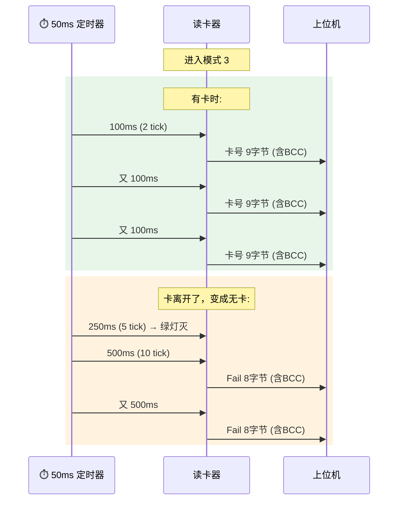

**适用场景：** 需要实时知道工位上有没有衣架的场合。上位机不用轮询，读卡器自己会一直报。

---

## 五、上位机 7 条命令速查

读卡器不是主动发完就完了——上位机也会发命令过来。这些命令**全部是被动响应**。


### 忙保护（重要！）

读卡器正在发送卡号（或处在进站冷却期）时，上位机发命令过来会被**静默忽略**：

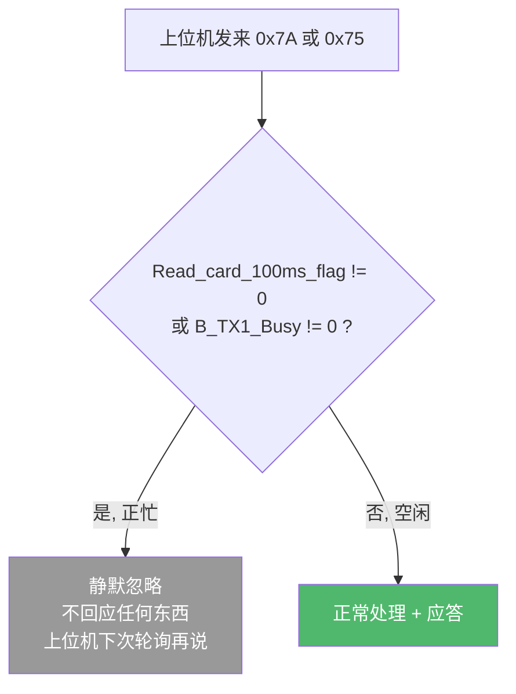

**为什么这样设计？** 卡号上报是最高优先级。如果正在发卡号时被打断去响应轮询，上位机可能收到半个包，解析出错。宁可这次不答，等上位机下次再问。

---

## 六、一个完整场景：衣架进站全过程

把所有概念串起来，看一个衣架从进入感应区到上位机做出决定的完整流程：

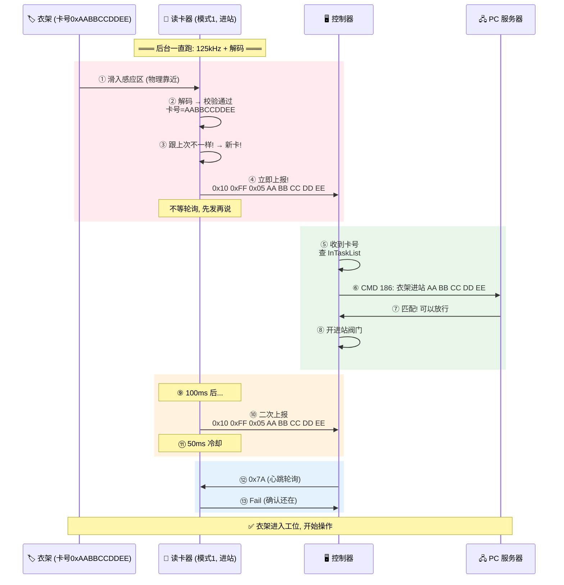

**理解这个流程的关键：** 第④步是读卡器**自己**发的，不是控制器⑫步问出来的。控制器的轮询在第⑫步才来——那时候衣架早就决定放行了。

---

## 七、数据包格式速查

所有 UART 通信都是 19200-8-N-1。

### 卡号包

```
模式 1:
┌──────┬──────┬──────┬──────────────────────────┐
│ 0x10 │ 0xFF │ 0x05 │ 5 字节卡号 (大端)          │
│ 帧头  │ 帧头  │ 长度  │ Card[3] Card[4]...Card[7]│
└──────┴──────┴──────┴──────────────────────────┘
  8 字节，无 BCC

模式 2 / 模式 3:
┌──────┬──────┬──────┬──────────────────────────┬─────┐
│ 0x10 │ 0xFF │ 0x05 │ 5 字节卡号 (大端)          │ BCC │
│ 帧头  │ 帧头  │ 长度  │ Card[3] Card[4]...Card[7]│ XOR │
└──────┴──────┴──────┴──────────────────────────┴─────┘
  9 字节，BCC = 所有前 8 字节 XOR
```

### Fail 包

```
模式 1:
┌──────┬──────┬──────┬───┬───┬───┬───┐
│ 0x10 │ 0xFF │ 0x04 │ F │ a │ i │ l │
└──────┴──────┴──────┴───┴───┴───┴───┘
  7 字节，无 BCC

模式 2 / 模式 3:
┌──────┬──────┬──────┬───┬───┬───┬───┬─────┐
│ 0x10 │ 0xFF │ 0x04 │ F │ a │ i │ l │ BCC │
└──────┴──────┴──────┴───┴───┴───┴───┴─────┘
  8 字节，BCC = 前 7 字节 XOR
```

---

## 八、LED 行为速查

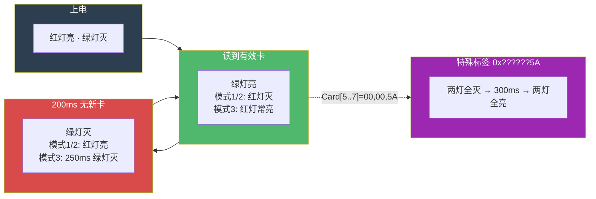

---

## 九、与第一代的兼容性

第一代只有模式 1 的功能（没有模式 2/3、没有 BCC、没有 Bootloader）。但只要上位机只用 0x7A 和 0x75 轮询，第一代和第二代可以**互换**：


**19 项行为在两端表现完全一致。** 上位机的控制逻辑不需要为不同代读卡器写分支。

---

## 十、控制器怎么用读卡器

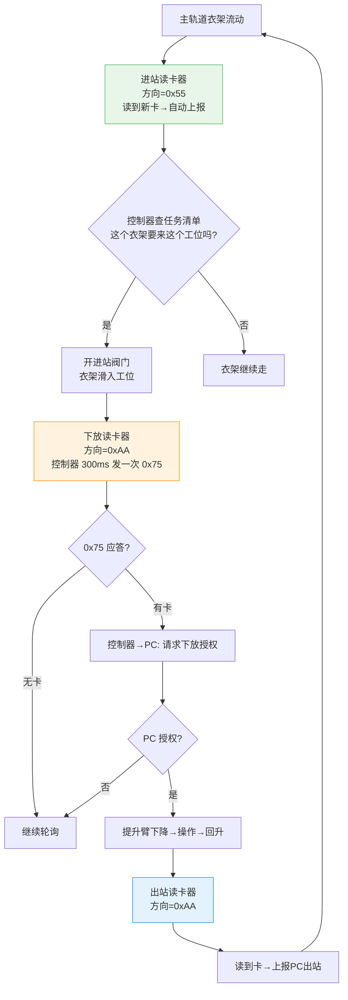

**每个工位有 2~3 个读卡器：** 进站、下放、出站（可选）。硬件完全相同，靠位置区分角色。

---

## 十一、固件升级（Application + Bootloader 协作）

读卡器的固件不是一成不变的——当需要修复 bug 或增加功能时，通过串口远程升级，不用派人去工位拆机烧录。

升级需要两个固件协作：**Bootloader**（驻守在 Flash 前 6KB）和 **Application**（正常的读卡业务代码）。

### 11.1 Flash 是怎么划分的

```
0x0000 ┌──────────────────────┐
       │     Bootloader       │  ~6KB，上电先跑它
       │     负责升级逻辑       │
0x1C00 ├──────────────────────┤  ← APP_START_ADDR
       │     Application      │  最大 10KB (0x2A00)
       │     正常读卡业务       │
0x4600 ├──────────────────────┤  ← UPD_PARAM_FLASH_ADDR
       │   Upgrade Param      │  512B，Bootloader 和 App 共享
       │   存升级状态/结果      │
0x4800 └──────────────────────┘
```

**Flash 总大小 32KB。** Bootloader + Application 共用，Parameters 区做桥梁。

### 11.2 上电后谁先跑

读卡器上电后，**永远先跑 Bootloader**，由它决定跳不跳 Application：

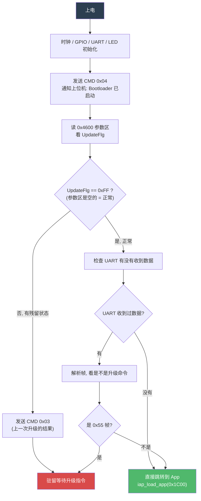

**正常情况（没在升级）：** UpdateFlg=0xFF → Bootloader 发现 UART 没数据 → 直接跳到 Application。整个过程很快，上位机几乎感觉不到。

**正在升级中：** UpdateFlg≠0xFF → Bootloader 驻留，等上位机发升级数据包。

### 11.3 正常运行时怎么触发升级

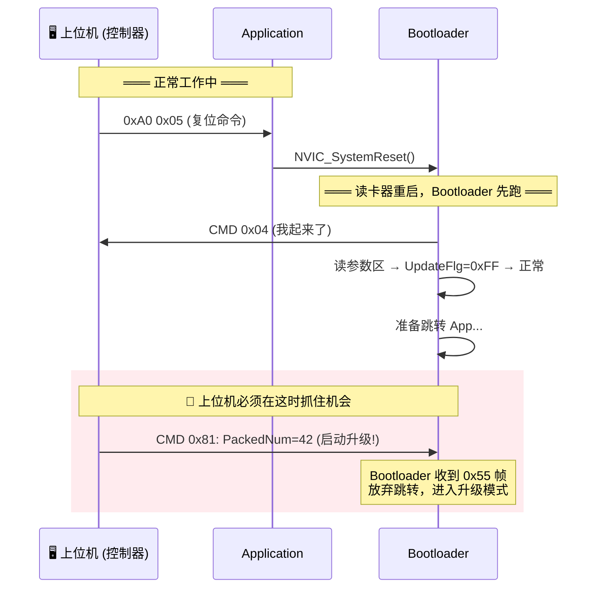

**时机很关键：** 上位机发完 0xA0 0x05 复位后，必须在 Bootloader 跳走之前发出 0x55 0x81。UART ISR 收到数据会设标志让主循环停留。

### 11.4 升级协议：0x55 帧（跟日常 0x10 帧不一样）

升级用的是**另一套帧协议**，帧头不是 0x10 而是 0x55：

```
上位机 → 读卡器 (含 PackNo):
┌──────┬─────┬──────────┬──────────┬──────────────┬──────────┬──────┐
│ 0x55 │ CMD │ Len (LE) │ PackNo   │ Data[Len]    │ CRC16    │ 0xAA │
│ 帧头  │ 命令 │  2 字节   │ (LE)2字节 │ 数据          │ (LE)2字节 │ 帧尾  │
└──────┴─────┴──────────┴──────────┴──────────────┴──────────┴──────┘

读卡器 → 上位机 (不含 PackNo):
┌──────┬─────┬──────────┬──────────────┬──────────┬──────┐
│ 0x55 │ CMD │ Len (LE) │ Data[Len]    │ CRC16    │ 0xAA │
│ 帧头  │ 命令 │  2 字节   │ 数据          │ (LE)2字节 │ 帧尾  │
└──────┴─────┴──────────┴──────────────┴──────────┴──────┘
```

**帧解析 6 步走：**
1. 找 0x55 帧头
2. 读 CMD（必须 > 0x80，否则丢弃）
3. 读 Len（2 字节小端），校验 `Len < 剩余长度 - 5`
4. 校验帧尾：`FlashBuff[j+Len+5] == 0xAA`
5. 读 PackNo（2 字节小端，序号）
6. 读 Data[Len] + 校验 CRC16

### 11.5 三条升级命令

| CMD | 方向 | 干什么 | 前提条件 |
|-----|------|--------|---------|
| **0x81** | 上位机 → BL | **启动升级** | 任何状态。上位机告诉 BL "总共多少包" |
| **0x82** | 上位机 → BL | **发送一包数据** | BL 处于 sRecive 状态，且包序号 = 上次 + 1 |
| **0x83** | 上位机 → BL | **查询结果** | BL 处于 sWaitRes 状态（升级完毕，等确认） |

| CMD      | 方向       | 应答内容                                   |
| -------- | -------- | -------------------------------------- |
| **0x01** | BL → 上位机 | 启动确认：回显 PackNo（4 字节）                   |
| **0x02** | BL → 上位机 | 数据包结果：PackNo(2B) + 0xAA(成功) 或 0x55(失败) |
| **0x03** | BL → 上位机 | 状态报告：版本(2B) + 0xAA/0x55                |
| **0x04** | BL → 上位机 | 启动通知：4 字节全零                            |

### 11.6 完整升级流程图

这是最重要的一张图——从复位到升级完成的每一步：

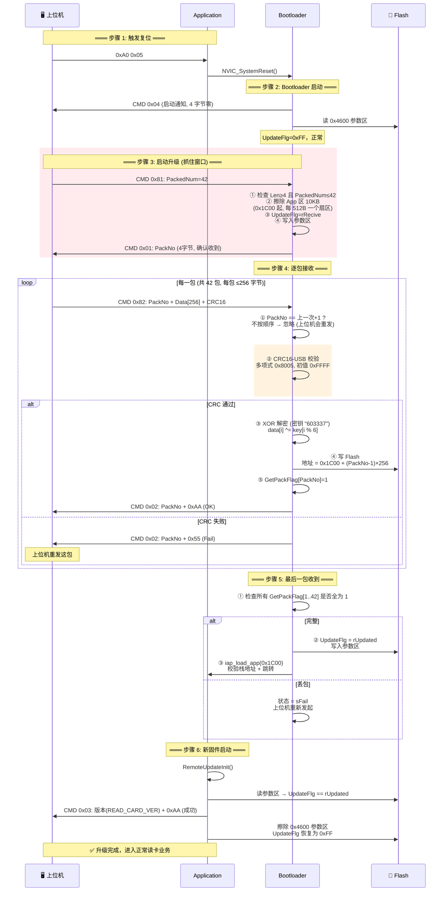

### 11.7 安全机制一览

| 机制 | 说明 |
|------|------|
| **CRC16-USB** | 每包数据校验，多项式 0x8005，XOR 初值和结果都是 0xFFFF |
| **XOR 加密** | 传输数据做了异或加密，密钥 "603337"（6 字节循环） |
| **包序号** | 必须严格递增。号跳跃 → 忽略，上位机重发 |
| **重发** | 每包最多重发 5 次 |
| **超时** | UPDATE_OTTP=8000 tick（约 8 秒），超时则回空闲 |
| **栈校验** | 跳转前验证 `(*(app_addr) & 0x2FFE0000) == 0x20000000`，确保 App 栈合法 |
| **半扇区擦除** | 每次写 256 字节前先擦除对应的 512 字节扇区 |

### 11.8 Application 端的升级感知

Application 上电后会调用一次 `RemoteUpdateInit()`，读 0x4600 参数区：

- **UpdateFlg == rUpdated** → 说明刚升级完 → 发 CMD 0x03 报成功 → **擦除参数区**（恢复为 0xFF，下次上电直接跳 App）
- **UpdateFlg 为其他异常值** → 发 CMD 0x03 报失败 → 擦除参数区
- **UpdateFlg == 0xFF 或 rNormal** → 什么都不做（正常情况）

### 11.9 Flash 布局速查

| 地址 | 内容 | 大小 |
|------|------|------|
| 0x0000 | Bootloader | ~6KB |
| 0x1C00 | Application 起始 | 最大 0x2A00 (10KB) |
| 0x4600 | Upgrade Param 区 | 512B (0x200) |
| 0x4800 | Flash 末尾 | — |

| 参数 | 值 |
|------|-----|
| APP_START_ADDR | 0x1C00 |
| UPDATE_APP_MAX | 0x2A00 (10KB) |
| UPD_PARAM_FLASH_ADDR | 0x4600 |
| PACK_MAX | 42 包 |
| U_FILE_MAX | 256 字节/包 |
| CRC | CRC16-USB (0x8005) |
| 加密 | XOR, key="603337" |
| 超时 | ~8 秒 (8000 tick) |
| 重试 | 5 次 |

---

## 十二、重构你需要做什么

### Application（读卡器主固件）

```
必须做的（向下兼容）：
☐ 125kHz 载波 + 曼彻斯特解码 → 64位 → 5字节卡号
☐ 卡号变化立即上报（不等轮询）
☐ 进站(0x55): 100ms 二次上报 + 50ms 冷却
☐ 下放(0xAA): 仅一次上报
☐ 0x7A → Fail 7字节
☐ 0x75 → 有卡报卡号/无卡 Fail
☐ 同卡去重

二代新增（也要做）：
☐ 0x9A/0x95 → 模式2 + BCC
☐ 0x9D → 模式3 连续上报
☐ 0x90 → 版本查询
☐ 0xA0 0x05 → 系统复位
☐ LED: 模式闪烁 + 红绿互斥 + 黑卡时序
☐ 看门狗
☐ RemoteUpdateInit (上电检测升级结果)
```

### Bootloader

```
☐ 上电 → CMD 0x04 通知
☐ UpdateFlg==0xFF → 跳转 App
☐ 0x55 帧协议: 0x81(启动) / 0x82(数据) / 0x83(查结果)
☐ CRC16-USB + XOR 解密
☐ Flash 擦写 + 栈校验 + 超时 + 重试
```

---

## 十三、测试清单（快速核对）

```
读卡基础:
☐ 有卡绿灯亮, 无卡绿灯灭
☐ 同卡不重复报
☐ 换卡立即报新卡号
☐ 非法卡不上报

进站 (0x55):
☐ 新卡→立即报→100ms后再报→50ms冷却
☐ 冷却期忽略指令
☐ 0x7A 轮询→应答 Fail

下放 (0xAA):
☐ 新卡→立即报 (仅一次)
☐ 0x75 轮询→有卡报卡号/无卡 Fail

模式 3:
☐ 有卡每 100ms 报, 无卡每 500ms 报
☐ 数据含 BCC
☐ 红灯常亮

上位机命令:
☐ 0x90 → Ver0310
☐ 0xA0 0x05 → 复位
☐ 忙时忽略指令

联调:
☐ 进站匹配→开阀→衣架进工位
☐ 下放授权→提升臂操作
☐ 出站确认→上报PC

升级:
☐ 上电 → CMD 0x04 通知
☐ UpdateFlg==0xFF → 直接跳 App
☐ 0x55 0x81 → 擦除 App 区 → 应答 CMD 0x01
☐ 0x82 顺序收包 → CRC 校验 → XOR 解密 → 写 Flash → ACK 0x02
☐ 包序号跳跃 → 忽略
☐ 全部收完 → rUpdated → 跳转新 App
☐ App 检测 rUpdated → CMD 0x03 报成功 → 擦除参数区
☐ CRC 错误 → 上位机重发 (≤5 次)
☐ 升级超时 → 回空闲
```


---

## 十四、升级全流程：三端协作与失败分支（代码实证版）

> 本节基于 S3 控制器、读卡器 App、读卡器 Bootloader **三份源码逐行核对**，修正第十一节的概念性简化，并补全所有失败/异常分支。
>
> **与第十一节的关键差异：**
> - 不是"上位机直连读卡器"，真实链路是 **PC -> S3 控制器 -> 读卡器** 三端
> - Flash 总大小是 **18KB**（非 32KB）；Bootloader 占 **7KB**（0x0000~0x1BFF，非 ~6KB）
> - **CRC 失败时 Bootloader 不发 NACK**，而是静默丢弃（第十一节 11.6 图里"回 0x02+0x55"是错的，那段 NACK 代码被注释掉了）
> - 读卡器 **App 自身的升级协议代码（CmdProtocol.c）未被编译**，是死代码。App 在升级中只干两件事：开机上报结果 + 接 0xA0 0x05 复位。真正的升级逻辑全在 Bootloader

### 14.1 真实三端架构

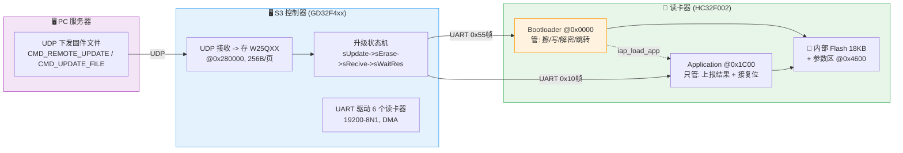

**职责切分：** PC 只管下发固件 + 收结果；S3 是升级编排者（存固件、驱动状态机、超时重传、上报结果）；读卡器 App 角色极小，Bootloader 干所有擦写活。

### 14.2 Flash 布局与共享标志（修正版）

```
0x0000 ┌──────────────────────┐
       │     Bootloader       │  7KB (0x0000~0x1BFF)
       │     升级逻辑/擦写/跳转  │
0x1C00 ├──────────────────────┤  ← APP_START_ADDR
       │     Application      │  10KB (0x2A00), 最大 42 包×256B
       │     正常读卡业务       │
0x4600 ├──────────────────────┤  ← UPD_PARAM_FLASH_ADDR
       │   BOOT_PARAM_STRU    │  512B (1 扇区)
       │   UpdateFlg 关键标志  │
0x4800 └──────────────────────┘  Flash 末尾 (共 18KB)
```

**`UpdateFlg`（@0x4604，Flash 持久化）--App↔Bootloader 唯一握手渠道：**

| 值 | 含义 | 谁设置 | Bootloader 见到后的动作 |
|---|---|---|---|
| 0xFF | 擦除态/正常 | App 上报后擦参数区 | **立即跳 App** |
| 0 (rNormal) | 正常 | - | 驻留监听 |
| 5 (rRecive) | 正在收固件 | Bootloader 的 GotoUpdate() | 驻留监听 |
| 3 (rUpdated) | 升级完成 | Bootloader 写完固件 | App 见到后发 0x03 上报 |

> ⚠️ 没有任何 RAM 共享标志，全靠 Flash @0x4600 传递。App 收 0xA0 0x05 后**直接复位，不预置 UpdateFlg**--靠 Bootloader 启动时 100ms 延时 + S3 抢发 0x81 占住总线来避免 Bootloader 跳走。

### 14.3 S3 控制器状态机（含全部失败分支）

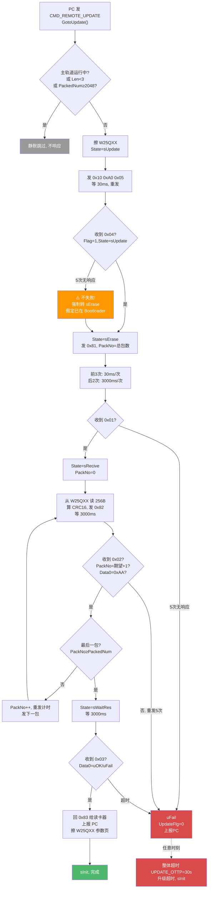

**S3 侧要点：**
- 进 Bootloader 阶段（sUpdate）5 次无响应**不判失败**，强制进入擦除阶段--故意覆盖"读卡器已停留在 Bootloader"的场景
- 所有重传由 S3 单边驱动，靠 `WaitCmdTC` 超时；读卡器从不主动要求重传
- 帧解析失败（无头/坏CMD/无尾/超长/CRC错）一律**静默丢弃**，靠超时重发

### 14.4 完整升级时序（Happy Path，三端）

```mermaid
sequenceDiagram
    participant PC as 🖧 PC
    participant S3 as 🖥️ S3 控制器
    participant App as 📱 读卡器 App
    participant BL as 🔧 Bootloader
    participant W25 as 💾 W25QXX
    participant FL as 💾 内部Flash

    Note over PC,S3: ═══ 阶段0: PC->S3 下发固件 ═══
    PC->>S3: CMD_REMOTE_UPDATE (PackedNum, Target)
    S3->>W25: 擦除 0x280000 区
    loop 2048 包内
        PC->>S3: CMD_UPDATE_FILE (PackNo+256B+CRC16)
        S3->>W25: 写页 (PackNo-1)*0x100
    end

    Note over S3,App: ═══ 阶段1: 进入 Bootloader (sUpdate) ═══
    S3->>App: 0x10 0xA0 0x05
    App->>App: NVIC_SystemReset()
    Note over BL: MCU 复位, Bootloader 先跑
    BL->>S3: CMD 0x04 (alive)
    S3->>S3: 收到 0x04 -> State=sErase

    Note over S3,BL: ═══ 阶段2: 擦除 (sErase) ═══
    S3->>BL: CMD 0x81, PackNo=总包数
    BL->>FL: 擦 21 个扇区 0x1C00~0x45FF
    BL->>FL: 写 UpdateFlg=rRecive @0x4600
    BL->>S3: CMD 0x01 (确认)
    S3->>S3: State=sRecive, PackNo=0

    Note over S3,BL: ═══ 阶段3: 传固件 (sRecive) ═══
    loop 每包 1..N
        S3->>W25: 读 256B @ (PackNo)*0x100
        S3->>BL: CMD 0x82, PackNo, Data[256], CRC16
        BL->>BL: 序号校验 + CRC16 校验
        BL->>BL: XOR 解密 (密钥 603337)
        BL->>FL: 写 0x1C00+(PackNo-1)*0x100
        BL->>S3: CMD 0x02, PackNo, uOK(0xAA)
        S3->>S3: PackNo++
    end

    Note over BL: ═══ 阶段4: 完成, 跳新 App ═══
    BL->>BL: 检查 GetPackFlag[1..N] 全1
    BL->>FL: 写 UpdateFlg=rUpdated @0x4600
    BL->>App: iap_load_app(0x1C00)<br/>校验栈指针 -> 设MSP -> 跳复位向量

    Note over App: ═══ 阶段5: 新 App 上报结果 ═══
    App->>App: RemoteUpdateInit() 见 rUpdated
    App->>S3: CMD 0x03, 版本, uOK(0xAA)
    App->>FL: 擦 0x4600 (UpdateFlg->0xFF)
    S3->>App: CMD 0x83 (ACK)
    S3->>PC: 上报升级结果
    S3->>W25: 擦参数Flash页
    Note over PC,S3: ✅ 升级完成
```

### 14.5 Bootloader 接收流程与失败分支树

这是失败分支最密集的部分。Bootloader **无看门狗、无重传逻辑**，所有错误要么静默丢弃、要么卡死。

```mermaid
flowchart TD
    Boot["Bootloader 启动"] --> RInit["读 0x4600 -> UpdateFlg"]
    RInit --> FC{"UpdateFlg?"}
    FC -->|"0xFF"| TryJ["主循环: 无UART数据->跳App"]
    FC -->|"0(rNormal)"| Stay["驻留监听"]
    FC -->|"其他"| Rep["发 0x03 报错 -> 驻留"]

    Stay --> Recv["收 0x55 帧"]
    Recv --> Prase{"UPD_RFID_Prase"}
    Prase -->|"无0x55头/CMD≤0x80/无0xAA尾/超长"| Drop1["静默丢弃<br/>不发NACK"]
    Prase -->|"CRC不匹配"| Drop1
    Prase -->|"OK"| Disp{"CMD?"}

    Disp -->|"0x81"| GU["GotoUpdate()"]
    GU --> Gchk{"Len<4 或<br/>PackedNum>42?"}
    Gchk -->|"是"| Drop2["静默中止<br/>不回任何响应"]
    Gchk -->|"否"| GErase["擦21扇区<br/>写 rRecive<br/>回 0x01"]
    GErase -.->|"擦除返回值未检查"| GErase

    Disp -->|"0x82"| UFR["UpdateFileRecv()"]
    UFR --> U1{"WorkState==sRecive?"}
    U1 -->|"否"| Drop3["静默丢弃"]
    U1 -->|"是"| U2{"PackNo==期望+1?"}
    U2 -->|"否"| Drop3
    U2 -->|"是"| U3{"Len>256?"}
    U3 -->|"是"| Drop4["⚠️ 静默忽略<br/>但落入末包检查!"]
    U3 -->|"否"| U4{"PackNo越界?"}
    U4 -->|"是"| Nack["回 0x02+uFail"]
    U4 -->|"否"| U5{"CRC匹配?"}
    U5 -->|"否"| Drop5["静默丢弃<br/>NACK代码被注释"]
    U5 -->|"是"| U6{"重复包?"}
    U6 -->|"是"| Half["半扇区擦除+重写"]
    U6 -->|"否"| Dec["XOR解密->写Flash"]
    Dec --> U7{"Flash写成功?"}
    U7 -->|"否"| BUG1["⚠️ WorkState=sFail<br/>但仍回 uOK 且置 flag=1!"]
    U7 -->|"是"| OK1["回 0x02+uOK<br/>GetPackFlag=1"]
    Half --> Dec

    OK1 --> Last{"最后一包?<br/>PackNo==PackedNum"}
    BUG1 --> Last
    Last -->|"否"| Recv
    Last -->|"是"| Comp{"GetPackFlag 全1?"}
    Comp -->|"有缺包"| Stuck1["sFail, 卡死<br/>不发错误, 无看门狗"]
    Comp -->|"全1, 但写过失败"| BUG2["⚠️ 跳损坏App<br/>App看门狗3.2s复位<br/>->回Bootloader可恢复"]
    Comp -->|"全1, 都成功"| Fin["写 rUpdated<br/>iap_load_app"]
    Fin --> SP{"栈指针合法?"}
    SP -->|"否"| Stuck2["静默返回, 卡死<br/>UpdateFlg=rUpdated≠0xFF"]
    SP -->|"是"| Jump["跳新App ✓"]

    Nack --> Recv
    Drop1 --> Recv
    Drop3 --> Recv
    Drop5 --> Recv

    Stay -.->|"4秒无包"| TO["超时 sInit<br/>卡死, 无看门狗"]

    style Drop1 fill:#999,color:#fff
    style Drop2 fill:#999,color:#fff
    style Drop3 fill:#999,color:#fff
    style Drop4 fill:#FF9800,color:#fff
    style Drop5 fill:#999,color:#fff
    style Nack fill:#FFC107,color:#000
    style BUG1 fill:#D94A4A,color:#fff
    style BUG2 fill:#D94A4A,color:#fff
    style Stuck1 fill:#D94A4A,color:#fff
    style Stuck2 fill:#D94A4A,color:#fff
    style TO fill:#D94A4A,color:#fff
    style Jump fill:#50B86C,color:#fff
```

### 14.6 各阶段失败分支速查

**阶段 0（PC->S3 文件接收）：**

| 条件 | 位置 | 处理 |
|---|---|---|
| 主轨道运行中 | S3 RemoteUpdate.c:143 | 静默跳过 |
| `Len<3` / `PackedNum≥2048` | S3 :146,152 | 跳过升级 |
| 单包 `Len>256` | S3 :217 | 丢弃该包 |
| PackNo 越界 | S3 :223,254 | 回 PC `uFail` |
| CRC 不匹配 | S3 :227,247 | `GetPackFlag=0`，回 `uFail` |
| 末包到齐但有空缺 | S3 :264 | `sFail`，面板"文件接收不完整" |

**阶段 1（进 Bootloader）：**

| 条件 | S3 处理 |
|---|---|
| 应用无响应（5×30ms） | **不失败**，强制转 sErase（覆盖读卡器已在 Bootloader 场景） |
| App 损坏/已在 Bootloader | 同上，S3 直接发 0x81 |

**阶段 2（擦除/启动）：**

| 条件 | S3 | Bootloader |
|---|---|---|
| 0x81 无响应 | 5 次重发(前3×30ms,后2×3s)->uFail | - |
| `Len<4` 或 `PackedNum>42` | S3 超时重发 | **静默中止，不回响应** |
| Flash 扇区擦除失败 | - | **返回值未检查**，继续 |
| 参数区写失败 | - | **返回值未检查** |

**阶段 3（传固件，分支最多）：**

| 条件 | S3 处理 | Bootloader 处理 |
|---|---|---|
| 单包无ACK/错序/Data0≠uOK | 忽略响应，3s 超时重发 | - |
| 单包重发 5 次失败 | uFail，上报 PC | - |
| 帧解析失败(无头/坏CMD/无尾/超长) | 超时重发 | **静默丢弃，不发NACK** |
| CRC 不匹配 | 超时重发 | **静默丢弃，NACK代码被注释** |
| 序号不对 | 超时重发 | 静默丢弃 |
| `Len>256` | - | ⚠️ **静默忽略但落入末包检查** |
| PackNo=0 或 >PackedNum 或 >42 | - | 回 0x02+uFail |
| 重复包 | - | 半扇区擦除+重写 |
| **Flash 写失败** | - | ⚠️ **sFail 但仍回 uOK 且置 flag=1（致命Bug）** |

**阶段 4（完成/跳转）：**

| 条件 | 处理 | 后果 |
|---|---|---|
| 末包到但 GetPackFlag 有空缺 | sFail，不发错误，**卡死** | 无看门狗，需手动复位 |
| 末包 Flash 写失败但 flag=1 | 完整性通过->**跳损坏App** | ⚠️ App 跑飞，看门狗 3.2s 复位 -> 回 Bootloader 可重新升级 |
| iap_load_app 栈指针非法 | 静默返回 | Bootloader 卡死（rUpdated≠0xFF 永不跳） |
| 参数区写 rUpdated 失败 | 未检查 | 复位后见旧 rRecive->发 0x03 错误 |

**阶段 5（结果上报）：**

| 条件 | S3 处理 |
|---|---|
| sWaitRes 3s 无 0x03 | uFail，上报 PC |
| 收 0x03 含 uFail | 记录上报 PC |
| 整体超时 30s | "升级超时"，sInit |

### 14.7 关键缺陷与风险

```mermaid
%%elk%%
flowchart LR
    subgraph 恢复["🟢 兜底机制 (保证不变砖)"]
        R1["App 启用 IWDT 看门狗<br/>3.2s 超时, 溢出=复位<br/>main.c:75-76启动, :97喂狗"]
        R2["Bootloader 区 0x0000~0x1BFF<br/>升级中永不被擦写<br/>永远完好可兜底"]
        R3["UpdateFlg≠0xFF 时 Bootloader 驻留<br/>0x81 来者不拒, 可重新升级"]
    end

    subgraph 数据["🔴 数据完整性缺陷 (会短暂死机, 但可恢复)"]
        B1["Flash写失败仍回uOK<br/>+ 置flag=1<br/>-> 末包跳损坏App<br/>看门狗复位后恢复"]
        B2["Len>256 静默忽略<br/>-> 误触发末包完成<br/>同理可恢复"]
    end

    subgraph 卡死["🟠 Bootloader 卡死风险 (无看门狗)"]
        C1["Bootloader 未启用看门狗<br/>(App 启用了, BL 没有)"]
        C2["栈指针非法 -> 静默返回<br/>UpdateFlg=rUpdated≠0xFF 永不跳App"]
        C3["GetPackFlag缺包 -> sFail<br/>不发错误, 但0x81仍可救"]
    end

    subgraph 效率["🟡 效率/鲁棒性问题"]
        E1["Bootloader 无重传逻辑<br/>全靠 S3 超时(3s)重发"]
        E2["CRC错/序号错/解析错<br/>一律静默丢弃, 无NACK"]
        E3["擦除/参数写返回值<br/>全部未检查"]
    end

    subgraph 时序["🟡 时序脆弱"]
        T1["App 收复位后不预置UpdateFlg<br/>靠100ms延时+S3抢发0x81占总线"]
        T2["进Bootloader 5次无响应不失败<br/>依赖读卡器已在Bootloader"]
    end

    subgraph 现场["🟡 现场运维风险"]
        F1["恢复依赖 PC/S3 重新发起升级<br/>若PC不自动重试, 读卡器停在Bootloader"]
        F2["停留在Bootloader期间不读卡不上报<br/>现场表现为死机, 易被误判为变砖"]
    end

    subgraph 死代码["⚪ 架构问题"]
        D1["App 的 CmdProtocol.c 未编译<br/>GotoUpdate被注释<br/>符号未定义"]
    end

    R1 -.->|"兜底"| B1
    R2 -.->|"兜底"| B1
    R3 -.->|"兜底"| C3

    style R1 fill:#50B86C,color:#fff
    style R2 fill:#50B86C,color:#fff
    style R3 fill:#50B86C,color:#fff
    style B1 fill:#FF9800,color:#fff
    style B2 fill:#FF9800,color:#fff
    style C1 fill:#FFC107,color:#000
    style C2 fill:#FFC107,color:#000
    style C3 fill:#FFC107,color:#000
    style E1 fill:#FFC107,color:#000
    style E2 fill:#FFC107,color:#000
    style E3 fill:#FFC107,color:#000
    style T1 fill:#FFC107,color:#000
    style T2 fill:#FFC107,color:#000
    style F1 fill:#FFC107,color:#000
    style F2 fill:#FFC107,color:#000
    style D1 fill:#999,color:#fff
```

### 14.8 超时与重传常量速查

| 常量 | 值 | 侧 | 作用 |
|---|---|---|---|
| `UPDATE_OTTP` | 30000ms | S3 | 整体升级超时 |
| `RFID_WAIT_OTTP` | 3000ms | S3 | 单步/单包响应超时 |
| `RESEND_CNT` | 5 | S3 | 每步最大重发（sUpdate 不失败） |
| sUpdate 单次 | 30ms | S3 | 进 Bootloader 响应超时 |
| sErase 前 3 次 | 30ms | S3 | 擦除响应 |
| sErase 后 2 次 | 3000ms | S3 | 留足擦除时间 |
| sRecive 单包 | 3000ms | S3 | 单包 ACK 超时 |
| sWaitRes | 3000ms | S3 | 最终结果超时 |
| `UPDATE_OTTP` | 8000 (≈4s) | Bootloader | 升级整体超时（500us×8000） |
| UART 帧间隔 | ~500us | Bootloader | `Usart_TimeOut_Num=100`×5us |
| 心跳 | 250ms | Bootloader | `Boot_Send_Timer=50000`×5us |
| `PACK_MAX` | 2048 / 42 | S3 / Bootloader | 最大包数（读卡器受 42 限，≤10KB） |
| `U_FILE_MAX` | 256B | 两侧 | 单包数据 |
| 解密 | XOR "603337" | Bootloader | 仅 Bootloader 解密，W25QXX 存密文 |

### 14.9 关键源码位置索引

| 角色 | 文件 | 关键函数 |
|---|---|---|
| S3 编排 | `APP\RemoteUpdate.c` | `GotoUpdate()`:132, `UpdateFileRecv()`:206, `RemoteUpdate()`:347, `UPD_toRFIDReader()`:738 |
| S3 通信 | `APP\RFIDReader.c` | `RFID_UPD_START()`:765, `UPD_RFID_Recv()`:680, `UPD_RFID_Prase()`:599 |
| S3 UDP 入口 | `APP\UDP_Comu.c` | :337(触发), :342(文件) |
| 读卡器 App | `midware\RFID\RFID.c` | `Read_Mode_Change()`:926(接复位) |
| 读卡器 App | `midware\REMOTEUPDATE\RemoteUpdate.c` | `RemoteUpdateInit()`:23(上报结果) |
| Bootloader 主 | `source\main.c` | :51(启动决策), :65(跳转/监听) |
| Bootloader 升级 | `midware\REMOTEUPDATE\RemoteUpdate.c` | `GotoUpdate()`:78, `UpdateFileRecv()`:131, `iap_load_app()`:275 |
| Bootloader 解帧 | `midware\CMDPROTOCOL\CmdProtocol.c` | `UPD_RFID_Prase()`:11, `UPD_RFID_Recv()`:93 |
| Bootloader 超时 | `midware\TIMCap\TIMCap.c` | :90(升级超时) |
| Flash 驱动 | `driver\src\flash.c` | `FLASH_SectorErase`:464, `FLASH_WriteByte`:235 |

### 14.10 失败后会不会变砖？（恢复机制分析）

> **结论：OTA 失败不会让读卡器永久变砖。** Bootloader 兜底 + App 看门狗保证可重新升级。但恢复依赖 PC/S3 重新发起，停留 Bootloader 期间现场表现为"死机"。

#### 三道兜底机制

```mermaid
flowchart TD
    Fail["升级失败<br/>(App区损坏/状态异常)"] --> Q1{"谁先发现?"}

    Q1 -->|"App跑飞, 3.2s没喂狗"| WD["🟢 App IWDT 看门狗复位<br/>溢出动作=RESET"]
    Q1 -->|"S3 主动重试"| S3R["S3 发 0x10 0xA0 0x05 复位"]
    Q1 -->|"人工干预"| PWR["断电重启"]

    WD --> Boot["Bootloader 启动 @0x0000"]
    S3R --> Boot
    PWR --> Boot

    Boot --> Flg{"读 UpdateFlg @0x4600"}
    Flg -->|"0xFF"| JumpBad["⚠️ 若App损坏, 跳过去又跑飞<br/>看门狗再复位, 循环"]
    Flg -->|"rRecive/rUpdated/其他"| Stay["✅ 驻留监听<br/>不跳App"]

    Stay --> Recv81["等 S3 发 0x81"]
    Recv81 --> ReUp["重新升级 -> 恢复 ✓"]

    JumpBad -.->|"看门狗循环<br/>但UpdateFlg会被App改写?"| Loop["见下文分析"]

    style WD fill:#50B86C,color:#fff
    style Stay fill:#50B86C,color:#fff
    style ReUp fill:#50B86C,color:#fff
    style JumpBad fill:#FF9800,color:#fff
    style Loop fill:#FFC107,color:#000
```

#### 兜底一：Bootloader 区永不被擦写

升级时擦写范围严格限定在 `0x1C00~0x45FF`（App 区）。Bootloader 自身位于 `0x0000~0x1BFF`，升级流程从不动它。所以无论 App 区怎么损坏，**Bootloader 永远完好**，是兜底的恢复入口。

#### 兜底二：App 启用了看门狗

读卡器 **App** 启用了 IWDT 独立看门狗（[main.c:75-76](D:\Reader\HC32F002_DDL_Rev1.2.0（卡号错误问题解决优化版）\example\gtimer\gtimer_timer\source\main.c) 启动，[main.c:97](D:\Reader\HC32F002_DDL_Rev1.2.0（卡号错误问题解决优化版）\example\gtimer\gtimer_timer\source\main.c) 主循环喂狗）：

- 超时时间：**3.2s**（`u32ArrCounter=109`, `IWDT_RC10K_DIV_32`，[IWDT.c:181-185](D:\Reader\HC32F002_DDL_Rev1.2.0（卡号错误问题解决优化版）\midware\IWDT\IWDT.c)）
- 溢出动作：**复位**（`IWDT_OVER_RESET__SLEEPMODE_STOP`）

所以"跳转到损坏 App"不会永久卡死--损坏的 App 跑飞后 3.2s 内不喂狗，看门狗自动复位，重新进 Bootloader。

> ⚠️ 注意：是 **App 启用了看门狗，Bootloader 没启用**（Bootloader 的 `App_WdtInit()` 从未被调用）。但 Bootloader 主循环是 `while(1)` 持续查 UART，没有会阻塞的分支，实际不会卡死。

#### 兜底三：UpdateFlg 状态机保证可重新升级

Bootloader 启动时读 `UpdateFlg`：
- `0xFF` -> 跳 App
- 其他任何值（`rRecive`/`rUpdated`/异常值）-> **驻留监听**

而 `case 0x81: GotoUpdate()` **无状态检查**--无论 `WorkState` 是什么，收到 0x81 就重新开始升级。所以一旦 Bootloader 驻留，S3 随时发 0x81 就能救回来。

#### 唯一的死循环风险（需现场注意）

若升级失败后 `UpdateFlg` 恰好是 `0xFF`（参数区写失败导致），Bootloader 会跳损坏 App -> 看门狗复位 -> 再跳 -> 再复位...形成**复位风暴**。但这不会变砖，S3 在复位间隙发的 0x81 能被 Bootloader 收到（Bootloader 启动时先发 0x04 延时 100ms，这期间 UART ISR 活跃），抓住窗口即可重新升级。

实际上更常见的情况是失败后 `UpdateFlg` 保持 `rRecive`(5)，Bootloader 直接驻留，连复位风暴都不会有。

#### 真正的现场风险

```mermaid
flowchart LR
    A["OTA 失败"] --> B["读卡器停在 Bootloader 驻留"]
    B --> C{"PC/S3 是否自动重新发起升级?"}
    C -->|"是"| D["✅ 自动恢复"]
    C -->|"否, 只报错给PC"| E["读卡器持续不读卡/不上报"]
    E --> F["现场表现为'死机不工作'<br/>易被误判为'变砖'"]
    F --> G["实际硬件完好<br/>PC 重新点一次升级即恢复"]

    style D fill:#50B86C,color:#fff
    style F fill:#D94A4A,color:#fff
    style G fill:#50B86C,color:#fff
```

**所以运维要点：** PC 端收到 `uFail` 后应自动重试升级，而不是只报警等人工。只要 PC 自动重试，失败后读卡器能无人干预自愈；若 PC 不重试，需人工在 PC 上重新触发升级（无需到现场拆机）。


# 协议需求
## 主程序协议
## 原SR2/SR3内容
**接收指令**（控制器 -> 读卡器）

| 序号  | 完整字节序列     | 语义               | S2  | S3  | 实际实现 |
| :-: | ---------- | ---------------- | :-: | :-: | :--: |
|  1  | `10 FF 7A` | 进站查询 + 切模式1+设置位置 |  ✅  |  ✅  |  ✅   |
|  2  | `10 FF 75` | 下放查询 + 切模式1+设置位置 |  ✅  |  ✅  |  ✅   |
|  3  | `10 A0 05` | 复位（进Bootloader）  |  ❌  |  ✅  |  ✅   |
|  4  | `10 FF 9A` | 进站 + 切模式2+设置位置   |  ❌  |  ❌  |  ✅   |
|  5  | `10 FF 95` | 下放 + 切模式2+设置位置   |  ❌  |  ❌  |  ✅   |
|  6  | `10 FF 9D` | 切模式3 连续上报        |  ❌  |  ❌  |  ✅   |
|  7  | `10 FF 90` | 查版本              |  ❌  |  ❌  |  ✅   |

**发送指令**（读卡器 -> 控制器）

| 序号  | 完整字节序列                          | 语义                | S2  | S3  | 实际实现 |
| :-: | ------------------------------- | ----------------- | :-: | :-: | :--: |
|  1  | `10 FF 05 AA BB CC DD EE`       | 卡号包 (模式1)         |  ✅  |  ✅  |  ✅   |
|  2  | `10 FF 04 46 61 69 6C`          | Fail包 (模式1)       |  ❌  |  ✅  |  ✅   |
|  3  | `10 FF 07 56 65 72 30 33 31 30` | 版本包 "Ver0310"     |  ❌  |  ❌  |  ✅   |
|  4  | `10 FF 05 AA BB CC DD EE XX`    | 卡号包+BCC (模式2/3)   |  ❌  |  ❌  |  ✅   |
|  5  | `10 FF 04 46 61 69 6C XX`       | Fail包+BCC (模式2/3) |  ❌  |  ❌  |  ✅   |


# 升级需求
