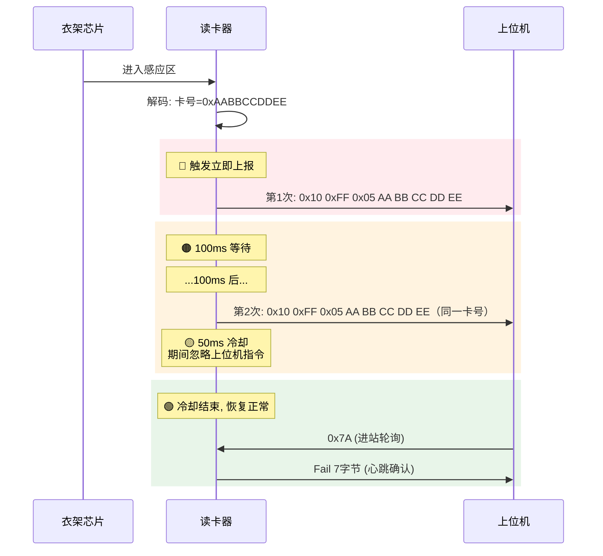
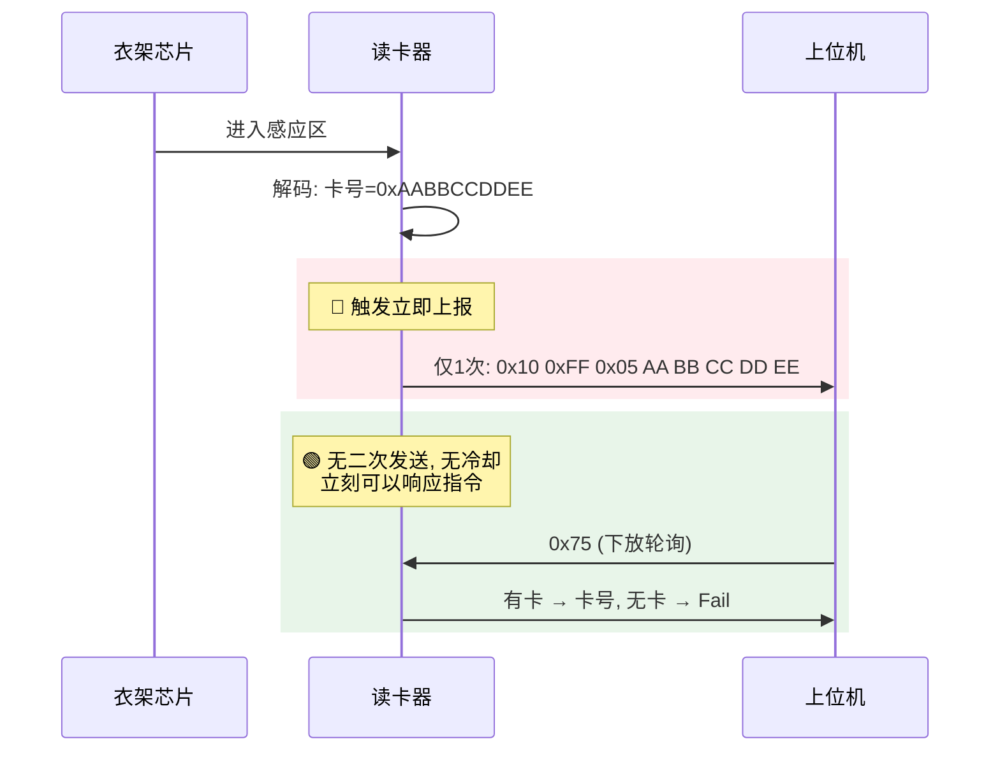
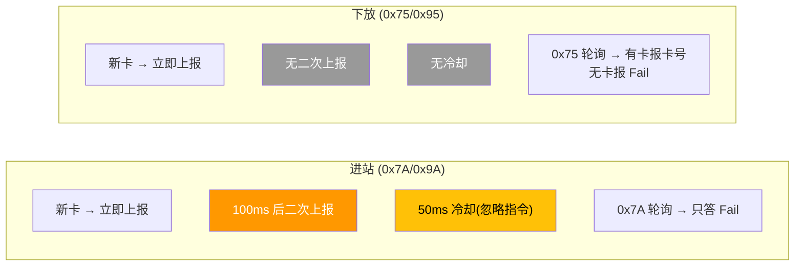
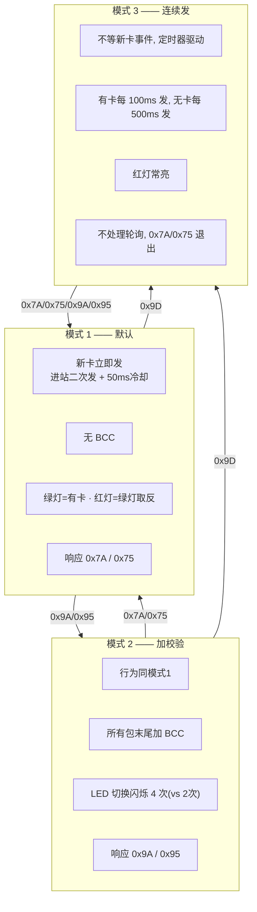
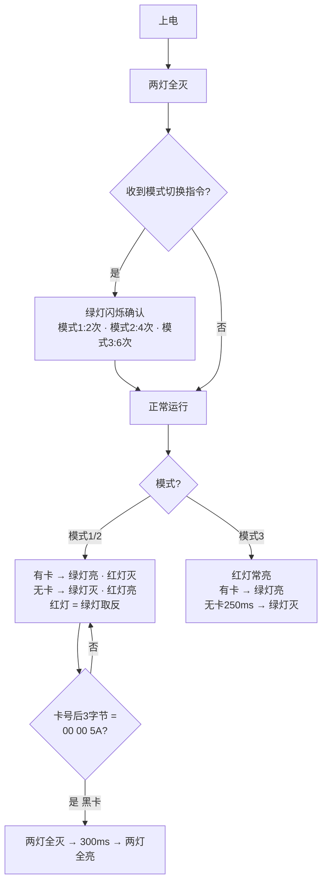
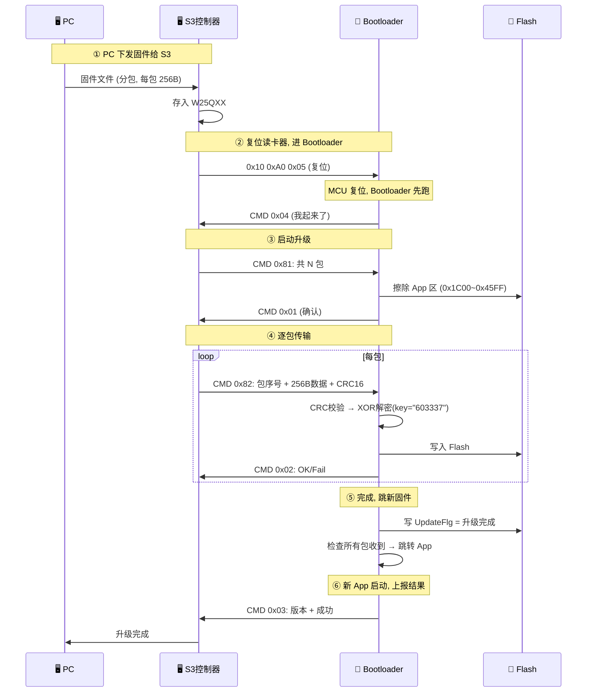
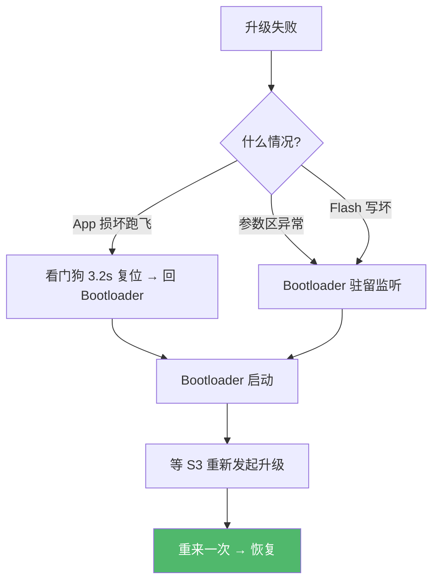

# SR2 / SR3 读卡器 —— 行为参考文档

> 新 SR3 开发对照手册。重点描述行为、时序、功能，不扣代码细节。

---

# 一、通信协议

## 接收指令（上位机 → 读卡器）

| 字节序列       | 语义                  | SR2 | SR3 | 2代控制器 | S3控制器 |
| ---------- | ------------------- | --- | --- | ----- | ----- |
| `10 FF 7A` | 进站查询 + 切模式1 + 设进站方向 | ✅   | ✅   | ✅     | ✅     |
| `10 FF 75` | 下放查询 + 切模式1 + 设下放方向 | ✅   | ✅   | ✅     | ✅     |
| `10 FF 9A` | 进站 + 切模式2（带BCC）     | ❌   | ✅   | ❌     | ❌     |
| `10 FF 95` | 下放 + 切模式2（带BCC）     | ❌   | ✅   | ❌     | ❌     |
| `10 FF 9D` | 切模式3（连续上报）          | ❌   | ✅   | ❌     | ❌     |
| `10 FF 90` | 查询版本号               | ❌   | ✅   | ❌     | ❌     |
| `10 A0 05` | 系统复位（进Bootloader）   | ❌   | ✅   | ❌     | ✅     |

## 发送指令（读卡器 → 上位机）

| 字节序列                            | 语义                 | 模式  | SR2 | SR3 | 2代控制器 | S3控制器 |
| ------------------------------- | ------------------ | --- | --- | --- | ----- | ----- |
| `10 FF 05 + 5字节卡号`              | 卡号包，8字节            | 1   | ✅   | ✅   | ✅     | ✅     |
| `10 FF 04 46 61 69 6C`          | Fail包，7字节          | 1   | ✅   | ✅   | ✅     | ✅     |
| `10 FF 05 + 5字节卡号 + BCC`        | 卡号包带校验，9字节         | 2/3 | ❌   | ✅   | ❌     | ❌     |
| `10 FF 04 46 61 69 6C + BCC`    | Fail包带校验，8字节       | 2/3 | ❌   | ✅   | ❌     | ❌     |
| `10 FF 01 56 65 72 30 33 31 30` | 版本包 "Ver0310"，10字节 | -   | ❌   | ✅   | ❌     | ❌     |

## 忙保护

读卡器正在发卡号时，上位机指令会被**忽略**。：
- 串口正在发送中
- 进站 100ms 等待期 
- 进站 50ms 冷却期

**但忙保护不阻止新卡上报**——新卡来了照样发。

---

# 位置行为


## 进站

衣架从主轨道滑进工位——需要确保上位机**一定收到**卡号，所以多发一次：



- **两次上报间隔 100ms**，上位机在轮询间隙也能收到
- **50ms 冷却**防止二次发送被轮询打断
- **0x7A 轮询只应答 Fail，不报卡号**——卡号早已主动报过了
- **冷却结束后才响应上位机指令**，冷却期内指令静默忽略

## 下放



- **只发一次**
- **0x75 轮询可查当前有无卡**：有卡报卡号，无卡报 Fail

## 进站 vs 下放 对比



## 新卡打断规则

**新卡优先级最高，随时打断任何流程。** 100ms 等待期、50ms 冷却期、只要检测到新卡号，立刻切新卡上报。

| 场景           | 结果                  |
| ------------ | ------------------- |
| 100ms 等待中来新卡 | 立即发新卡，原卡二次发送取消      |
| 50ms 冷却中来新卡  | 立即发新卡，重新开始 100ms 计时 |
| 发送中来新卡       | 等当前发送完（约 20ms）→ 发新卡 |

## 3.5 三种模式



| 维度 | 模式 1 | 模式 2 | 模式 3 |
|---|---|---|---|
| 进入指令 | 0x7A / 0x75 | 0x9A / 0x95 | 0x9D |
| 上报驱动 | 新卡事件 | 新卡事件 | 定时器 |
| 进站二次发 | ✅ | ✅ | 不适用 |
| 50ms 冷却 | ✅ | ✅ | ❌ |
| BCC | ❌ | ✅ | ✅ |
| 红灯 | 绿灯取反 | 绿灯取反 | 常亮 |

---

# 四、LED 行为

## 4.1 SR2（极简）


无模式切换闪烁、无红绿互斥、无黑卡处理。

## 4.2 SR3



### 模式切换时 LED 闪烁

切换到新模式时，绿灯快速闪烁以示确认：
- 切模式1：闪 2 次
- 切模式2：闪 4 次
- 切模式3：闪 6 次

### 黑卡

读到特殊衣架芯片（卡号以 `00 00 5A` 结尾）时：两灯全灭 → 等 300ms → 两灯同时亮。用于标识特定设备/推车。

---

# 五、固件升级

读卡器固件可通过串口远程升级，不需要拆机烧录。

## 5.1 升级架构


三端协作：PC 下发 → S3 控制器编排 → 读卡器 Bootloader 执行。

## 5.2 Flash 划分

```
0x0000 ┌──────────────┐
       │  Bootloader  │  7KB, 上电先跑, 永不被擦
0x1C00 ├──────────────┤
       │ Application  │  10KB, 存放读卡业务
0x4600 ├──────────────┤
       │  参数区       │  512B, Bootloader 和 App 共享
0x4800 └──────────────┘
```

## 5.3 升级流程



## 5.4 升级帧格式（与日常 0x10 帧不同）

```
上位机 → 读卡器:
┌──────┬─────┬──────────┬──────────┬──────────────┬──────────┬──────┐
│ 0x55 │ CMD │ Len(LE)  │ PackNo   │ Data[Len]    │ CRC16 LE │ 0xAA │
└──────┴─────┴──────────┴──────────┴──────────────┴──────────┴──────┘

读卡器 → 上位机:
┌──────┬─────┬──────────┬──────────────┬──────────┬──────┐
│ 0x55 │ CMD │ Len(LE)  │ Data[Len]    │ CRC16 LE │ 0xAA │
└──────┴─────┴──────────┴──────────────┴──────────┴──────┘
```

## 5.5 命令速查

| CMD | 方向 | 干什么 |
|---|---|---|
| 0x81 | 上位机→BL | 启动升级（告知总包数） |
| 0x82 | 上位机→BL | 发送一包数据 |
| 0x83 | 上位机→BL | 查询升级结果 |
| 0x01 | BL→上位机 | 启动确认 |
| 0x02 | BL→上位机 | 数据包 ACK |
| 0x03 | App→上位机 | 升级结果报告 |
| 0x04 | BL→上位机 | Bootloader 启动通知 |

## 5.6 安全机制

- **CRC16-USB** 校验每包数据
- **XOR 加密**传输（密钥 "603337"，6 字节循环）
- **包序号**严格递增，跳跃丢弃
- **重传**：S3 最多重发 5 次
- **超时**：S3 整体 30s，单步 3s；Bootloader 约 4s

## 5.7 失败了怎么办



**结论：OTA 失败不会变砖。** Bootloader 区永不被擦，App 有看门狗兜底。只要 PC/S3 重新发起升级就能恢复。

---

# 六、SR2 ↔ SR3 差异与兼容

## 6.1 兼容基线

上位机**只发 0x7A 和 0x75** 时，SR2 和 SR3 行为完全一致，可以直接互换。

## 6.2 差异总览


| 维度 | SR2 | SR3 |
|---|---|---|
| MCU | STC15W4K32S4 (32KB) | HC32F002 (18KB) |
| 指令数 | 2 条 | 7 条 |
| 模式 | 只有模式1 | 模式1/2/3 |
| BCC 校验 | ❌ | 模式2/3 ✅ |
| 校验关数 | 行+列 (2关) | 停止位+行+列 (3关) |
| LED | 红=上电亮, 绿=有卡亮 | 红绿互斥, 模式闪烁, 黑卡时序 |
| 看门狗 | ❌ | ✅ ~3.2s |
| 远程升级 | ❌ | ✅ |
