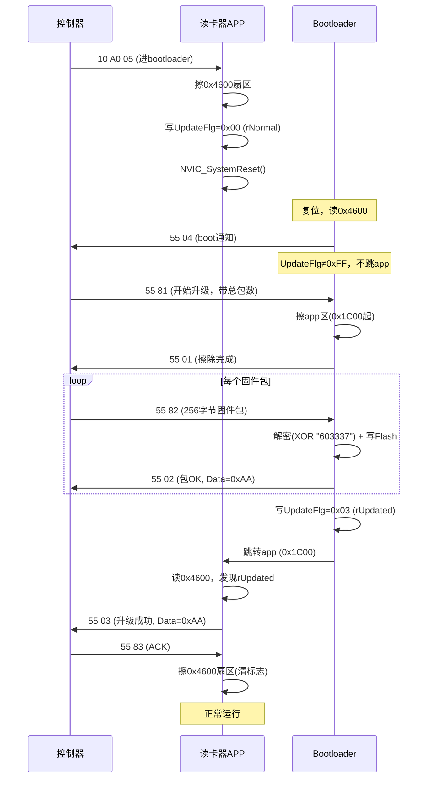
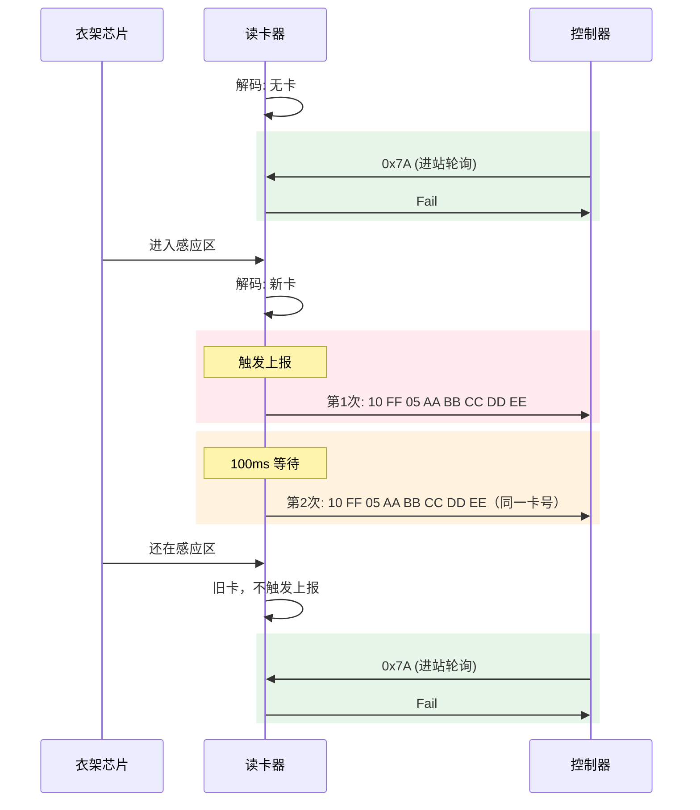
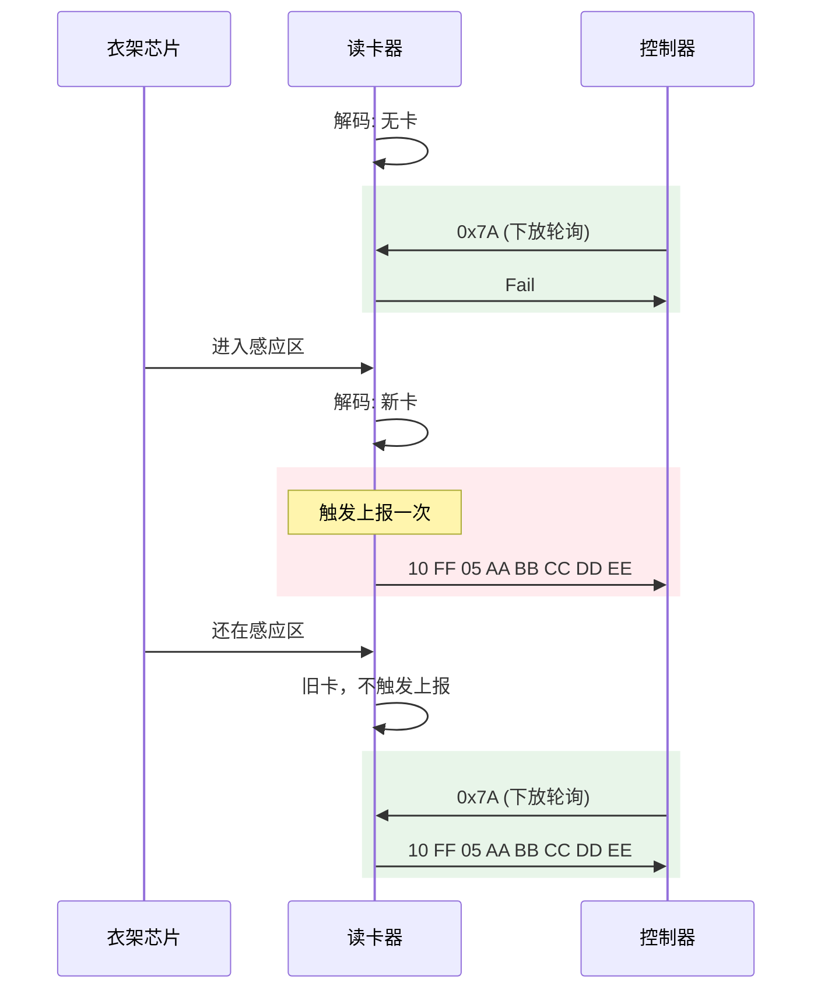
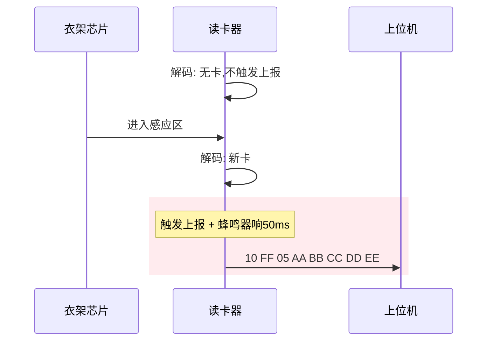
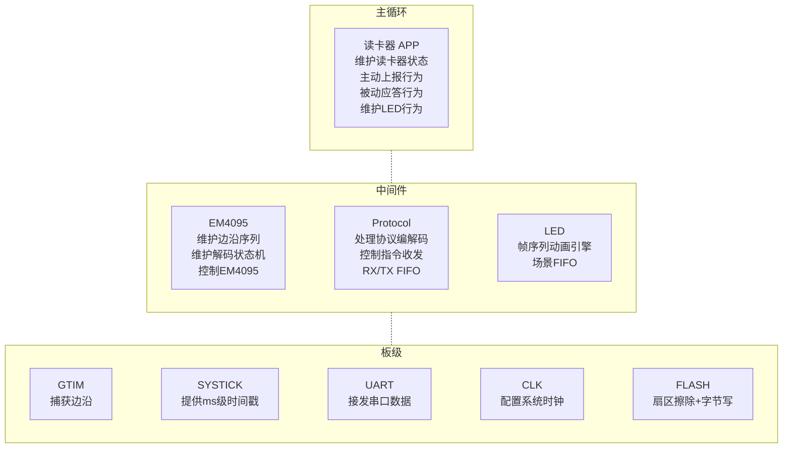
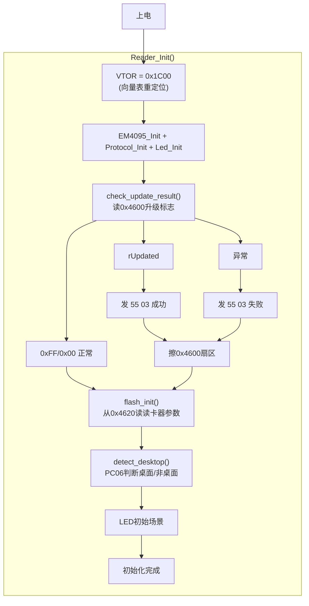
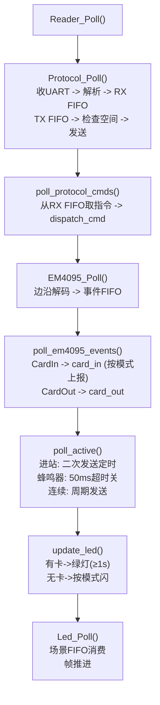
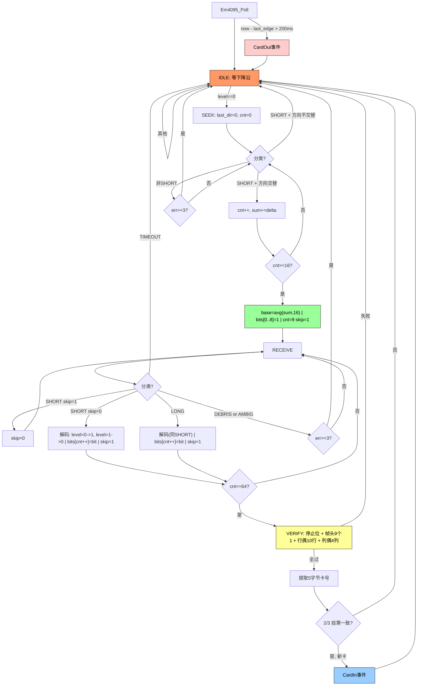

## TODO

> [!todo] 待实现
> - 连续模式无卡时上报间隔不一样：500ms，预留设置指令
> - LED动画进一步细化（不同模式特殊动画）
> - 可视化模式
> - 考虑异常衣架上报，固定卡号，延迟判断 \[A]，\[A B]
> - 特殊卡号亮黄灯：是否要多个特殊卡号，增加更改指令

# 需求

## Flash 布局

| 地址 | 大小 | 用途 | 谁读写 |
| :--: | :--: | :--- | :----- |
| 0x0000 | 7KB | Bootloader | 仅 bootloader |
| 0x1C00 | 10.5KB | 主程序 | 仅 app |
| 0x4600 | 6B | BootParam_t (升级标志) | bootloader + app |
| 0x4620 | ~10B | FlashParams_t (读卡器参数) | 仅 app |

> [!note] 扇区共享
> 0x4600 和 0x4620 共享同一个 512B 扇区。正常工作时升级标志是 0xFF（擦除态），互不干扰。升级时整个扇区被擦，读卡器参数回到默认值。

## 升级 (IAP)

### 升级流程



### 0x55 协议帧格式

```
字节:  0     1     2-3        4-5         6~6+Len-1      6+Len  7+Len   8+Len
       0x55  CMD   Len(小端)  PackNo(大端) Data[Len]      CRC_HB CRC_LB  0xAA
```

- CRC: CRC-16/USB (poly=0x8005, init=0xFFFF, refin/refout, xorout=0xFFFF)，仅对 Data 计算
- PackNo/CRC: **大端**（控制器按大端解析）
- Len: 小端

### 升级标志值

| 值 | 名称 | 含义 |
| :--: | :--- | :--- |
| 0xFF | (擦除态) | 正常，bootloader 直接跳 app |
| 0x00 | rNormal | bootloader 不跳 app，等命令 |
| 0x05 | rRecive | 接收中 |
| 0x03 | rUpdated | 升级完成，app 上报后擦除 |

## 通信协议

### 指令表
长度不在协议中体现，靠约定长度来进行解析。
**`0xFF`**:卡号相关
**`0xA0`**:下发设置和查询相关，控制器设置参数或查询数据
`0xA1`:上报信息相关，读卡器上报参数

#### **接收指令**（控制器 -> 读卡器）
| HEAD | TYPE | CMD  |          DATA          |          完整字节序列          |                                   功能                                    | 约定数据长度 | 备注               |
| :--: | :--: | :--: | :--------------------: | :----------------------: | :---------------------------------------------------------------------: | :----: | ---------------- |
| 0x10 | 0xFF | 0x7A |           无            |        `10 FF 7A`        |                            进站查询+失能BCC+切进站模式                             |   3    | 功能使能以及模式不存flash  |
| 0x10 | 0xFF | 0x75 |           无            |        `10 FF 75`        |                            下放查询+失能BCC+切下放模式                             |   3    | 功能使能以及模式不存flash  |
| 0x10 | 0xFF | 0x9A |           无            |        `10 FF 9A`        |                            进站查询+使能BCC+切进站模式                             |   3    | 功能使能以及模式不存flash  |
| 0x10 | 0xFF | 0x95 |           无            |        `10 FF 95`        |                            下放查询+使能BCC+切下放模式                             |   3    | 功能使能以及模式不存flash  |
| 0x10 | 0xA0 | 0x01 |           无            |        `10 A0 01`        |                         查询读卡器版本+模式                              |   3    |                  |
| 0x10 | 0xA0 | 0x02 |           模式           |     `10 A0 02 MODE`      | 设置读卡器模式<br>MODE `00`:桌面<br>MODE `01`:进站<br>MODE `02`:下放<br>MODE `03`:连续 |   4    | 存flash作为下次启动默认模式 |
| 0x10 | 0xA0 | 0x03 |         BCC使能          |    `10 A0 03 BCC_EN`     |                  BCC_EN `55`:不带BCC<br>BCC_EN `AA`:带BCC                  |   4    | 存flash           |
| 0x10 | 0xA0 | 0x04 |   进站二次发送间隔,**两字节小端**   | `10 A0 04 TIME_L TIME_H` |                          修改进站二次发送间隔时间，默认值100ms                          |   5    | 存flash           |
| 0x10 | 0xA0 | 0x05 |           无            |        `10 A0 05`        |                           进Bootloader升级模式                             |   3    |                  |
| 0x10 | 0xA0 | 0x06 | 连续模式周期发送间隔时间,**两字节小端** | `10 A0 06 TIME_L TIME_H` |                         修改连续模式周期发送间隔时间，默认值100ms                         |   5    | 存flash           |
| 0x10 | 0xA0 | 0x07 |           无            |        `10 A0 07`        |                                 查询模式                                        |   3    |                  |
| 0x10 | 0xA0 | 0x08 |           无            |        `10 A0 08`        |                                 查询BCC使能                                     |   3    |                  |
| 0x10 | 0xA0 | 0x09 |           无            |        `10 A0 09`        |                                 查询进站二次发送间隔                              |   3    |                  |
| 0x10 | 0xA0 | 0x0A |           无            |        `10 A0 0A`        |                                 查询连续模式周期                                 |   3    |                  |

#### **发送指令**（读卡器 -> 控制器）
| HEAD | TYPE | CMD  |             DATA             |            完整字节序列            |       功能       | 约定数据长度 |
| :--: | :--: | :--: | :--------------------------: | :--------------------------: | :------------: | :----: |
| 0x10 | 0xFF | 0x05 |      厂商编号\[1]+衣架ID\[4]       |  `10 FF 05 AA BB CC DD EE`   |      上报卡号      |   5    |
| 0x10 | 0xFF | 0x04 |     `46 61 69 6C`:"fail"     |    `10 FF 04 46 61 69 6C`    |     上报没有卡号     |   4    |
| 0x10 | 0xFF | 0x06 |  厂商编号\[1]+衣架ID\[4]+BCC\[1]   | `10 FF 06 AA BB CC DD EE BC` |    上报带BCC卡号    |   6    |
| 0x10 | 0xA1 | 0x01 | `52 44 33 2e 31 31`:"RD3.11" + MODE | `10 A1 01 52 44 33 2e 31 31 MODE` |   上报版本号+模式   |   7    |
| 0x10 | 0xA1 | 0x02 |              模式              |       `10 A1 02 MODE`        |      上报模式      |   4    |
| 0x10 | 0xA1 | 0x03 |            BCC使能             |      `10 A1 03 BCC_EN`       |    上报BCC使能     |   4    |
| 0x10 | 0xA1 | 0x04 |      进站二次发送间隔,**两字节小端**      |   `10 A1 04 TIME_L TIME_H`   |   上报进站二次发送间隔   |   5    |
| 0x10 | 0xA1 | 0x06 |    连续模式周期发送间隔时间,**两字节小端**    |   `10 A1 06 TIME_L TIME_H`   | 上报连续模式周期发送间隔时间 |   5    |

> [!note] 查询版本+模式
> `10 A0 01` 查询版本时，读卡器应答一帧:
> `10 A1 01 52 44 33 2e 31 31 MODE` (版本号 "RD3.11" + 当前模式, 共7字节)

> [!note] 忙保护
> 去除忙保护机制，FIFO缓存指令（收发各一个SPSC FIFO）

## 模式与功能

> [!note] 约定
> **新卡**：
>  - 有卡的情况下卡号变了
>  - 从无卡到有卡

### 模式表
| MODE | 模式名称 |                          主动行为                           |               被动行为               |    场景    |
| :--: | :--: | :-----------------------------------------------------: | :------------------------------: | :------: |
| 0x00 | 桌面模式 |                  有新卡后发送一次卡号，蜂鸣器响50ms                   |                无                 |  桌面读卡器   |
| 0x01 | 进站模式 | 读到新卡主动上报一次后**间隔一段**时间再次上报<br>若期间**读到新卡**则结束上次上报后开始上报新卡号 | 收到查询指令后不管实际有没有读到卡<br>都上报**没有卡号** |  进站读卡器   |
| 0x02 | 下放模式 |                       读到新卡主动上报一次                        |      收到查询指令后**根据实际情况**上报卡号       | 下放/出站读卡器 |
| 0x03 | 连续模式 |                       周期发送实际读卡情况                        |                无                 |  分拣读卡器   |

### 模式切换与自动适应

> [!note] 拔插自动适应
> 读卡器可以随意拔插换位置，控制器通过 0xFF 查询指令自动切换模式：
> - 控制器发 `0x7A/0x9A` -> 读卡器切进站模式（不存Flash，重启后恢复Flash模式）
> - 控制器发 `0x75/0x95` -> 读卡器切下放模式（不存Flash）
> - 首次收到切模式+Fail，后续收到按模式轮询应答

> [!note] 桌面模式硬件检测
> 桌面模式在读卡器上电时通过 PC06 引脚电平判断：
> - PC06 低 = 桌面硬件（蜂鸣器三极管下拉）-> 强制桌面模式 + 写Flash
> - PC06 高 = 非桌面硬件（10K 上拉）-> 若 Flash 存了桌面模式则改为进站 + 写Flash
> - 检测完后 PC06 切为输出（桌面模式驱动蜂鸣器）

> [!tip] 主动和被动
> **主动**:主要是主动上报 **被动**: 主要是对于指令的响应
> 主动行为和被动行为是独立的互不影响，所以等待期间如果有查询也会上报

### 功能表
|  功能   |                  功能描述                  |
| :---: | :------------------------------------: |
| BCC功能 | 开启后所有上报的卡号都使用带BCC的指令<br>`10 FF 06` |

### 不同模式通信流程
#### 进站

- **两次上报间隔默认 100ms，可设置**
- **进站轮询只应答 Fail，不报卡号**

#### 下放


#### 连续

**上报间隔默认 100ms，可设置**

#### 桌面


### LED行为表

| MODE | 模式名称 |   状态    |    LED行为     |                                    |
| :--: | :--: | :-----: | :----------: | ---------------------------------- |
| 0x00 | 桌面模式 |   无卡    |     红灯常亮     |                                    |
| 0x00 | 桌面模式 |   有卡    |     绿灯常亮     | 至少持续1s, 防止瞬间刷卡一闪即灭                 |
| 0x01 | 进站模式 |   无卡    |  红灯慢闪 (1Hz)  |                                    |
| 0x01 | 进站模式 |   有卡    |     绿灯常亮     | 至少持续1s                             |
| 0x02 | 下放模式 |   无卡    | 红灯快闪 (2.5Hz) |                                    |
| 0x02 | 下放模式 |   有卡    |     绿灯常亮     | 至少持续1s                             |
| 0x03 | 连续模式 |   无卡    |     红灯双闪     |                                    |
| 0x03 | 连续模式 |   有卡    |     绿灯常亮     | 至少持续1s                             |

# 框架

## 整体框架


## 代码分区（#pragma region）

### reader_app.c
| 分区 | 说明 |
| :--- | :--- |
| LED 动画 | 场景表定义 (帧数组 + Led_Anim_t 数组) |
| 指令表 | s_rx_table 接收指令表 |
| 卡号工具 | card_id_copy / card_id_clear |
| Flash 持久化 | flash_defaults / flash_load / flash_save / flash_apply / flash_init / flash_update |
| 升级 (IAP) | crc16_usb / send_update_frame / check_update_result / handle_reset_cmd |
| 发送函数 | send_card / send_fail / send_version_reply / send_mode_reply / send_bcc_reply / send_*_interval_reply |
| 卡事件 | card_in (按模式上报+蜂鸣器) / card_out (清进站状态) |
| 指令处理 | handle_query / handle_query_version / handle_set_* / dispatch_cmd |
| 主动行为 | poll_active (进站二次发送 / 蜂鸣器超时 / 连续周期发送) |
| EM4095 事件 & Protocol 指令 | poll_em4095_events / poll_protocol_cmds |
| HW 初始化 | em4095_hw_init (PC03 SHD) / led_hw_init (PD02/PD03) / led_set |
| 桌面模式检测 | detect_desktop (PC06 读电平判断桌面/非桌面) |
| LED 状态管理 | update_led (唯一决定LED场景的入口) |
| 公开 API | Reader_Init / Reader_Poll |

### led.c
| 分区 | 说明 |
| :--- | :--- |
| FIFO 操作 | fifo_push / fifo_pop / fifo_is_empty (场景请求环形FIFO) |
| 动画切换 & 推进 | switch_to / advance_frame |
| 公开 API | Led_Init / Led_SetScene / Led_Poll |

### protocol.c
| 分区 | 说明 |
| :--- | :--- |
| 公开 API | Protocol_Poll (收发) / Protocol_PopCmd / Protocol_SendCmd / Protocol_Init |

### em4095.c
| 分区 | 说明 |
| :--- | :--- |
| 公共 API | EM4095_Init / EM4095_Poll / EM4095_PopEvent |

## 初始化流程



## Reader_Poll 流程



## 解码方案

### 事件表
| 事件  |    事件介绍     |
| :-: | :---------: |
| 离开  | 200ms没有读到卡  |
| 新卡  | 无卡到有卡或者读到新卡 |


