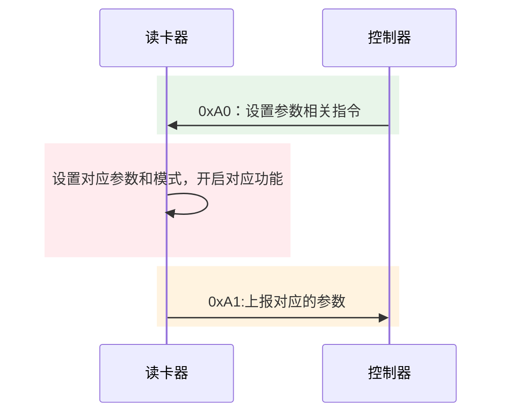
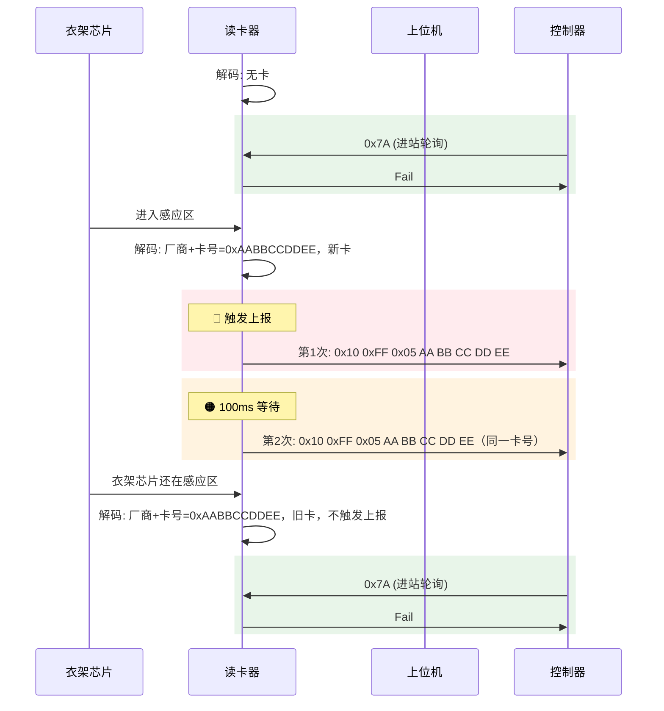
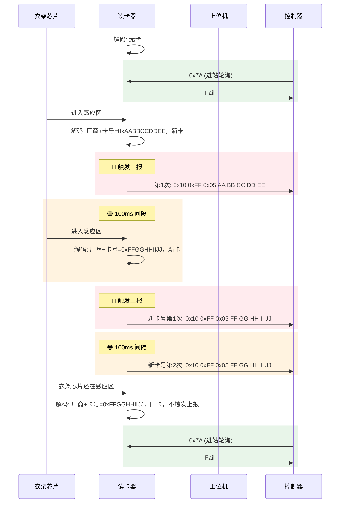
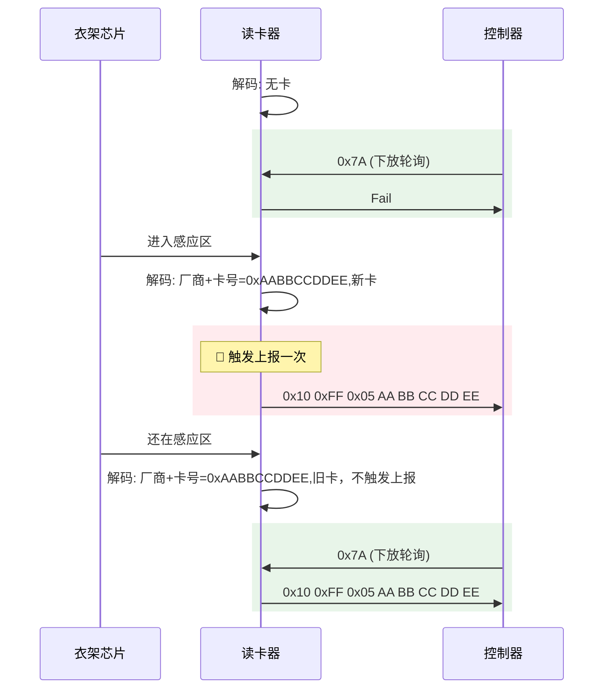
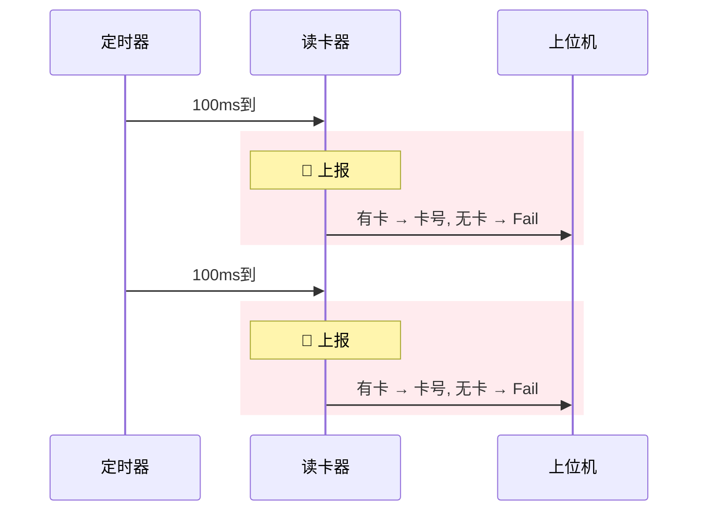
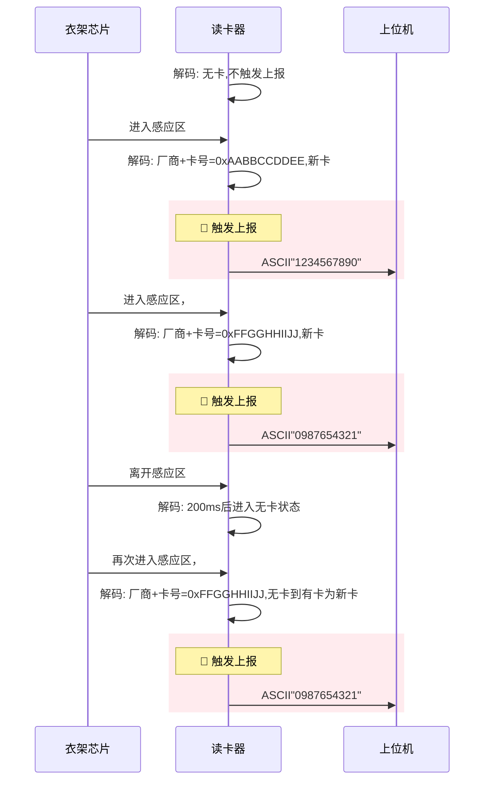
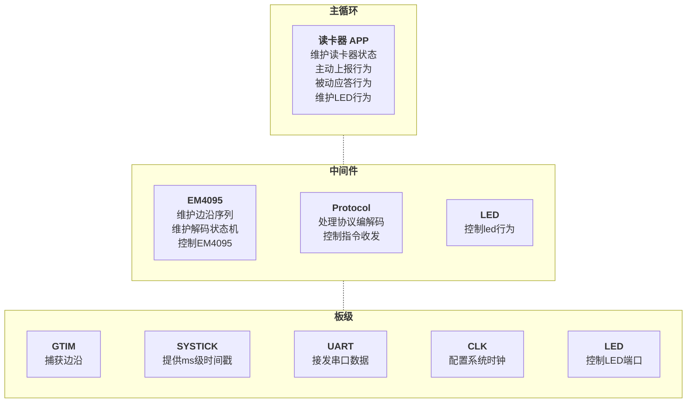
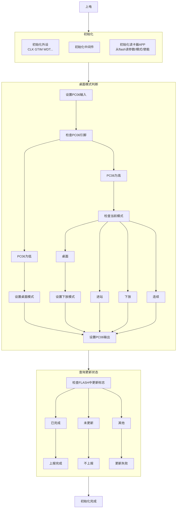
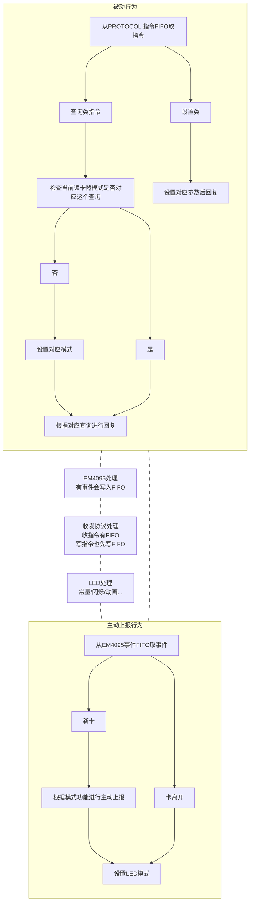

## 待办列表
- [ ] 编码
- [ ] 测试
- [ ] 合并
# 需求
## 通信协议
### 指令表
长度不在协议中体现，靠约定长度来进行解析。
**`0xFF`**:卡号相关 
**`0xA0`**:下发设置和查询相关，控制器设置参数或查询数据
`0xA1`:上报信息相关，读卡器上报参数
#### **接收指令**（控制器 -> 读卡器）
| HEAD | TYPE | CMD  |          DATA          |          完整字节序列          |                                   功能                                    | 约定数据长度 | 二代控制器 | S3控制器 | 备注               |
| :--: | :--: | :--: | :--------------------: | :----------------------: | :---------------------------------------------------------------------: | :----: | :---: | :---: | ---------------- |
| 0x10 | 0xFF | 0x7A |           无            |        `10 FF 7A`        |                            进站查询+失能BCC+切进站模式                             |   3    |   ✅   |   ✅   | 功能使能以及模式不存flash  |
| 0x10 | 0xFF | 0x75 |           无            |        `10 FF 75`        |                            下放查询+失能BCC+切下放模式                             |   3    |   ✅   |   ✅   | 功能使能以及模式不存flash  |
| 0x10 | 0xFF | 0x9A |           无            |        `10 FF 9A`        |                            进站查询+使能BCC+切进站模式                             |   3    |       |       | 功能使能以及模式不存flash  |
| 0x10 | 0xFF | 0x95 |           无            |        `10 FF 95`        |                            下放查询+使能BCC+切下放模式                             |   3    |       |       | 功能使能以及模式不存flash  |
| 0x10 | 0xA0 | 0x05 |           无            |        `10 A0 05`        |                           复位读卡器（进Bootloader）                            |   3    |       |       |                  |
| 0x10 | 0xA0 | 0x01 |           无            |        `10 A0 01`        |                                 查询读卡器版本                                 |   3    |       |       |                  |
| 0x10 | 0xA0 | 0x02 |           模式           |     `10 A0 02 MODE`      | 设置读卡器模式 MODE `00`:桌面 MODE `01`:进站 MODE `02`:下放 MODE `03`:连续 |   4    |       |       | 存flash作为下次启动默认模式 |
| 0x10 | 0xA0 | 0x03 |         BCC使能          |    `10 A0 03 BCC_EN`     |                  BCC_EN `55`:不带BCC BCC_EN `AA`:带BCC                  |   4    |       |       | 存flash           |
| 0x10 | 0xA0 | 0x04 |   进站二次发送间隔,**两字节小端**   | `10 A0 04 TIME_L TIME_H` |                          修改进站二次发送间隔时间，默认值100ms                          |   5    |       |       | 存flash           |
| 0x10 | 0xA0 | 0x05 | 连续模式周期发送间隔时间,**两字节小端** | `10 A0 05 TIME_L TIME_H` |                         修改连续模式周期发送间隔时间，默认值100ms                         |   5    |       |       | 存flash           |
#### **发送指令**（读卡器 -> 控制器）
| HEAD | TYPE | CMD  |             DATA             |            完整字节序列            |       功能       |     | 约定数据长度 | 二代控制器 | S3控制器 |
| :--: | :--: | :--: | :--------------------------: | :--------------------------: | :------------: | :-: | :----: | :---: | :---: |
| 0x10 | 0xFF | 0x05 |      厂商编号\[1]+衣架ID\[4]       |  `10 FF 05 AA BB CC DD EE`   |      上报卡号      |     |   5    |   ✅   |   ✅   |
| 0x10 | 0xFF | 0x04 |     `46 61 69 6C`:"fail"     |    `10 FF 04 46 61 69 6C`    |     上报没有卡号     |     |   4    |   ✅   |   ✅   |
| 0x10 | 0xFF | 0x06 |  厂商编号\[1]+衣架ID\[4]+BCC\[1]   | `10 FF 06 AA BB CC DD EE BC` |    上报带BCC卡号    |     |   6    |       |       |
| 0x10 | 0xA1 | 0x01 | `52 44 33 2e 31 31`:“RD3.11” | `10 A1 01 52 44 33 2e 31 31` |     上报版本号      |     |   6    |       |       |
| 0x10 | 0xA1 | 0x02 |              模式              |       `10 A1 02 MODE`        |      上报模式      |     |   4    |       |       |
| 0x10 | 0xA1 | 0x03 |            BCC使能             |      `10 A1 03 BCC_EN`       |    上报BCC使能     |     |   4    |       |       |
| 0x10 | 0xA1 | 0x04 |      进站二次发送间隔,**两字节小端**      |   `10 A1 04 TIME_L TIME_H`   |   上报进站二次发送间隔   |     |   5    |       |       |
| 0x10 | 0xA1 | 0x05 |    连续模式周期发送间隔时间,**两字节小端**    |   `10 A1 05 TIME_L TIME_H`   | 上报连续模式周期发送间隔时间 |     |   5    |       |       |

> [!note] 忙保护
> 去除忙保护机制，FIFO缓存指令

## 模式与功能

> [!note] 约定
> 
> **新卡**：
>  - 有卡的情况下卡号变了;
>  - 从无卡到有卡;

### 模式表
| MODE | 模式名称 |                          主动行为                           |               被动行为               |    场景    | 二代控制器 | S3控制器 |
| :--: | :--: | :-----------------------------------------------------: | :------------------------------: | :------: | :---: | :---: |
| 0x00 | 桌面模式 |                  有新卡后发送一次卡号**ASCII码**                   |                无                 |  桌面读卡器   |       |       |
| 0x01 | 进站模式 | 读到新卡主动上报一次后**间隔一段**时间再次上, 若期间**读到新卡**则结束上次上报后开始上报新卡号 | 收到查询指令后不管实际有没有读到卡 都上报**没有卡号** |  进站读卡器   |   ✅   |   ✅   |
| 0x02 | 下放模式 |                       读到新卡主动上报一次                        |      收到查询指令后**根据实际情况**上报卡号       | 下放/出站读卡器 |   ✅   |   ✅   |
| 0x03 | 连续模式 |                       周期发送实际读卡情况                        |                无                 |  分拣读卡器   |       |       |
其中`桌面模式`会在读卡器上电时确定

> [!tip] 主动和被动
> **主动**:主要是主动上报 **被动**: 主要是对于指令的响应
> 主动行为和被动行为是独立的互不影响，所以等待期间如果有查询也会上报

### 功能表
|  功能   |                  功能描述                  | 二代控制器 | S3控制器 |
| :---: | :------------------------------------: | :---: | :---: |
| BCC功能 | 开启后所有上报的卡号都使用带BCC的指令 `10 FF 06`  |       |       |

### 不同模式通信流程
#### 进站

**等待期间有新卡号**

- **两次上报间隔默认 100ms，可设置** 
- **进站轮询只应答 Fail，不报卡号**
#### 下放

#### 连续

**上报间隔默认 100ms，可设置**

> [!todo]
> ！**增加无卡的时候间隔不一样：500ms,预留设置指令**

#### 桌面

### LED行为表

| MODE | 模式名称 |   状态    |  LED行为  |               |
| :--: | :--: | :-----: | :-----: | ------------- |
| 0x00 | 桌面模式 |   无卡    | 亮红灯  |               |
| 0x00 | 桌面模式 |   有卡    |   亮绿灯   |               |
| 0x01 | 进站模式 |   无卡    | 亮红灯  |               |
| 0x01 | 进站模式 |   有卡    |   亮绿灯   |               |
| 0x01 | 进站模式 | 有卡+特殊卡号 |   亮黄灯   | ？待定，是否要多个特殊卡号 |
| 0x02 | 下放模式 |   无卡    | 亮红灯  |               |
| 0x02 | 下放模式 |   有卡    |   亮绿灯   |               |
| 0x03 | 连续模式 |   无卡    | 亮红灯  |               |
| 0x03 | 连续模式 |   有卡    |   亮绿灯   |               |

# 框架
## 整体框架

### 伪代码
#### 初始化

#### Reader App

## 解码方案
#### 方案

#### 事件表
| 事件  |    事件介绍     |
| :-: | :---------: |
| 离开  | 200ms没有读到卡  |
| 新卡  | 无卡到有卡或者读到新卡 |

