---
领域:
  - 工作
类型:
  - 开发
项目:
  - "[[分拣操作面板]]"
任务:
  - "[[260401S3串口协议]]"
状态: 完成
相关任务:
  - "[[260401S3分拣面板]]"
创建时间: 2026-04-01T12:59:00
截止时间: 2026-04-20T12:59:00
完成时间: 2026-08-01T20:41:24
---

### 1.通信协议
#### 协议格式：
##### 约定
协议格式中的数据采用小端模式，
整帧最小长度 = 11 字节（无数据）
整帧最大长度 = 267字节（单帧满载）
##### 帧格式
| 名称       | 长度     | 内容      | 备注                         |
| -------- | ------ | ------- | -------------------------- |
| HEAD 帧头  | 1      | 0x55    | 固定帧起始                      |
| LEN 帧总长  | 2      | 整帧字节总数  | 包含 HEAD~TAIL 全部字段，**小端模式** |
| VER 版本   | 1      | 0x01    | 当前协议唯一版本                   |
| CFG 配置位  | 1      | 配置为     | 通信属性配置位                    |
| SEQ 序列号  | 2      | 0~65535 | 帧序列号，每帧递增，用于 ACK 匹配，**小端模式** |
| CMD 指令码  | 2      | 自定义指令   | 业务功能码，**小端模式**             |
| DATA 数据域 | LEN-11 | 业务数据    | 最小0字节，最大256字节              |
| CHECK 校验 | 1      | CRC8    | 校验范围：HEAD ~ DATA(除CHECK/TAIL) |
| TAIL 帧尾  | 1      | 0xAA    | 固定帧结束                      |

##### 配置位
| Bit7 | Bit6 | Bit5 | Bit4 | Bit3 | Bit2 | Bit1 | Bit0 |
| ---- | ---- | ---- | ---- | ---- | ---- | ---- | ---- |
| 保留 | 保留 | 保留 | 保留 | 分片状态 | 分片状态 | 应答帧 | 期望回ACK |

- **Bit0 期望回ACK（expect_ack）**：1 = 期望对方回ACK（请求/回复）；0 = 不期望（单向请求/纯ACK，终止）
- **Bit1 应答帧（is_ACK）**：1 = 本帧为应答/响应帧
- **Bit3~2 分片状态（frag_state）**：
  - `2b00` 包中 -- 分片中间帧
  - `2b01` 包头 -- 分片首帧
  - `2b10` 包尾 -- 分片末帧
  - `2b11` 单帧 -- 不分包的完整帧（既头又尾）
- **Bit4~7 保留**

#### 分包机制（库内实现，应用层无感）
双向分包：请求/回复都支持任意长度（>256 拆片）。库内部处理分片/重组/去重/确认，应用注册缓冲+回调，收齐拿完整数据。

##### 帧类型

| 帧类型 | is_ACK | expect_ack | frag_state | 用途 |
|---|---|---|---|---|
| 请求帧 | 0 | 1 | 单/头/中/尾 | A 发命令（单帧或分片），B 回复 |
| 单向请求 | 0 | 0 | 单 | A 单向发（≤256，发一次即出队），B 收到不回 |
| 纯 ACK | 1 | 0 | 单 | 确认分片收到（请求片/回复片），终止 |
| 回复帧 | 1 | 1 | 单/头/中/尾 | B 回复（空/短/长），A 回纯ACK |

- 纯 ACK 只确认分片，丢靠原片重传恢复（终止点，不套娃）。
- 回复帧 expect_ack=1，A 收到回纯 ACK。`reply_len=0` 也是回复帧（空回复）。
- **单向请求**：`Protocol_Cmd_Config_t.expect_ack=0`，仅单帧（≤256，长数据被拒）。A 发一次即出队（不进 WAIT_ACK、不重传不等）；B 调回调交付数据但不组回复。
- **等回复（ctx 级 `wait_reply_active`）**：配了 reply_callback 且回复未到时，末片确认后**弹出末片**、转 ctx 级 `wait_reply_active` 等回复收齐（reply_done）或超时。**不阻塞发送队列**——后续回复分片可照常发，防双向并发死锁。没配 reply_callback -> 末片确认即出队。长回复先纯 ACK 确认末片再发回复分片。等回复超时用独立配置 `reply_timeout_ms`（0=同 timeout_ms），且只在收到**新**回复片时重置计时（重复片不重置，防"只收重复片"永不超时）。
- **回调备注（有/无回调）**：
  - B 侧 CmdCallback：有回调 -> 执行业务、返回 reply（reply_len>0 回复帧，=0 空回复帧）；**无回调 -> 当空回调，reply_len=0，仍发空回复帧**（流程不变）。
  - A 侧 reply_callback：有回调 -> 末片确认后转等回复，收齐执行 reply_callback(data,len)；**无回调 -> 末片确认即出队（不等回复）；A 的 RX 仍会逐片 ACK B 的回复（B 不会超时），只是不调 reply_callback、不交付回复数据**。
  - timeout_callback：有 -> 整包失败时调；无 -> no-op。

##### 实现要点（与代码一致）
- **seq 从 1 起**：`ProtocolInit` 置 `tx.seq=1`，使收方去重 `f->seq <= last_seq` 对首帧也成立（`last_seq` 初值 0 不被首帧命中）。
- **HEAD 分片去重**：请求侧（`entry->rx_last_seq`）与回复侧（`tx->reply_last_seq`）的 HEAD 片都做 `seq<=last_seq` 去重--旧/重传头片回纯 ACK 不重组，防覆盖进行中的重组；MIDDLE/TAIL 同理。
- **等回复计时**：ctx 级 `wait_reply_send_time` 只在收到**新**回复片（已过去重）时重置；重复片不重置，防"只收重复片"永不超时。
- **双向死锁修复**：末片确认即弹出、转 ctx 级等回复，不阻塞发送队列。否则两端末片都卡在等回复、回显分片排在各自队列后互相等 = 死锁。
- **回复分片顺序 ACK 门控**：回复分片一片片发、每片等 ACK 再发下一片（库内 `RxPushReplyFragments` 产生，重传参数 `PROTOCOL_REPLY_FRAG_RETRY_MAX=5` / `PROTOCOL_REPLY_FRAG_TIMEOUT_MS=300ms`，应用不可配）。丢包多时长回复可能超时（设计特性，非 bug）；要更快需改流水线。
- **应用接口**：`ProtocolSendCmd(ctx, &cfg, cmd, data, len)` 任意长度自动拆片；`ProtocolRegisterCmdCallback(ctx, cmd, cb, rx_buf, rx_buf_size)` 注册时给请求重组缓冲；`Protocol_Cmd_Config_t` 含 `expect_ack`/`reply_callback`/`timeout_callback`/`retry_max`/`timeout_ms`/`reply_timeout_ms`/`reply_buf`/`reply_buf_size`（`expect_ack=0` 单向，仅单帧≤256）。
- **单向发送**：`expect_ack=0` 时仅支持单帧（长数据 `ProtocolSendCmd` 拒绝）；A 侧 SEND 后即弹出（不进 WAIT_ACK、不重传不等），B 侧 `BUILD_ACK` 见 `expect_ack=0` 不组回复（回调仍调，交付数据）。

##### 发送配置 `Protocol_Cmd_Config_t` 字段 ↔ 流程
| 字段 | 作用 | 流程中起作用处 |
|---|---|---|
| `expect_ack` | 1=等回复(请求帧置1); 0=单向(仅单帧≤256, 发一次即出队) | `TxPushOneFrag` 定帧位; `TxCmdProcess` SEND 后决定进不进 WAIT_ACK |
| `retry_max` | 单片最大重传次数(不含首发) | `WAIT_ACK` 超时后重传, `send_count>retry_max+1` 则整包失败 |
| `timeout_ms` | 单片重传超时(ms) | `WAIT_ACK` 判超时(`GetTimeDiff>=timeout_ms`) |
| `reply_timeout_ms` | 等回复总超时(ms, 0=同 timeout_ms) | ctx 级 `WAIT_REPLY` 判超时 |
| `reply_callback` | 收齐完整回复(已重组)时调 | `RxHandleResponse` 回复 TAIL/单帧时 |
| `timeout_callback` | 整包失败 / 等回复超时时调 | `WAIT_ACK` 耗尽 / `WAIT_REPLY` 超时 |
| `reply_buf` / `reply_buf_size` | 收回复重组缓冲(应用给) | `RxHandleResponse` 重组回复分片; NULL/溢出则不重组、A 超时 |

> 接收方侧对应的是注册时给的 `rx_buf`/`rx_buf_size`（收请求重组），与 `reply_buf`（请求方收回复重组）区分。

#### 场景流程
##### 正常流程

**1. 短请求 + 无回复（reply_len=0）**
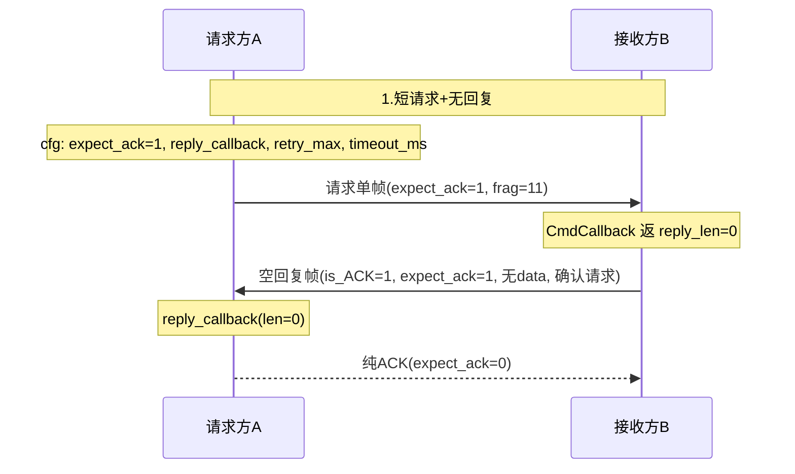

**2. 短请求 + 短回复（reply_len≤256）**
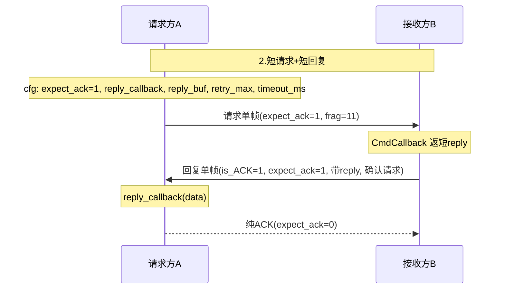

**3. 短请求 + 长回复（reply_len>256）**
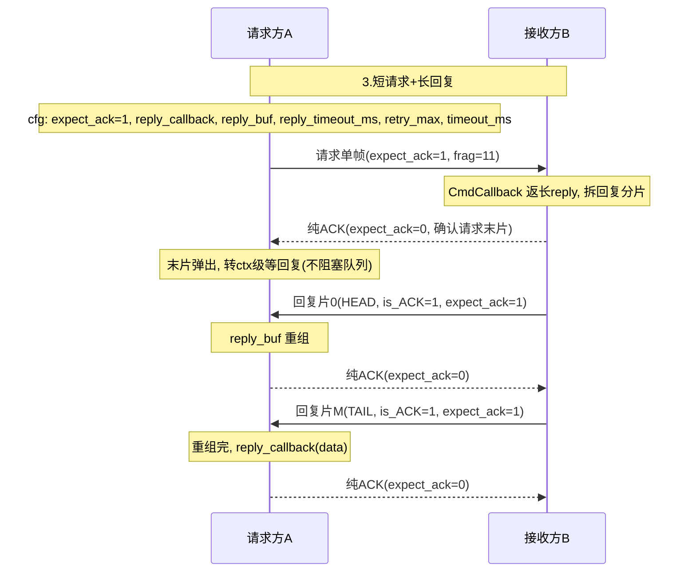

**4. 长请求 + 无回复**
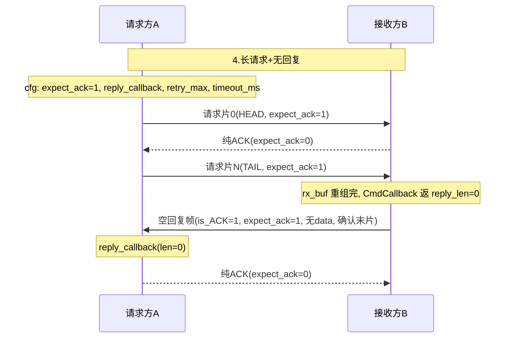

**5. 长请求 + 短回复**
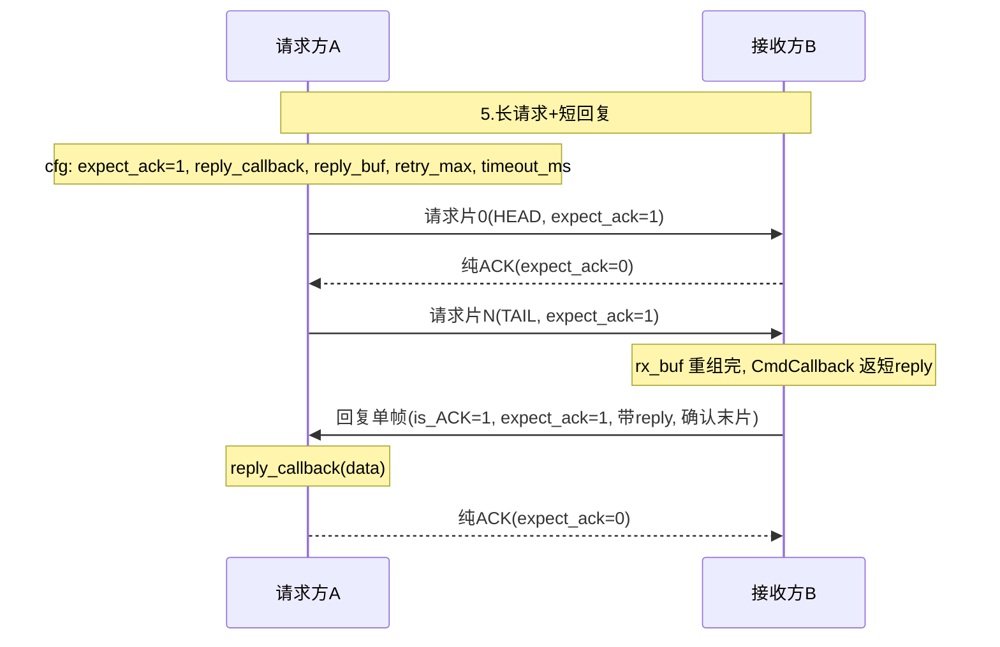

**6. 长请求 + 长回复**
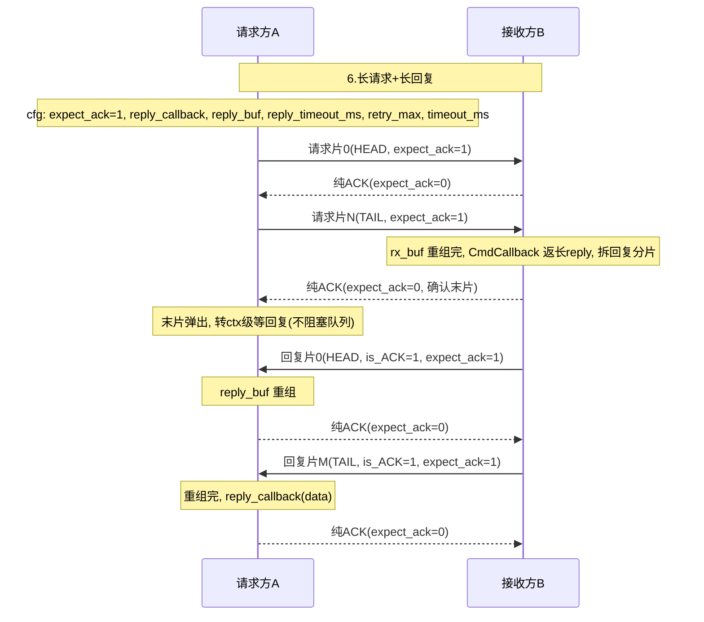

**7. 单向发送（expect_ack=0，B 不回）**
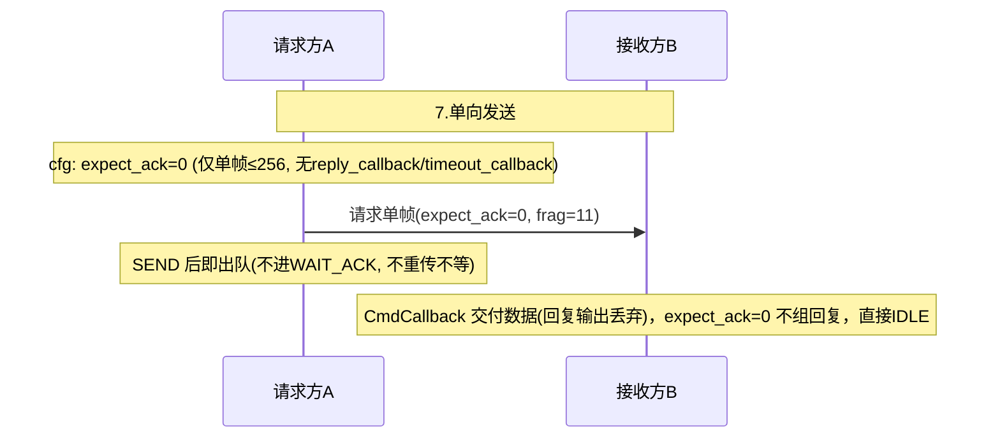

##### 异常流程

**1. 请求分片丢**
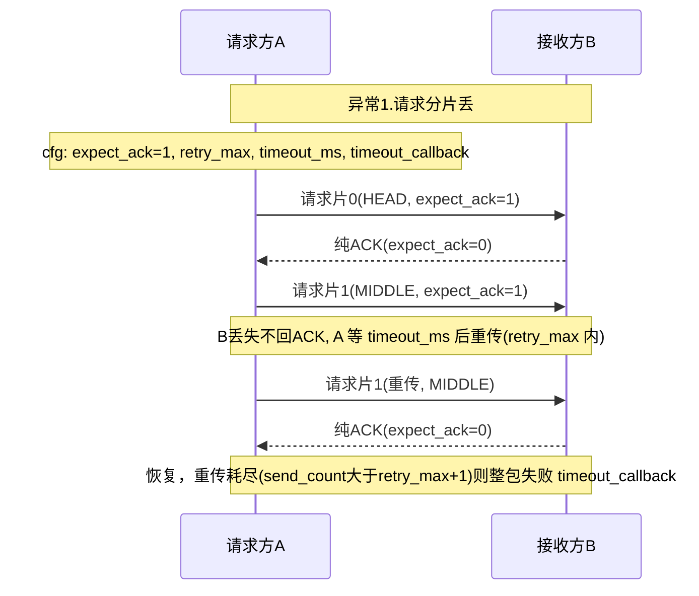

**2. 请求片纯ACK丢**
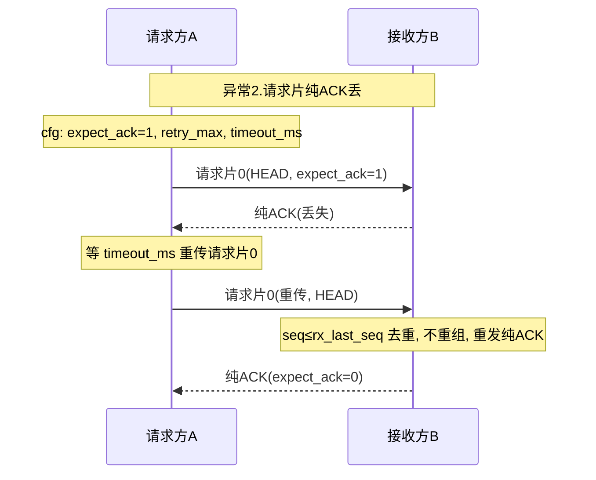

**3. 回复帧丢**
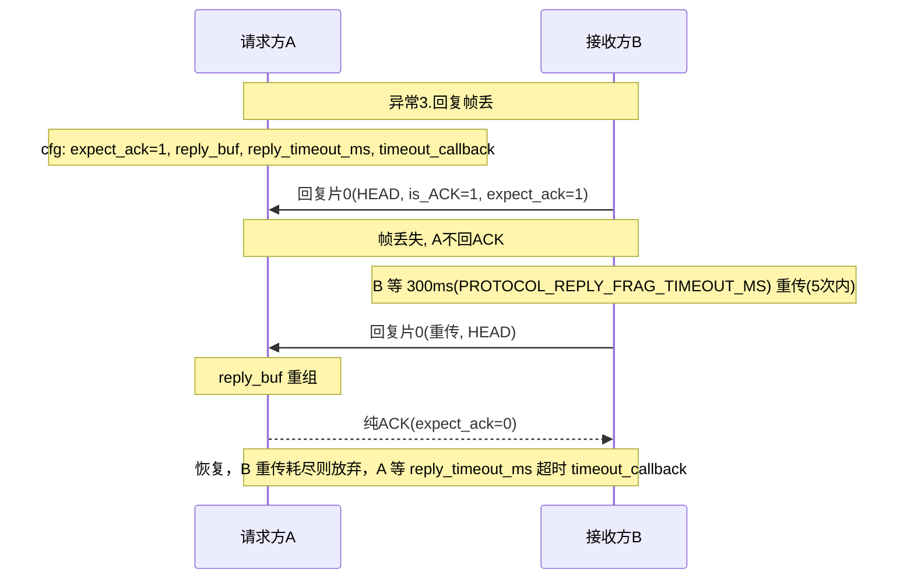

**4. 回复片纯ACK丢**
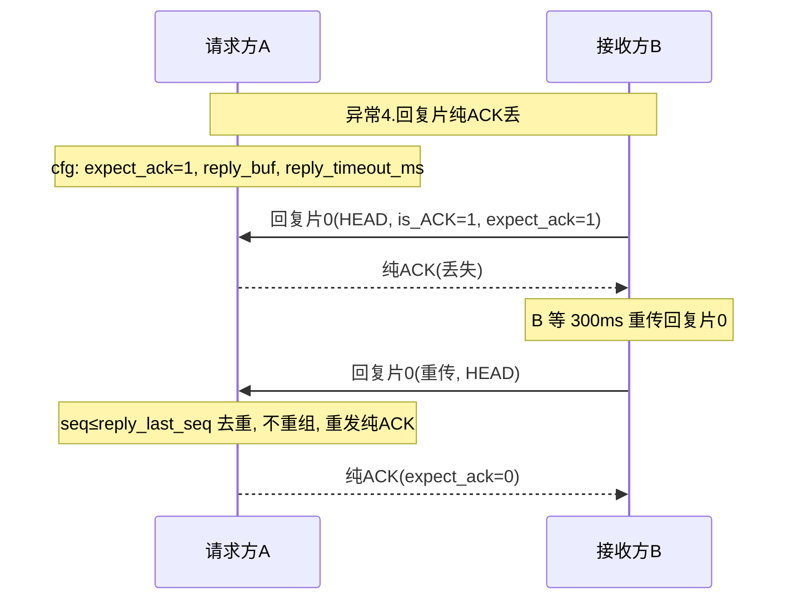

**5. buf溢出 / 未注册buf**
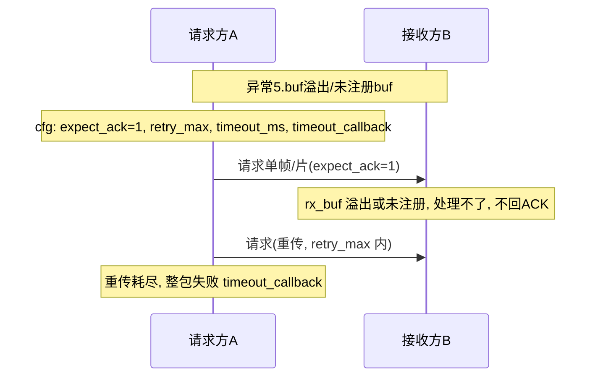

**6. 残包（收HEAD没TAIL）**
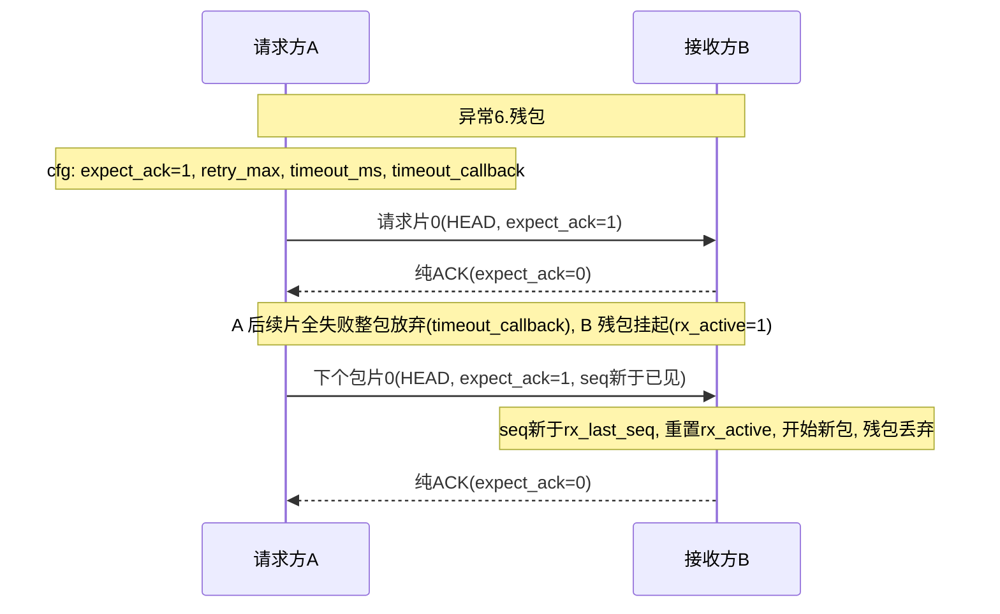

###  1.通信流程

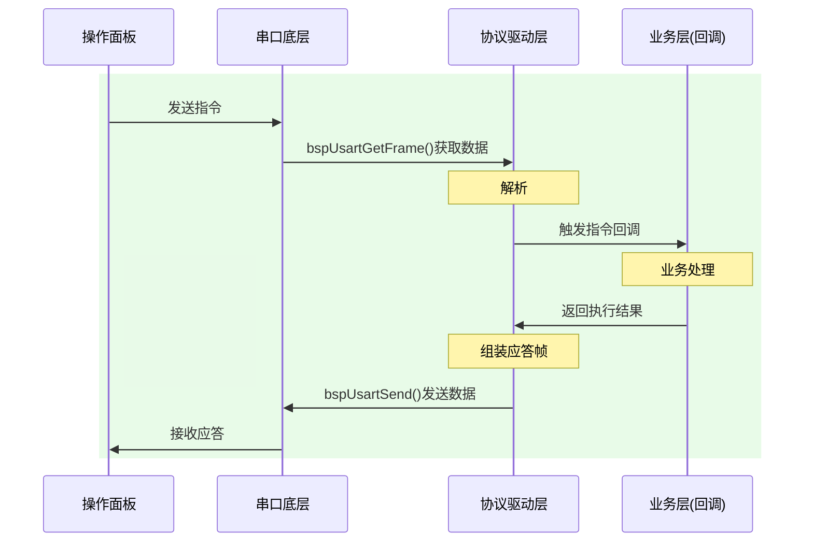

