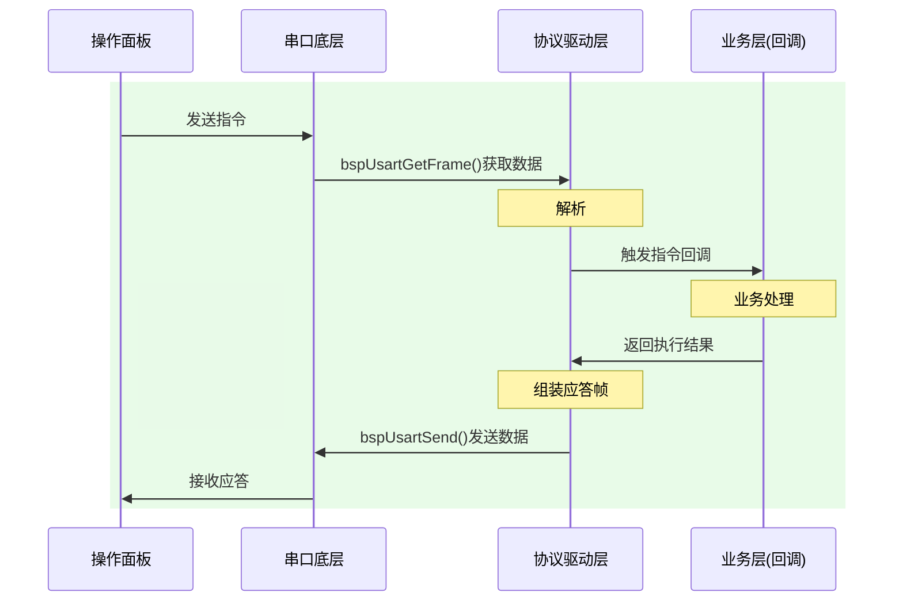

## 待办列表
- [x] 编码
- [ ] 测试
- [ ] 合并
### 1.通信协议
#### 协议格式：
大端模式，

| 名称       | 长度    | 内容      | 备注                         |
| -------- | ----- | ------- | -------------------------- |
| 字段       | 字节数   | 取值/规则   | 说明                         |
| HEAD 帧头  | 1     | 0x55    | 固定帧起始魔术字                   |
| LEN 帧总长  | 2     | 整帧字节总数  | 包含 HEAD~TAIL 全部字段，**大端模式** |
| VER 版本   | 1     | 0x01    | 当前协议唯一版本                   |
| CFG 配置位  | 1     | 位图控制    | 通信属性配置位                    |
| SEQ 序列号  | 2     | 0~65535 | 分片/事务序号，**大端模式**           |
| CMD 指令码  | 2     | 自定义指令   | 业务功能码，**大端模式**             |
| DATA 数据域 | LEN-9 | 业务数据    | 最小0字节，最大245字节              |
| CHECK 校验 | 1     | CRC8    | 校验范围：LEN ~ DATA            |
| TAIL 帧尾  | 1     | 0xAA    | 固定帧结束魔术字                   |

###  1.通信流程

### 2026/4/17面板功能会议

 -  不兼容升级，只烧录定制版本，分阶段，后续进行开发
 - [ ] 支持中/英文；
 - [ ] IP/端口设置界面：支持四段IP设置，端口选择
 - [x] 模块开关界面：
 - [x] 参数设置界面：
 - [x] 通道/模块