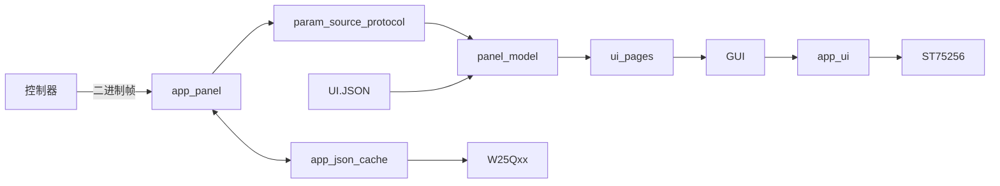

---
领域:
  - 工作
类型:
  - 方案
项目:
  - "[[分拣操作面板]]"
任务:
  - "[[260401S3分拣面板]]"
相关任务:
状态: 进行
创建时间: 2026-08-01T22:57:22
截止时间:
完成时间:
---
<!-- plan-doc:v1 -->

# 分拣操作面板规划

> **一句话**：HC32F460 分拣操作面板固件，JSON 驱动 UI，经控制器协议完成参数读写、网络配置、IO 调试与运行开关。
> **仓库**：`Panel_RTOS`（面板固件）｜`GUI`（嵌套子模块）｜`my_protocol`（本地嵌套仓库）
> **规则**：改需求先记 C；一功能一机制；执行一次只做一条。

## 0. 看板

- **阶段**：P0 验收（T1-1 已完成；V-3 真机待确认）
- **下一条**：—（无 P0 任务；V-3 真机验收待安排）
- **本次范围**：验收 T1-1 与主机回归；真机 V-3 待安排
- **事实源**：代码 / 测试 > `AGENTS.md`、`README.md` > 本文
- **最后更新**：2026-10-30｜**活跃变更**：—｜**冻结**：—｜**血缘**：前身 —（旧版规划已完成内容不迁移，未完成项见 §7）

### 需求登记

| R | 需求 | 来源 | 状态 | 覆盖任务 | 文档 |
|---|---|---|---|---|---|
| R1 | 把 JSON `remark` 用起来：模块参数页按“照明”键弹出当前参数提示 | 用户 | 交付 | T1-1 | — |

### 任务总览

| 任务 | 状态 | 出口条件 |
|---|---|---|
| T1-1 照明键参数提示 | done | 模块页按“照明”显示当前参数 `remark`；空备注 800ms toast；常驻到手动关闭 |
| V-1 主机回归 | done | GUI ctest 73/73、panel_model 1/1、`04_Application/test` 3/3 |
| V-2 双工程构建 | done | Keil + EIDE Target_1 0 error |
| V-3 真机验收 | todo | 照明键、空备注、长备注换行、编辑态不弹、Cancel 关闭逐项通过 |

### 机制登记

| 机制 | 位置 | 用途 | 扩展方式 | 使用者 |
|---|---|---|---|---|
| 面板协议 | `04_Application/app/app_panel.c`、`panel_cmd.h` | 心跳/JSON/读写/使能/网络/调试/开关命令 | 加命令号与处理分支，不改帧格式 | — |
| 二进制帧与在途请求 | `02_Middleware/my_protocol` | 组帧/校验/分片/ACK/在途请求 | 扩展命令表，不改收发状态机 | — |
| JSON 模型 / 值池 / 值源 | `02_Middleware/panel_model` | JSON 解析、参数模型、UI 元数据、值池、值源 | 加字段解析与容量，不改页面接口 | T1-1 |
| JSON A/B 缓存 | `04_Application/app/app_json_cache.c` | JSON 落盘、CRC32、A/B 槽切换 | 加校验/版本字段，不改槽位布局 | — |
| GUI 框架 | `02_Middleware/GUI` | 无 malloc 页面/列表/弹窗/焦点 | 加控件与配置项，不改事件路由 | T1-1 |
| 页面状态契约 | `04_Application/ui_pages/page_state.h` | `SELECTED`、`focused_index`、滚动窗口 | 加 helper，不各页私存状态 | — |
| UI 硬件适配 | `04_Application/app/app_ui.c` | `UI_Ops_t` 唯一接线 | 在 ops 内加能力，不直连页面 | — |
| LCD 驱动 | `01_Hardware/component/st75256`、`adapt/st75256` | 4800B 帧缓冲、全帧刷新 | 走 `ST75256_Ops_t` | — |
| Flash 驱动 | `01_Hardware/component/w25qxx`、`adapt/w25qxx` | 字体/JSON 读写 | 走 `W25Qxx_Ops_t` | — |
| 时基与串口 | `01_Hardware/bsp` | 1ms 时基、USART1 环形缓冲、按键/LED | 加 BSP 接口，不改调用约定 | — |

### 基线

**仓库 / 分支 / 提交**

- 面板固件 `Panel_RTOS`：`develop` @ `b5fb7e4`，工作区干净；仅未跟踪 `02_Middleware/my_protocol/`（本地依赖，不提交）。
- GUI：`02_Middleware/GUI` 嵌套仓库 `main` @ `80c3648`，本地领先 `origin/main` 26 个提交；父仓 gitlink 同为 `80c3648`。
- my_protocol：`02_Middleware/my_protocol` 嵌套仓库 `main` @ `8fa3cbf`，未纳入父仓。
- panel_model / Log / RTT / ZenButton：父仓内普通目录，随父仓提交。
- 控制器仓库：本机工作区未找到；旧文档记录 `89928e8`，`panel_cmd.h` 对端缺失。

**构建**

- 固件（Keil MDK，AC6）：`00_Project/MDK/Panel.uvprojx`，Target_1，产物 `05_Output/Keil/`。
- 固件（EIDE，AC6）：`00_Project/EIDE`，Target_1。
- EIDE MCP server 可用：`eide_get_targets` / `eide_build` / `eide_rebuild` / `eide_clean` / `eide_flash` 等；工程 uid `9dc4459a667b72f8c233969882658b8a`。一次只调一个工具，不并行；MCP 不可用时先报告服务问题。
- GUI 模拟器（CMake + MinGW GCC，C 语言）：`cmake -B build` → `cmake --build build --config Debug`。
- panel_model：`cmake -S 02_Middleware/panel_model -B 02_Middleware/panel_model/build`。
- 应用层主机测试：`cmake -G "MinGW Makefiles" -S 04_Application/test -B 04_Application/test/build`。

**测试（2026-10-30 T1-1 验收）**

- GUI ctest 73/73：`ui_core` 42 + `panel_ui` 31 场景（含 `panel_ui_light_hint`）。
- panel_model 1/1。
- `04_Application/test` 3/3：`panel_cmd` / `app_panel_vals` / `app_json_cache`。
- Keil Target_1 0 error / 0 warning；EIDE Target_1 `exit 0`、`build successfully`。

## 1. 任务池

### R-T-D-C 关联表 / 状态总览

| 任务 | 状态 | 需求 | 决策 | 变更 | 记录 |
|---|---|---|---|---|---|
| T1-1 照明键参数提示 | done | R1 | D2 | C1 | §5 |
| V-1 主机回归 | done | R1 | — | — | §5 |
| V-2 双工程构建 | done | R1 | — | — | §5 |
| V-3 真机验收 | todo | R1 | — | — | — |

### P0（立即）

- 空。T1-1 已完成；V-3 真机验收待安排。

### P1 / P2

- 空。

### 外部依赖与验收

- 控制器仓库 / `panel_cmd.h` 对端：本机未找到，联调前确认路径与提交。
- [ ] **V-3 真机验收** → 需求：R1；验收：模块页按“照明”出常驻提示；空备注 800ms toast；长备注换行；编辑态不弹；Cancel 关闭。

## 2. 契约 v1（2026-10-30）

- **分层**：硬件（`01_Hardware`）→ GUI / panel_model / my_protocol（`02_Middleware`）→ 应用（`04_Application`）。
- **硬件访问**：只经 ops 表（`ST75256_Ops_t`、`W25Qxx_*`、`UI_Ops_t`）；寄存器只出现在 `st75256_hc32_adapter.c`、`app_ui.c`。
- **通道基准**：页面与 `ParamStore` 0-based；协议 1-based（`ch+1`）。
- **JSON**：缓冲借用面板 RX 缓冲，解析后只读；参数顺序 = JSON 实参顺序；`length=1/2B`，u16 大端。
- **失败格式**：`[0x00][idx][reason]`；写入失败 `idx` 1-based，其它为 0；reason UTF-8、最多 64B，面板原样显示。
- **协议头**：`04_Application/app/panel_cmd.h` 与控制器 `APP/panel/panel_cmd.h` 必须字节一致，由 `panel_cmd` 测试校验。
- **UI 事件码**：`eKeyLight`（照明键）只由模块页消费，用于显示当前参数 `remark`（← C1）。
- **Flash 分区**：JSON A/B 槽 `0x00F00000` / `0x00F10000`，自检扇区 `0x00F9F000`；字体区低于 `0x00F00000`。
- **时基**：`Bsp_GetTickMs()` 为全局 1ms 时基；`Bsp_SysTickInit()` 必须在 `Bsp_ClkInit()` 之后。
- **非阻塞**：主循环各 `*Loop` 不得阻塞。
- **构建**：Keil / EIDE 新增源文件双登记；EIDE 优先用 MCP 工具（`eide_build` / `eide_flash` 等），不直接改 `.eide/eide.yml`；必须改时先 `eide_reload`。MCP 不可用时先报告服务问题，不自动回退 shell 构建 / 烧录。

## 3. 设计要点

### 3.1 分层与数据流

```mermaid
flowchart LR
    C[控制器] -- 二进制帧 --> P[app_panel]
    P --> S[param_source_protocol]
    S --> M[panel_model]
    J[UI.JSON] --> M
    M --> PG[ui_pages]
    PG --> G[GUI]
    G --> U[app_ui]
    U --> L[ST75256]
    P <--> F[app_json_cache]
    F --> W[W25Qxx]
```

- 主循环：`App_KeyProcess` → `App_PanelLoop`（心跳 / JSON / 分片 / 命令）→ `App_ParamLoop`（JSON ready 后解析一次）→ `App_LogLoop` → `UI_Loop`。
- 页面只读模型 / 值池，写经 `ParamSource`；页面不直接拼协议字节。

### 3.2 页面焦点与状态

- 列表只有 `SELECTED` 时高亮当前行；页面切焦点同步 `SELECTED`。
- 模块页每通道独立行号；单通道忽略左右；编辑中左右归参数编辑器。
- 页面状态契约集中在 `04_Application/ui_pages/page_state.h`，页面不各存一套。

### 3.3 照明键参数提示（R1）

- 入口：`KEY_Light`（`app_key.h`）当前未映射；新增 `eKeyLight`，`app_key.c` 映射，模块页页级事件处理。
- 取值：`s_list.focused_index` → `s_flat_idx[row]` → `PModParam_t.remark`（JSON span，非 NUL）。
- 展示：`copy_span` 到 192B 静态缓冲（`参数名\n备注`，UTF-8 边界截断）；`UI_PopupShow(..., BTN_NONE, PRIO_INFO, 0, &module_page, ...)` 常驻，Cancel 关闭；空 remark 改 `UI_PopupToast("无备注", 800)`。
- 测试：`ui_min.json` 模块 4 第一条加 `remark`，第二条保持空；新增 `panel_ui_light_hint` 覆盖有值弹窗、空值 toast、Cancel 关闭。
- 编辑态：`UI_Param` 编辑中吞掉非编辑键，照明键不弹提示，不改编辑器。
- 边界：仅模块参数页；网络页 IP 行聚合多参数、整页汇总、长按连发、协议改动不做。
- 机制：复用 GUI 事件路由 / Popup / ParamModel remark；不新建机制（D2）。

## 4. 决策与变更

### 决策（D）

| D | 决策 | 结论 | 任务 |
|---|---|---|---|
| D1 | 规划文档重建 | 以代码 / 测试为准重建基线；旧版已完成内容不迁移，未完成项只作 §7 参考，重新经 `/splan-req` 登记 | — |
| D2 | 照明键复用 | 不新增按键 / 页面；模块页聚焦行弹常驻提示，空备注 800ms toast；仅模块页，网络页 / 整页汇总不做 | T1-1 |

### 变更（C）

| C | 日期 | 类型 | 需求 | 内容 | 影响 | 处理 | 任务 |
|---|---|---|---|---|---|---|---|
| C1 | 2026-10-30 | 新增 | R1 | 新增 `eKeyLight` 事件码与照明键映射，模块页显示 JSON `remark` | 契约、任务、测试、文档、机制 | T1-1（完成） | T1-1 |

## 5. 实施记录

- [x] **T1-1 照明键参数提示** —— 新增 `eKeyLight`/`KEY_Light`/F4 映射；模块页有备注常驻弹窗、空备注 800ms toast、编辑态不弹、Cancel 关闭；验证：GUI ctest 73/73、应用 3/3、panel_model 1/1、Keil/EIDE Target_1 0 error / 0 warning → 全部通过；人工：模拟器模块页 F4 常驻/空备注/编辑态 → 通过；行为：模块页按“照明”（模拟器 F4）显示当前参数名与备注，空备注提示“无备注”；结果：通过。
- [x] **V-1 主机回归** —— 验证：GUI ctest 73/73、panel_model 1/1、`04_Application/test` 3/3 → 全部通过；行为：主机测试全绿；结果：通过。
- [x] **V-2 双工程构建** —— 验证：Keil Target_1 0 error / 0 warning、EIDE Target_1 exit 0 → 通过；行为：双工程可构建；结果：通过。

## 6. 归档

| 任务 | 结果 | 关联 | 提交 |
|---|---|---|---|
| T1-1 | 完成 | ← C1 | `80c3648` / `b5fb7e4` |
| V-1 | 完成 | → T1-1 | — |
| V-2 | 完成 | → T1-1 | — |

## 7. 参考与索引

### 仓库

| 仓库 | 路径 | 角色 | 构建 | 测试 |
|---|---|---|---|---|
| Panel_RTOS | `D:\Screen\Projects\Panel_RTOS` | 面板固件 | Keil / EIDE | GUI / panel_model / 应用测试 |
| GUI | `02_Middleware/GUI` | 无 malloc GUI + Win32 模拟器 | CMake | ctest |
| my_protocol | `02_Middleware/my_protocol` | 二进制帧 / 分片 / 在途请求 | 随固件 | — |
| panel_model | `02_Middleware/panel_model` | JSON / 模型 / 值池 / 值源 | CMake | ctest |
| 控制器 | 本机未找到 | 面板通信对端 | — | — |

### 工具

| 工具 | 入口 | 用途 |
|---|---|---|
| EIDE MCP server | `00_Project/EIDE`，uid `9dc4459a667b72f8c233969882658b8a` | 枚举 / 切换 target、构建 / 重建 / 清理 / 烧录、源码目录 / 宏 / 编译选项 |
| EIDE 工程 | `00_Project/EIDE` | Target_1，AC6；新增源文件双登记 |
| Keil 工程 | `00_Project/MDK/Panel.uvprojx` | Target_1，AC6 |

### 关键文件

| 文件 | 作用 |
|---|---|
| `04_Application/main.c` | 初始化顺序与主循环 |
| `04_Application/app/app_panel.c` | 面板协议：心跳 / JSON / 值 / 使能 / 网络 / 调试 / 开关 |
| `04_Application/app/app_param.c` | JSON → 模型 / 值池 glue |
| `04_Application/app/app_json_cache.c` | JSON A/B 缓存 + CRC32 |
| `04_Application/app/app_key.c` | 矩阵键 → `UI_EventCode_t` 映射 |
| `04_Application/app/app_ui.c` | `UI_Ops_t` 硬件适配 |
| `04_Application/app/panel_cmd.h` | 协议命令 / 载荷定义（须与控制器同字节） |
| `04_Application/ui_pages/` | 首页 / 模块列表 / 模块 / 网络 / 调试 / 运行开关 / 版本 |
| `04_Application/ui_pages/page_state.h` | 列表焦点 / `SELECTED` / 滚动窗口契约 |
| `01_Hardware/bsp/bsp_config.h` | 引脚 / USART / DMA |
| `02_Middleware/GUI/inc/ui_event.h` | `UI_EventCode_t` 事件码定义 |
| `02_Middleware/GUI/AGENTS.md` | GUI 框架规则 |
| `02_Middleware/panel_model/inc/param_model.h` | 模型容量 |
| `UI.JSON` | 当前 UI 定义（34,095B） |

### 文档

- `README.md`：架构、协议、JSON 与错误处理详解。
- `AGENTS.md`：仓库结构与构建 / 测试约定。
- `02_Middleware/GUI/AGENTS.md`：GUI 事件路由、裁剪、弹窗。
- `eide-mcp-tools` skill：EIDE MCP 工具清单、调用顺序与 `eide_reload` 规则。
- `[[260401S3协议]]`：同目录，通信协议参考。
- `[[S3吊挂控制器]]`：控制器对端项目笔记。

### 旧文档遗留候选（未登记 R，仅参考）

- 控制器：面板状态收敛、调试切换显式化、断线回归。
- 面板主动推送：同位置置 dirty、重连补快照、发送失败重试与回归。
- Stage 5：长按 / 重复导航（Up/Down 800ms 后 120ms 重复）。
- 容量与自适应：40KB 预算、旧模型保留、未知类型、SYS 扩展、边界测试。
- 交付：注释 / 中英文 / 线路与参数说明 / 24h 稳定性 / 发布。
- 6 路读卡器：等控制器统一接口，面板只做接收适配。
- 真机验收：网络重启生效、调试输入 / 输出、运行开关、读卡。
