## 待办列表
- [ ] 编码
- [ ] 测试
- [ ] 合并
### 1.通信协议
#### 协议格式：
##### 约定
协议格式中的数据采用小端模式，
整帧最小长度 = 11 字节（无数据）
整帧最大长度 = 267字节（单帧满载）
##### 帧格式
| 名称       | 长度     | 内容      | 备注                         |
| -------- | ------ | ------- | -------------------------- |
| HEAD 帧头  | 1      | 0x55    | 固定帧起始                      |
| LEN 帧总长  | 2      | 整帧字节总数  | 包含 HEAD~TAIL 全部字段，**小端模式** |
| VER 版本   | 1      | 0x01    | 当前协议唯一版本                   |
| CFG 配置位  | 1      | 配置为     | 通信属性配置位                    |
| SEQ 序列号  | 2      | 0~65535 | 帧序列号，每帧递增，用于 ACK 匹配，**小端模式** |
| CMD 指令码  | 2      | 自定义指令   | 业务功能码，**小端模式**             |
| DATA 数据域 | LEN-11 | 业务数据    | 最小0字节，最大256字节              |
| CHECK 校验 | 1      | CRC8    | 校验范围：LEN ~ DATA            |
| TAIL 帧尾  | 1      | 0xAA    | 固定帧结束                      |

##### 配置位
| Bit7 | Bit6 | Bit5 | Bit4 | Bit3 | Bit2 | Bit1 | Bit0 |
| ---- | ---- | ---- | ---- | ---- | ---- | ---- | ---- |
| 保留 | 保留 | 保留 | 保留 | 分片状态 | 分片状态 | 应答帧 | 是否应答 |

- **Bit0 是否应答（need_ACK）**：1 = 需要应答确认
- **Bit1 应答帧（is_ACK）**：1 = 本帧为应答/响应帧
- **Bit3~2 分片状态（frag_state）**：
  - `2b00` 包中 -- 分片中间帧
  - `2b01` 包头 -- 分片首帧
  - `2b10` 包尾 -- 分片末帧
  - `2b11` 单帧 -- 不分包的完整帧（既头又尾）
- **Bit4~7 保留**

#### 分包机制（库内实现，应用层无感）
双向分包：请求/回复都支持任意长度（>256 拆片）。库内部处理所有分片/重组/去重/确认，应用只注册缓冲+回调，收齐拿完整数据。

##### 帧类型（库按 is_ACK + need_ACK + frag_state 区分）

| 帧类型 | is_ACK | need_ACK | frag_state | 用途 |
|---|---|---|---|---|
| 请求帧 | 0 | 1 | 单/头/中/尾 | A 发命令（单帧或分片） |
| 纯 ACK | 1 | 0 | 单 | 确认某分片收到（请求片/回复片） |
| 回复帧 | 1 | 1 | 单/头/中/尾 | B 回复（空/短单帧/长分片） |

- **纯 ACK**：只确认分片，不带数据，不 need_ACK。丢了不重传它本身，靠原片重传恢复（原片 need_ACK，等不到纯 ACK 重传原片，接收方去重重发纯 ACK）。终止点，不套娃。
- **回复帧**：need_ACK=1，A 收到回纯 ACK 确认。`reply_len=0` 也是回复帧（空回复帧，A `reply_callback(len=0)`）。

##### 发送方 A 流程

1. `ProtocolSendCmd(data, len)`：`len≤256` 单帧(frag=11)；`len>256` 按 256 拆片(头01/中00/尾10)，每片独立 seq，need_ACK=1。
2. 状态机：`IDLE -> SEND(发一片) -> WAIT_ACK(等响应) -> ...`。
3. 收到响应（is_ACK=1）：纯 ACK(need_ACK=0) = 该请求片确认；回复帧(need_ACK=1) = 末片确认 + 回复，A 接收侧重组到 reply_buf，收齐 `reply_callback`。
4. 某片重传耗尽：跳过本包剩余片，`timeout_callback`。
5. 应用层串行：发请求后等 `reply_callback`（或确认完成）再发下一个，避免并发在途（库不强制等回复，无 WAIT_REPLY 状态）。

##### 接收方 B 流程

1. 收请求帧：单帧直接处理；分片重组到 rx_buf（seq 去重），收齐（尾片）处理。
2. 调回调：有回调则调，返回 reply（指针+长度）；没回调当作 reply_len=0。
3. 按回复长度发回复帧：
   - `reply_len=0`：空回复帧（need_ACK=1，无 data）
   - `reply_len≤256`：回复单帧（need_ACK=1，带 reply，frag=11，seq=请求seq 兼确认请求）
   - `reply_len>256`：回复分片（need_ACK=1，seq=回复自己，frag 头/中/尾）
4. 每收一个请求片回纯 ACK（确认该片）。
5. 回复帧发出后等 A 的纯 ACK 确认；丢重传，耗尽放弃。

##### 短回复合并

回复单帧/空回复帧 `seq=请求seq`，一帧同时确认请求 + 带回复（短请求场景，少一个纯 ACK）。长回复（分片）`seq=回复自己`，必须先纯 ACK 确认请求再发分片（seq 不冲突）。

##### 去重

seq 去重：重复的请求片/回复片只回纯 ACK，不重组不回调（防重传重复）。

##### 异常（统一 timeout）

- 接收方处理不了（buf溢出/未注册buf）：不回 ACK，发送方该片超时重传耗尽整包 timeout。
- 没回调：当作空回复（reply_len=0），回空回复帧，A `reply_callback(len=0)` 或完成。
- 残包（收 HEAD 没 TAIL）：下个 HEAD 到来重置，残包丢弃。

##### 应用接口

- 注册：`ProtocolRegisterCmdCallback(ctx, cmd, cb, rx_buf, rx_buf_size)`，rx_buf=NULL 短命令。
- 发送：`ProtocolSendCmd(ctx, cfg, cmd, data, len)`，cfg 含 reply_callback/reply_buf/timeout。
- 回调：`CmdCallback(data, len, reply, reply_len)`（接收方）；`ReplyCallback(data, len)`（请求方收回复）；`TimeoutCallback(pFrame)`（per-cmd）。

#### 场景流程
##### 正常流程

**1. 短请求 + 无回复（reply_len=0）**
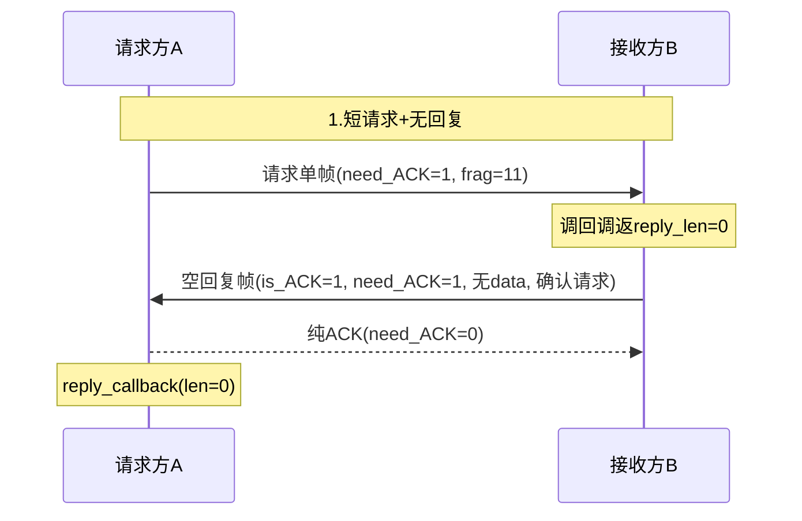

**2. 短请求 + 短回复（reply_len≤256）**
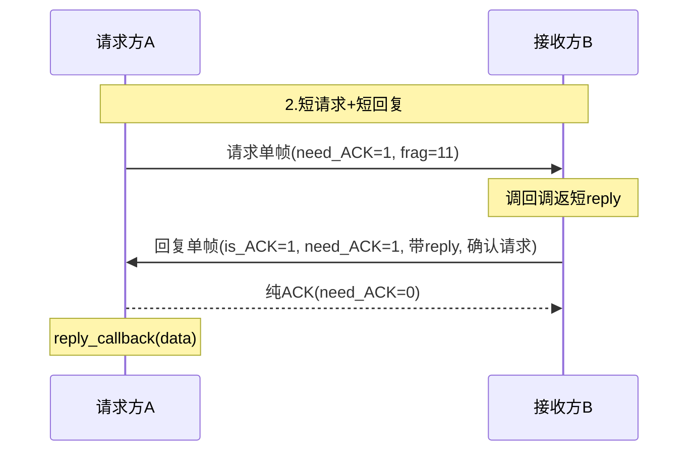

**3. 短请求 + 长回复（reply_len>256）**
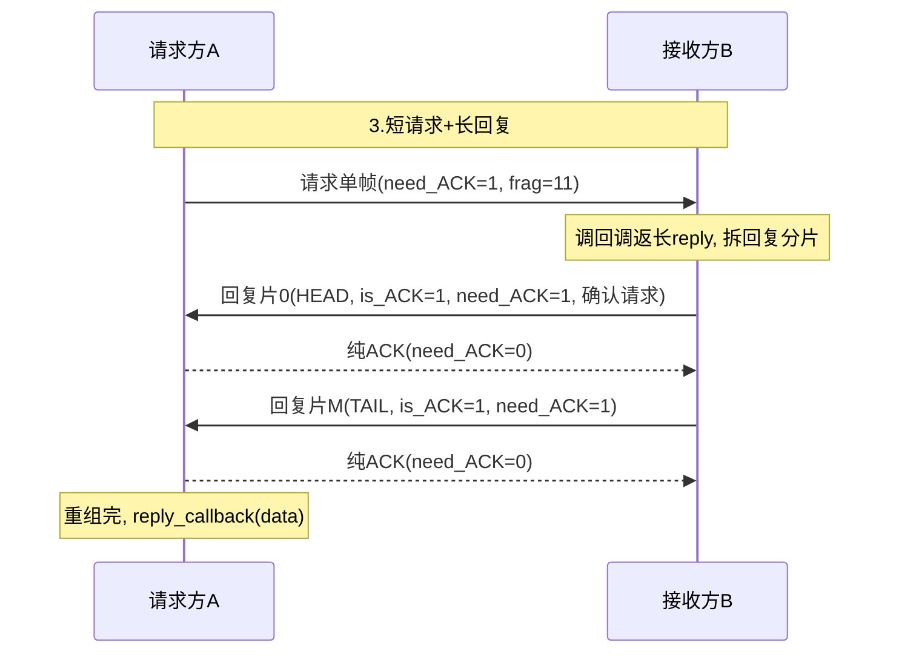

**4. 长请求 + 无回复**
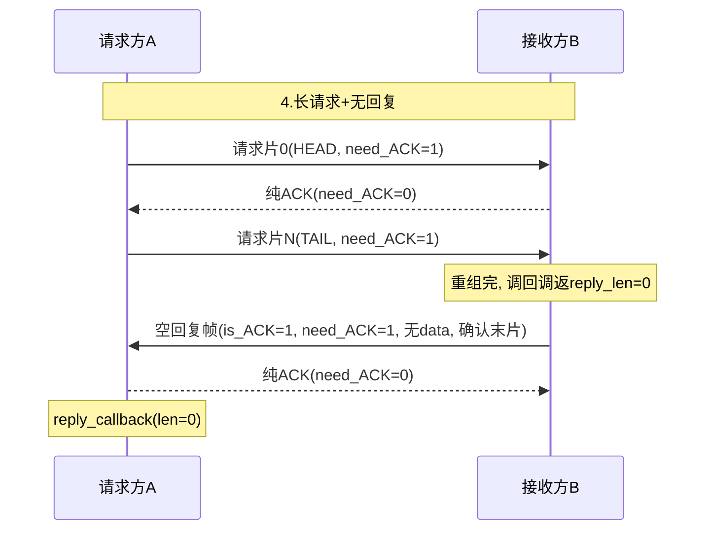

**5. 长请求 + 短回复**
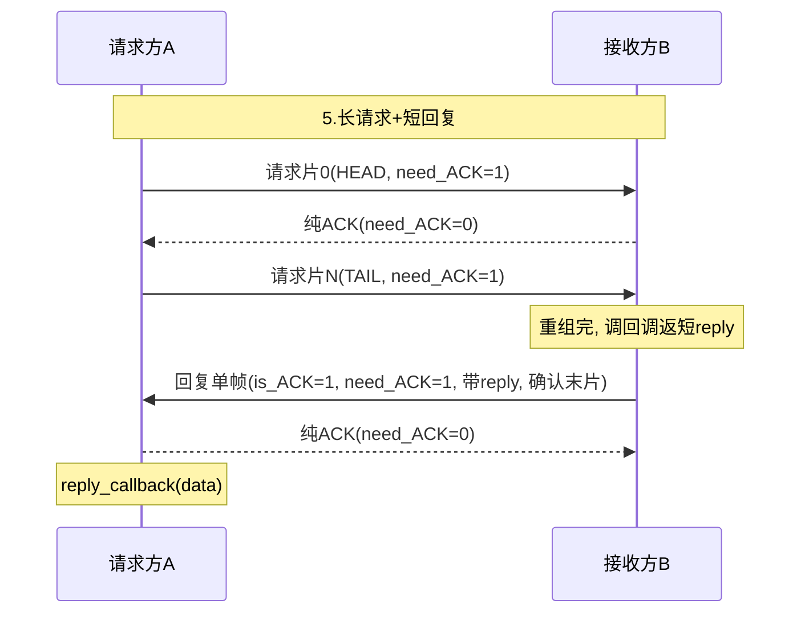

**6. 长请求 + 长回复**
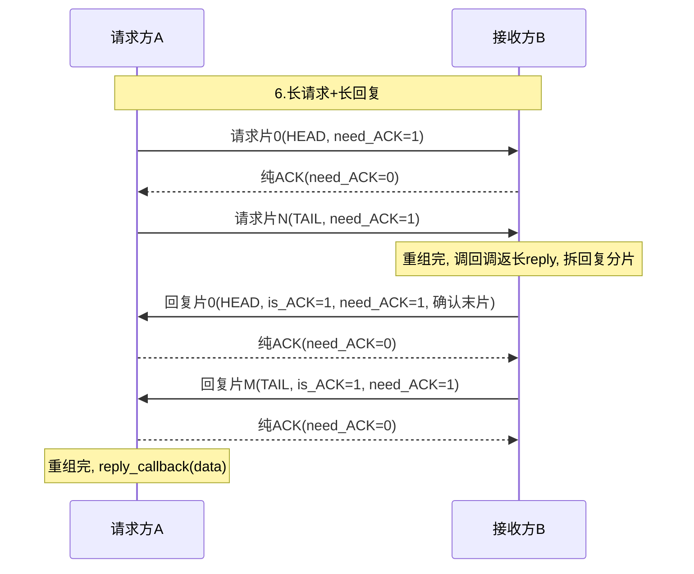

##### 异常流程

**1. 请求分片丢**
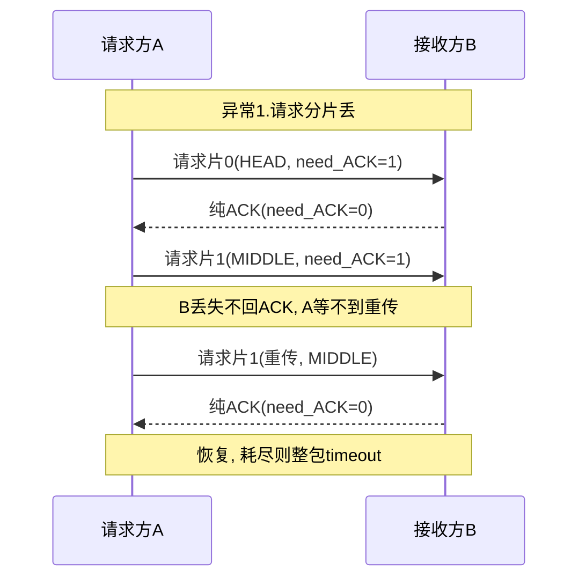

**2. 请求片纯ACK丢**
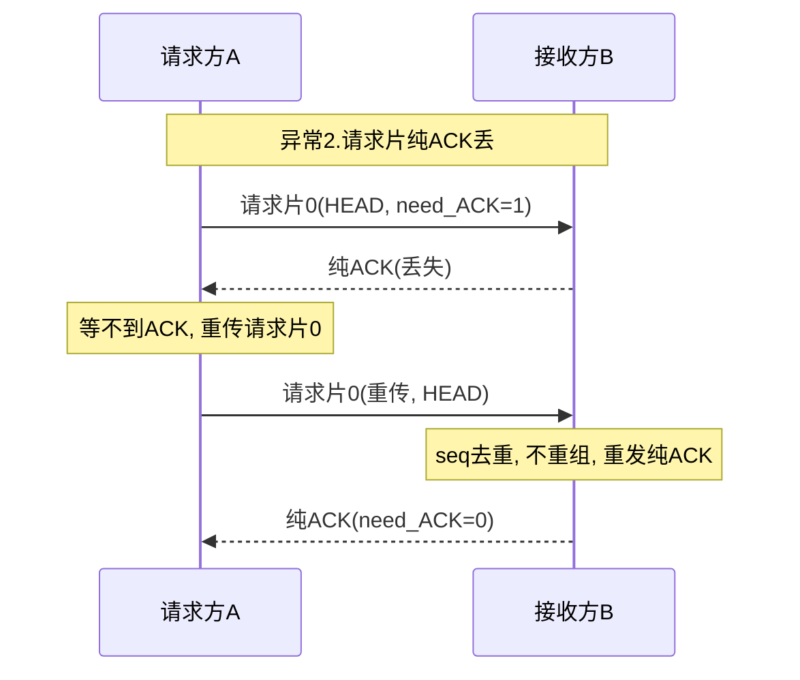

**3. 回复帧丢**
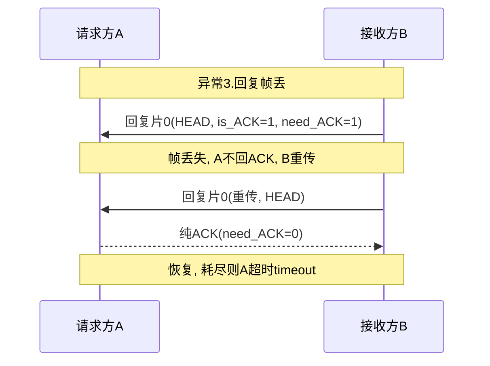

**4. 回复片纯ACK丢**
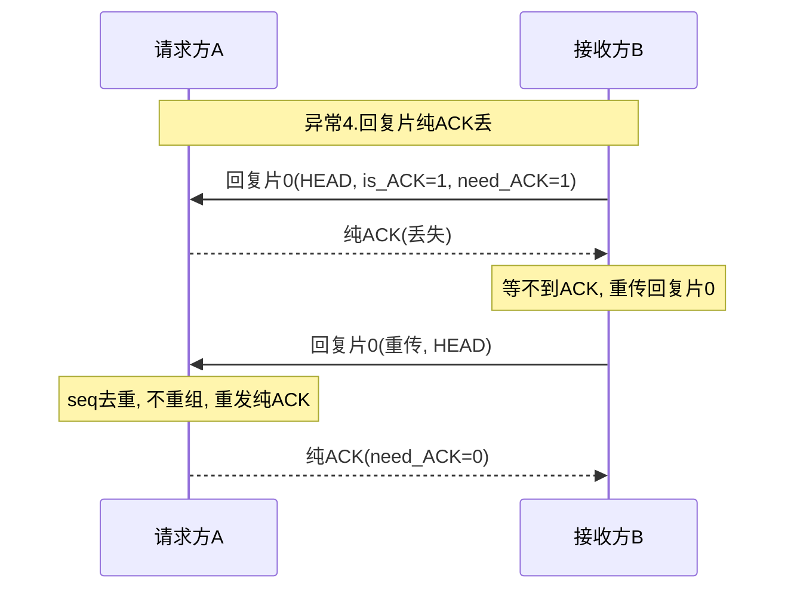

**5. 没回调 / buf溢出 / 未注册buf**
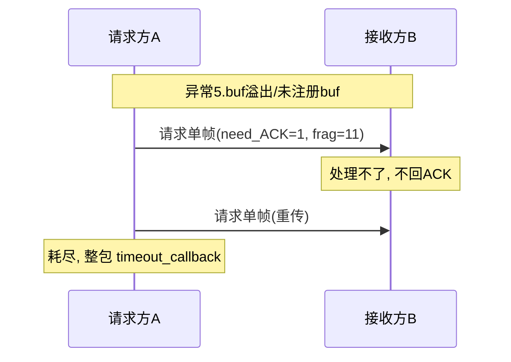

**6. 残包（收HEAD没TAIL）**
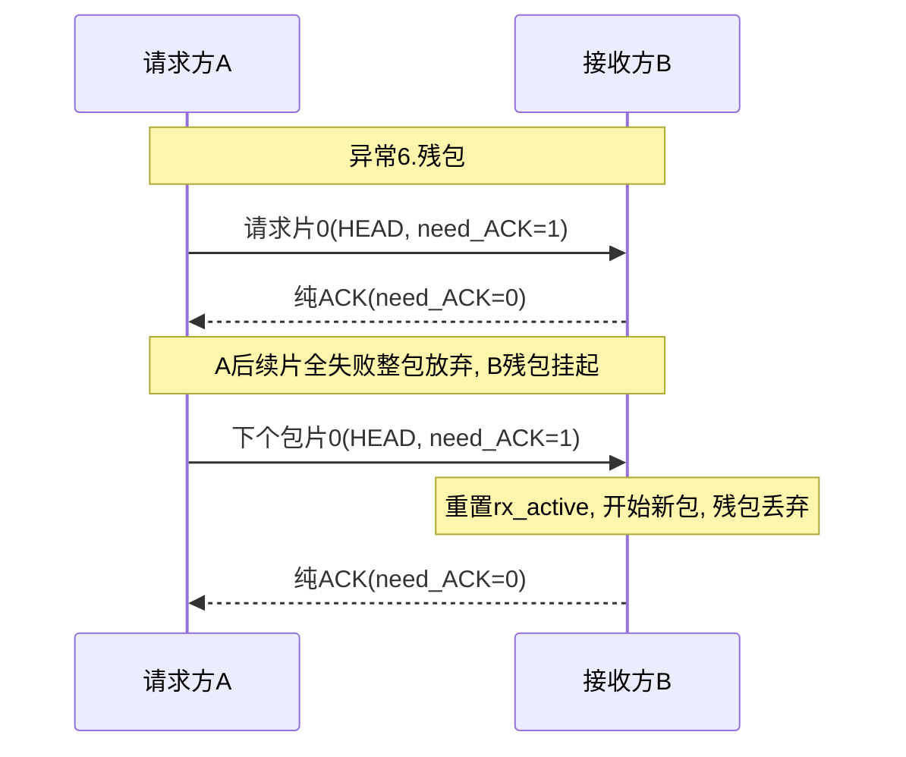

###  1.通信流程

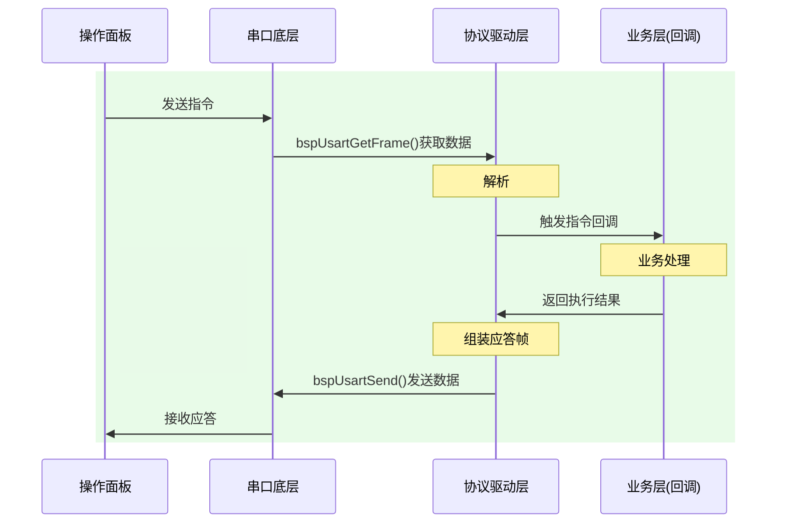

### 2026/4/17面板功能会议

 -  不兼容升级，只烧录定制版本，分阶段，后续进行开发
 - [ ] 支持中/英文；
 - [ ] IP/端口设置界面：支持四段IP设置，端口选择
 - [ ] 模块开关界面：
 - [ ] 参数设置界面：
 - [ ] 通道/模块
