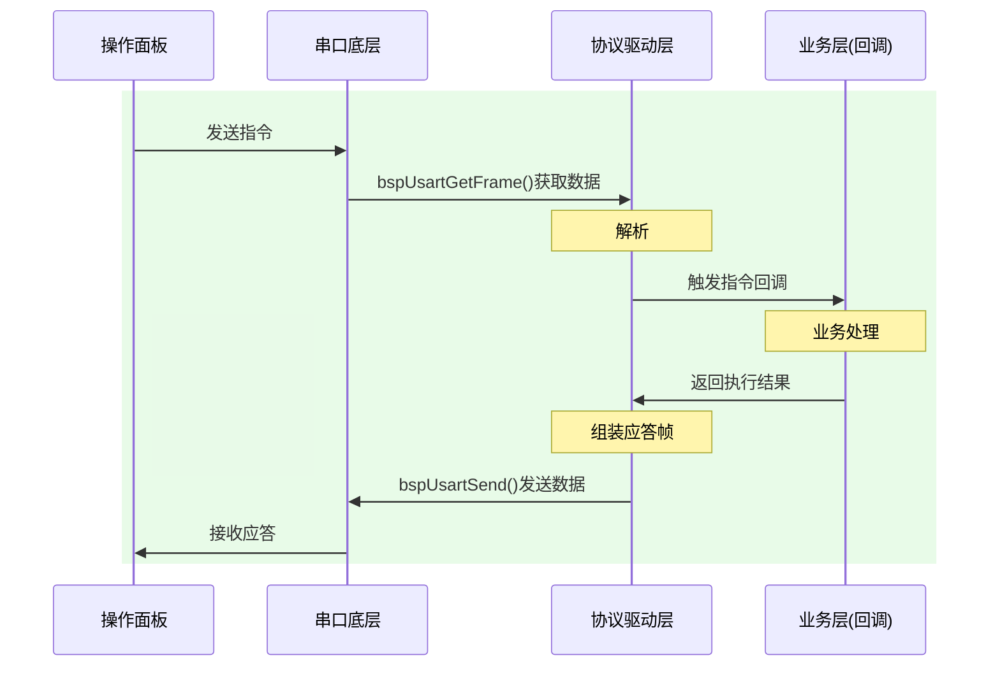

## 待办列表
- [ ] 编码
- [ ] 测试
- [ ] 合并
### 1.通信协议
#### 协议格式：
##### 约定
协议格式中的数据采用小端模式，
整帧最小长度 = 11 字节（无数据）
整帧最大长度 = 267字节（单帧满载）
##### 帧格式
| 名称       | 长度     | 内容      | 备注                         |
| -------- | ------ | ------- | -------------------------- |
| HEAD 帧头  | 1      | 0x55    | 固定帧起始                      |
| LEN 帧总长  | 2      | 整帧字节总数  | 包含 HEAD~TAIL 全部字段，**小端模式** |
| VER 版本   | 1      | 0x01    | 当前协议唯一版本                   |
| CFG 配置位  | 1      | 配置为     | 通信属性配置位                    |
| SEQ 序列号  | 2      | 0~65535 | 帧序列号，每帧递增，用于 ACK 匹配，**小端模式** |
| CMD 指令码  | 2      | 自定义指令   | 业务功能码，**小端模式**             |
| DATA 数据域 | LEN-11 | 业务数据    | 最小0字节，最大256字节              |
| CHECK 校验 | 1      | CRC8    | 校验范围：LEN ~ DATA            |
| TAIL 帧尾  | 1      | 0xAA    | 固定帧结束                      |

##### 配置位
| Bit7 | Bit6 | Bit5 | Bit4 | Bit3 | Bit2 | Bit1 | Bit0 |
| ---- | ---- | ---- | ---- | ---- | ---- | ---- | ---- |
| 保留 | 保留 | 保留 | 保留 | 分片状态 | 分片状态 | 应答帧 | 是否应答 |

- **Bit0 是否应答（need_ACK）**：1 = 需要应答确认
- **Bit1 应答帧（is_ACK）**：1 = 本帧为应答帧
- **Bit3~2 分片状态（frag_state）**：
  - `2b00` 包中 —— 分片中间帧
  - `2b01` 包头 —— 分片首帧
  - `2b10` 包尾 —— 分片末帧
  - `2b11` 单帧 —— 不分包的完整帧（既头又尾）

##### 分包机制
长数据（>256 字节）分包收发，**发送侧库自动拆片，接收侧应用自行重组**。

- **发送**：应用调用 `ProtocolSendCmd(data, len)` 传入任意长度数据，库按 256 字节切片，每片独立成帧。首片 `frag_state=包头`，末片 `frag_state=包尾`，中间片 `frag_state=包中`。每片拥有独立 SEQ，独立 ACK 确认与超时重传（复用现有机制）。
- **接收**：库不做重组，每收到一个分片帧即触发业务回调。应用在回调中依据 `pFrame->cfg.bits.frag_state` 判断包头/包中/包尾，自行累积到自己的缓冲区，包尾到达时处理完整数据。
- **去重**：分片重传时接收侧会收到重复 SEQ 的片，应用需用 SEQ 去重（记住已处理 SEQ，重复则丢弃）。
- **全双工**：两端可同时收发，串行停等（一次仅一个分片在途），不引入 packet_id。
- **回复**：短回复（≤256）放应答帧带回；长回复由应用主动调用 `ProtocolSendCmd` 发送反向命令（同样分片）。

> 分包待定项：发送 FIFO 深度（建议 32）、去重具体策略、回调签名是否调整。

###  1.通信流程

### 2026/4/17面板功能会议

 -  不兼容升级，只烧录定制版本，分阶段，后续进行开发
 - [ ] 支持中/英文；
 - [ ] IP/端口设置界面：支持四段IP设置，端口选择
 - [ ] 模块开关界面：
 - [ ] 参数设置界面：
 - [ ] 通道/模块
