## 待办列表
- [ ] 编码
- [ ] 测试
- [ ] 合并
### 1.通信协议
#### 协议格式：
##### 约定
协议格式中的数据采用小端模式，
整帧最小长度 = 11 字节（无数据）
整帧最大长度 = 267字节（单帧满载）
##### 帧格式
| 名称       | 长度     | 内容      | 备注                         |
| -------- | ------ | ------- | -------------------------- |
| HEAD 帧头  | 1      | 0x55    | 固定帧起始                      |
| LEN 帧总长  | 2      | 整帧字节总数  | 包含 HEAD~TAIL 全部字段，**小端模式** |
| VER 版本   | 1      | 0x01    | 当前协议唯一版本                   |
| CFG 配置位  | 1      | 配置为     | 通信属性配置位                    |
| SEQ 序列号  | 2      | 0~65535 | 帧序列号，每帧递增，用于 ACK 匹配，**小端模式** |
| CMD 指令码  | 2      | 自定义指令   | 业务功能码，**小端模式**             |
| DATA 数据域 | LEN-11 | 业务数据    | 最小0字节，最大256字节              |
| CHECK 校验 | 1      | CRC8    | 校验范围：LEN ~ DATA            |
| TAIL 帧尾  | 1      | 0xAA    | 固定帧结束                      |

##### 配置位
| Bit7 | Bit6 | Bit5 | Bit4 | Bit3 | Bit2 | Bit1 | Bit0 |
| ---- | ---- | ---- | ---- | ---- | ---- | ---- | ---- |
| 保留 | 保留 | 保留 | 保留 | 分片状态 | 分片状态 | 应答帧 | 是否应答 |

- **Bit0 是否应答（need_ACK）**：1 = 需要应答确认
- **Bit1 应答帧（is_ACK）**：1 = 本帧为应答/响应帧
- **Bit3~2 分片状态（frag_state）**：
  - `2b00` 包中 -- 分片中间帧
  - `2b01` 包头 -- 分片首帧
  - `2b10` 包尾 -- 分片末帧
  - `2b11` 单帧 -- 不分包的完整帧（既头又尾）
- **Bit4~7 保留**

#### 分包机制
双向分包：发送指令支持任意长度（>256 拆片），回复也支持任意长度（回调返回大回复，库拆片发回）。应用层注册缓冲，收齐调一次回调。

- **请求（A 发）**：`len≤256` 单帧（frag_state=11）；`len>256` 按 256 拆片（首片 01/中间 00/末片 10），每片独立 seq，`need_ACK=1`。A 逐片发，每片等纯 ACK，丢重传该片，耗尽整包 `timeout_callback`。
- **回复（B 发）**：B 收齐请求（重组到 rx_buf）调回调，回调返回 reply（指针+长度）。
  - `reply_len=0`：空回复帧（is_ACK=1, need_ACK=1, 无 data）
  - `reply_len≤256`：回复单帧（is_ACK=1, need_ACK=1, 带 reply, frag_state=11）
  - `reply_len>256`：回复分片（is_ACK=1, need_ACK=1, frag_state 头/中/尾）
  - 回复帧 `need_ACK=1`，A 收到回纯 ACK 确认，丢 B 重传。
- **纯 ACK**：is_ACK=1, need_ACK=0, 无 data, 带被确认帧 seq+cmd。用于确认请求片/回复片收到。不 need_ACK，丢了不重传它本身，靠原片重传恢复（原片 need_ACK，等不到纯 ACK 重传原片，接收方去重重发纯 ACK）。这是终止点，不套娃。
- **短回复合并**：回复单帧/空回复帧 `seq=请求seq`，一帧同时确认请求 + 带回复。长回复（分片）`seq=回复自己`，必须先纯 ACK 确认请求再发分片（seq 不冲突）。
- **接收重组**：B 收请求分片 -> rx_buf，A 收回复分片 -> reply_buf，seq 去重（重复只回纯 ACK 不重组），收齐（末片）调回调。
- **WAIT_REPLY**：A 发完请求末片 + 收到末片纯 ACK（请求送达）。配了 reply_callback -> 进 WAIT_REPLY 等回复；收齐回复 reply_callback 回 IDLE；超时 timeout_callback 回 IDLE。没配 reply_callback -> 末片 ACK 即完成，不进 WAIT_REPLY。
- **异常（统一 timeout）**：接收方处理不了（没回调/buf溢出/未注册buf）-> 不回 ACK -> A 该片超时重传耗尽整包 timeout。模型A：没回调不回 ACK。残包：B 收 HEAD 没等到 TAIL（rx_active 挂起）-> 下个 HEAD 到来重置，残包丢弃。
- **回调签名**：`Protocol_CmdCallback_t(data, len, reply, reply_len)`（接收方）；`Protocol_ReplyCallback_t(data, len)`（请求方收回复）；`Protocol_FrameCallback_t(pFrame)`（timeout，per-cmd）。
- **注册**：`ProtocolRegisterCmdCallback(ctx, cmd, cb, rx_buf, rx_buf_size)`，rx_buf=NULL 短命令。

#### 场景流程
##### 正常流程

**1. 短请求 + 无回复（reply_len=0）**
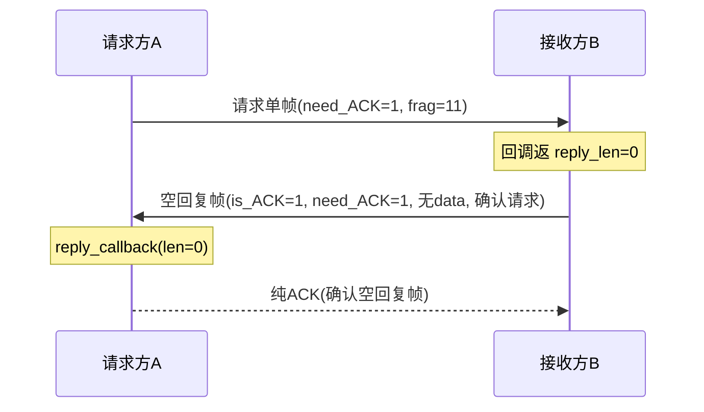

**2. 短请求 + 短回复（reply_len≤256）**
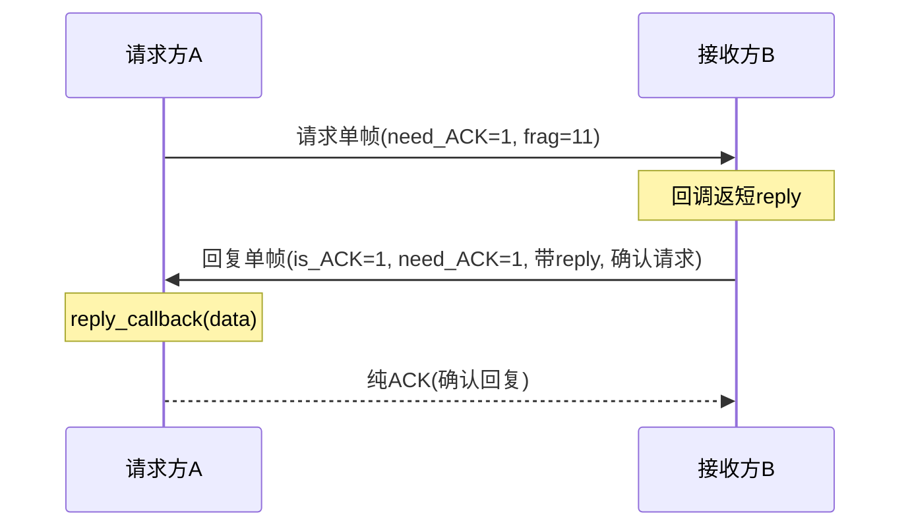

**3. 短请求 + 长回复（reply_len>256）**
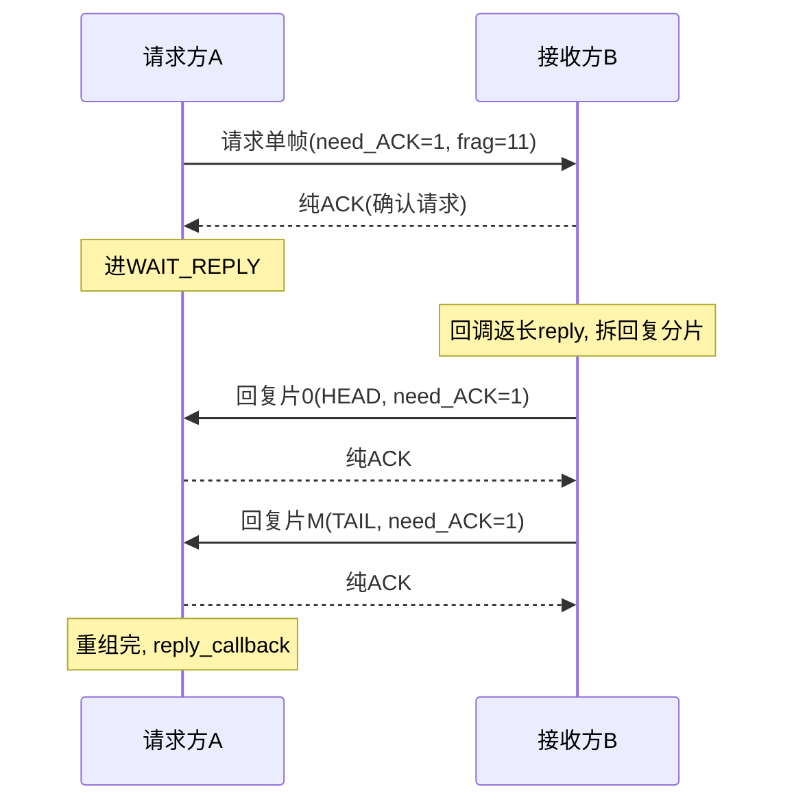

**4. 长请求 + 无回复**
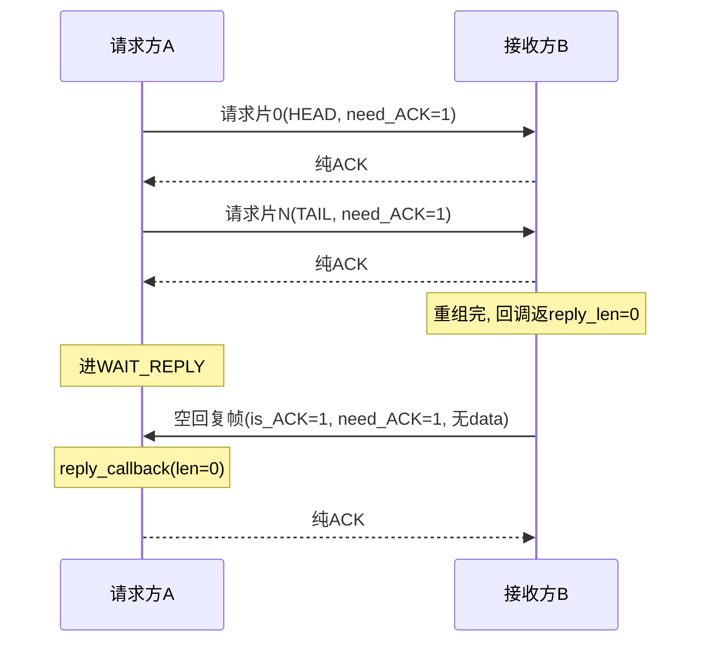

**5. 长请求 + 短回复**
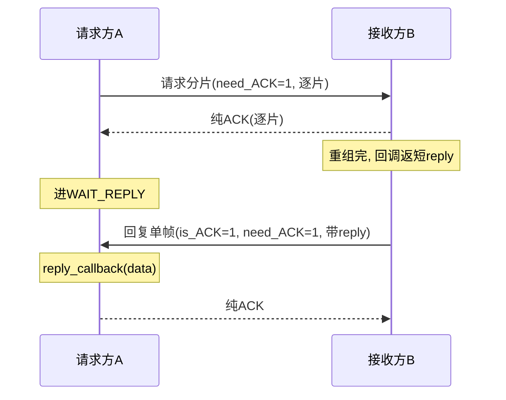

**6. 长请求 + 长回复**
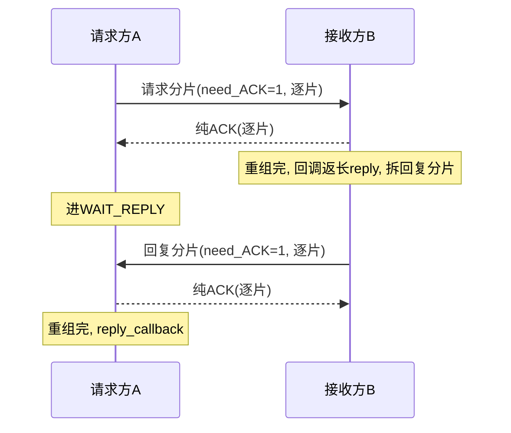

##### 异常流程

**1. 请求分片丢**
```mermaid
sequenceDiagram
    participant A as 请求方A
    participant B as 接收方B
    A->>B: 请求片0(HEAD)
    B-->>A: 纯ACK
    A->>B: 请求片1(MIDDLE)
    Note over B: 丢失, 不回ACK
    Note over A: 等不到ACK, 重传
    A->>B: 请求片1(重传)
    B-->>A: 纯ACK
    Note over A,B: 恢复; 耗尽则整包timeout
```

**2. 请求片纯ACK丢**
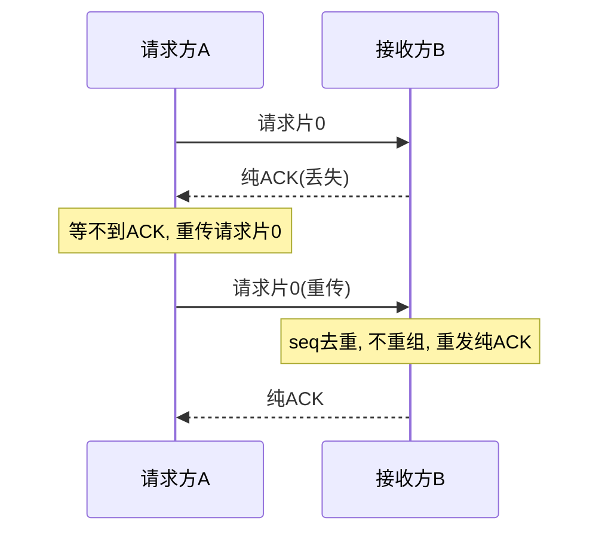

**3. 回复帧丢**
```mermaid
sequenceDiagram
    participant A as 请求方A
    participant B as 接收方B
    B->>A: 回复片0(HEAD, need_ACK=1)
    Note over A: 丢失, 不回ACK
    Note over B: 等不到ACK, 重传
    B->>A: 回复片0(重传)
    A-->>B: 纯ACK
    Note over A,B: 恢复; 耗尽B放弃, A等回复超时timeout
```

**4. 回复片纯ACK丢**
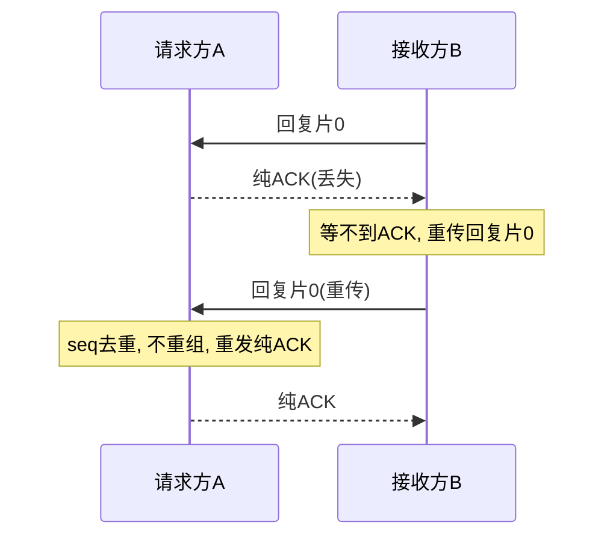

**5. 没回调 / buf溢出 / 未注册buf**
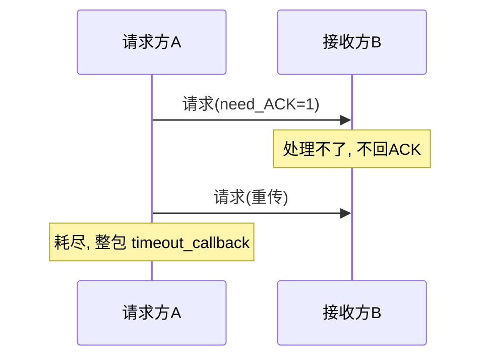

**6. 残包（收HEAD没TAIL）**
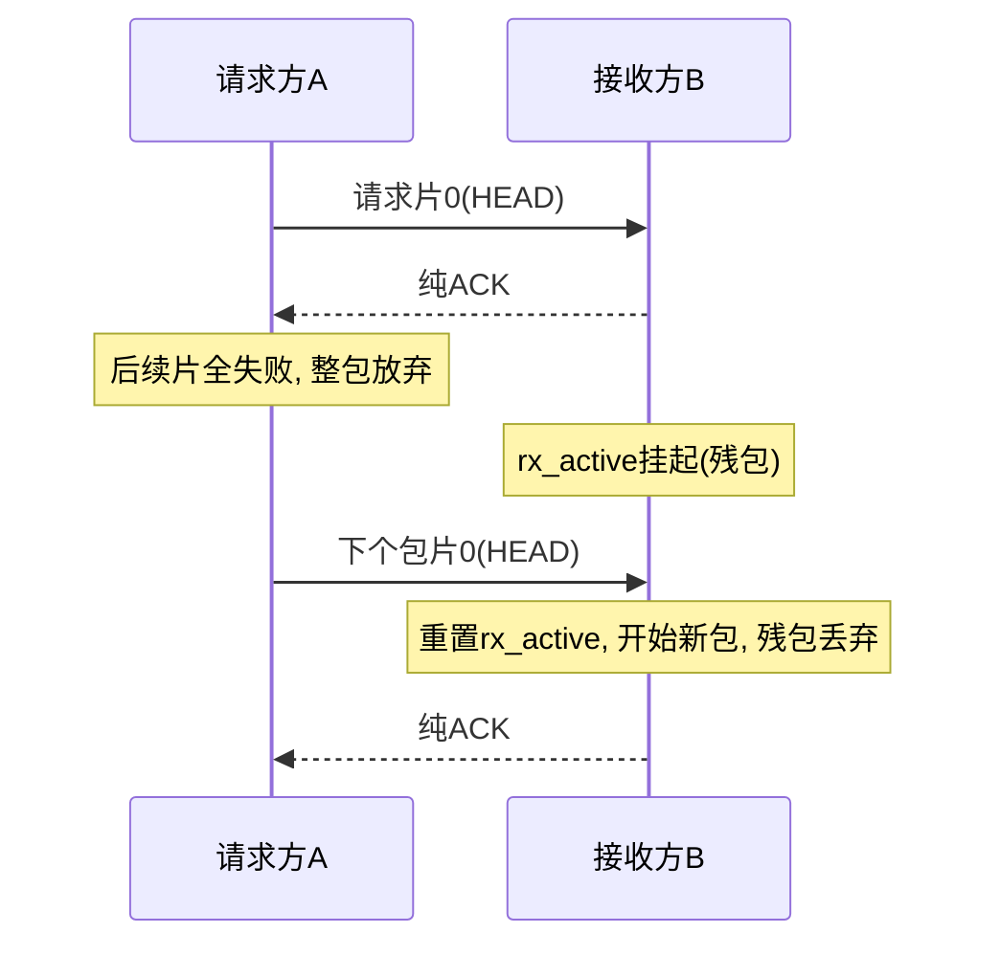

###  1.通信流程

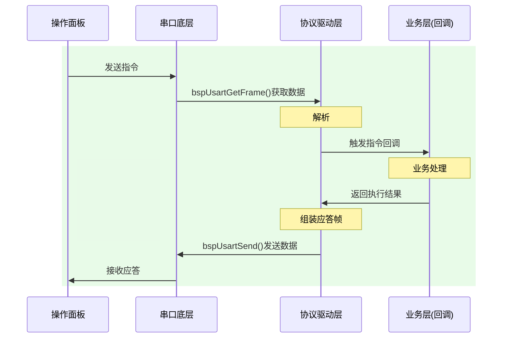

### 2026/4/17面板功能会议

 -  不兼容升级，只烧录定制版本，分阶段，后续进行开发
 - [ ] 支持中/英文；
 - [ ] IP/端口设置界面：支持四段IP设置，端口选择
 - [ ] 模块开关界面：
 - [ ] 参数设置界面：
 - [ ] 通道/模块
