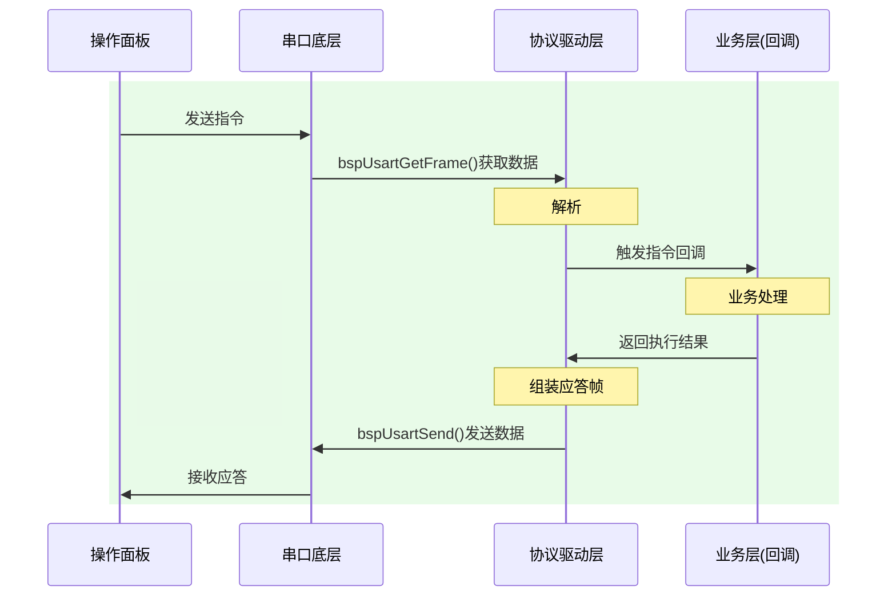

## 待办列表
- [ ] 编码
- [ ] 测试
- [ ] 合并
### 1.通信协议
#### 协议格式：

| 名称             | 长度          | 内容       | 备注     |
| -------------- | ----------- | -------- | ------ |
| 帧头    (HEAD)   | 一字节         | 0x55     |        |
| 长度    (LEN)    | 两字节         | 整个数据帧长度  |        |
| 控制码 (CTR)      | 一字节         | 标识方向，帧类型 | bit 8： |
| 序列号 (SEQ)      | 一字节         |          |        |
| 指令码 (CMD)      | 两字节         | 指令码      |        |
| 数据    (DATA)   | (len - 8)字节 |          |        |
| 状态    (STATUE) | 一字节         |          |        |
| 校验    (CHECK)  | 一字节         |          |        |
| 帧尾    (TAIL)   | 一字节         | 0xAA     |        |

###  1.通信流程

