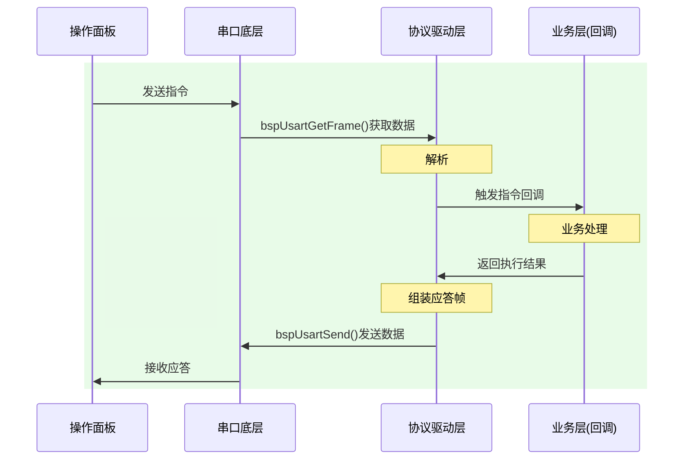

## 待办列表
- [ ] 编码
- [ ] 测试
- [ ] 合并
### 1.通信协议
#### 协议格式：

| 名称            | 长度          | 内容             | 备注  |
| ------------- | ----------- | -------------- | --- |
| 帧头    (HEAD)  | 两字节         | 0x55，0x55      |     |
| 长度    (LEN)   | 两字节         | 整个数据帧长度        |     |
| 版本号 (VER）     | 一字节         |                |     |
| 配置位 (CFG)     | 两字节         | 应答设置           |     |
| 序列号 (SEQ)     | 两字节         | 当前数据帧序列号       |     |
| 指令码 (CMD)     | 两字节         | 标识当前是什么指令      |     |
| 数据    (DATA)  | (len - 9)字节 | 指令内容           |     |
| 校验    (CHECK) | 一字节         | CRC8（LEN-DATA） |     |
| 帧尾    (TAIL)  | 两字节         | 0xAA，0xAA      |     |

###  1.通信流程

### 2026/4/17面板功能会议

 -  不兼容升级，只烧录定制版本，分阶段，后续进行开发
 - [ ] 支持中/英文；
 - [ ] IP/端口设置界面：支持四段IP设置，端口选择
 - [ ] 模块开关界面：
 - [ ] 参数设置界面
 - [ ] 通道/模块 唯一标记设置界面：全厂唯一；