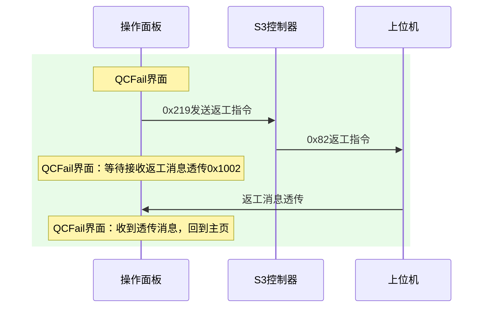
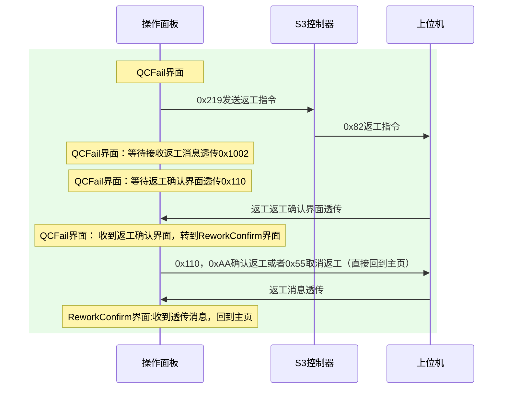
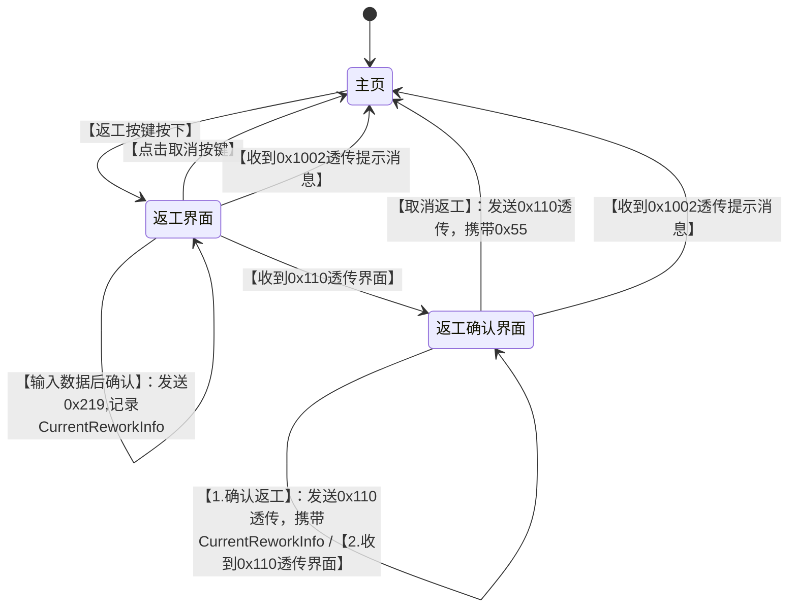

## 待办列表
- [ ] 编码
- [ ] 测试
- [ ] 合并

### 流程
#### 1.旧版

```mermaid
sequenceDiagram
    participant 面板 as 操作面板
    participant 控制器 as S3控制器
    participant 上位机 as 上位机
    rect rgba(180, 240, 180, 0.3) # 外层绿色区块
    note over 面板:QCFail界面
	面板   ->> 控制器: 0x219发送返工指令
	控制器 ->> 上位机: 0x82返工指令
	note over 面板:QCFail界面：等待接收返工消息透传0x1002
	上位机 ->> 面板: 返工消息透传
	note over 面板:QCFail界面：收到透传消息，回到主页
	 end
```
#### 2.新版

```mermaid
sequenceDiagram
    participant 面板 as 操作面板
    participant 控制器 as S3控制器
    participant 上位机 as 上位机
    rect rgba(180, 240, 180, 0.3) # 外层绿色区块
    note over 面板:QCFail界面
	面板   ->> 控制器: 0x219发送返工指令
	控制器 ->> 上位机: 0x82返工指令
	note over 面板:QCFail界面：等待接收返工消息透传0x1002
	note over 面板:QCFail界面：等待返工确认界面透传0x110
	上位机 ->> 面板:返工返工确认界面透传
	note over 面板:QCFail界面： 收到返工确认界面，转到ReworkConfirm界面
	面板 ->> 上位机:0x110，0xAA确认返工或者0x55取消返工（直接回到主页）
	上位机 ->> 面板: 返工消息透传
	note over 面板:ReworkConfirm界面:收到透传消息，回到主页
	 end
```
#### 3.界面状态转换

```mermaid
stateDiagram-v2
    [*] --> 主页
    主页 --> 返工界面: 【返工按键按下】
    返工界面 --> 返工界面: 【输入数据后确认】：发送0x219,记录CurrentReworkInfo
    返工界面 --> 主页: 【点击取消按键】
    返工界面 --> 主页: 【收到0x1002透传提示消息】
    返工界面 --> 返工确认界面: 【收到0x110透传界面】
    返工确认界面 --> 主页: 【取消返工】：发送0x110透传，携带0x55
    返工确认界面 --> 主页: 【收到0x1002透传提示消息】
    返工确认界面 --> 返工确认界面: 【1.确认返工】：发送0x110透传，携带CurrentReworkInfo /【2.收到0x110透传界面】
    
```
