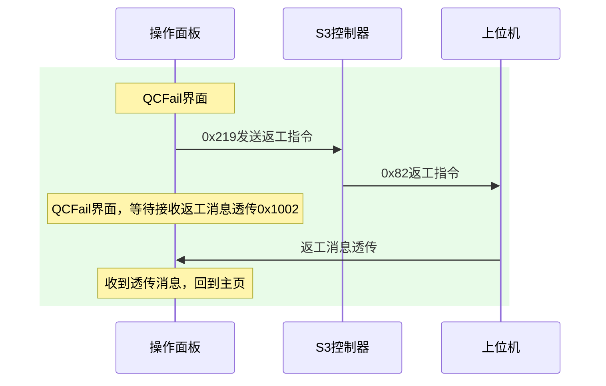
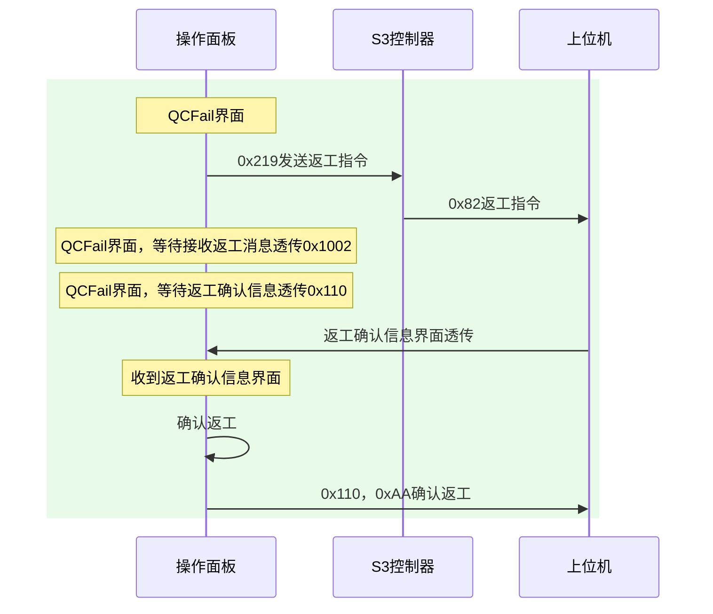

## 待办列表
- [ ] 编码
- [ ] 测试
- [ ] 合并

### 流程

```mermaid
sequenceDiagram
    participant 面板 as 操作面板
    participant 控制器 as S3控制器
    participant 上位机 as 上位机
    rect rgba(180, 240, 180, 0.3) # 外层绿色区块
    note over 面板:QCFail界面
	面板   ->> 控制器: 0x219发送返工指令
	控制器 ->> 上位机: 0x82返工指令
	note over 面板:QCFail界面，等待接收返工消息透传0x1002
	上位机 ->> 面板: 返工消息透传
	note over 面板:收到透传消息，回到主页
	 end
```

```mermaid
sequenceDiagram
    participant 面板 as 操作面板
    participant 控制器 as S3控制器
    participant 上位机 as 上位机
    rect rgba(180, 240, 180, 0.3) # 外层绿色区块
    note over 面板:QCFail界面
	面板   ->> 控制器: 0x219发送返工指令
	控制器 ->> 上位机: 0x82返工指令
	note over 面板:QCFail界面，等待接收返工消息透传0x1002
	note over 面板:QCFail界面，等待返工确认信息透传0x110
	上位机 ->> 面板: 返工确认信息界面透传
	note over 面板:收到返工确认信息界面
	面板 ->> 面板:确认返工
	面板 ->> 上位机:0x110，0xAA确认返工
	 end
```