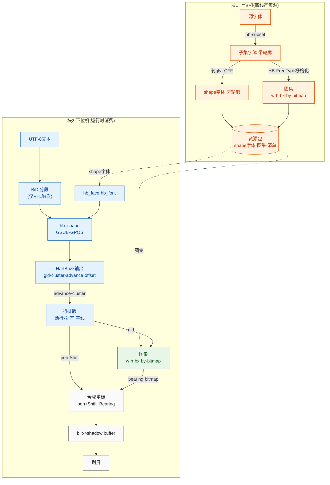

## 待办列表
- [ ] 编码
- [ ] 测试
- [ ] 合并

## 方案

## 项目结构

harfembed/
├── docs/                               # 文档
├── res/
│   ├── fonts/                          # 源字体，CLI 输入
│   │   ├── xxx.ttf
│   │   └── xxx.otf
│   └── fontlets/                          # 生成产物
│       ├── fontlets_registry.h        # 生成的 fontlet 索引
│       ├── common.fontlet
│       ├── latn.fontlet
│       ├── hani.fontlet
│       └── hans.fontlet
├── src/
│   ├── third_party/                   # harfbuzz / freetype
│   ├── fonlet_generator_cli/       # 生成fontlet
│   │   └── CMakeLists.txt
│   └── harfembed/                   # MCU 库
│       ├── CMakeLists.txt
│       └── inc/                          # 公共 API 头（含 fontlet_format.h）
├── examples/
│   └── CMakeLists.txt
├── tests/
│   └── CMakeLists.txt
├── .gitignore
├── CMakeLists.txt
├── LICENSE
└── README.md

