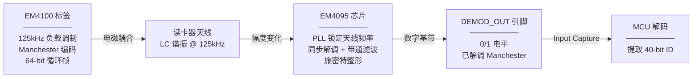
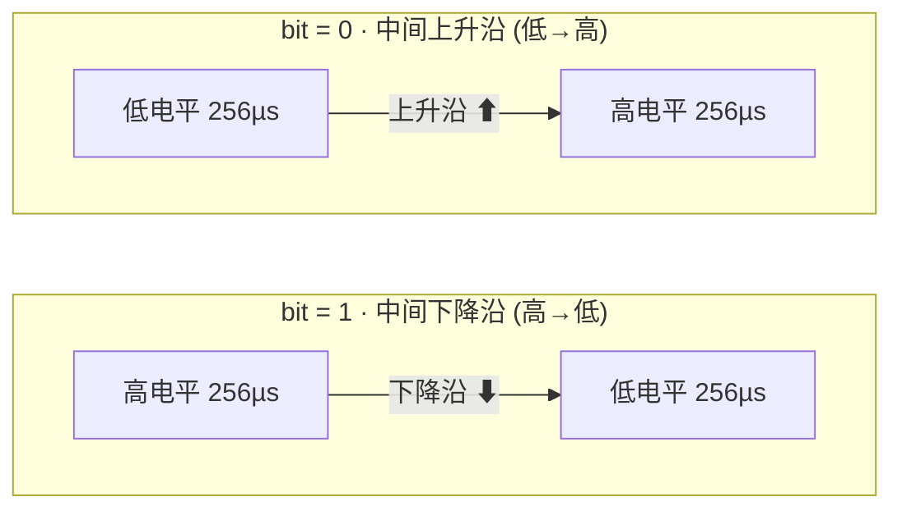
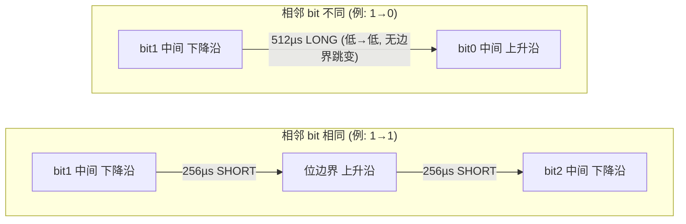
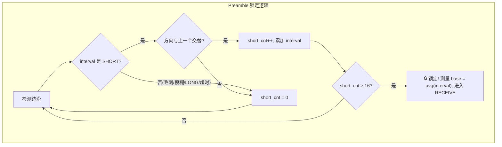
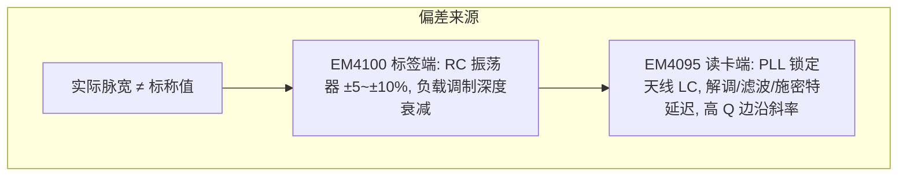
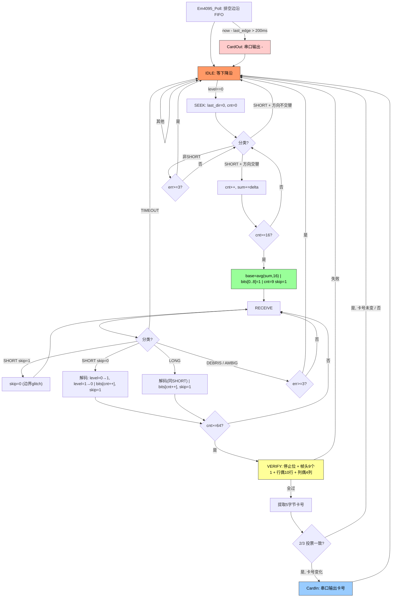
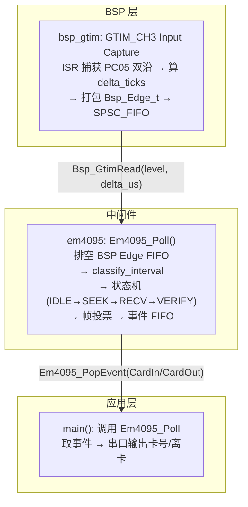

---
领域:
  - 输出
类型:
  - 文章
项目:
  - "[[SR3读卡器]]"
状态: 草稿
创建时间: 2026-08-01T22:11:12
完成时间:
---
# 125kHz RFID 读卡器 —— EM4095/EM4100

## 1. 协议

### 1.1 物理层参数与系统总览



| 参数 | 值 |
|---|---|
| 载波频率 | 125kHz (典型，实际 100~150kHz) |
| 数据编码 | Manchester |
| 位速率 | 载波 ÷ 64 ≈ 1953 bps |
| 位周期 | 64 载波周期 = 512µs |
| 半位周期 | 32 载波周期 = 256µs |
| 通信方式 | 负载调制 |

### 1.2 Manchester 编码

核心规则:每个位周期正中间必有一次电平跳变,跳变方向代表 bit 值。



```
下降沿 (level=0) → bit = 1
上升沿 (level=1) → bit = 0
```

### 1.3 相邻位边界跳变规律

相邻 bit 之间的边界处是否产生额外跳变，取决于相邻 bit 是否相同。这决定了边沿间隔是 SHORT 还是 LONG。



| 相邻 bit | 边界电平变化 | 边界有无跳变 | 边沿间隔序列 |
|---|---|---|---|
| 1 → 1 | 低 → 高 | 有 (上升沿) | SHORT → SHORT |
| 1 → 0 | 低 → 低 | 无 | LONG |
| 0 → 1 | 高 → 高 | 无 | LONG |
| 0 → 0 | 高 → 低 | 有 (下降沿) | SHORT → SHORT |

> **关键结论**: 信号中只会出现两种合法边沿间隔——SHORT (≈256µs) 和 LONG (≈512µs)。

### 1.4 Preamble (同步头)

9 位全 1 同步头在 Manchester 编码后产生 **18 个连续 SHORT 边沿**,方向严格交替:

```
偶数边沿 (0,2,4...16) = bit 中间跳变,全部为下降沿
奇数边沿 (1,3,5...17) = 位边界跳变,全部为上升沿

锁定条件: 连续检测到 ≥16 个交替方向的 SHORT 边沿
→ 确认同步头,锁定相位,动态测量 avg_short
```



### 1.5 帧结构 (64 bits)

```
bit  0 ~  8: 9bit 同步头 (全 1)
bit  9 ~ 13: 数据行0 (4bit 数据 + 1bit 行偶校验 P0)
bit 14 ~ 18: 数据行1
...
bit 54 ~ 58: 数据行9
bit 59 ~ 62: 4bit 列偶校验 (PC0~PC3)
bit 63     : 1bit 停止位 (固定为 0)
```

10 行 × 4bit 数据 = **40-bit ID** = 5 字节 (厂商编号[1] + 衣架ID[4])

### 1.6 校验规则

- **行偶校验 (10 行)**: 每行 4 个数据 bit XOR 后必须等于该行校验 bit (偶校验)
- **列偶校验 (4 列)**: 每列 10 个数据 bit XOR 后必须等于该列校验 bit (偶校验)
- **停止位**: bit[63] 必须为 0

横向 + 纵向双重校验，随机序列通过概率 ≈ 1/32768。

---

## 2. DEMOD_OUT 信号

### 2.1 脉宽偏差来源



> 实际 SHORT/LONG 是围绕标称值波动的区间,不是固定数值。解码必须用"有效窗口"判定。

### 2.2 时间窗口过滤 (classify_interval)

以 base (avg_short, 实测 ≈ 256µs) 为基准,百分比判定:

```
DEBRIS    < 70% × base         噪声碎片,忽略
SHORT     70% ~ 130% × base    半位周期 (≈ 256µs)
AMBIGUOUS 130% ~ 170% × base   模糊灰区,忽略并累计错误
LONG      170% ~ 230% × base   整位周期 (≈ 512µs)
TIMEOUT   > 230% × base        信号丢失/帧间隙
```

---

## 3. 解码状态机

**设计原则: ISR 只记录不判断 → 主循环做全部消抖/过滤/解码。**

### 3.1 状态流转



### 3.2 各状态详解

| 状态 | 做什么 | 触发条件 | 输出 |
|---|---|---|---|
| IDLE | 等第一个下降沿 | level==0 | → SEEK |
| SEEK | 统计交替 SHORT,数满 16 个锁前导码 | 每收到交替 SHORT cnt++ | base (avg) + 帧头 9 个 1 + → RECEIVE |
| RECEIVE | need_skip 相位跟踪,逐位解码 64 bits | SHORT(非 skip)/LONG 解码; SHORT(skip)/毛刺/模糊跳过 | bits[64] → VERIFY |
| VERIFY | 停止位 + 帧头 + 行偶 10 行 + 列偶 4 列 | 收满 64 bits | 5 字节卡号 → 投票 |
| 帧投票 | 3 帧中 2/3 一致 + 与上次卡号不同 | 校验通过 | CardIn 事件 |
| 离卡检测 | now - last_edge > 200ms | 卡已离开 | CardOut 事件 |

### 3.3 校验流程

```
1. 停止位    bit[63] == 0
2. 帧头      bits[0..8] 全为 1
3. 行偶校验  10 行全部通过 (每行 4bit XOR == 校验 bit)
4. 列偶校验  4 列全部通过 (每列 10bit XOR == 校验 bit)
```

四项全过才进投票,任一项不过回 IDLE。

### 3.4 need_skip 相位跟踪

| 场景 | 动作 |
|---|---|
| SHORT (skip=0) | bit 中心跳变 → 解码 1 bit → skip=1 |
| SHORT (skip=1) | bit 边界 glitch → 丢弃 → skip=0 |
| LONG | bit 中心跳变 (相邻 bit 不同) → 解码 1 bit → skip=1 |

---

## 4. 事件模型

| 事件 | 条件 | 输出 |
|---|---|---|
| CardIn | 2/3 帧校验通过 + 卡号与上次不同 | 新卡号 5 字节 |
| CardOut | 没有任何边沿超过 200ms | 离卡通知 |

卡号持续不变时不重复触发 CardIn; 卡离开后重新进入才视为新卡。

---

## 5. 实现架构



---

## 6. 关键数值速查

| 参数 | 值 |
|---|---|
| 标称半位周期 | 256µs |
| SHORT 窗口 | 70% ~ 130% × base (~179 ~ 333µs) |
| AMBIGUOUS 窗口 | 130% ~ 170% × base |
| LONG 窗口 | 170% ~ 230% × base (~435 ~ 589µs) |
| TIMEOUT | > 230% × base (> 589µs) |
| 帧长度 | 64 bits |
| SEEK 锁定 | ≥16 交替 SHORT |
| 投票 | 3 帧中 2/3 一致 |
| 离卡 | 200ms 无沿 |
| base 初始值 | 256µs |
| base 动态测量 | SEEK 锁时取 16 SHORT 均值,钳位 200~312µs |

---

## 附录: 状态机速查

| 状态 | 做什么 | 吃什么 | 产出 |
|---|---|---|---|
| IDLE | 等下降沿 | 下降沿 | → SEEK |
| SEEK | 数 16 SHORT 交替 + 方向翻转 → 测 base | SHORT 边沿 | base + 帧头 9 个 1 → RECEIVE |
| RECEIVE | need_skip 相位跟踪 + 逐位解码 64 bits | 所有合法边沿 | bits[64] → VERIFY |
| VERIFY | 停止位 + 帧头 9 个 1 + 行偶 + 列偶 | bits[64] | 5 字节卡号 → 投票 |
| 投票 | 3 帧 2/3 一致 + 卡号变化 | valid ID | CardIn |
| 离卡 | 200ms 无沿 | 时间基准 | CardOut |
