---
领域:
  - 输出
  - 工作
类型: 文章
项目: "[[SR3读卡器]]"
状态: 草稿
创建时间: 2026-08-01T22:11:12
完成时间:
---
# 125kHz RFID 读卡器 —— EM4095/EM4100
---

## 第一章：EM4100 只读标签协议

  

### 1.1 物理层参数与系统总览

  

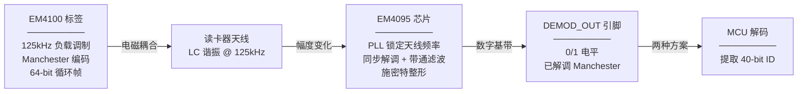

  

| 参数 | 值 |

|---|---|

| 载波频率 | 125kHz (典型值，实际 100~150kHz) |

| 数据编码 | Manchester (曼彻斯特编码) |

| 位速率 | 载波频率 ÷ 64，125kHz 下 ≈ 1953 bps |

| 位周期 | 64 载波周期 = 512µs (125kHz 下) |

| 半位周期 | 32 载波周期 = 256µs |

| 通信方式 | 负载调制，标签改变天线负载幅度 |

  

### 1.2 Manchester 编码详解

  

核心规则：**每个位周期正中间必有一次电平跳变，跳变方向代表 bit 值。**

  

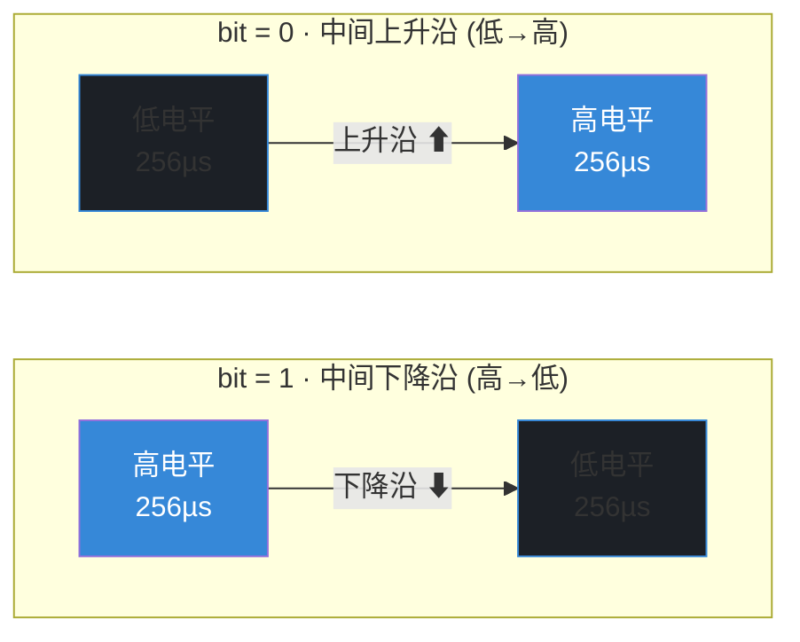

  

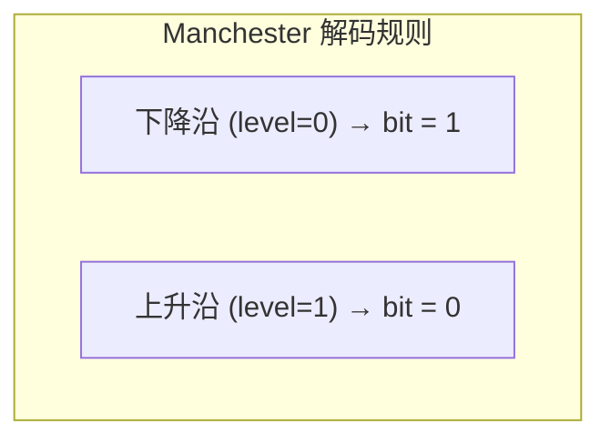

  

### 1.3 相邻位边界跳变规律

  

相邻 bit 之间的边界处是否产生额外跳变，取决于两个 bit 是否相同。这直接决定了边沿间隔是 SHORT 还是 LONG。

  

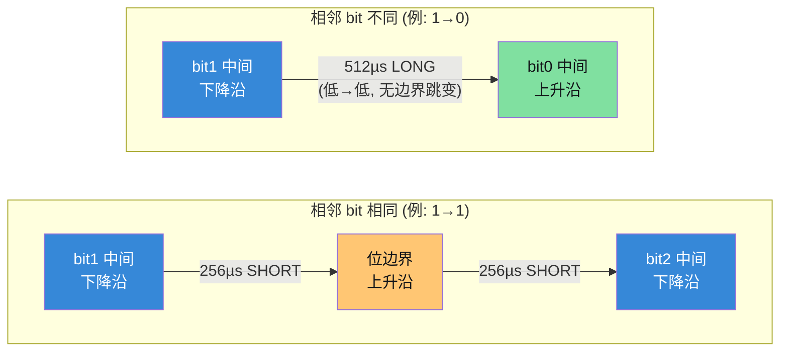

  

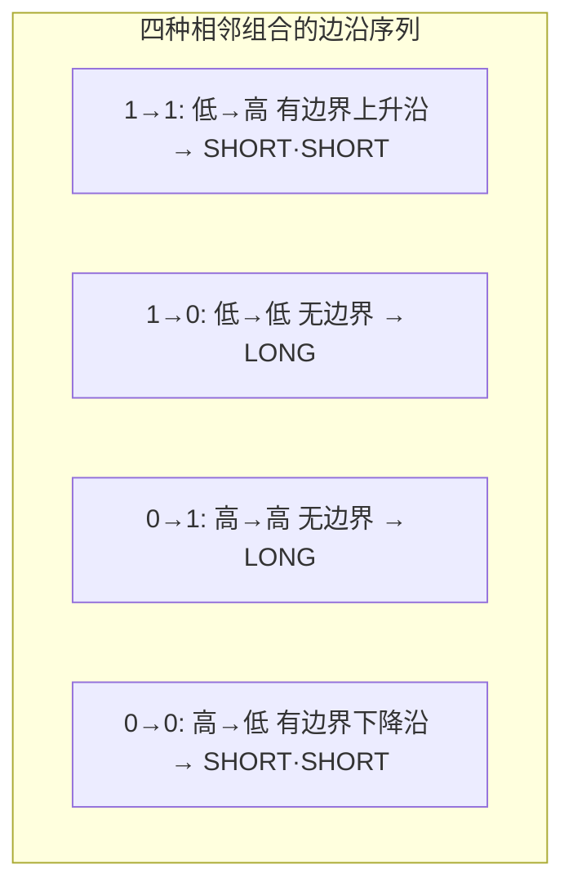

  

| 相邻 bit | 边界电平变化 | 边界有无跳变 | 边沿间隔序列 |

|---|---|---|---|

| 1 → 1 | 低 → 高 | 有 (上升沿) | SHORT → SHORT |

| 1 → 0 | 低 → 低 | 无 | LONG |

| 0 → 1 | 高 → 高 | 无 | LONG |

| 0 → 0 | 高 → 低 | 有 (下降沿) | SHORT → SHORT |

  

> **关键结论**：信号中只会出现两种合法边沿间隔 —— SHORT (≈256µs，半周期) 和 LONG (≈512µs，整周期)。两者之间存在安全间隙，绝不重叠。

  

### 1.4 Preamble（同步头）特征

  

9 位全 1 同步头在 Manchester 编码后产生 **18 个连续 SHORT 边沿**，方向严格交替：

  

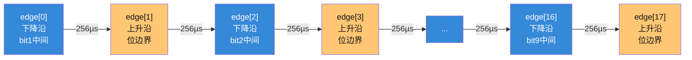

  

```

偶数边沿 (0,2,4...16)  = bit 中间跳变，全部为下降沿

奇数边沿 (1,3,5...17)  = 位边界跳变，全部为上升沿

  

锁定条件：连续检测到 ≥14 个交替方向的 SHORT 边沿

→ 确认同步头，锁定相位，测量实际 avg_short

```

  

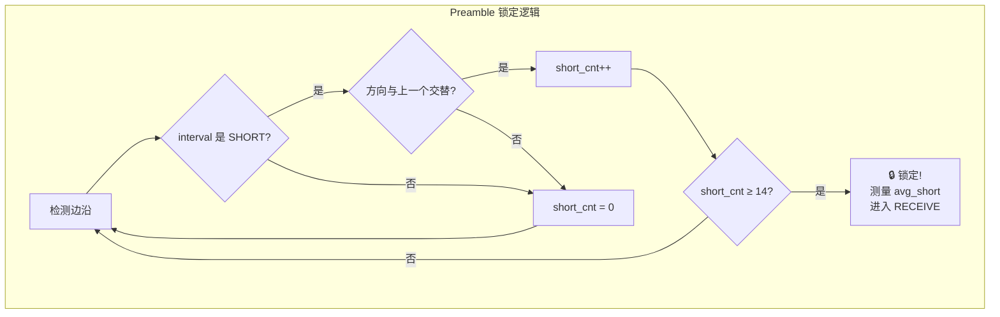

  

### 1.5 帧结构 (64 bits)

  

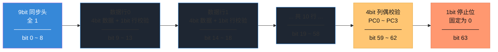

  

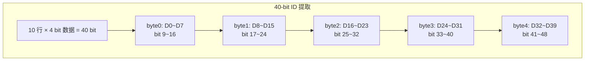

  

### 1.6 校验规则

  

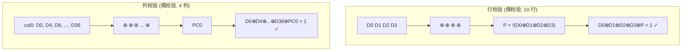

  

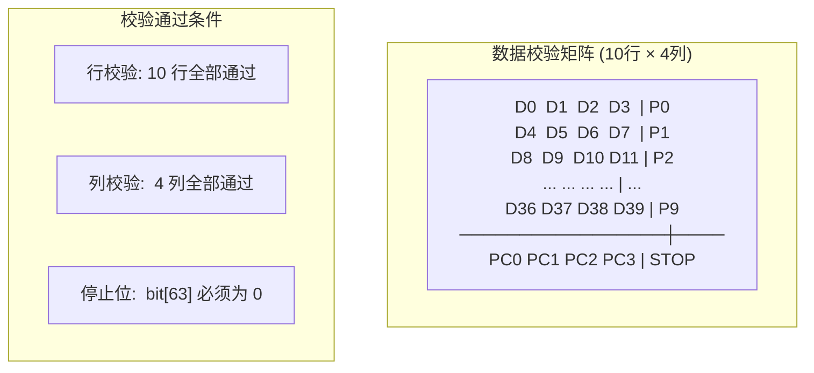

  

横向 + 纵向双重校验，随机 bit 序列通过概率 ≈ 1/32768。

  

---

  

## 第二章：DEMOD_OUT 信号与抗干扰基础

  

### 2.1 脉宽偏差的来源

  

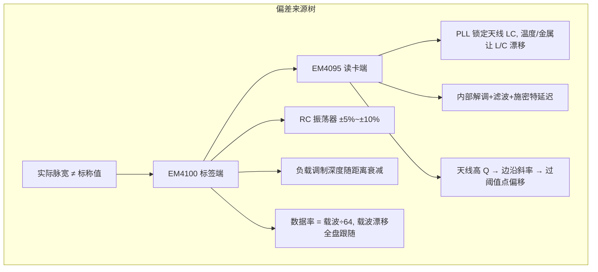

  

> **结论**：实际 SHORT / LONG 是围绕标称值波动的区间，不是固定数值。解码必须用"有效窗口"判定。

  

### 2.2 时间参数与判定窗口

  

综合标签时钟误差、解调延迟、噪声抖动，取 **±20% 容差**可覆盖绝大多数工作场景。

  

```mermaid

flowchart LR

    S0["0µs"] --> Smin["< 150µs\n碎片区"] --> SnL["205µs\nSHORT 下限"] --> Snorm["256µs\n标称值"] --> SnH["307µs\nSHORT 上限"]

    --> Gap["308~409µs\n模糊灰区"]

    --> LnL["410µs\nLONG 下限"] --> Lnorm["512µs\n标称值"] --> LnH["614µs\nLONG 上限"] --> T["> 614µs\n超时/帧间隙"]

  

    style Smin fill:#ff9870,color:#121418

    style SnL fill:#80e0a0,color:#121418

    style Snorm fill:#80e0a0,color:#121418

    style SnH fill:#80e0a0,color:#121418

    style Gap fill:#ffc673,color:#121418

    style LnL fill:#80e0a0,color:#121418

    style Lnorm fill:#80e0a0,color:#121418

    style LnH fill:#80e0a0,color:#121418

    style T fill:#ff9870,color:#121418

```

  

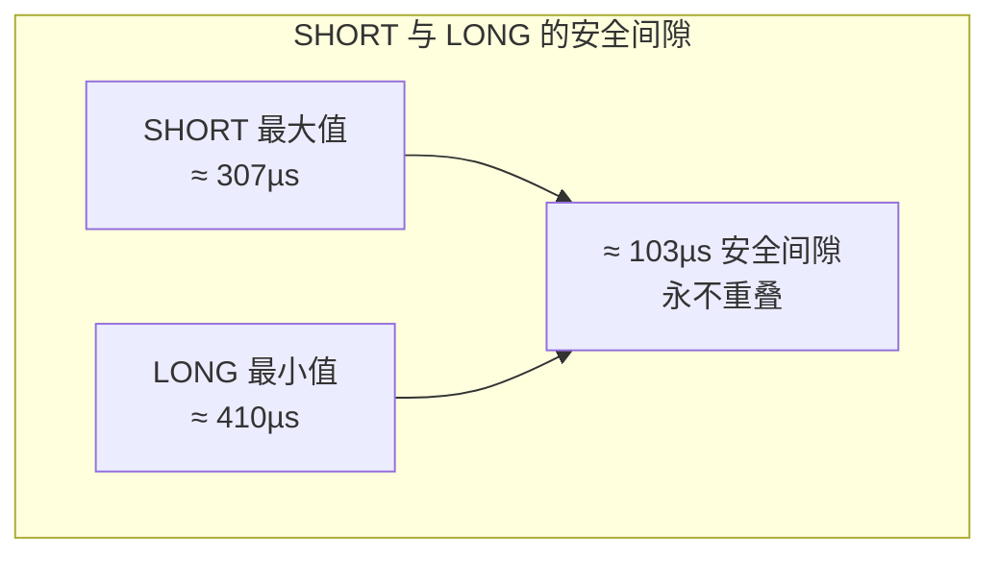

  

### 2.3 常见信号异常

  

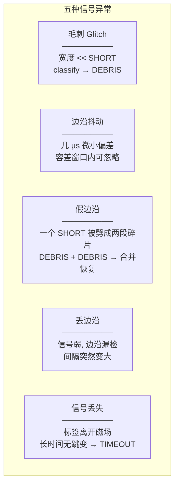

  

### 2.4 时间窗口过滤机制

  

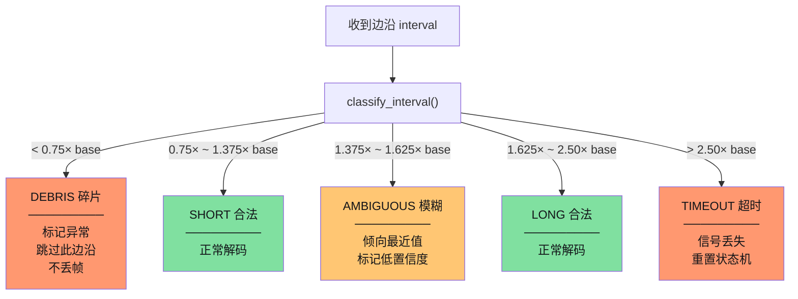

  

| 区间范围 | 类型 | 处理逻辑 |

|---|---|---|

| < 0.75× avg_short | DEBRIS 碎片 | 标记异常，不丢帧，跳过此边沿继续 |

| 0.75× ~ 1.375× avg_short | SHORT 合法 | 正常送入解码状态机 |

| 1.375× ~ 1.625× avg_short | AMBIGUOUS 模糊 | 偏 SHORT/LONG 由上下文决定，标记低置信度 |

| 1.625× ~ 2.50× avg_short | LONG 合法 | 正常送入解码状态机 |

| > 2.50× avg_short | TIMEOUT 超时 | 信号丢失或帧间隙，重置状态机 |

  

---

  

## 第三章：共用核心 —— 解码状态机

  

**两种方案仅前端采集方式不同，一旦获得 {level, interval} 序列，后续解码 100% 共用。**

  

### 3.1 设计原则

  

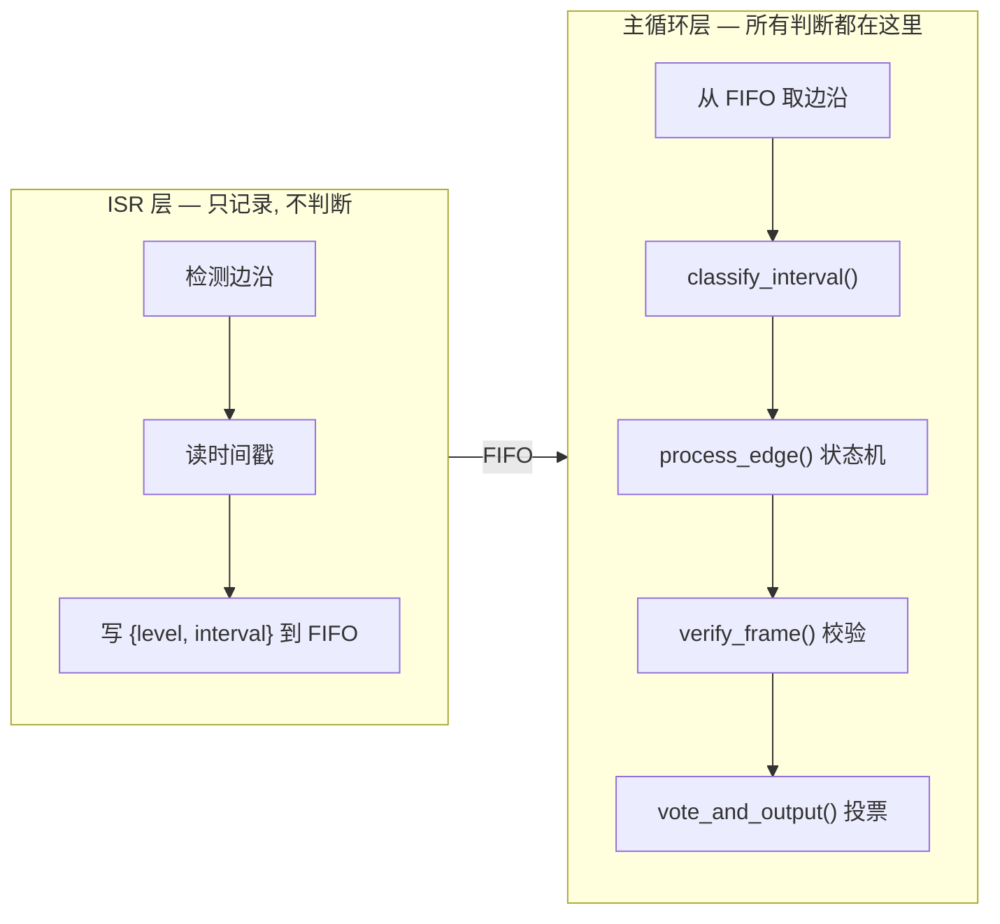

  

### 3.2 状态机总览

  

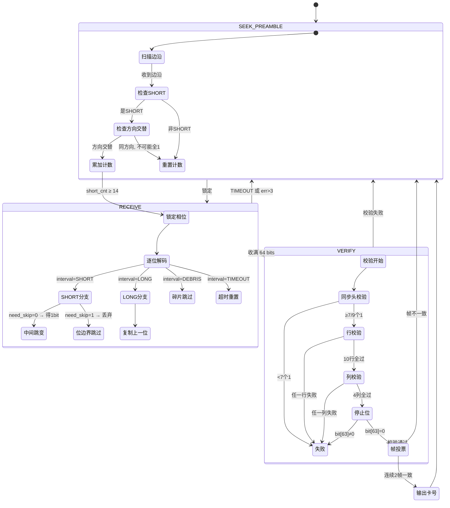

  

### 3.3 共用类型定义

  

```c

typedef struct {

    uint8_t  level;       // 跳变后电平: 1=上升沿→bit=0, 0=下降沿→bit=1

    uint16_t interval;    // 距上次边沿的 tick 数

} edge_t;

  

typedef enum { SEEK_PREAMBLE, RECEIVE, VERIFY } state_t;

typedef enum { DEBRIS, SHORT, AMBIGUOUS, LONG, TIMEOUT } class_t;

  

typedef struct {

    uint8_t  running;

    state_t  state;

    uint16_t avg_short;

    uint16_t short_buf[18];

    uint8_t  short_cnt;

    uint8_t  bit_buf[64];

    uint8_t  bit_idx;

    uint8_t  prev_bit;

    uint8_t  prev_edge_level;

    uint8_t  need_skip;

    uint8_t  err_cnt;

    uint8_t  id_queue[3][5];

    uint8_t  id_q_idx, id_q_cnt;

    void   (*on_id)(uint8_t id[5]);

} decoder_t;

```

  

### 3.4 间隔分类 (classify_interval)

  

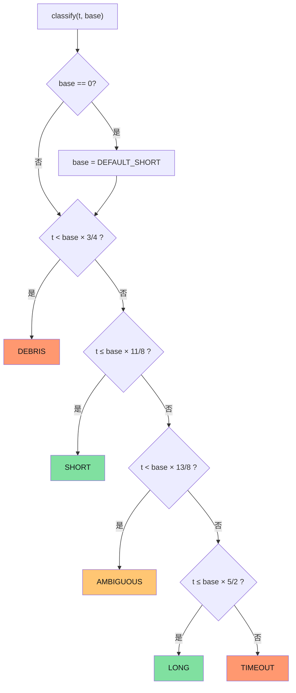

  

```c

class_t classify(uint16_t t, uint16_t base)

{

    if (base == 0) base = DEFAULT_SHORT;

  

    if      (t <  base * 3 / 4)  return DEBRIS;

    else if (t <= base * 11 / 8) return SHORT;

    else if (t <  base * 13 / 8) return AMBIGUOUS;

    else if (t <= base * 5 / 2)  return LONG;

    else                         return TIMEOUT;

}

```

  

### 3.5 解码核心 (process_edge)

  

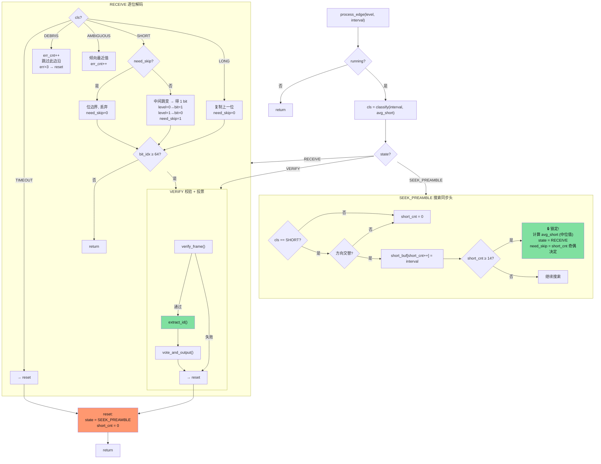

  

```c

void process_edge(decoder_t *d, uint8_t level, uint16_t interval)

{

    if (!d->running) return;

    class_t cls = classify(interval, d->avg_short);

  

    // ============================

    // SEEK_PREAMBLE

    // ============================

    if (d->state == SEEK_PREAMBLE) {

        if (cls == SHORT) {

            if (d->short_cnt >= 1 && level == d->prev_edge_level)

                d->short_cnt = 0;

            if (d->short_cnt < 18)

                d->short_buf[d->short_cnt] = interval;

            d->short_cnt++;

            if (d->short_cnt >= 14) {

                uint16_t s[14]; memcpy(s, d->short_buf, 28);

                sort(s, 14); d->avg_short = s[7];

                d->state = RECEIVE; d->bit_idx = 0;

                d->prev_bit = 0xFF; d->err_cnt = 0;

                d->need_skip = (d->short_cnt & 1) ? 1 : 0;

            }

        } else { d->short_cnt = 0; }

        d->prev_edge_level = level;

        return;

    }

  

    // ============================

    // RECEIVE

    // ============================

    if (d->state == RECEIVE) {

        if (cls == TIMEOUT)   goto reset;

        if (cls == DEBRIS)    { d->err_cnt++; if(d->err_cnt>3) goto reset;

                                d->prev_edge_level=level; return; }

        if (cls == AMBIGUOUS) { cls=(interval<d->avg_short*3/2)?SHORT:LONG;

                                d->err_cnt++; if(d->err_cnt>3) goto reset; }

        if (cls == SHORT) {

            if (d->need_skip) { d->need_skip = 0; }

            else {

                uint8_t bit = (level == 0) ? 1 : 0;

                if (d->bit_idx < 64) {

                    d->bit_buf[d->bit_idx] = bit;

                    d->prev_bit = bit; d->bit_idx++;

                }

                d->need_skip = 1;

            }

        } else {

            if (d->prev_bit != 0xFF && d->bit_idx < 64)

                d->bit_buf[d->bit_idx++] = d->prev_bit;

            else d->err_cnt++;

            d->need_skip = 0;

        }

        if (d->bit_idx >= 64) goto verify;

        d->prev_edge_level = level; return;

    }

  

    // ============================

    // VERIFY

    // ============================

verify:

    { uint8_t ok = verify_frame(d->bit_buf);

      if (ok) { uint8_t id[5]; extract_id(d->bit_buf, id);

                vote_and_output(d, id); } }

reset:

    d->state = SEEK_PREAMBLE; d->short_cnt = 0;

    d->prev_edge_level = level;

}

```

  

### 3.6 校验流程

  

```mermaid

flowchart TD

    START["verify_frame(bits[64])"] --> H{"同步头:\nbits[0..8] ≥ 7 个 1?"}

    H -->|否| FAIL["返回 0 (失败)"]

    H -->|是| R{"行校验:\n10 行偶校验全过?"}

    R -->|否| FAIL

    R -->|是| C{"列校验:\n4 列偶校验全过?"}

    C -->|否| FAIL

    C -->|是| S{"停止位:\nbits[63] == 0?"}

    S -->|否| FAIL

    S -->|是| PASS["返回 1 (通过)"]

  

    style FAIL fill:#ff9870,color:#121418

    style PASS fill:#80e0a0,color:#121418

```

  

```c

uint8_t verify_frame(uint8_t *bits)

{

    uint8_t n = 0;

    for (int i = 0; i < 9; i++) if (bits[i]) n++;

    if (n < 7) return 0;

  

    for (int r = 0; r < 10; r++) {

        uint8_t x = 0;

        for (int i = 0; i < 5; i++) x ^= bits[9 + r*5 + i];

        if (x != 1) return 0;

    }

  

    for (int c = 0; c < 4; c++) {

        uint8_t x = bits[59 + c];

        for (int r = 0; r < 10; r++) x ^= bits[9 + r*5 + c];

        if (x != 1) return 0;

    }

  

    if (bits[63] != 0) return 0;

    return 1;

}

```

  

### 3.7 帧投票流程

  

```mermaid

flowchart TD

    VOTE["vote_and_output(id)"] --> Q["id_queue[id_q_idx] = id\nid_q_idx = (id_q_idx+1) % 3\nid_q_cnt++"]

    Q --> CHK{"id_q_cnt ≥ 2?"}

    CHK -->|否| WAIT["等待更多帧"]

    CHK -->|是| CMP{"最近 2 帧\nID 一致?"}

    CMP -->|是| OUT["✅ 输出卡号!\non_id(id)\n清空队列"]

    CMP -->|否| WAIT2["保留队列\n等第 3 帧投票"]

  

    style OUT fill:#80e0a0,color:#121418

```

  

```c

void vote_and_output(decoder_t *d, uint8_t *id)

{

    memcpy(d->id_queue[d->id_q_idx], id, 5);

    d->id_q_idx = (d->id_q_idx + 1) % 3;

    if (d->id_q_cnt < 3) d->id_q_cnt++;

  

    if (d->id_q_cnt >= 2) {

        uint8_t i1 = (d->id_q_idx - 1 + 3) % 3;

        uint8_t i2 = (d->id_q_idx - 2 + 3) % 3;

        if (memcmp(d->id_queue[i1], d->id_queue[i2], 5) == 0) {

            if (d->on_id) d->on_id(d->id_queue[i1]);

            d->id_q_cnt = 0;

        }

    }

}

```

  

---

  

## 第四章：方案① —— 定时采样 + 边沿检测（纯软件）

  

### 4.1 原理

  

定时器周期触发 ISR (如 125kHz，周期 8µs)。ISR 内读 GPIO，电平变了 → 读硬件 CNT → 算间隔 → 写 FIFO。**ISR 不做任何滤波/去抖/判断。**

  

```mermaid

flowchart TD

    subgraph s1["方案① 数据流"]

        direction TD

        DEMOD["DEMOD_OUT 引脚"] --> GPIO["任意 GPIO 输入"]

        GPIO --> ISR["定时器 ISR\n125kHz / 8µs 周期"]

        ISR --> FIFO["边沿 FIFO\n128 条 × 3B = 384B"]

        FIFO --> POLL["em4095_poll()\n主循环消费"]

    end

  

    subgraph s1_isr["ISR 内部 (4 行)"]

        direction TD

        I1["① 读 GPIO 电平"] --> I2["② 与上次对比"]

        I2 -->|"变了"| I3["③ 读硬件 CNT"]

        I3 --> I4["④ 写 FIFO {level, interval}"]

        I2 -->|"没变"| I5["退出"]

    end

  

    subgraph shared["共用解码核心 (与方案②相同)"]

        direction TD

        C1["classify_interval()\n判定 DEBRIS/SHORT/AMBIGUOUS/LONG/TIMEOUT"]

        --> C2["process_edge() 状态机\nSEEK → RECEIVE → VERIFY"]

        --> C3["verify_frame() 校验"]

        --> C4["vote_and_output() 投票"]

        --> C5["输出 40-bit ID"]

    end

  

    s1 --> shared

```

  

### 4.2 ISR 详细流程

  

```mermaid

flowchart TD

    ISR_ENTRY["GTim_IRQHandler()"] --> FLAG{"溢出中断标志?"}

    FLAG -->|否| EXIT["return"]

    FLAG -->|是| READ["now = 读 CNT\ncur = 读 GPIO"]

    READ --> CMP{"cur != last_level?"}

    CMP -->|是| EDGE["写 FIFO:\nlevel = cur\ninterval = now - last_tick\nlast_tick = now\nlast_level = cur"]

    CMP -->|否| NOP["无操作"]

    EDGE --> CLR["清除中断标志"]

    NOP --> CLR

    CLR --> EXIT2["return"]

```

  

### 4.3 完整代码

  

**配置：**

  

```c

#define DEFAULT_SHORT  32        // 256µs / 8µs = 32 ticks

#define FIFO_SIZE      128

#define FIFO_MASK      (FIFO_SIZE - 1)

  

edge_t           s_fifo[FIFO_SIZE];

volatile uint8_t s_fifo_wr;

         uint8_t s_fifo_rd;

decoder_t        g_dec;

```

  

**ISR：**

  

```c

void GTim_IRQHandler(void)

{

    if (!Gtim_IsActiveFlag(GTIM_IT_FLAG_UI)) return;

  

    static uint8_t  last_level = 0;

    static uint16_t last_tick  = 0;

  

    uint16_t now       = Gtim_GetCounter();

    uint8_t  cur_level = BSP_EM4095_DEMOD_READ() ? 1 : 0;

  

    if (cur_level != last_level) {

        uint8_t w = s_fifo_wr;

        s_fifo[w].level    = cur_level;

        s_fifo[w].interval = now - last_tick;

        s_fifo_wr = (w + 1) & FIFO_MASK;

  

        last_tick  = now;

        last_level = cur_level;

    }

  

    Gtim_ClearFlag(GTIM_IT_CLR_UI);

}

```

  

**主循环：**

  

```c

void scheme1_poll(void)

{

    if (!g_dec.running) return;

  

    while (s_fifo_rd != s_fifo_wr) {

        edge_t *e = &s_fifo[s_fifo_rd];

        s_fifo_rd = (s_fifo_rd + 1) & FIFO_MASK;

        process_edge(&g_dec, e->level, e->interval);

        if (!g_dec.running) break;

    }

}

```

  

**启停：**

  

```c

void scheme1_start(void) {

    decoder_reset(&g_dec);

    s_fifo_wr = s_fifo_rd = 0;

    g_dec.running = 1;

    enable_timer_interrupt();

}

void scheme1_stop(void) {

    g_dec.running = 0;

    disable_timer_interrupt();

}

```

  

### 4.4 优缺点

  

| 优点 | 缺点 |

|---|---|

| 任意 GPIO 均可，不占用 Capture 通道 | 中断频率高 (125kHz)，CPU 占用偏大 |

| 纯软件实现，移植极度灵活 | 精度受采样率限制，存在量化误差 |

  

---

  

## 第五章：方案② —— Input Capture（硬件辅助）

  

### 5.1 原理

  

配置定时器为双边沿捕获。**硬件自动做**：数字滤波 → 边沿检测 → CNT 锁存到 CCR → 触发中断。ISR 内只需读 CCR、算间隔、写 FIFO。

  

```mermaid

flowchart TD

    subgraph s2["方案② 数据流"]

        direction TD

        DEMOD["DEMOD_OUT 引脚"] --> AF["AF 引脚\nGTIM Capture 通道"]

        AF --> HW["硬件自动:\n① 数字滤波器\n② 边沿检测器\n③ CNT 锁存到 CCR\n④ 触发中断"]

        HW --> ISR["捕获 ISR\n~3.9kHz (仅边沿时)"]

        ISR --> FIFO["边沿 FIFO\n64 条 × 3B = 192B"]

        FIFO --> POLL["em4095_poll()\n主循环消费"]

    end

  

    subgraph s2_isr["ISR 内部 (6 行)"]

        direction TD

        I1["① 读 CCR 锁存值"] --> I2["② 读边沿方向"]

        I2 --> I3["③ interval = CCR - last_CCR"]

        I3 --> I4["④ 写 FIFO {level, interval}"]

    end

  

    subgraph shared["共用解码核心 (与方案①相同)"]

        direction TD

        C1["classify_interval()"]

        --> C2["process_edge() 状态机"]

        --> C3["verify_frame() 校验"]

        --> C4["vote_and_output() 投票"]

        --> C5["输出 40-bit ID"]

    end

  

    s2 --> shared

```

  

### 5.2 ISR 详细流程

  

```mermaid

flowchart TD

    ISR_ENTRY["Capture_IRQHandler()"] --> FLAG{"捕获中断标志?"}

    FLAG -->|否| EXIT["return"]

    FLAG -->|是| READ["cap = 读 CCR\nlevel = 捕获方向(上升=1,下降=0)"]

    READ --> CALC["拼接 32-bit 时间戳\nnow = (ovf<<16) | cap\ninterval = now - last\nlast_cap = cap, last_ovf = ovf"]

    CALC --> CLAMP{"interval > 50000?"}

    CLAMP -->|是| CLP["interval = 50000"]

    CLAMP -->|否| WR

    CLP --> WR["写 FIFO\n{level, interval}"]

    WR --> CLR["清除捕获中断标志"]

    CLR --> EXIT2["return"]

```

  

### 5.3 完整代码

  

**配置：**

  

```c

#define DEFAULT_SHORT  256       // 256µs / 1µs = 256 ticks

#define FIFO_SIZE      64

#define FIFO_MASK      (FIFO_SIZE - 1)

  

edge_t           s_fifo[FIFO_SIZE];

volatile uint8_t s_fifo_wr;

         uint8_t s_fifo_rd;

decoder_t        g_dec;

volatile uint16_t s_ovf;         // CNT 溢出累计

```

  

**ISR：**

  

```c

void Capture_IRQHandler(void)

{

    if (!capture_flag()) return;

  

    uint16_t cap   = read_ccr();

    uint8_t  level = capture_is_rising() ? 1 : 0;

  

    static uint16_t last_cap = 0, last_ovf = 0;

    uint32_t now  = ((uint32_t)s_ovf    << 16) | cap;

    uint32_t last = ((uint32_t)last_ovf << 16) | last_cap;

    uint32_t interval = now - last;

    last_cap = cap; last_ovf = s_ovf;

  

    if (interval > 50000) interval = 50000;

  

    uint8_t w = s_fifo_wr;

    s_fifo[w].level    = level;

    s_fifo[w].interval = (uint16_t)interval;

    s_fifo_wr = (w + 1) & FIFO_MASK;

  

    clear_capture_flag();

}

  

void Overflow_IRQHandler(void) {

    s_ovf++;

    clear_overflow_flag();

}

```

  

**主循环 (与方案①完全相同)：**

  

```c

void scheme2_poll(void)

{

    if (!g_dec.running) return;

  

    while (s_fifo_rd != s_fifo_wr) {

        edge_t *e = &s_fifo[s_fifo_rd];

        s_fifo_rd = (s_fifo_rd + 1) & FIFO_MASK;

        process_edge(&g_dec, e->level, e->interval);

        if (!g_dec.running) break;

    }

}

```

  

**启停：**

  

```c

void scheme2_start(void) {

    decoder_reset(&g_dec);

    s_fifo_wr = s_fifo_rd = 0; s_ovf = 0;

    g_dec.running = 1;

    start_timer();

    enable_capture_interrupt(); enable_overflow_interrupt();

}

void scheme2_stop(void) {

    g_dec.running = 0;

    disable_capture_interrupt(); disable_overflow_interrupt();

}

```

  

### 5.4 优缺点

  

| 优点 | 缺点 |

|---|---|

| CPU 负载极低，中断频率仅 ~3.9kHz | 引脚受限，必须接 Capture AF 通道 |

| 时间精度极高，硬件锁存不受 ISR 延迟影响 | |

| ISR 极简，不易出 bug | |

  

---

  

## 第六章：两种方案并排对比

  

### 6.1 数据流并排

  

```mermaid

flowchart TD

    subgraph signal["同一信号源"]

        S["EM4095\nDEMOD_OUT\n数字电平"]

    end

  

    S --> GPIO_A["方案①\n任意 GPIO"]

    S --> GPIO_B["方案②\nAF 引脚"]

  

    subgraph s1_all["方案① 定时采样"]

        S1_ISR["ISR: 125kHz\n读GPIO→对比→读CNT→写FIFO\n─────────\n4 行代码\nISR/帧 ≈ 4100 次"]

        S1_FIFO["FIFO\n128条 × 3B\n= 384B"]

        S1_ISR --> S1_FIFO

    end

  

    subgraph s2_all["方案② Input Capture"]

        S2_ISR["ISR: ~3.9kHz\n读CCR→算间隔→写FIFO\n─────────\n6 行代码\nISR/帧 ≈ 128 次"]

        S2_FIFO["FIFO\n64条 × 3B\n= 192B"]

        S2_ISR --> S2_FIFO

    end

  

    GPIO_A --> S1_ISR

    GPIO_B --> S2_ISR

  

    S1_FIFO --> POLL["em4095_poll()\n══════════════\n主循环消费 FIFO\n══════════════\n共用代码"]

    S2_FIFO --> POLL

  

    POLL --> CORE["process_edge()\n══════════════\n共用代码\n══════════════"]

  

    CORE --> CLASS["classify_interval()"]

    CLASS -->|"DEBRIS"| DROP["标记跳过"]

    CLASS -->|"SHORT"| DECODE["正常解码"]

    CLASS -->|"LONG"| DECODE

    CLASS -->|"AMBIGUOUS"| FUZZY["倾向最近值"]

    CLASS -->|"TIMEOUT"| RESET["重置状态机"]

  

    DECODE --> FSM["状态机\nSEEK → RECEIVE → VERIFY"]

    FSM --> VRFY["verify_frame()"]

    VRFY --> VOTE["帧投票 2/3 一致"]

    VOTE --> OUT["40-bit ID 输出"]

```

  

### 6.2 ISR 对比

  

```mermaid

flowchart LR

    subgraph isr1["方案① ISR (125kHz)"]

        direction TD

        I1_1["读 GPIO 电平"]

        I1_2["与 last_level 对比"]

        I1_3["变了? → 读 CNT"]

        I1_4["写 {level, interval}"]

        I1_1 --> I1_2 --> I1_3 --> I1_4

    end

  

    subgraph isr2["方案② ISR (~3.9kHz)"]

        direction TD

        I2_1["读 CCR (硬件锁存)"]

        I2_2["读捕获方向"]

        I2_3["interval = CCR - last"]

        I2_4["写 {level, interval}"]

        I2_1 --> I2_2 --> I2_3 --> I2_4

    end

```

  

### 6.3 逐维度对比

  

```mermaid

flowchart TD

    subgraph compare["逐层对比"]

        direction TB

        L1["边沿感知"] --> L1A["方案①: 软件轮询 + 电平对比"] & L1B["方案②: 硬件边沿检测器自动捕获"]

        L2["时间戳"] --> L2A["方案①: 读硬件 CNT, ±8µs 量化"] & L2B["方案②: 硬件瞬间锁存 CCR, ±1µs"]

        L3["抗毛刺"] --> L3A["方案①: 主循环 classify DEBRIS"] & L3B["方案②: 硬件数字滤波 + 主循环 classify"]

        L4["中断频率"] --> L4A["方案①: 125kHz"] & L4B["方案②: ~3.9kHz"]

        L5["ISR 代码"] --> L5A["方案①: 4 行"] & L5B["方案②: 6 行"]

        L6["CPU 占用"] --> L6A["方案①: 偏高"] & L6B["方案②: 极低"]

        L7["引脚"] --> L7A["方案①: 任意 GPIO"] & L7B["方案②: Capture AF 通道"]

        L8["解码逻辑"] --> L8AB["两种方案 100% 共用"]

    end

```

  

| 对比维度 | 方案① 定时采样 | 方案② Input Capture |

|---|---|---|

| 边沿感知 | 软件轮询 + 电平对比 | 硬件边沿检测器自动捕获 |

| 时间戳获取 | 读硬件 CNT | 硬件瞬间锁存 CCR |

| 抗毛刺 | 主循环 classify_interval DEBRIS | 硬件数字滤波 + 主循环 classify |

| 中断频率 | 125kHz (每 tick) | ~3.9kHz (每个边沿) |

| ISR 行数 | 4 行 | 6 行 |

| ISR/帧调用 | ~4100 次 | ~128 次 |

| CPU 占用 | 偏高 | 极低 |

| FIFO 大小 | 128条 = 384B | 64条 = 192B |

| 引脚 | 任意 GPIO | 仅限 Capture AF 通道 |

| 解码逻辑 | **100% 共用** | **100% 共用** |

| 适用场景 | 快速原型、无 Capture 资源 | 量产产品、低功耗多任务 |

  

> **总结**：方案① 胜在灵活通用，方案② 胜在性能稳定。两种方案的 `process_edge()` 解码核心完全一致，换方案只需换一个 `.c` 文件。

  

---

  

## 第七章：模块架构

  

### 7.1 架构总览

  

```mermaid

flowchart TD

    subgraph app["应用层"]

        direction LR

        A1["main()"]

        A2["em4095_poll()"]

        A3["start() / stop()"]

        A4["on_id() 回调"]

    end

  

    subgraph core["解码核心 em4095_core.c (共用)"]

        direction TB

        C_types["类型定义: edge_t, decoder_t, class_t, state_t"]

        C_class["classify_interval()\nDEBRIS/SHORT/AMBIGUOUS/LONG/TIMEOUT"]

        C_edge["process_edge()\nSEEK_PREAMBLE → RECEIVE → VERIFY"]

        C_verf["verify_frame()\n同步头 + 行校验 + 列校验 + 停止位"]

        C_vote["vote_and_output()\n2/3 帧投票"]

        C_extr["extract_id()\n64bit → 5 字节卡号"]

  

        C_types --> C_class & C_edge

        C_edge --> C_verf --> C_extr --> C_vote

    end

  

    subgraph s1["方案① scheme1_timer.c"]

        direction TB

        S1_ISR["ISR: 125kHz\n读 GPIO → CNT → 写 FIFO"]

        S1_FIFO["FIFO: 128 条\n{level, interval}"]

        S1_POLL["poll(): 消费 FIFO"]

        S1_CTRL["start() / stop()"]

    end

  

    subgraph s2["方案② scheme2_capture.c"]

        direction TB

        S2_ISR["ISR: ~3.9kHz\n读 CCR → 算间隔 → 写 FIFO"]

        S2_OVF["ISR: 溢出中断\novf_cnt++"]

        S2_FIFO["FIFO: 64 条\n{level, interval}"]

        S2_POLL["poll(): 消费 FIFO"]

        S2_CTRL["start() / stop()"]

    end

  

    subgraph bsp["硬件抽象 bsp_em4095.h"]

        B1["BSP_EM4095_DEMOD_READ()"]

    end

  

    app --> core

    s1 --> core

    s2 --> core

    s1 --> bsp

    s2 --> bsp

  

    style core fill:#1e2632,stroke:#3688d8,stroke-width:3px

```

  

### 7.2 源文件组织

  

```

em4095/

├── em4095_core.h          # 共用类型 + 解码器结构体 + API 声明

├── em4095_core.c          # process_edge() + 校验 + 投票 + classify

│

├── scheme1_timer.h        # 方案① 配置 (采样率: 125kHz, FIFO: 128, SHORT: 32 ticks)

├── scheme1_timer.c        # 方案① ISR + poll() + start()/stop()

│

├── scheme2_capture.h      # 方案② 配置 (计数: 1MHz, FIFO: 64, SHORT: 256 ticks)

├── scheme2_capture.c      # 方案② ISR + poll() + start()/stop()

│

└── bsp_em4095.h           # 硬件抽象: DEMOD_OUT 引脚读写

```

  

### 7.3 主程序调用关系

  

```mermaid

sequenceDiagram

    participant main as main()

    participant poll as em4095_poll()

    participant edge as process_edge()

    participant verify as verify_frame()

    participant vote as vote_and_output()

    participant cb as on_id() 回调

  

    main->>poll: 循环调用

    poll->>poll: 从 FIFO 取 {level, interval}

  

    loop 每条边沿

        poll->>edge: process_edge(level, interval)

        edge->>edge: classify_interval()

  

        alt SEEK_PREAMBLE

            edge->>edge: 检查连续 SHORT + 方向交替

            edge-->>edge: ≥14 → 锁定, 状态→RECEIVE

        else RECEIVE

            edge->>edge: SHORT→看方向得bit

            edge->>edge: LONG→复制上一位

            edge->>edge: DEBRIS→跳过, TIMEOUT→重置

        else VERIFY

            edge->>verify: verify_frame(bits[64])

            verify-->>edge: 通过

            edge->>vote: vote_and_output(id)

            vote->>vote: 检查连续2帧一致

            vote-->>cb: on_id(id)

            cb-->>main: 格式化输出卡号

            edge->>edge: 状态→SEEK_PREAMBLE (继续收下帧)

        end

    end

```

  

---

  

## 附录：关键数值速查表

  

### A.1 EM4100 协议参数

  

| 参数 | 125kHz 标称值 | 容差范围 (±20%) |

|---|---|---|

| 载波周期 | 8 µs | - |

| 位周期 (64 cycles) | 512 µs | - |

| 半周期 (32 cycles) | 256 µs | 205 ~ 307 µs |

| 整周期 (=2×半周期) | 512 µs | 410 ~ 614 µs |

| 帧长度 (64 bits) | 32.8 ms | - |

| 帧重复间隔 | 32 ~ 35 ms | - |

| 数据速率 | 1953 bps | - |

| Preamble SHORT 个数 | 18 个 | 有效检测 ≥14 个 |

| SHORT/LONG 判定间隙 | ≈180 µs | 永不重叠 |

  

### A.2 classify_interval 阈值换算

  

```mermaid

flowchart LR

    subgraph s1_val["方案① 8µs采样 → 1 tick = 8µs\n256µs 半周期 = 32 ticks"]

        direction LR

        S1_D["DEBRIS\n< 24"] --> S1_S["SHORT\n24~44"] --> S1_A["AMBIGUOUS\n44~52"] --> S1_L["LONG\n52~80"] --> S1_T["TIMEOUT\n> 80"]

    end

  

    subgraph s2_val["方案② 1µs计数 → 1 tick = 1µs\n256µs 半周期 = 256 ticks"]

        direction LR

        S2_D["DEBRIS\n< 192"] --> S2_S["SHORT\n192~352"] --> S2_A["AMBIGUOUS\n352~416"] --> S2_L["LONG\n416~640"] --> S2_T["TIMEOUT\n> 640"]

    end

  

    style S1_S fill:#80e0a0,color:#121418

    style S1_L fill:#80e0a0,color:#121418

    style S2_S fill:#80e0a0,color:#121418

    style S2_L fill:#80e0a0,color:#121418

    style S1_A fill:#ffc673,color:#121418

    style S2_A fill:#ffc673,color:#121418

    style S1_D fill:#ff9870,color:#121418

    style S1_T fill:#ff9870,color:#121418

    style S2_D fill:#ff9870,color:#121418

    style S2_T fill:#ff9870,color:#121418

```

  

| 区间 | 方案① (8µs tick) | 方案② (1µs tick) |

|---|---|---|

| 标称半周期 | 32 ticks | 256 ticks |

| DEBRIS | < 24 ticks | < 192 ticks |

| SHORT | 24 ~ 44 ticks | 192 ~ 352 ticks |

| AMBIGUOUS | 44 ~ 52 ticks | 352 ~ 416 ticks |

| LONG | 52 ~ 80 ticks | 416 ~ 640 ticks |

| TIMEOUT | > 80 ticks | > 640 ticks |

  

### A.3 解码器状态速查

  

| 状态 | 做什么 | 吃什么输入 | 输出什么 |

|---|---|---|---|

| SEEK_PREAMBLE | 找 ≥14 连续 SHORT + 方向交替 | SHORT 边沿 | avg_short 值 + 相位锁定 |

| RECEIVE | 逐位解码 64 bits | 所有合法边沿 | bit_buf[64] |

| VERIFY | 四步校验 | bit_buf | 通过/失败 |

| 帧投票 | 最近 3 帧 2/3 一致 | valid ID | 输出卡号 |
